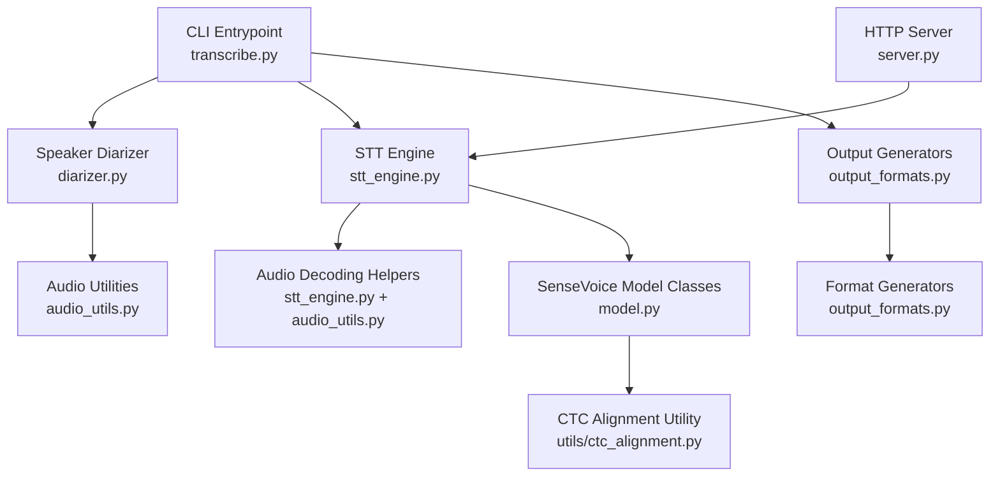
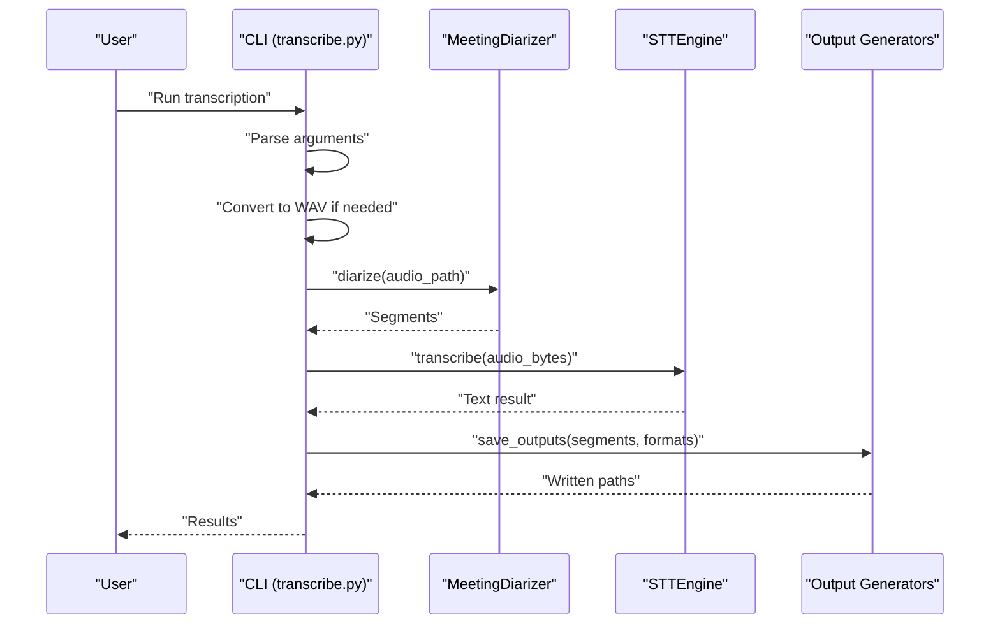
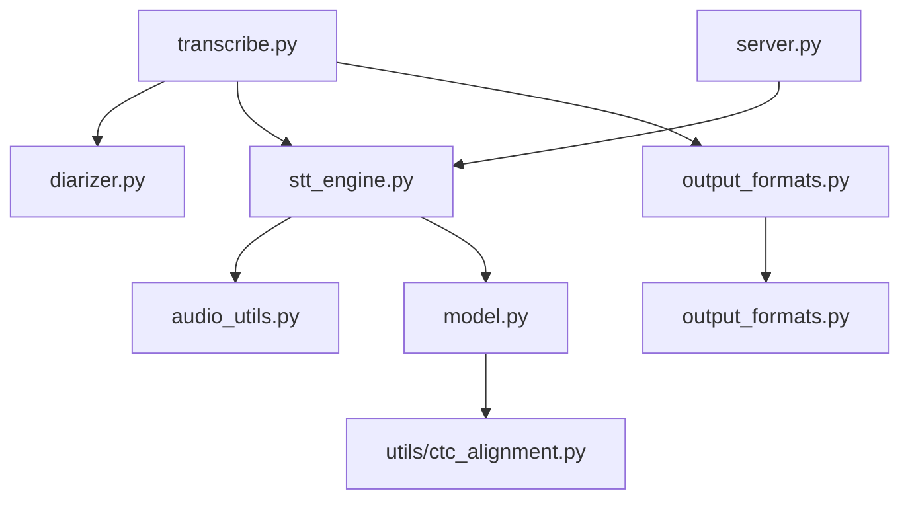

# API Reference

<cite>
**Referenced Files in This Document**
- [README.md](file://README.md)
- [transcribe.py](file://transcribe.py)
- [stt_engine.py](file://stt_engine.py)
- [server.py](file://server.py)
- [diarizer.py](file://diarizer.py)
- [audio_utils.py](file://audio_utils.py)
- [output_formats.py](file://output_formats.py)
- [model.py](file://model.py)
- [utils/ctc_alignment.py](file://utils/ctc_alignment.py)
- [pyproject.toml](file://pyproject.toml)
</cite>

## Table of Contents
1. [Introduction](#introduction)
2. [Project Structure](#project-structure)
3. [Core Components](#core-components)
4. [Architecture Overview](#architecture-overview)
5. [Detailed Component Analysis](#detailed-component-analysis)
6. [Dependency Analysis](#dependency-analysis)
7. [Performance Considerations](#performance-considerations)
8. [Troubleshooting Guide](#troubleshooting-guide)
9. [Conclusion](#conclusion)
10. [Appendices](#appendices)

## Introduction
This API reference documents the public interfaces of the meeting transcription system. It covers the CLI entry points, the in-process STT engine, the HTTP server, speaker diarization, audio utilities, and output format generators. The documentation includes method signatures, parameter specifications, return value descriptions, validation rules, exception handling, and usage examples organized by module and functionality.

## Project Structure
The project is organized into modules that implement distinct stages of the transcription pipeline:
- CLI entry points and orchestration
- In-process STT engine
- HTTP server compatible with OpenAI Whisper API
- Speaker diarization
- Audio processing utilities
- Output format generators
- Model components and utilities

**Diagram sources**
- [transcribe.py:173-240](file://transcribe.py#L173-L240)
- [diarizer.py:27-110](file://diarizer.py#L27-L110)
- [stt_engine.py:24-185](file://stt_engine.py#L24-L185)
- [server.py:92-197](file://server.py#L92-L197)
- [audio_utils.py:23-120](file://audio_utils.py#L23-L120)
- [output_formats.py:118-160](file://output_formats.py#L118-L160)
- [model.py:437-800](file://model.py#L437-L800)
- [utils/ctc_alignment.py:1-77](file://utils/ctc_alignment.py#L1-L77)

**Section sources**
- [README.md:134-173](file://README.md#L134-L173)
- [pyproject.toml:1-24](file://pyproject.toml#L1-L24)

## Core Components
This section summarizes the primary public interfaces and their responsibilities.

- CLI Entrypoint
  - Purpose: Unified entry point for transcription and HTTP server modes.
  - Key functions: Argument parsing, mode selection, and orchestration of pipeline steps.
  - See [build_parser:173-221](file://transcribe.py#L173-L221), [run_transcription:45-144](file://transcribe.py#L45-L144), [run_server:151-166](file://transcribe.py#L151-L166), [main:228-240](file://transcribe.py#L228-L240).

- STT Engine
  - Purpose: In-process speech-to-text using SenseVoice via FunASR.
  - Key class: [STTEngine:24-185](file://stt_engine.py#L24-L185)
  - Public methods: [STTEngine.__init__:27-66](file://stt_engine.py#L27-L66), [STTEngine.transcribe:71-106](file://stt_engine.py#L71-L106)

- HTTP Server
  - Purpose: Exposes OpenAI Whisper-compatible endpoints for transcription.
  - Key functions: [create_app:92-162](file://server.py#L92-L162), [run_server:169-197](file://server.py#L169-L197)
  - Endpoints: POST /v1/audio/transcriptions, POST /recognition

- Speaker Diarizer
  - Purpose: Detect speakers and segment audio into per-speaker turns.
  - Key class: [MeetingDiarizer:27-110](file://diarizer.py#L27-L110)
  - Public methods: [MeetingDiarizer.__init__:30-54](file://diarizer.py#L30-L54), [MeetingDiarizer.diarize:55-71](file://diarizer.py#L55-L71)

- Audio Utilities
  - Purpose: Format conversion, segment extraction, and in-memory decoding.
  - Key functions: [convert_to_wav:23-51](file://audio_utils.py#L23-L51), [prepare_audio_buffer:53-94](file://audio_utils.py#L53-L94), [process_audio_bytes_torchaudio:96-120](file://audio_utils.py#L96-L120)

- Output Formats
  - Purpose: Generate SRT, VTT, TXT, and JSON outputs.
  - Key functions: [save_outputs:118-160](file://output_formats.py#L118-L160), [generate_srt:43-56](file://output_formats.py#L43-L56), [generate_vtt:58-71](file://output_formats.py#L58-L71), [generate_txt:73-85](file://output_formats.py#L73-L85), [generate_json:87-104](file://output_formats.py#L87-L104)

- Model Components
  - Purpose: SenseVoice encoder and model definitions used by the STT engine.
  - Key classes: [SenseVoiceEncoderSmall:437-578](file://model.py#L437-L578), [SenseVoiceSmall:580-800](file://model.py#L580-L800)
  - Utility: [ctc_forced_align:3-77](file://utils/ctc_alignment.py#L3-L77)

**Section sources**
- [transcribe.py:45-166](file://transcribe.py#L45-L166)
- [stt_engine.py:24-185](file://stt_engine.py#L24-L185)
- [server.py:92-197](file://server.py#L92-L197)
- [diarizer.py:27-110](file://diarizer.py#L27-L110)
- [audio_utils.py:23-120](file://audio_utils.py#L23-L120)
- [output_formats.py:118-160](file://output_formats.py#L118-L160)
- [model.py:437-800](file://model.py#L437-L800)
- [utils/ctc_alignment.py:1-77](file://utils/ctc_alignment.py#L1-L77)

## Architecture Overview
The system operates in two primary modes:
- In-process transcription: Converts input to WAV, runs speaker diarization, extracts segments, transcribes with STT engine, and saves outputs.
- HTTP server: Starts a FastAPI server exposing OpenAI Whisper-compatible endpoints backed by the STT engine.

**Diagram sources**
- [transcribe.py:45-144](file://transcribe.py#L45-L144)
- [diarizer.py:55-71](file://diarizer.py#L55-L71)
- [stt_engine.py:71-106](file://stt_engine.py#L71-L106)
- [output_formats.py:118-160](file://output_formats.py#L118-L160)

## Detailed Component Analysis

### CLI Entrypoint API
- Purpose: Provide unified CLI for transcription and HTTP server modes.
- Entry points and responsibilities:
  - [build_parser:173-221](file://transcribe.py#L173-L221): Defines CLI arguments and help text.
  - [run_transcription:45-144](file://transcribe.py#L45-L144): Orchestrates the full pipeline (WAV conversion, diarization, segment extraction, transcription, output saving).
  - [run_server:151-166](file://transcribe.py#L151-L166): Starts the HTTP server with configured parameters.
  - [main:228-240](file://transcribe.py#L228-L240): Entry point that selects mode based on arguments.

Key parameters and defaults:
- Mode selection: [--server:188-192](file://transcribe.py#L188-L192)
- Device: [--device:195-196](file://transcribe.py#L195-L196)
- Model directory: [--model_dir:196-197](file://transcribe.py#L196-L197)
- Transcription mode:
  - [-i, --input:199-200](file://transcribe.py#L199-L200)
  - [--language:200-201](file://transcribe.py#L200-L201)
  - [--format:202-206](file://transcribe.py#L202-L206)
  - [-o, --output:207-208](file://transcribe.py#L207-L208)
  - [--max-workers:208-209](file://transcribe.py#L208-L209)
  - [--padding:209-210](file://transcribe.py#L209-L210)
  - [--max-gap:210-211](file://transcribe.py#L210-L211)
- Server mode:
  - [--host:213-214](file://transcribe.py#L213-L214)
  - [--port:214-215](file://transcribe.py#L214-L215)
  - [--vad_model:215-216](file://transcribe.py#L215-L216)
  - [--use_itn:216-217](file://transcribe.py#L216-L217)
  - [--merge_vad:217-218](file://transcribe.py#L217-L218)
  - [--merge_length_s:218-219](file://transcribe.py#L218-L219)

Validation rules:
- Missing required input path triggers an error and exits.
- Input file existence is validated before processing.
- Unknown output formats are skipped with a warning.

Typical usage patterns:
- In-process transcription with default formats and CPU device.
- Server mode with MPS/CUDA device and custom model directory.
- Custom output formats and padding/merging parameters.

Edge cases:
- No input file provided leads to immediate exit with error.
- Unsupported audio input types in STT engine result in error payload.
- Unknown output format is ignored and logged.

Return value interpretation:
- Transcription results include a text field; errors are captured under an error key.
- Output saving returns a list of written file paths.

**Section sources**
- [transcribe.py:45-166](file://transcribe.py#L45-L166)
- [transcribe.py:173-221](file://transcribe.py#L173-L221)
- [transcribe.py:228-240](file://transcribe.py#L228-L240)

### STT Engine API
- Class: [STTEngine:24-185](file://stt_engine.py#L24-L185)
- Constructor parameters:
  - model_dir: str, default "iic/SenseVoiceSmall"
  - remote_code: str, default "./model.py"
  - device: str, default "cpu"
  - ncpu: int, default 4
  - language: str, default "auto"
  - vad_model: str, default "fsmn-vad"
  - vad_kwargs: int, default 30000
  - use_itn: bool, default True
  - merge_vad: bool, default True
  - merge_length_s: int, default 15

Public method:
- [transcribe(audio_input):71-106](file://stt_engine.py#L71-L106)
  - audio_input: Union[str, bytes, np.ndarray]
    - str: file path to an audio file
    - bytes: raw audio file bytes (decoded in-memory)
    - np.ndarray: pre-processed 16 kHz mono float32 samples
  - Returns: dict with keys "text" and optionally "error" on failure
  - Validation rules:
    - Unsupported audio_input type raises TypeError
    - Exceptions during model.generate are caught and returned as error payload
  - Post-processing:
    - Rich transcription post-processing
    - Simplified Chinese to Traditional Chinese conversion

Internal helpers:
- [_process_bytes(audio_bytes):111-129](file://stt_engine.py#L111-L129): Decodes bytes using torchaudio with ffmpeg fallback.
- [_format_result(rec_results):130-139](file://stt_engine.py#L130-L139): Formats raw results into processed text.

Module-level audio processing utilities:
- [_process_audio_bytes_torchaudio(audio_bytes):147-171](file://stt_engine.py#L147-L171): Decodes in-memory audio to 16 kHz mono float32.
- [_process_audio_bytes_ffmpeg(audio_path):173-185](file://stt_engine.py#L173-L185): Decodes via ffmpeg to PCM s16le.

Exception handling:
- Errors in model.generate are logged and returned as {"text": "", "error": str(exc)}.
- Audio decoding failures fall back to ffmpeg and log warnings.

**Section sources**
- [stt_engine.py:24-185](file://stt_engine.py#L24-L185)

### HTTP Server API
- Factory: [create_app(engine, temp_dir):92-162](file://server.py#L92-L162)
  - Creates a FastAPI app bound to an STTEngine instance.
  - Endpoints:
    - POST /recognition: Legacy endpoint returning {"text": ..., "code": ...}.
    - POST /v1/audio/transcriptions: OpenAI Whisper-compatible endpoint.
      - Form fields:
        - file: UploadFile (audio file)
        - model: Optional[str] (alias "sensevoice")
        - language: Optional[str]
        - prompt: Optional[str]
        - response_format: Optional[str] (text/json/verbose_json/srt/vtt)
        - temperature: Optional[float]
      - Returns:
        - Plain text for text/srt/vtt
        - JSON for json/verbose_json
        - Error payload for invalid requests or formatting errors

- Runner: [run_server(...):169-197](file://server.py#L169-L197)
  - Builds STTEngine with provided parameters and starts Uvicorn server.

Response formatting helpers:
- [_format_srt_time(seconds):30-38](file://server.py#L30-L38), [_format_vtt_time(seconds):40-48](file://server.py#L40-L48)
- [_format_srt(text, duration):50-54](file://server.py#L50-L54), [_format_vtt(text, duration):56-60](file://server.py#L56-L60)
- [_format_transcription_response(text, response_format, duration, language):62-85](file://server.py#L62-L85)

Validation rules:
- Audio file read errors return structured error payloads.
- Unknown response_format falls back to JSON with text field.

Example usage:
- Start server on localhost:8100 with MPS device and custom model directory.
- Call POST /v1/audio/transcriptions with multipart/form-data.

**Section sources**
- [server.py:92-197](file://server.py#L92-L197)

### Speaker Diarizer API
- Class: [MeetingDiarizer:27-110](file://diarizer.py#L27-L110)
- Constructor parameters:
  - hf_token: Optional[str], default None (reads from environment)
  - device: Optional[torch.device], default None (auto-selects MPS/CPU)
  - max_gap: float, default 2.0

Public method:
- [diarize(audio_path):55-71](file://diarizer.py#L55-L71)
  - Returns a sorted list of segments: [{"start": float, "end": float, "speaker": str}, ...]
  - Validation rules:
    - Requires HF_TOKEN in environment or constructor argument; otherwise raises ValueError

Internal helpers:
- [_get_speaker_tracks(output):76-87](file://diarizer.py#L76-L87): Aggregates speaker turns by speaker label.
- [_merge_segments(speaker_tracks, max_gap):89-110](file://diarizer.py#L89-L110): Merges adjacent segments from the same speaker within max_gap.

**Section sources**
- [diarizer.py:27-110](file://diarizer.py#L27-L110)

### Audio Utilities API
- [convert_to_wav(input_path):23-51](file://audio_utils.py#L23-L51)
  - Converts any supported audio/video file to 16 kHz mono WAV using ffmpeg.
  - Returns: path to converted WAV file.
  - Validation rules:
    - Raises subprocess.CalledProcessError on conversion failure.

- [prepare_audio_buffer(waveform, start_time, end_time, sample_rate, padding):53-94](file://audio_utils.py#L53-L94)
  - Extracts a segment from a waveform and returns an in-memory WAV buffer.
  - Returns: Optional[io.BytesIO] or None on error.
  - Validation rules:
    - Clips segment to valid frame bounds and logs errors.

- [process_audio_bytes_torchaudio(audio_bytes):96-120](file://audio_utils.py#L96-L120)
  - Decodes audio bytes to 16 kHz mono float32 numpy array.

**Section sources**
- [audio_utils.py:23-120](file://audio_utils.py#L23-L120)

### Output Formats API
- [save_outputs(segments, output_dir, base_name, formats):118-160](file://output_formats.py#L118-L160)
  - Saves transcription results in requested formats.
  - Returns: List of written file paths.
  - Validation rules:
    - Skips unknown formats with a warning.

- Format generators:
  - [generate_srt(segments):43-56](file://output_formats.py#L43-L56)
  - [generate_vtt(segments):58-71](file://output_formats.py#L58-L71)
  - [generate_txt(segments):73-85](file://output_formats.py#L73-L85)
  - [generate_json(segments):87-104](file://output_formats.py#L87-L104)

Time formatting helpers:
- [_format_time_srt(seconds):20-27](file://output_formats.py#L20-L27), [_format_time_vtt(seconds):29-36](file://output_formats.py#L29-L36)

**Section sources**
- [output_formats.py:118-160](file://output_formats.py#L118-L160)

### Model Components API
- [SenseVoiceEncoderSmall:437-578](file://model.py#L437-L578)
  - Encoder module with sinusoidal position encoding, SANM attention, and feed-forward layers.
  - Methods: [forward(xs_pad, ilens):546-578](file://model.py#L546-L578)

- [SenseVoiceSmall:580-800](file://model.py#L580-L800)
  - Hybrid CTC-attention model with language identification and text normalization embeddings.
  - Methods: [forward(speech, speech_lengths, text, text_lengths):655-706](file://model.py#L655-L706), [encode(speech, speech_lengths, text):707-746](file://model.py#L707-L746), [inference(data_in, data_lengths, key, tokenizer, frontend, **kwargs):781-800](file://model.py#L781-L800)

- [ctc_forced_align(log_probs, targets, input_lengths, target_lengths, blank, ignore_id):3-77](file://utils/ctc_alignment.py#L3-L77)
  - Aligns CTC label sequences to emissions.

**Section sources**
- [model.py:437-800](file://model.py#L437-L800)
- [utils/ctc_alignment.py:1-77](file://utils/ctc_alignment.py#L1-L77)

## Dependency Analysis
The following diagram shows module-level dependencies among the core components.

**Diagram sources**
- [transcribe.py:49-52](file://transcribe.py#L49-L52)
- [server.py:21](file://server.py#L21)
- [stt_engine.py:12-19](file://stt_engine.py#L12-L19)
- [model.py:8-16](file://model.py#L8-L16)

**Section sources**
- [transcribe.py:45-166](file://transcribe.py#L45-L166)
- [server.py:92-197](file://server.py#L92-L197)
- [stt_engine.py:24-185](file://stt_engine.py#L24-L185)
- [diarizer.py:27-110](file://diarizer.py#L27-L110)
- [audio_utils.py:23-120](file://audio_utils.py#L23-L120)
- [output_formats.py:118-160](file://output_formats.py#L118-L160)
- [model.py:437-800](file://model.py#L437-L800)
- [utils/ctc_alignment.py:1-77](file://utils/ctc_alignment.py#L1-L77)

## Performance Considerations
- Device selection: Prefer CUDA/MPS for GPU acceleration; CPU is the default and safest option.
- Concurrency: In-process transcription uses a semaphore to limit concurrent transcriptions; adjust [--max-workers:208-209](file://transcribe.py#L208-L209) to balance throughput and resource usage.
- Audio preprocessing: Ensure consistent 16 kHz mono sampling to minimize re-sampling overhead.
- VAD integration: Disable internal VAD when using pre-segmented audio from diarizer to avoid redundant segmentation artifacts.
- Output formats: JSON serialization is UTF-8 encoded; large outputs may benefit from streaming or chunked writes.

[No sources needed since this section provides general guidance]

## Troubleshooting Guide
Common issues and resolutions:
- Missing HuggingFace token: Ensure HF_TOKEN is set in the environment; required for PyAnnote pipeline initialization.
- FFmpeg version compatibility: Confirm FFmpeg 4–8 installation; conversion failures raise subprocess.CalledProcessError.
- torchcodec version mismatch: Ensure torchcodec version satisfies the project’s requirements.
- Audio decoding failures: STT engine falls back from torchaudio to ffmpeg; check logs for warnings and verify input formats.

**Section sources**
- [diarizer.py:36-41](file://diarizer.py#L36-L41)
- [audio_utils.py:44-51](file://audio_utils.py#L44-L51)
- [README.md:175-203](file://README.md#L175-L203)

## Conclusion
This API reference provides a comprehensive overview of the public interfaces across the meeting transcription system. It outlines CLI usage, engine capabilities, server endpoints, diarization behavior, audio utilities, and output generation. By following the documented parameters, validation rules, and examples, developers can integrate the system effectively and troubleshoot common issues.

[No sources needed since this section summarizes without analyzing specific files]

## Appendices

### CLI Parameter Reference
- Mode selection
  - [--server:188-192](file://transcribe.py#L188-L192): Enable HTTP server mode.
- Common options
  - [--device:195-196](file://transcribe.py#L195-L196): Device choice (cpu, mps, cuda).
  - [--model_dir:196-197](file://transcribe.py#L196-L197): SenseVoice model directory.
- Transcription mode
  - [-i, --input:199-200](file://transcribe.py#L199-L200): Input audio/video file path.
  - [--language:200-201](file://transcribe.py#L200-L201): Language selection (auto, zh, en, yue, ja, ko).
  - [--format:202-206](file://transcribe.py#L202-L206): Comma-separated output formats.
  - [-o, --output:207-208](file://transcribe.py#L207-L208): Output directory.
  - [--max-workers:208-209](file://transcribe.py#L208-L209): Max concurrent transcriptions.
  - [--padding:209-210](file://transcribe.py#L209-L210): Audio segment padding in seconds.
  - [--max-gap:210-211](file://transcribe.py#L210-L211): Merge gap threshold for same-speaker segments.
- Server mode
  - [--host:213-214](file://transcribe.py#L213-L214), [--port:214-215](file://transcribe.py#L214-L215)
  - [--vad_model:215-216](file://transcribe.py#L215-L216), [--use_itn:216-217](file://transcribe.py#L216-L217)
  - [--merge_vad:217-218](file://transcribe.py#L217-L218), [--merge_length_s:218-219](file://transcribe.py#L218-L219)

**Section sources**
- [transcribe.py:173-221](file://transcribe.py#L173-L221)

### HTTP Server Endpoints
- POST /v1/audio/transcriptions
  - Form fields: file, model, language, prompt, response_format, temperature
  - Response formats: text, json, verbose_json, srt, vtt
- POST /recognition
  - Form field: audio
  - Response: {"text": ..., "code": ...}

**Section sources**
- [server.py:121-161](file://server.py#L121-L161)

### Example Workflows
- In-process transcription
  - Convert input to WAV, run diarizer, extract segments, transcribe, and save outputs.
  - See [run_transcription:45-144](file://transcribe.py#L45-L144).
- HTTP server
  - Start server with selected device and model directory; send multipart/form-data to /v1/audio/transcriptions.
  - See [run_server:169-197](file://server.py#L169-L197).

**Section sources**
- [transcribe.py:45-166](file://transcribe.py#L45-L166)
- [server.py:169-197](file://server.py#L169-L197)