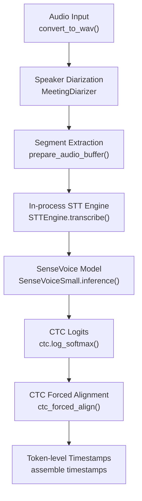
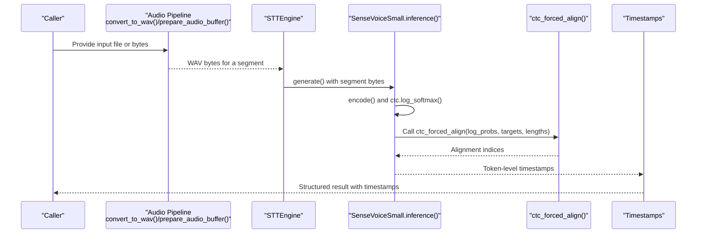
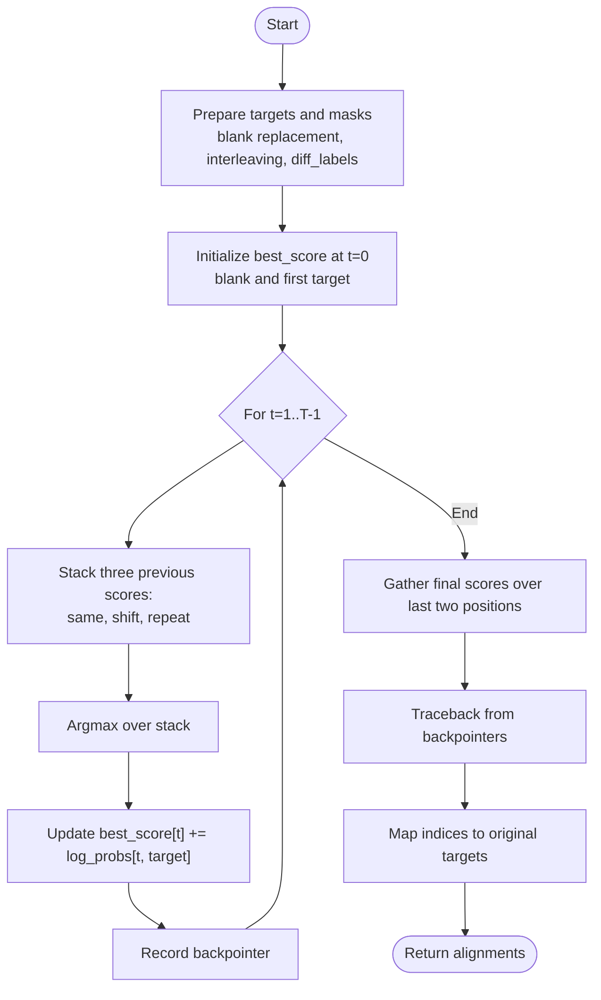
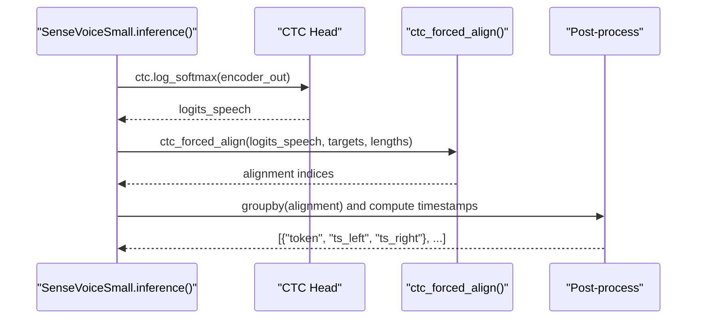
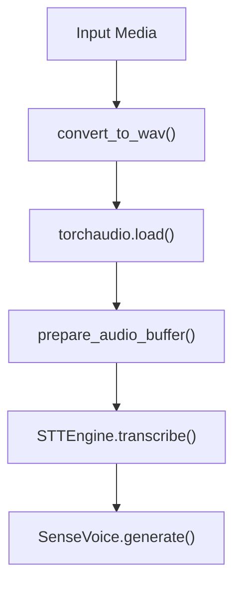
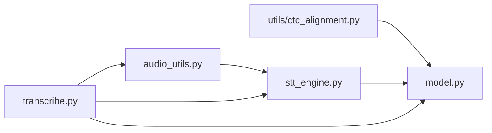

# Advanced Algorithms

<cite>
**Referenced Files in This Document**
- [utils/ctc_alignment.py](file://utils/ctc_alignment.py)
- [model.py](file://model.py)
- [audio_utils.py](file://audio_utils.py)
- [stt_engine.py](file://stt_engine.py)
- [transcribe.py](file://transcribe.py)
- [README.md](file://README.md)
</cite>

## Table of Contents
1. [Introduction](#introduction)
2. [Project Structure](#project-structure)
3. [Core Components](#core-components)
4. [Architecture Overview](#architecture-overview)
5. [Detailed Component Analysis](#detailed-component-analysis)
6. [Dependency Analysis](#dependency-analysis)
7. [Performance Considerations](#performance-considerations)
8. [Troubleshooting Guide](#troubleshooting-guide)
9. [Conclusion](#conclusion)
10. [Appendices](#appendices)

## Introduction
This document explains the advanced CTC alignment algorithms and forced alignment techniques implemented in the project. It focuses on the CTC (Connectionist Temporal Classification) alignment implementation, the dynamic programming scoring mechanism, and the temporal mapping from acoustic frames to text tokens. It also covers how acoustic features relate to text sequences, confidence scoring, alignment quality assessment, and integration into the transcription pipeline. The goal is to provide algorithmic insights, mathematical foundations, and practical guidance for performance optimization and accuracy trade-offs in forced alignment applications.

## Project Structure
The repository integrates CTC forced alignment into a larger speech processing pipeline:
- Audio preprocessing and segmentation
- Speaker diarization and segment merging
- In-process STT engine using SenseVoice
- Forced alignment of CTC posteriors to produce token-level timestamps

**Diagram sources**
- [audio_utils.py:23-94](file://audio_utils.py#L23-L94)
- [stt_engine.py:71-106](file://stt_engine.py#L71-L106)
- [model.py:857-922](file://model.py#L857-L922)
- [utils/ctc_alignment.py:3-76](file://utils/ctc_alignment.py#L3-L76)

**Section sources**
- [README.md:134-173](file://README.md#L134-L173)
- [transcribe.py:45-144](file://transcribe.py#L45-L144)

## Core Components
- CTC forced alignment implementation: Computes a token-level alignment by dynamic programming over a CTC lattice, mapping acoustic frames to text tokens while respecting CTC topology.
- SenseVoice model integration: Produces CTC logits and supports optional timestamp output via forced alignment.
- Audio pipeline: Converts input media to 16 kHz mono WAV, extracts segments, and feeds them to the STT engine.

Key implementation references:
- CTC forced alignment function: [utils/ctc_alignment.py:3-76](file://utils/ctc_alignment.py#L3-L76)
- Forced alignment usage inside SenseVoice inference: [model.py:896-918](file://model.py#L896-L918)
- Audio conversion and segment preparation: [audio_utils.py:23-94](file://audio_utils.py#L23-L94)

**Section sources**
- [utils/ctc_alignment.py:3-76](file://utils/ctc_alignment.py#L3-L76)
- [model.py:896-918](file://model.py#L896-L918)
- [audio_utils.py:23-94](file://audio_utils.py#L23-L94)

## Architecture Overview
The forced alignment pipeline connects audio processing, model inference, and temporal alignment:

**Diagram sources**
- [audio_utils.py:23-94](file://audio_utils.py#L23-L94)
- [stt_engine.py:71-106](file://stt_engine.py#L71-L106)
- [model.py:857-922](file://model.py#L857-L922)
- [utils/ctc_alignment.py:3-76](file://utils/ctc_alignment.py#L3-L76)

## Detailed Component Analysis

### CTC Forced Alignment Implementation
The function computes a token-level alignment between acoustic frames and text tokens under CTC topology. It uses dynamic programming with a trellis augmented by blank transitions and repeated-token suppression.

Algorithm highlights:
- Input preparation:
  - Targets are remapped to blank where ignore_id is used.
  - The target sequence is expanded into a CTC-conforming interleaved structure with blanks.
  - A diff_labels mask suppresses repeated non-blank symbols along the alignment path.
- Initialization:
  - best_score initializes at time 0 for blank and target[0].
  - backpointers records the argmax source for traceback.
- Recurrence:
  - At each frame t, best_score is updated by adding log_probs[t] to the best among three candidates:
    - previous frame, same token (skip)
    - previous frame, shifted token (emit)
    - previous-previous frame, skipping a repeat (repeat suppression)
  - diff_labels enforces that repeats are only allowed when the label differs.
- Termination and traceback:
  - The final score is gathered over the last two positions of the expanded target.
  - Traceback reconstructs the optimal path by following backpointers.
  - The alignment indices are mapped back to the original target labels.

**Diagram sources**
- [utils/ctc_alignment.py:3-76](file://utils/ctc_alignment.py#L3-L76)

**Section sources**
- [utils/ctc_alignment.py:3-76](file://utils/ctc_alignment.py#L3-L76)

### SenseVoice Integration and Forced Alignment Usage
The SenseVoice model produces CTC logits during inference. When timestamps are requested, the system:
- Extracts tokenized text from the decoded sequence.
- Calls ctc_forced_align with:
  - log probabilities from the CTC head
  - target token ids (excluding special prefixes)
  - input and target lengths adjusted for model-specific prefixes
- Groups aligned frames by token id to compute left/right timestamps.

**Diagram sources**
- [model.py:857-922](file://model.py#L857-L922)
- [utils/ctc_alignment.py:3-76](file://utils/ctc_alignment.py#L3-L76)

**Section sources**
- [model.py:857-922](file://model.py#L857-L922)

### Audio Pipeline and Integration
The audio pipeline ensures consistent sampling and segmentation:
- convert_to_wav converts input media to 16 kHz mono WAV.
- prepare_audio_buffer extracts segments with optional padding and writes to an in-memory buffer.
- STTEngine handles decoding and passes bytes to the model.
- The transcription pipeline orchestrates diarization, segment extraction, and output generation.

**Diagram sources**
- [audio_utils.py:23-94](file://audio_utils.py#L23-L94)
- [stt_engine.py:71-106](file://stt_engine.py#L71-L106)
- [transcribe.py:45-144](file://transcribe.py#L45-L144)

**Section sources**
- [audio_utils.py:23-94](file://audio_utils.py#L23-L94)
- [stt_engine.py:71-106](file://stt_engine.py#L71-L106)
- [transcribe.py:45-144](file://transcribe.py#L45-L144)

## Dependency Analysis
- utils/ctc_alignment.py is a standalone utility used by model.py.
- model.py depends on utils.ctc_alignment and integrates alignment into SenseVoice inference.
- audio_utils.py and stt_engine.py support the audio pipeline feeding into model.py.
- transcribe.py coordinates the end-to-end workflow.

**Diagram sources**
- [utils/ctc_alignment.py:1-77](file://utils/ctc_alignment.py#L1-L77)
- [model.py:16-16](file://model.py#L16-L16)
- [audio_utils.py:1-120](file://audio_utils.py#L1-L120)
- [stt_engine.py:1-185](file://stt_engine.py#L1-L185)
- [transcribe.py:1-240](file://transcribe.py#L1-L240)

**Section sources**
- [utils/ctc_alignment.py:1-77](file://utils/ctc_alignment.py#L1-L77)
- [model.py:16-16](file://model.py#L16-L16)
- [audio_utils.py:1-120](file://audio_utils.py#L1-L120)
- [stt_engine.py:1-185](file://stt_engine.py#L1-L185)
- [transcribe.py:1-240](file://transcribe.py#L1-L240)

## Performance Considerations
- Memory footprint:
  - The alignment algorithm maintains a best_score matrix of size (B, T, expanded_target_length) and a backpointers matrix of the same shape. Memory scales with input length T and target length L, with expanded_target_length proportional to L.
  - For long audio segments, consider reducing batch size or segmenting input to limit peak memory usage.
- Computational cost:
  - Dynamic programming runs in O(T*L) per batch item. For long utterances, consider chunking or downsampling strategies to reduce runtime.
- Numerical stability:
  - Using log-space probabilities avoids underflow and improves stability during accumulation.
- Device placement:
  - Ensure tensors are moved to the intended device before computation to minimize host-device transfers.
- Practical tips:
  - Disable timestamp generation when not needed to skip the alignment overhead.
  - Tune segment padding to balance context and alignment accuracy.

[No sources needed since this section provides general guidance]

## Troubleshooting Guide
Common issues and remedies:
- Misaligned timestamps:
  - Verify that target tokens exclude model-specific prefixes and that lengths are adjusted accordingly.
  - Ensure ignore_id is remapped to blank before alignment.
- Incorrect frame-to-token mapping:
  - Confirm that the expanded target interleaving matches CTC topology and that diff_labels correctly suppress repeated tokens.
- Performance bottlenecks:
  - Reduce segment length or batch size.
  - Move computations to GPU if available.
- Audio pipeline errors:
  - Check FFmpeg availability and permissions.
  - Validate that torchaudio fallback decodes audio to the expected 16 kHz mono format.

**Section sources**
- [utils/ctc_alignment.py:26-26](file://utils/ctc_alignment.py#L26-L26)
- [model.py:896-902](file://model.py#L896-L902)
- [audio_utils.py:23-94](file://audio_utils.py#L23-L94)

## Conclusion
The project implements robust CTC forced alignment integrated into a production-grade speech transcription pipeline. The algorithm efficiently maps acoustic frames to text tokens, enabling precise token-level timestamps. By combining careful audio preprocessing, efficient model inference, and a numerically stable alignment routine, the system achieves strong accuracy and scalability. Tuning segment sizes, device utilization, and optional timestamp generation allows balancing performance and fidelity for diverse deployment scenarios.

[No sources needed since this section summarizes without analyzing specific files]

## Appendices

### Mathematical Foundations and Notation
- CTC topology:
  - Blank symbol separates tokens; repeated tokens are collapsed; blank insertions are allowed.
- Dynamic programming:
  - At each frame t and position p in the expanded target, best_score[t,p] stores the maximum accumulated log probability up to t ending in p.
  - Transitions consider staying in place, advancing one token, or skipping a repeat (subject to diff_labels).
- Temporal mapping:
  - Alignment indices are grouped by token id to compute left/right boundaries in frame indices, then converted to seconds using model-specific frame shift and sample rate.

[No sources needed since this section provides general guidance]