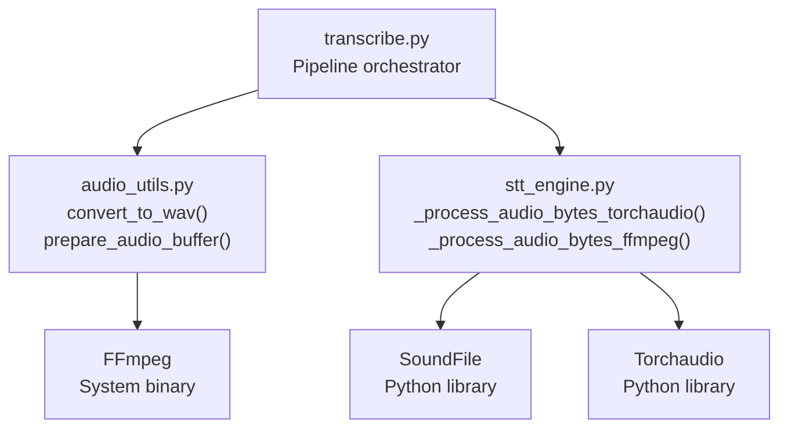
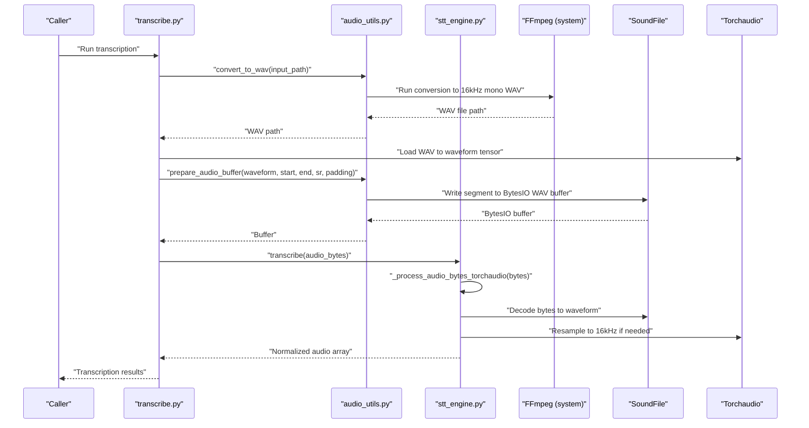
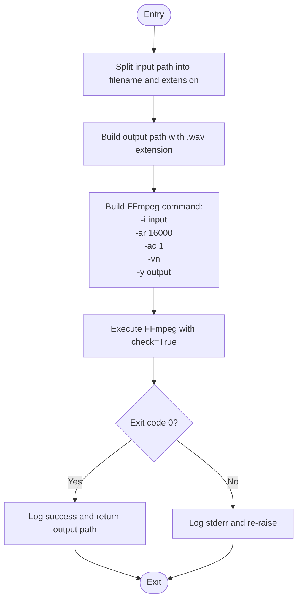
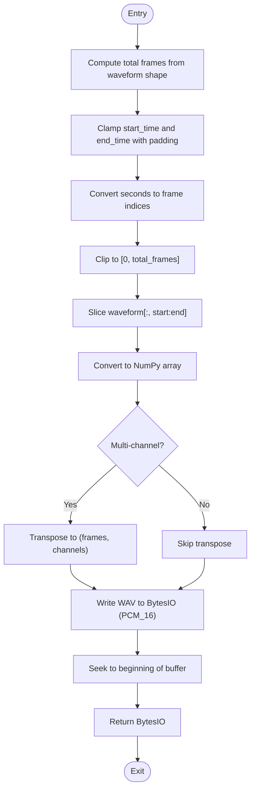
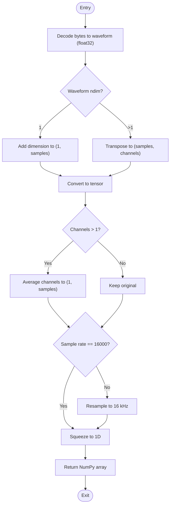
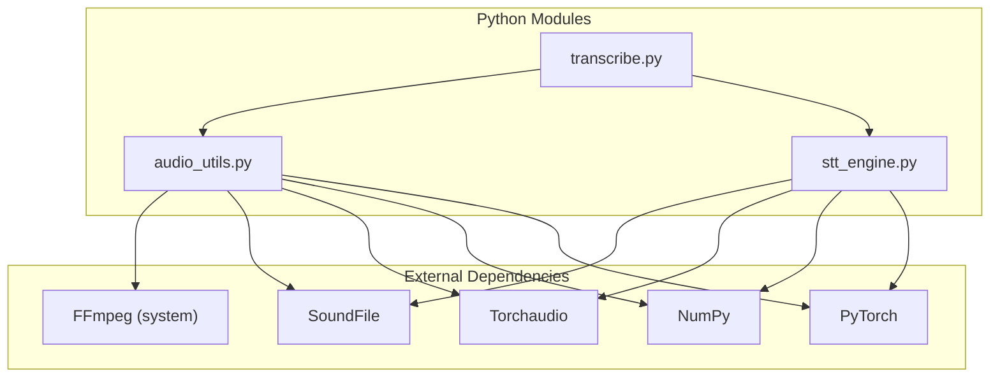

# Audio Processing Utilities

<cite>
**Referenced Files in This Document**
- [audio_utils.py](file://audio_utils.py)
- [transcribe.py](file://transcribe.py)
- [stt_engine.py](file://stt_engine.py)
- [README.md](file://README.md)
- [pyproject.toml](file://pyproject.toml)
</cite>

## Table of Contents
1. [Introduction](#introduction)
2. [Project Structure](#project-structure)
3. [Core Components](#core-components)
4. [Architecture Overview](#architecture-overview)
5. [Detailed Component Analysis](#detailed-component-analysis)
6. [Dependency Analysis](#dependency-analysis)
7. [Performance Considerations](#performance-considerations)
8. [Troubleshooting Guide](#troubleshooting-guide)
9. [Conclusion](#conclusion)
10. [Appendices](#appendices)

## Introduction
This document provides comprehensive documentation for the audio processing utilities used in the meeting transcription pipeline. It focuses on:
- Format conversion to WAV using FFmpeg
- Audio normalization and resampling to 16 kHz mono
- Buffer management for in-memory audio segments
- Segment extraction with configurable padding
- Supported input formats and FFmpeg integration
- Audio quality considerations and troubleshooting
- Performance optimization and memory management for large audio files

The documentation is designed for both technical and non-technical readers, with clear explanations, diagrams, and practical guidance.

## Project Structure
The audio processing utilities are primarily implemented in a dedicated module and integrated into the transcription pipeline. Key files:
- audio_utils.py: Provides format conversion, segment extraction, and in-memory audio decoding helpers
- transcribe.py: Orchestrates the end-to-end pipeline, including format conversion and segment preparation
- stt_engine.py: Handles audio decoding for model input, including fallbacks and normalization
- README.md: Describes supported formats and workflow
- pyproject.toml: Declares audio-related dependencies

**Diagram sources**
- [transcribe.py:45-144](file://transcribe.py#L45-L144)
- [audio_utils.py:23-119](file://audio_utils.py#L23-L119)
- [stt_engine.py:147-184](file://stt_engine.py#L147-L184)

**Section sources**
- [audio_utils.py:1-120](file://audio_utils.py#L1-L120)
- [transcribe.py:1-240](file://transcribe.py#L1-L240)
- [stt_engine.py:1-185](file://stt_engine.py#L1-L185)
- [README.md:12-13](file://README.md#L12-L13)
- [pyproject.toml:7-23](file://pyproject.toml#L7-L23)

## Core Components
This section documents the primary audio processing functions and their roles in the pipeline.

- convert_to_wav(input_path: str) -> str
  - Purpose: Convert any supported audio/video file to a 16 kHz mono WAV using FFmpeg
  - Behavior: Generates a new file path with .wav extension in the same directory
  - Output: Path to the converted WAV file
  - Exceptions: Raises subprocess.CalledProcessError on failure
  - Notes: Used in the pipeline to normalize input to a standard format

- prepare_audio_buffer(waveform: torch.Tensor, start_time: float, end_time: float, sample_rate: int, padding: float = 0.3) -> Optional[io.BytesIO]
  - Purpose: Extract a segment from a waveform and return an in-memory WAV buffer
  - Inputs:
    - waveform: Tensor of shape (channels, samples) representing audio
    - start_time: Segment start in seconds
    - end_time: Segment end in seconds
    - sample_rate: Sampling rate in Hz
    - padding: Extra padding in seconds added to each side (default 0.3)
  - Output: BytesIO buffer containing WAV data, or None on error
  - Behavior: Clips segment to valid bounds, converts multi-channel to expected layout for SoundFile, writes PCM_16 WAV

- process_audio_bytes_torchaudio(audio_bytes: bytes) -> np.ndarray
  - Purpose: Decode audio bytes to a 16 kHz mono float32 NumPy array
  - Inputs: Raw audio bytes
  - Output: 1D float32 NumPy array at 16 kHz mono
  - Behavior: Uses SoundFile to decode, converts to tensor, averages channels if multichannel, resamples to 16 kHz if needed

**Section sources**
- [audio_utils.py:23-50](file://audio_utils.py#L23-L50)
- [audio_utils.py:53-94](file://audio_utils.py#L53-L94)
- [audio_utils.py:96-119](file://audio_utils.py#L96-L119)
- [stt_engine.py:147-170](file://stt_engine.py#L147-L170)

## Architecture Overview
The audio processing pipeline integrates format conversion, segmentation, and normalization before inference. The diagram below maps the actual code components and their interactions.

**Diagram sources**
- [transcribe.py:45-144](file://transcribe.py#L45-L144)
- [audio_utils.py:23-94](file://audio_utils.py#L23-L94)
- [stt_engine.py:71-129](file://stt_engine.py#L71-L129)

## Detailed Component Analysis

### convert_to_wav()
- Purpose: Normalize diverse input audio/video files to a standard 16 kHz mono WAV
- Implementation highlights:
  - Constructs an FFmpeg command with explicit sampling rate and channel configuration
  - Writes output to a .wav file in the same directory as the input
  - Logs success or errors and re-raises exceptions for upstream handling
- Method signature: convert_to_wav(input_path: str) -> str
- Parameters:
  - input_path: Absolute or relative path to input audio/video file
- Returns:
  - Path to the newly created WAV file
- Exceptions:
  - subprocess.CalledProcessError on FFmpeg failure

**Diagram sources**
- [audio_utils.py:23-50](file://audio_utils.py#L23-L50)

**Section sources**
- [audio_utils.py:23-50](file://audio_utils.py#L23-L50)
- [transcribe.py:63-67](file://transcribe.py#L63-L67)

### prepare_audio_buffer()
- Purpose: Extract a time-aligned segment from a loaded waveform and produce an in-memory WAV buffer
- Implementation highlights:
  - Computes frame indices from seconds and sample rate, clamps to valid bounds
  - Applies symmetric padding around the segment
  - Converts multi-channel arrays to SoundFile’s expected (frames, channels) layout
  - Writes PCM_16 WAV into a BytesIO buffer and resets position
- Method signature: prepare_audio_buffer(waveform, start_time, end_time, sample_rate, padding=0.3) -> Optional[io.BytesIO]
- Parameters:
  - waveform: Tensor of shape (channels, samples)
  - start_time: Segment start in seconds
  - end_time: Segment end in seconds
  - sample_rate: Sampling rate in Hz
  - padding: Padding in seconds (default 0.3)
- Returns:
  - BytesIO buffer containing WAV data, or None on error
- Notes:
  - Padding helps avoid cutting off transient sounds at segment boundaries
  - The buffer is suitable for immediate decoding by the STT engine

**Diagram sources**
- [audio_utils.py:53-94](file://audio_utils.py#L53-L94)

**Section sources**
- [audio_utils.py:53-94](file://audio_utils.py#L53-L94)
- [transcribe.py:99-114](file://transcribe.py#L99-L114)

### process_audio_bytes_torchaudio()
- Purpose: Decode raw audio bytes into a normalized 16 kHz mono float32 array
- Implementation highlights:
  - Uses SoundFile to decode bytes to waveform and dtype
  - Ensures correct shape for single/multi-channel audio
  - Converts to tensor and averages channels if multichannel
  - Resamples to 16 kHz if necessary
- Method signature: process_audio_bytes_torchaudio(audio_bytes: bytes) -> np.ndarray
- Parameters:
  - audio_bytes: Raw audio bytes
- Returns:
  - 1D float32 NumPy array at 16 kHz mono
- Notes:
  - This function is used by the STT engine to normalize audio for model input

**Diagram sources**
- [audio_utils.py:96-119](file://audio_utils.py#L96-L119)
- [stt_engine.py:147-170](file://stt_engine.py#L147-L170)

**Section sources**
- [audio_utils.py:96-119](file://audio_utils.py#L96-L119)
- [stt_engine.py:147-170](file://stt_engine.py#L147-L170)

## Dependency Analysis
Audio processing relies on external binaries and Python libraries. The following diagram shows the relationships among modules and external dependencies.

**Diagram sources**
- [audio_utils.py:15-18](file://audio_utils.py#L15-L18)
- [stt_engine.py:12-19](file://stt_engine.py#L12-L19)
- [pyproject.toml:7-23](file://pyproject.toml#L7-L23)

**Section sources**
- [pyproject.toml:7-23](file://pyproject.toml#L7-L23)
- [audio_utils.py:15-18](file://audio_utils.py#L15-L18)
- [stt_engine.py:12-19](file://stt_engine.py#L12-L19)

## Performance Considerations
- FFmpeg conversion:
  - Prefer converting once to WAV to avoid repeated decoding overhead during segmentation
  - Ensure FFmpeg is installed and accessible in PATH; the pipeline logs conversion outcomes
- Memory usage:
  - Loading entire audio into memory (waveform tensor) is efficient for moderate-length files
  - For very long audio, consider streaming or chunked processing to reduce peak memory
- Parallelism:
  - The pipeline uses asyncio with a semaphore to limit concurrent transcriptions
  - Adjust max_workers according to CPU/GPU capacity and available RAM
- I/O:
  - Using BytesIO buffers avoids disk I/O during segmentation and decoding
  - Temporary files are only used in the STT engine fallback path

[No sources needed since this section provides general guidance]

## Troubleshooting Guide
Common issues and resolutions:

- FFmpeg not found or incompatible
  - Symptom: Conversion fails or raises CalledProcessError
  - Resolution: Install FFmpeg 4–8 and ensure it is available in PATH
  - References:
    - [README.md:17-19](file://README.md#L17-L19)
    - [README.md:189-203](file://README.md#L189-L203)

- Audio decoding failures
  - Symptom: Error during audio bytes decoding or segmentation
  - Resolution: The STT engine falls back to FFmpeg PCM decoding; verify FFmpeg availability
  - References:
    - [stt_engine.py:111-129](file://stt_engine.py#L111-L129)
    - [stt_engine.py:173-184](file://stt_engine.py#L173-L184)

- Incorrect sample rate or channel layout
  - Symptom: Poor recognition quality or runtime errors
  - Resolution: Ensure inputs are normalized to 16 kHz mono; the pipeline converts inputs and the STT engine resamples if needed
  - References:
    - [audio_utils.py:23-50](file://audio_utils.py#L23-L50)
    - [audio_utils.py:96-119](file://audio_utils.py#L96-L119)

- Large audio files causing memory pressure
  - Symptom: Out-of-memory errors or slow performance
  - Resolution: Reduce max_workers, consider shorter segments, or process files in smaller chunks
  - References:
    - [transcribe.py:208-210](file://transcribe.py#L208-L210)

**Section sources**
- [README.md:17-19](file://README.md#L17-L19)
- [README.md:189-203](file://README.md#L189-L203)
- [stt_engine.py:111-129](file://stt_engine.py#L111-L129)
- [stt_engine.py:173-184](file://stt_engine.py#L173-L184)
- [audio_utils.py:23-50](file://audio_utils.py#L23-L50)
- [audio_utils.py:96-119](file://audio_utils.py#L96-L119)
- [transcribe.py:208-210](file://transcribe.py#L208-L210)

## Conclusion
The audio processing utilities provide a robust foundation for format normalization, segmentation, and decoding within the transcription pipeline. By converting inputs to 16 kHz mono WAV, extracting segments with configurable padding, and normalizing audio for model input, the system achieves consistent quality and performance. Proper FFmpeg installation, mindful memory management, and appropriate concurrency settings are essential for reliable operation at scale.

[No sources needed since this section summarizes without analyzing specific files]

## Appendices

### Supported Input Formats and Quality Matrix
- Supported formats:
  - MP4, MP3, M4A, WAV
  - The pipeline automatically converts non-WAV inputs to 16 kHz mono WAV
- Quality considerations:
  - FFmpeg resampling ensures consistent sample rate and mono channel
  - Multi-channel inputs are averaged to mono
  - The STT engine further normalizes audio to 16 kHz mono float32 for model input

**Section sources**
- [README.md:12](file://README.md#L12)
- [audio_utils.py:23-50](file://audio_utils.py#L23-L50)
- [audio_utils.py:96-119](file://audio_utils.py#L96-L119)

### Example Workflows
- Basic transcription workflow:
  - Convert input to WAV using FFmpeg
  - Load audio into memory
  - Extract segments with padding and pass to STT engine
  - Save outputs in desired formats
  - References:
    - [transcribe.py:63-67](file://transcribe.py#L63-L67)
    - [transcribe.py:78-80](file://transcribe.py#L78-L80)
    - [transcribe.py:99-114](file://transcribe.py#L99-L114)

**Section sources**
- [transcribe.py:63-67](file://transcribe.py#L63-L67)
- [transcribe.py:78-80](file://transcribe.py#L78-L80)
- [transcribe.py:99-114](file://transcribe.py#L99-L114)