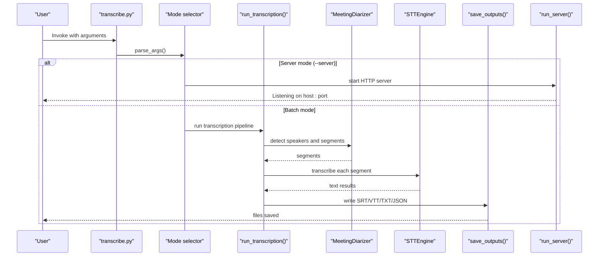
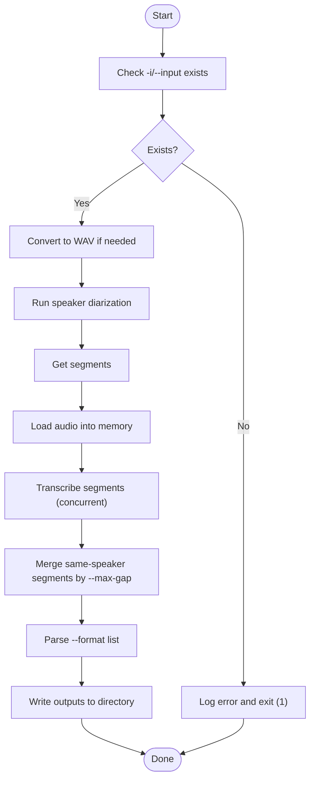
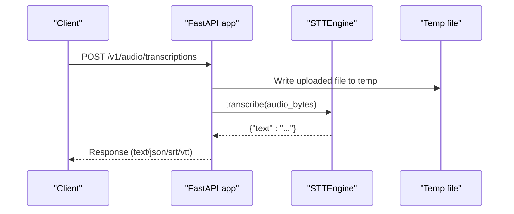
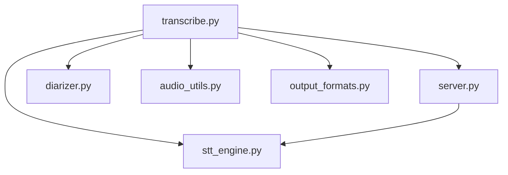

# CLI Interface

<cite>
**Referenced Files in This Document**
- [README.md](file://README.md)
- [transcribe.py](file://transcribe.py)
- [server.py](file://server.py)
- [stt_engine.py](file://stt_engine.py)
- [diarizer.py](file://diarizer.py)
- [audio_utils.py](file://audio_utils.py)
- [output_formats.py](file://output_formats.py)
- [run.sh](file://run.sh)
- [pyproject.toml](file://pyproject.toml)
</cite>

## Table of Contents
1. [Introduction](#introduction)
2. [Project Structure](#project-structure)
3. [Core Components](#core-components)
4. [Architecture Overview](#architecture-overview)
5. [Detailed Component Analysis](#detailed-component-analysis)
6. [Dependency Analysis](#dependency-analysis)
7. [Performance Considerations](#performance-considerations)
8. [Troubleshooting Guide](#troubleshooting-guide)
9. [Conclusion](#conclusion)
10. [Appendices](#appendices)

## Introduction
This document describes the command-line interface (CLI) of the meeting transcriber. It covers all command-line arguments, usage patterns, and operational modes. It also documents environment variables, error handling, exit codes, and troubleshooting guidance for common issues.

## Project Structure
The CLI entry point is unified in a single script that supports two operational modes:
- Batch transcription mode: processes a single audio/video file and writes output files locally.
- Server mode: starts an HTTP server compatible with OpenAI Whisper API for external clients.

```mermaid
graph TB
CLI["transcribe.py<br/>CLI entrypoint"] --> MODE{"Mode selected?"}
MODE --> |No (--server)| BATCH["Batch transcription mode"]
MODE --> |Yes (--server)| SRV["Server mode"]
BATCH --> DIARIZER["Diarizer<br/>Speaker diarization"]
BATCH --> ENGINE["STTEngine<br/>SenseVoice in-process"]
BATCH --> OUTPUT["Output formats<br/>SRT/VTT/TXT/JSON"]
SRV --> FASTAPI["FastAPI app<br/>/v1/audio/transcriptions"]
SRV --> LEGACY["Legacy endpoint<br/>/recognition"]
SRV --> ENGINE
DIARIZER --- AUDIO["audio_utils.py<br/>convert_to_wav, prepare_audio_buffer"]
ENGINE --- MODEL["stt_engine.py<br/>STTEngine"]
OUTPUT --- FORMATS["output_formats.py"]
```

**Diagram sources**
- [transcribe.py:228-239](file://transcribe.py#L228-L239)
- [server.py:92-161](file://server.py#L92-L161)
- [diarizer.py:27-71](file://diarizer.py#L27-L71)
- [audio_utils.py:23-51](file://audio_utils.py#L23-L51)
- [stt_engine.py:24-66](file://stt_engine.py#L24-L66)
- [output_formats.py:118-159](file://output_formats.py#L118-L159)

**Section sources**
- [README.md:134-149](file://README.md#L134-L149)
- [transcribe.py:228-239](file://transcribe.py#L228-L239)

## Core Components
- CLI argument parser: defines all flags and options for both modes.
- Batch transcription pipeline: runs diarization, loads audio, transcribes segments, and saves outputs.
- HTTP server: exposes OpenAI Whisper-compatible endpoints and a legacy endpoint.

Key responsibilities:
- Argument parsing and mode routing.
- Environment variable loading for credentials.
- Device selection and model configuration.
- Output generation and persistence.

**Section sources**
- [transcribe.py:173-220](file://transcribe.py#L173-L220)
- [transcribe.py:45-144](file://transcribe.py#L45-L144)
- [server.py:92-161](file://server.py#L92-L161)

## Architecture Overview
The CLI orchestrates two distinct flows depending on the mode flag.



**Diagram sources**
- [transcribe.py:228-239](file://transcribe.py#L228-L239)
- [transcribe.py:45-144](file://transcribe.py#L45-L144)
- [server.py:169-196](file://server.py#L169-L196)

## Detailed Component Analysis

### CLI Argument Parser
The parser defines a unified set of options. Required vs optional parameters and defaults are documented below.

- Mode selection
  - --server: flag; when present, starts server mode; otherwise runs batch transcription.

- Common options
  - --device: string; default cpu; accepted values inferred from runtime device selection.
  - --model_dir: string; default iic/SenseVoiceSmall; local path or Hugging Face model identifier.

- Batch transcription options
  - -i, --input: string; required in batch mode; path to audio/video file.
  - --language: string; default auto; supported values include zh, en, yue, ja, ko.
  - --format: string; default txt; comma-separated list of formats (srt, vtt, txt, json).
  - -o, --output: string; default <input_dir>/output/; output directory override.
  - --max-workers: integer; default 1; concurrency for segment transcription.
  - --padding: float; default 0.3; seconds to pad each segment.
  - --max-gap: float; default 2.0; seconds to merge adjacent same-speaker segments.

- Server options
  - --host: string; default 0.0.0.0; bind address.
  - --port: integer; default 8000; TCP port.
  - --vad_model: string; default fsmn-vad; voice activity detection model.
  - --use_itn: boolean; default True; enable inverse text normalization.
  - --merge_vad: boolean; default True; merge VAD segments.
  - --merge_length_s: integer; default 15; maximum VAD segment length in seconds.

Validation and constraints:
- Batch mode requires -i/--input.
- Unknown output formats in --format are ignored with a warning.
- Server mode does not require an input file; it serves HTTP endpoints.

Exit codes:
- Non-zero exit on missing input file or invalid state in batch mode.
- Server mode exits on startup errors (e.g., port binding).

Environment variables:
- HF_TOKEN: required for PyAnnote model access; loaded from .env via python-dotenv.

Notes:
- The default value for --format differs between the CLI parser and the README. The CLI default is txt, while the README lists srt,vtt,txt,json as default. The CLI default is authoritative.

**Section sources**
- [transcribe.py:173-220](file://transcribe.py#L173-L220)
- [transcribe.py:54-61](file://transcribe.py#L54-L61)
- [output_formats.py:118-159](file://output_formats.py#L118-L159)
- [diarizer.py:35-40](file://diarizer.py#L35-L40)
- [README.md:90-122](file://README.md#L90-L122)

### Operational Modes

#### Batch Transcription Mode (-i/--input)
Behavior:
- Converts input to WAV if needed.
- Runs speaker diarization to obtain speech segments.
- Loads audio into memory and transcribes segments concurrently up to --max-workers.
- Merges adjacent segments from the same speaker within --max-gap.
- Generates outputs for requested formats and writes them to disk.

Processing logic flow:



**Diagram sources**
- [transcribe.py:45-144](file://transcribe.py#L45-L144)
- [audio_utils.py:23-51](file://audio_utils.py#L23-L51)
- [diarizer.py:55-70](file://diarizer.py#L55-L70)
- [output_formats.py:118-159](file://output_formats.py#L118-L159)

**Section sources**
- [transcribe.py:45-144](file://transcribe.py#L45-L144)
- [audio_utils.py:23-51](file://audio_utils.py#L23-L51)
- [diarizer.py:55-70](file://diarizer.py#L55-L70)
- [output_formats.py:118-159](file://output_formats.py#L118-L159)

#### Server Mode (--server)
Behavior:
- Starts a FastAPI server exposing:
  - POST /v1/audio/transcriptions (OpenAI Whisper-compatible)
  - POST /recognition (legacy)
- Accepts uploaded audio files, decodes them, runs transcription via STTEngine, and returns formatted results.

Endpoints:
- /v1/audio/transcriptions
  - form fields: file (required), model (alias: model, default sensevoice), language (optional), prompt (optional), response_format (default json), temperature (default 0).
  - returns text/plain for text, srt, vtt; JSON for json, verbose_json.
- /recognition
  - form field: audio (required); returns JSON with text and code.

Server configuration:
- Host and port from --host and --port.
- Model and VAD parameters forwarded to STTEngine.



**Diagram sources**
- [server.py:121-160](file://server.py#L121-L160)
- [stt_engine.py:71-105](file://stt_engine.py#L71-L105)

**Section sources**
- [server.py:92-161](file://server.py#L92-L161)
- [stt_engine.py:24-66](file://stt_engine.py#L24-L66)

### Usage Patterns and Examples
Note: Replace placeholders with actual paths and values.

- Basic transcription
  - uv run transcribe.py -i PATH_TO_AUDIO [--device DEVICE] [--model_dir DIR]
- Language selection
  - uv run transcribe.py -i PATH_TO_AUDIO --language zh|en|yue|ja|ko
- Output format specification
  - uv run transcribe.py -i PATH_TO_AUDIO --format srt,json
- Custom output directory
  - uv run transcribe.py -i PATH_TO_AUDIO -o OUTPUT_DIR
- Server configuration
  - uv run transcribe.py --server --host HOST --port PORT [--device DEVICE] [--model_dir DIR]

These examples align with documented parameters and defaults.

**Section sources**
- [README.md:40-90](file://README.md#L40-L90)
- [transcribe.py:173-184](file://transcribe.py#L173-L184)

### Environment Variables
- HF_TOKEN: required for PyAnnote model access; loaded from .env at startup.

**Section sources**
- [diarizer.py:35-40](file://diarizer.py#L35-L40)
- [transcribe.py:28-30](file://transcribe.py#L28-L30)

### Error Handling and Exit Codes
- Missing input file in batch mode: logs an error and exits with code 1.
- File not found during processing: logs an error and exits with code 1.
- Server-side exceptions: logged and returned as structured error responses.
- FFmpeg conversion failures: logged with stderr details.

**Section sources**
- [transcribe.py:54-61](file://transcribe.py#L54-L61)
- [audio_utils.py:48-50](file://audio_utils.py#L48-L50)
- [server.py:113-115](file://server.py#L113-L115)
- [server.py:142-144](file://server.py#L142-L144)

## Dependency Analysis
The CLI depends on several modules for functionality.



**Diagram sources**
- [transcribe.py:49-52](file://transcribe.py#L49-L52)
- [server.py](file://server.py#L21)
- [diarizer.py:10-13](file://diarizer.py#L10-L13)
- [audio_utils.py:15-18](file://audio_utils.py#L15-L18)
- [output_formats.py:7-11](file://output_formats.py#L7-L11)
- [stt_engine.py:12-18](file://stt_engine.py#L12-L18)

**Section sources**
- [pyproject.toml:7-23](file://pyproject.toml#L7-L23)

## Performance Considerations
- Concurrency: --max-workers controls concurrent segment transcription; increasing it may improve throughput but also increases GPU/CPU usage.
- Padding: --padding adds silence around segments to reduce artifacts; larger padding increases processing time.
- VAD merging: --merge_vad and --merge_length_s affect server-side segmentation quality and latency.
- Device selection: --device affects inference speed and memory usage; choose mps or cuda when available.

[No sources needed since this section provides general guidance]

## Troubleshooting Guide
Common issues and resolutions:

- Missing input file
  - Symptom: error message and exit code 1.
  - Action: verify -i/--input path exists.
- FFmpeg conversion failure
  - Symptom: FFmpeg stderr logged.
  - Action: ensure FFmpeg 4–8 is installed and accessible.
- PyAnnote model access
  - Symptom: error indicating HF_TOKEN requirement.
  - Action: set HF_TOKEN in .env and accept model terms on Hugging Face.
- torchcodec version mismatch
  - Symptom: NameError related to AudioDecoder.
  - Action: align torchcodec version with pyproject.toml requirements.

**Section sources**
- [transcribe.py:54-61](file://transcribe.py#L54-L61)
- [audio_utils.py:48-50](file://audio_utils.py#L48-L50)
- [diarizer.py:35-40](file://diarizer.py#L35-L40)
- [README.md:175-203](file://README.md#L175-L203)

## Conclusion
The CLI provides a unified interface for both batch transcription and HTTP server operation. Parameter defaults and validation are defined in the argument parser, with environment variables supporting model access. The server adheres to an OpenAI Whisper-compatible API for external integrations.

## Appendices

### Command Reference
- Mode selection
  - --server: start HTTP server
- Common
  - --device: cpu|mps|cuda
  - --model_dir: model path or Hugging Face identifier
- Batch mode
  - -i, --input: input audio/video path (required)
  - --language: auto|zh|en|yue|ja|ko
  - --format: comma-separated srt|vtt|txt|json
  - -o, --output: output directory
  - --max-workers: concurrency
  - --padding: seconds
  - --max-gap: seconds
- Server mode
  - --host: bind address
  - --port: TCP port
  - --vad_model: VAD model name
  - --use_itn: boolean
  - --merge_vad: boolean
  - --merge_length_s: seconds

**Section sources**
- [transcribe.py:173-220](file://transcribe.py#L173-L220)
- [README.md:90-122](file://README.md#L90-L122)