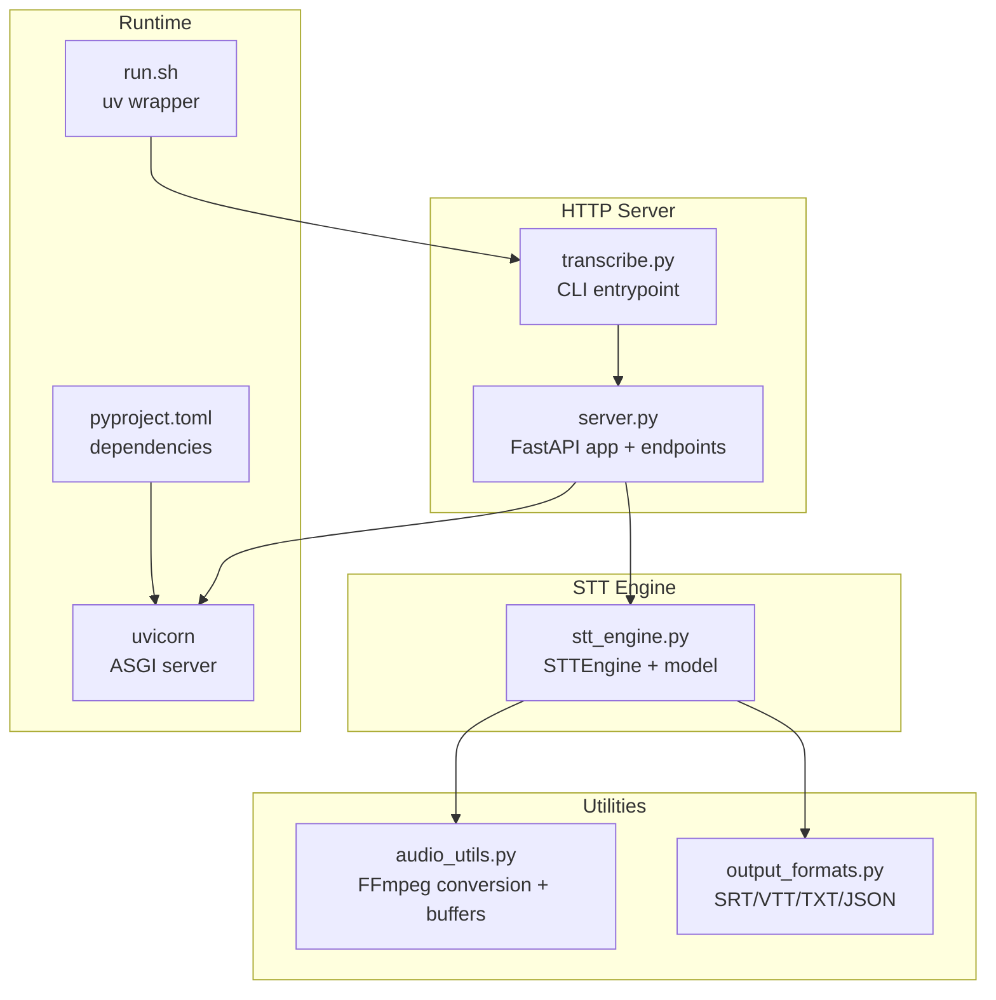
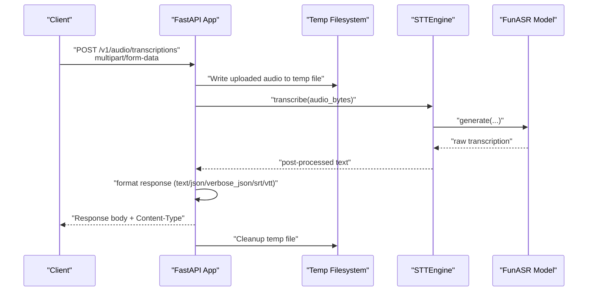
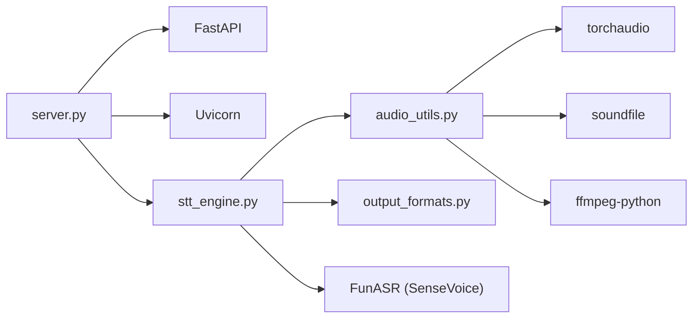

# HTTP API Server

<cite>
**Referenced Files in This Document**
- [server.py](file://server.py)
- [stt_engine.py](file://stt_engine.py)
- [transcribe.py](file://transcribe.py)
- [README.md](file://README.md)
- [pyproject.toml](file://pyproject.toml)
- [run.sh](file://run.sh)
- [audio_utils.py](file://audio_utils.py)
- [output_formats.py](file://output_formats.py)
</cite>

## Table of Contents
1. [Introduction](#introduction)
2. [Project Structure](#project-structure)
3. [Core Components](#core-components)
4. [Architecture Overview](#architecture-overview)
5. [Detailed Component Analysis](#detailed-component-analysis)
6. [Dependency Analysis](#dependency-analysis)
7. [Performance Considerations](#performance-considerations)
8. [Troubleshooting Guide](#troubleshooting-guide)
9. [Conclusion](#conclusion)
10. [Appendices](#appendices)

## Introduction
This document describes the HTTP API server built with FastAPI that exposes a Speech-to-Text (STT) service compatible with OpenAI Whisper API semantics. It provides:
- Two HTTP endpoints:
  - POST /v1/audio/transcriptions (OpenAI Whisper API compatible)
  - POST /recognition (legacy endpoint)
- Request/response schemas and authentication considerations
- Server configuration options, deployment settings, and performance tuning parameters
- Example HTTP requests and responses
- Integration guidance for external applications and client implementations
- Error handling, status codes, and rate limiting considerations

The server runs as a standalone HTTP service and delegates transcription to an STT engine that wraps FunASR’s SenseVoice model.

## Project Structure
The HTTP server is implemented in a dedicated module and integrates with the STT engine and CLI entrypoint.

**Diagram sources**
- [server.py:92-161](file://server.py#L92-L161)
- [transcribe.py:151-165](file://transcribe.py#L151-L165)
- [stt_engine.py:24-105](file://stt_engine.py#L24-L105)
- [audio_utils.py:23-50](file://audio_utils.py#L23-L50)
- [output_formats.py:118-159](file://output_formats.py#L118-L159)
- [pyproject.toml:1-24](file://pyproject.toml#L1-L24)
- [run.sh:1-7](file://run.sh#L1-L7)

**Section sources**
- [server.py:10-197](file://server.py#L10-L197)
- [transcribe.py:151-165](file://transcribe.py#L151-L165)
- [pyproject.toml:1-24](file://pyproject.toml#L1-L24)
- [run.sh:1-7](file://run.sh#L1-L7)

## Core Components
- FastAPI application factory that creates endpoints bound to an STT engine
- OpenAI Whisper API compatible endpoint for audio transcription
- Legacy endpoint for backward compatibility
- STT engine wrapper around FunASR SenseVoice
- CLI entrypoint that starts the server with configurable parameters

Key responsibilities:
- Expose HTTP endpoints for audio transcription
- Validate multipart/form-data uploads
- Persist uploaded audio temporarily, transcribe, and format responses
- Return OpenAI-compatible response formats (text/json/verbose_json/srt/vtt)

**Section sources**
- [server.py:92-161](file://server.py#L92-L161)
- [stt_engine.py:24-105](file://stt_engine.py#L24-L105)
- [transcribe.py:151-165](file://transcribe.py#L151-L165)

## Architecture Overview
The HTTP server is a thin wrapper around the STT engine. It accepts audio uploads, writes them to a temporary directory, invokes the STT engine, and formats the result according to the requested response format.

**Diagram sources**
- [server.py:121-160](file://server.py#L121-L160)
- [stt_engine.py:71-105](file://stt_engine.py#L71-L105)

## Detailed Component Analysis

### Endpoint: POST /v1/audio/transcriptions (OpenAI Whisper API compatible)
Purpose:
- Accept audio uploads and return transcriptions in multiple formats.

Request
- Method: POST
- URL: /v1/audio/transcriptions
- Headers:
  - Content-Type: multipart/form-data
- Form fields:
  - file: audio file (required)
  - model (alias: model): string, defaults to "sensevoice"
  - language: string, optional
  - prompt: string, optional
  - response_format: string, one of "text", "json", "verbose_json", "srt", "vtt"; defaults to "json"
  - temperature: number, optional (ignored by server logic)

Response
- Success:
  - 200 OK
  - Body depends on response_format:
    - text/json: JSON object with a "text" field
    - verbose_json: JSON object with fields "task", "language", "duration", "text"
    - srt/vtt: plain text content with SRT or WebVTT format
- Error:
  - 400 Bad Request or 500 Internal Server Error depending on stage
  - Body includes an "error" object with "message" and "type" fields

Notes
- The server writes the uploaded audio to a temporary file and removes it after processing.
- The language parameter is accepted but not used in the response formatting logic.

Example requests
- Basic transcription (JSON):
  - curl -X POST http://localhost:8000/v1/audio/transcriptions -F file=@audio/example.wav -F model=sensevoice
- Verbose JSON:
  - curl -X POST http://localhost:8000/v1/audio/transcriptions -F file=@audio/example.wav -F model=sensevoice -F response_format=verbose_json
- Plain text:
  - curl -X POST http://localhost:8000/v1/audio/transcriptions -F file=@audio/example.wav -F model=sensevoice -F response_format=text

Example responses
- JSON:
  - {
      "text": "Hello world."
    }
- Verbose JSON:
  - {
      "task": "transcribe",
      "language": "zh",
      "duration": null,
      "text": "Hello world."
    }
- Text:
  - "Hello world."
- SRT:
  - "1\n00:00:00,000 --> 00:00:10,000\nHello world.\n"
- VTT:
  - "WEBVTT\n\n1\n00:00:00.000 --> 00:00:10.000\nHello world.\n"

Authentication
- No authentication is enforced by the server. Access control must be implemented at the network or reverse proxy level.

Rate limiting
- Not implemented in the server. Consider deploying behind a reverse proxy with rate limiting or adding middleware.

**Section sources**
- [server.py:121-160](file://server.py#L121-L160)
- [server.py:62-84](file://server.py#L62-L84)
- [README.md:74-88](file://README.md#L74-L88)

### Endpoint: POST /recognition (Legacy)
Purpose:
- Backward-compatible endpoint for audio transcription.

Request
- Method: POST
- URL: /recognition
- Headers:
  - Content-Type: multipart/form-data
- Form fields:
  - audio: audio file (required)

Response
- Success:
  - 200 OK
  - Body:
    - {"text": "<transcribed text>", "code": 0}
- Error:
  - 500 Internal Server Error
  - Body:
    - {"msg": "<error message>", "code": 1}

Example request
- curl -X POST http://localhost:8000/recognition -F audio=@audio/example.wav

Example response
- {
    "text": "Hello world.",
    "code": 0
  }

Authentication
- No authentication is enforced by the server.

Rate limiting
- Not implemented in the server.

**Section sources**
- [server.py:100-117](file://server.py#L100-L117)

### Server Factory and Application Creation
The server factory constructs a FastAPI app, registers endpoints, and binds them to an STT engine instance.

Key behaviors
- Creates a temporary directory for audio uploads
- Registers endpoints under "/v1/audio/transcriptions" and "/recognition"
- Uses asynchronous file writing for uploads
- Formats responses according to response_format

**Section sources**
- [server.py:92-161](file://server.py#L92-L161)

### STT Engine Integration
The STT engine wraps FunASR’s AutoModel and provides a unified transcribe method that accepts file paths, bytes, or NumPy arrays. It performs audio decoding and post-processing.

Important notes
- Audio decoding falls back from torchaudio to ffmpeg if needed
- Post-processing applies rich transcription and Simplified-to-Traditional Chinese conversion
- The engine returns a dictionary with a "text" field

**Section sources**
- [stt_engine.py:24-105](file://stt_engine.py#L24-L105)
- [stt_engine.py:111-140](file://stt_engine.py#L111-L140)

### CLI Entry Point and Server Runner
The CLI entry point supports a server mode that starts the HTTP server with configurable parameters.

Parameters exposed for server mode
- host: string, default "0.0.0.0"
- port: integer, default 8000
- device: string, default "cpu"
- model_dir: string, default "iic/SenseVoiceSmall"
- vad_model: string, default "fsmn-vad"
- use_itn: boolean, default True
- merge_vad: boolean, default True
- merge_length_s: integer, default 15

These parameters are passed to the STT engine initialization and Uvicorn server startup.

**Section sources**
- [transcribe.py:151-165](file://transcribe.py#L151-L165)
- [transcribe.py:212-220](file://transcribe.py#L212-L220)
- [server.py:169-196](file://server.py#L169-L196)

## Dependency Analysis
External dependencies and runtime stack:
- ASGI server: Uvicorn
- Web framework: FastAPI
- Audio processing: torchaudio, soundfile, ffmpeg-python
- STT model: FunASR + SenseVoice
- Utilities: python-multipart, aiofiles

**Diagram sources**
- [server.py:16-21](file://server.py#L16-L21)
- [stt_engine.py:12-19](file://stt_engine.py#L12-L19)
- [audio_utils.py:15-18](file://audio_utils.py#L15-L18)
- [pyproject.toml:7-23](file://pyproject.toml#L7-L23)

**Section sources**
- [pyproject.toml:7-23](file://pyproject.toml#L7-L23)

## Performance Considerations
- Concurrency and throughput:
  - The server is single-threaded per request due to synchronous file I/O and model inference. For high concurrency, deploy behind a reverse proxy with multiple worker processes or scale horizontally.
- Audio processing:
  - Uploaded audio is decoded in-memory when possible; fallback to ffmpeg is used otherwise. Ensure sufficient RAM for large audio files.
- Model device:
  - Use GPU acceleration (device=cuda) for improved latency when available.
- Temporary storage:
  - Configure a fast local disk for the temp directory to minimize I/O overhead.
- SSL termination:
  - Enable TLS at the reverse proxy or provide ssl_certfile and ssl_keyfile to the server runner for secure transport.

[No sources needed since this section provides general guidance]

## Troubleshooting Guide
Common issues and resolutions:
- Audio decoding failures:
  - The server attempts torchaudio decoding first, then falls back to ffmpeg. Ensure FFmpeg is installed and accessible.
- Model loading errors:
  - Verify the model_dir path and device availability. The STT engine logs model loading messages.
- Permission errors:
  - Ensure the temp directory is writable by the server process.
- Unsupported response formats:
  - The server defaults to JSON if an unsupported response_format is provided.

**Section sources**
- [stt_engine.py:111-140](file://stt_engine.py#L111-L140)
- [audio_utils.py:23-50](file://audio_utils.py#L23-L50)
- [server.py:132-159](file://server.py#L132-L159)

## Conclusion
The HTTP API server provides a straightforward, OpenAI Whisper API compatible interface for audio transcription backed by the SenseVoice STT engine. It supports multiple output formats and is designed for easy deployment and integration. For production use, pair the server with a reverse proxy for authentication, rate limiting, and TLS termination, and tune device and concurrency settings to match workload characteristics.

[No sources needed since this section summarizes without analyzing specific files]

## Appendices

### Deployment and Configuration
- Start the server via CLI:
  - uv run transcribe.py --server --port 8100 --device mps --model_dir ./models/sensevoice_small_yue
- Environment:
  - Ensure FFmpeg is installed and available in PATH.
  - Set HF_TOKEN in environment for model downloads if needed.
- Reverse proxy:
  - Place Nginx or Traefik in front for TLS, authentication, and rate limiting.

**Section sources**
- [README.md:74-88](file://README.md#L74-L88)
- [run.sh:1-7](file://run.sh#L1-L7)

### Example HTTP Requests and Responses
- OpenAI-compatible endpoint:
  - curl -X POST http://localhost:8000/v1/audio/transcriptions -F file=@audio/example.wav -F model=sensevoice
- Legacy endpoint:
  - curl -X POST http://localhost:8000/recognition -F audio=@audio/example.wav

**Section sources**
- [README.md:84-88](file://README.md#L84-L88)
- [server.py:121-160](file://server.py#L121-L160)
- [server.py:100-117](file://server.py#L100-L117)

### Error Handling and Status Codes
- Audio read/processing errors:
  - Legacy endpoint returns {"msg": "...", "code": 1}
  - OpenAI-compatible endpoint returns {"error": {"message": "...", "type": "invalid_request_error"}} or {"error": {"message": "...", "type": "server_error"}}
- Cleanup:
  - Temporary audio files are removed after processing.

**Section sources**
- [server.py:113-117](file://server.py#L113-L117)
- [server.py:142-144](file://server.py#L142-L144)
- [server.py:157-159](file://server.py#L157-L159)

### Response Formatting Details
- text: plain text response
- json: {"text": "..."}
- verbose_json: {"task": "transcribe", "language": "...", "duration": null, "text": "..."}
- srt: SRT-formatted subtitle content
- vtt: WebVTT-formatted subtitle content

**Section sources**
- [server.py:62-84](file://server.py#L62-L84)