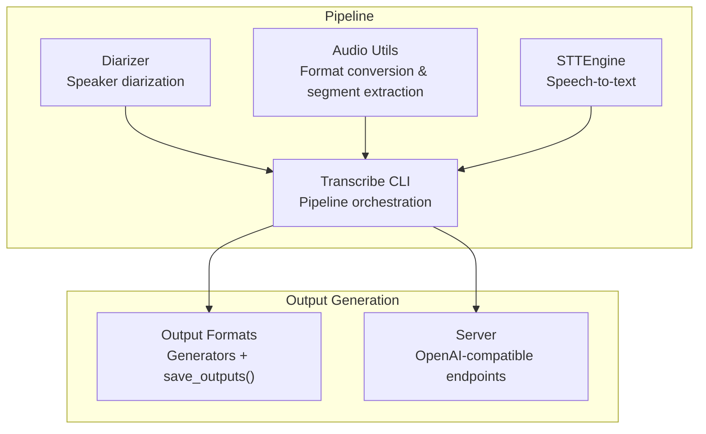
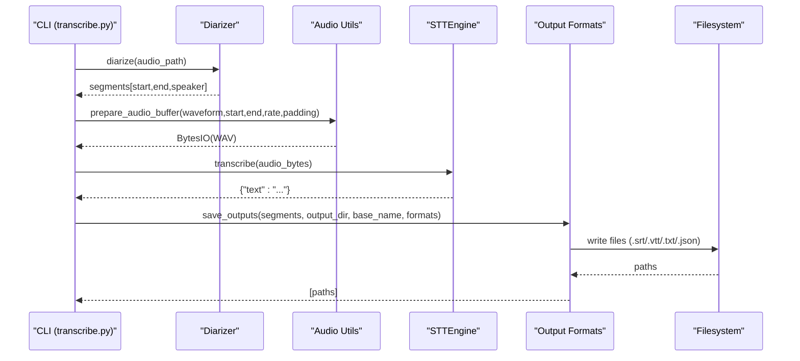
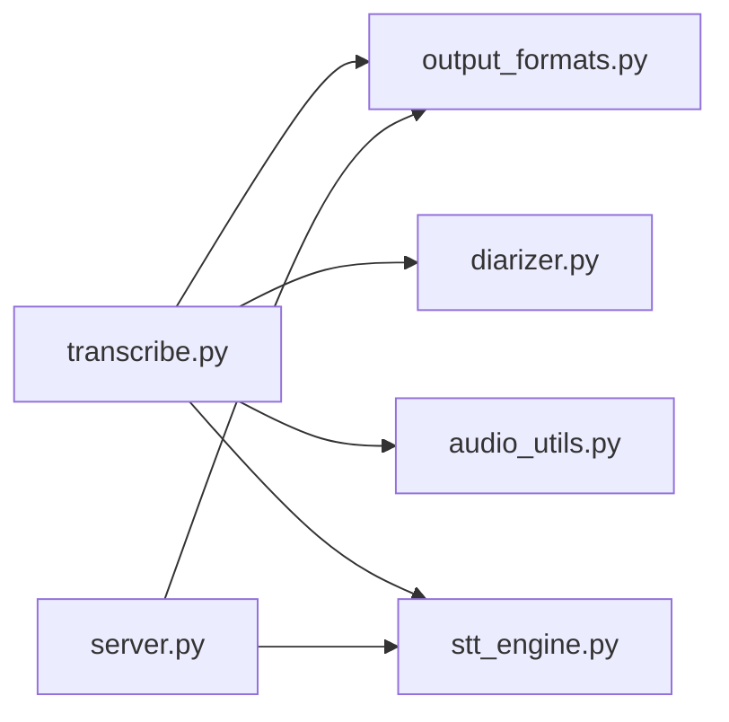

# Output Generation System

<cite>
**Referenced Files in This Document**
- [output_formats.py](file://output_formats.py)
- [transcribe.py](file://transcribe.py)
- [stt_engine.py](file://stt_engine.py)
- [diarizer.py](file://diarizer.py)
- [audio_utils.py](file://audio_utils.py)
- [server.py](file://server.py)
- [README.md](file://README.md)
</cite>

## Table of Contents
1. [Introduction](#introduction)
2. [Project Structure](#project-structure)
3. [Core Components](#core-components)
4. [Architecture Overview](#architecture-overview)
5. [Detailed Component Analysis](#detailed-component-analysis)
6. [Dependency Analysis](#dependency-analysis)
7. [Performance Considerations](#performance-considerations)
8. [Troubleshooting Guide](#troubleshooting-guide)
9. [Conclusion](#conclusion)

## Introduction
This document describes the output generation system that transforms transcription results into multiple formats (SRT, VTT, TXT, JSON). It focuses on the save_outputs() function, format-specific generators, and post-processing capabilities. It explains supported output formats, their schemas and formatting rules, method signatures, parameter configurations, file naming conventions, and the relationship between transcription results and output formatting including timestamp handling and speaker attribution. It also covers file I/O operations, encoding considerations, and output validation processes.

## Project Structure
The output generation system spans several modules:
- output_formats.py: Defines format-specific generators and the save_outputs() function
- transcribe.py: Orchestrates the transcription pipeline and invokes save_outputs()
- stt_engine.py: Provides the STTEngine used to generate text content for segments
- diarizer.py: Performs speaker diarization to produce speaker-tagged segments
- audio_utils.py: Handles audio conversion and segment extraction
- server.py: Provides HTTP endpoints that can format responses in SRT/VTT for server mode

**Diagram sources**
- [transcribe.py:45-144](file://transcribe.py#L45-L144)
- [output_formats.py:118-159](file://output_formats.py#L118-L159)
- [server.py:92-161](file://server.py#L92-L161)

**Section sources**
- [README.md:134-173](file://README.md#L134-L173)
- [transcribe.py:45-144](file://transcribe.py#L45-L144)

## Core Components
- save_outputs(): Persists transcription segments to multiple formats in a single call
- Format-specific generators: generate_srt(), generate_vtt(), generate_txt(), generate_json()
- Time formatting helpers: _format_time_srt(), _format_time_vtt()
- Format registry: _FORMAT_MAP mapping format identifiers to generators and extensions
- File I/O: UTF-8 encoding, JSON indentation, and directory creation

Key responsibilities:
- Validate and normalize requested formats
- Generate content using the appropriate generator
- Write files with correct extensions and encoding
- Log successful writes and warn on unknown formats

**Section sources**
- [output_formats.py:118-159](file://output_formats.py#L118-L159)
- [output_formats.py:43-103](file://output_formats.py#L43-L103)
- [output_formats.py:20-35](file://output_formats.py#L20-L35)

## Architecture Overview
The output generation system integrates with the transcription pipeline and server mode:

**Diagram sources**
- [transcribe.py:69-144](file://transcribe.py#L69-L144)
- [output_formats.py:118-159](file://output_formats.py#L118-L159)

## Detailed Component Analysis

### save_outputs() Function
Purpose:
- Save transcription results in the requested formats to disk

Method signature:
- save_outputs(segments, output_dir, base_name, formats) -> list[str]

Parameters:
- segments: list of dicts with keys start, end, speaker, text
- output_dir: directory to write output files
- base_name: filename stem (without extension)
- formats: iterable of format strings (e.g., ["srt","vtt","txt","json"])

Behavior:
- Creates output_dir if missing
- Normalizes each format string (strip and lowercase)
- Skips unknown formats with a warning
- Uses _FORMAT_MAP to select generator and extension
- Writes JSON with UTF-8 and indentation; other formats with UTF-8 text
- Returns list of written file paths

File naming convention:
- {base_name}.srt, {base_name}.vtt, {base_name}.txt, {base_name}.json

Validation:
- Unknown formats are ignored with a warning
- Directory creation is idempotent

**Section sources**
- [output_formats.py:118-159](file://output_formats.py#L118-L159)

### Format-Specific Generators

#### SRT Generator (generate_srt)
- Input: list of segment dicts with start, end, speaker, text
- Output: SRT-formatted text with numbered blocks and comma-milliseconds timestamps
- Timestamp format: HH:MM:SS,mmm
- Each block includes speaker tag in brackets

**Section sources**
- [output_formats.py:43-55](file://output_formats.py#L43-L55)
- [output_formats.py:20-26](file://output_formats.py#L20-L26)

#### VTT Generator (generate_vtt)
- Input: list of segment dicts with start, end, speaker, text
- Output: WebVTT-formatted text with header and numbered cues
- Timestamp format: HH:MM:SS.mmm
- Each cue includes speaker tag in brackets

**Section sources**
- [output_formats.py:58-70](file://output_formats.py#L58-L70)
- [output_formats.py:29-35](file://output_formats.py#L29-L35)

#### TXT Generator (generate_txt)
- Input: list of segment dicts with start, end, speaker, text
- Output: Plain text with one line per segment
- Line format: [timestamp --> timestamp] [speaker] text
- Timestamp format: HH:MM:SS,mmm

**Section sources**
- [output_formats.py:73-84](file://output_formats.py#L73-L84)
- [output_formats.py:20-26](file://output_formats.py#L20-L26)

#### JSON Generator (generate_json)
- Input: list of segment dicts with start, end, speaker, text
- Output: dict with top-level "segments" list
- Each segment preserves start, end, speaker, text

**Section sources**
- [output_formats.py:87-103](file://output_formats.py#L87-L103)

### Time Formatting Helpers
- _format_time_srt(seconds): HH:MM:SS,mmm
- _format_time_vtt(seconds): HH:MM:SS.mmm

These helpers ensure consistent timestamp formatting across all generators.

**Section sources**
- [output_formats.py:20-35](file://output_formats.py#L20-L35)

### Relationship Between Transcription Results and Output Formatting
- Segments originate from diarizer.diarize() as [{"start": float, "end": float, "speaker": str}, ...]
- STTEngine.transcribe() adds "text" to each segment
- Output generators consume segments with keys: start, end, speaker, text
- Timestamp handling: seconds are converted to SRT/VTT timecodes via helper functions
- Speaker attribution: all formats include speaker tags

**Section sources**
- [diarizer.py:55-70](file://diarizer.py#L55-L70)
- [stt_engine.py:71-105](file://stt_engine.py#L71-L105)
- [output_formats.py:43-103](file://output_formats.py#L43-L103)

### Server Mode Output Formatting
While save_outputs() persists files locally, the server provides OpenAI-compatible endpoints that can return SRT/VTT responses for single transcriptions. The server uses internal helpers to format SRT/VTT text for HTTP responses.

Endpoints:
- POST /v1/audio/transcriptions (OpenAI-compatible)
- POST /recognition (legacy)

Response formats:
- text, json, verbose_json, srt, vtt

**Section sources**
- [server.py:121-161](file://server.py#L121-L161)
- [server.py:62-84](file://server.py#L62-L84)

## Dependency Analysis
The output generation system has clear boundaries and minimal coupling:

- transcribe.py orchestrates the pipeline and calls save_outputs()
- output_formats.py depends only on standard library and typing
- server.py depends on STTEngine and reuses time formatting logic
- No circular dependencies observed

**Diagram sources**
- [transcribe.py:45-144](file://transcribe.py#L45-L144)
- [output_formats.py:118-159](file://output_formats.py#L118-L159)
- [server.py:92-161](file://server.py#L92-L161)

**Section sources**
- [transcribe.py:45-144](file://transcribe.py#L45-L144)
- [output_formats.py:118-159](file://output_formats.py#L118-L159)
- [server.py:92-161](file://server.py#L92-L161)

## Performance Considerations
- save_outputs() iterates over requested formats sequentially; order does not matter
- File I/O uses UTF-8 encoding; JSON is indented for readability
- Time formatting is O(n) with respect to number of segments
- No in-memory buffering beyond generator outputs; efficient for large transcripts

[No sources needed since this section provides general guidance]

## Troubleshooting Guide
Common issues and resolutions:
- Unknown output format: save_outputs() logs a warning and skips the format. Ensure format strings are valid (srt, vtt, txt, json).
- Missing output directory: save_outputs() creates the directory automatically.
- Encoding problems: All formats are written with UTF-8; ensure downstream consumers expect UTF-8.
- JSON formatting: JSON output is indented with 2 spaces for readability.
- Server SRT/VTT responses: Verify response_format parameter in HTTP requests.

**Section sources**
- [output_formats.py:136-159](file://output_formats.py#L136-L159)
- [server.py:121-161](file://server.py#L121-L161)

## Conclusion
The output generation system provides a clean, extensible interface for producing multiple transcription formats. save_outputs() centralizes persistence logic, while format-specific generators encapsulate formatting rules. The system integrates seamlessly with the transcription pipeline and supports both local file output and HTTP response formatting. Consistent timestamp handling and speaker attribution ensure reliable cross-format compatibility.