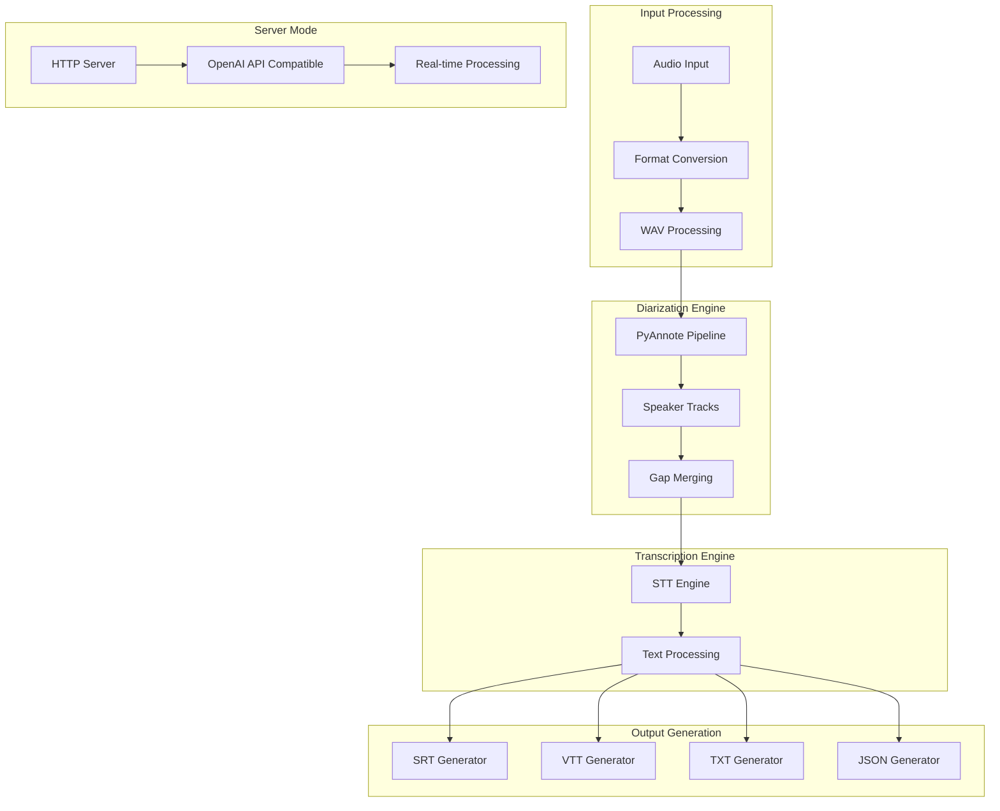
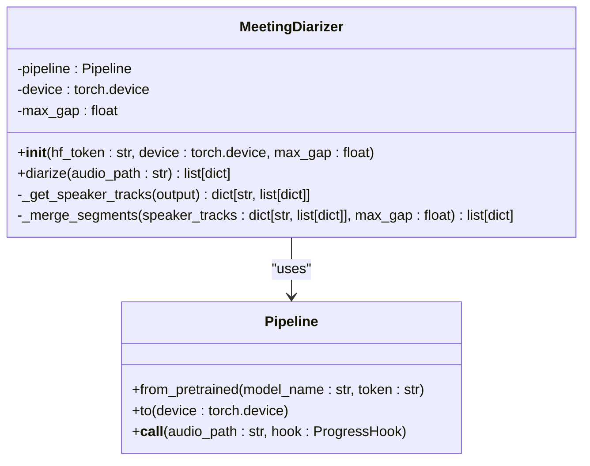
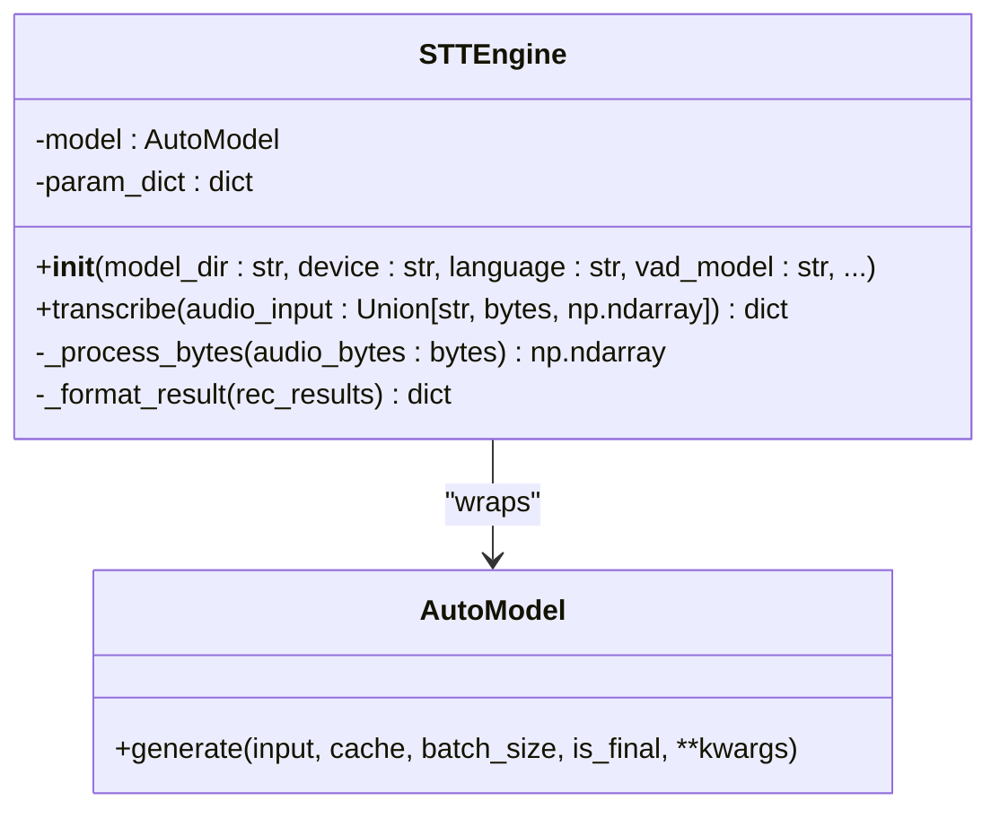
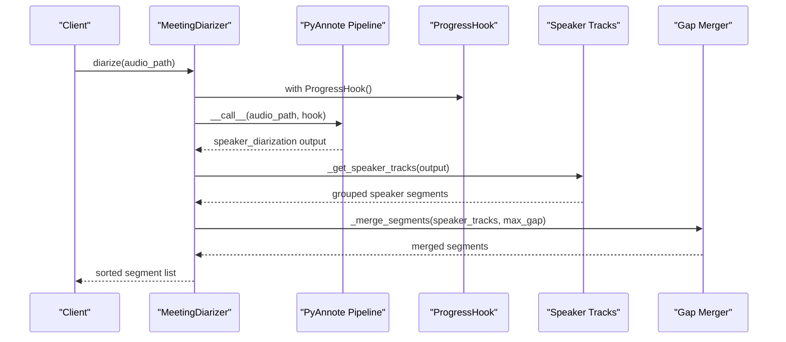
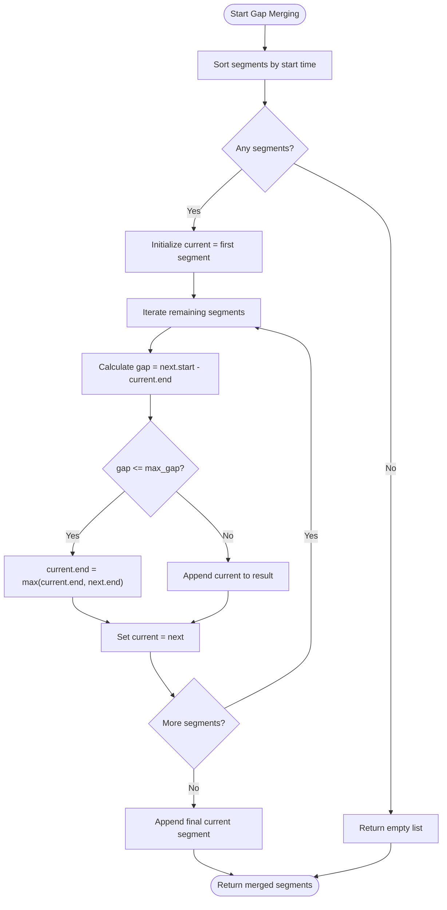
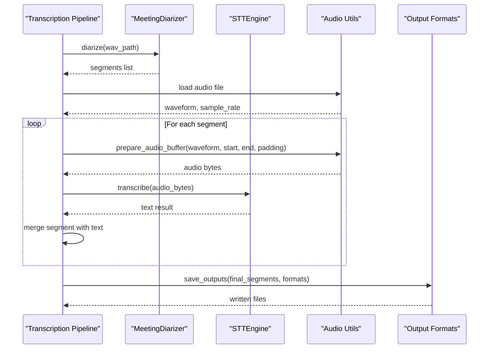

# Speaker Diarization System

<cite>
**Referenced Files in This Document**
- [diarizer.py](file://diarizer.py)
- [transcribe.py](file://transcribe.py)
- [README.md](file://README.md)
- [audio_utils.py](file://audio_utils.py)
- [output_formats.py](file://output_formats.py)
- [stt_engine.py](file://stt_engine.py)
- [server.py](file://server.py)
- [pyproject.toml](file://pyproject.toml)
</cite>

## Table of Contents
1. [Introduction](#introduction)
2. [System Architecture](#system-architecture)
3. [Core Components](#core-components)
4. [Diarization Pipeline](#diarization-pipeline)
5. [Configuration Parameters](#configuration-parameters)
6. [Output Format Specifications](#output-format-specifications)
7. [Segmentation and Gap Merging](#segmentation-and-gap-merging)
8. [Integration with Transcription Workflow](#integration-with-transcription-workflow)
9. [Performance Tuning](#performance-tuning)
10. [Accuracy Optimization](#accuracy-optimization)
11. [Troubleshooting Guide](#troubleshooting-guide)
12. [Conclusion](#conclusion)

## Introduction

The Speaker Diarization System is a comprehensive solution for automatic speaker separation and transcription of meeting audio recordings. Built on top of PyAnnote.audio for speaker diarization and SenseVoice (FunASR) for speech-to-text conversion, this system provides end-to-end audio processing with speaker identification and timestamped transcription.

The system follows a sequential pipeline: audio format conversion, speaker diarization, segment merging, individual segment transcription, and output generation in multiple formats (SRT, VTT, TXT, JSON). It supports both in-process operation and HTTP server modes for flexible deployment scenarios.

## System Architecture

The speaker diarization system is designed with clear separation of concerns across multiple modules, each handling specific aspects of the audio processing pipeline.



**Diagram sources**
- [diarizer.py:27-110](file://diarizer.py#L27-L110)
- [transcribe.py:45-144](file://transcribe.py#L45-L144)
- [stt_engine.py:24-185](file://stt_engine.py#L24-L185)

The architecture consists of four primary processing stages:

1. **Audio Preprocessing**: Format conversion and preparation
2. **Speaker Diarization**: PyAnnote-based speaker identification
3. **Segment Processing**: Gap merging and speaker track management
4. **Text Generation**: STT engine integration and output formatting

## Core Components

### MeetingDiarizer Class

The [`MeetingDiarizer`:27-110](file://diarizer.py#L27-L110) class serves as the central orchestrator for speaker diarization operations. It wraps the PyAnnote.audio pipeline and provides a simplified interface for speaker separation tasks.



**Diagram sources**
- [diarizer.py:27-110](file://diarizer.py#L27-L110)

**Section sources**
- [diarizer.py:27-110](file://diarizer.py#L27-L110)

### STTEngine Class

The [`STTEngine`:24-185](file://stt_engine.py#L24-L185) class provides the speech-to-text conversion capabilities using SenseVoice via FunASR. It handles audio preprocessing, model inference, and result formatting.



**Diagram sources**
- [stt_engine.py:24-185](file://stt_engine.py#L24-L185)

**Section sources**
- [stt_engine.py:24-185](file://stt_engine.py#L24-L185)

## Diarization Pipeline

The diarization pipeline follows a structured sequence of operations to transform raw audio into speaker-labeled segments.



**Diagram sources**
- [diarizer.py:55-110](file://diarizer.py#L55-L110)

### Method Signature: diarize()

The primary interface for speaker diarization is the [`diarize()`:55-70](file://diarizer.py#L55-L70) method with the following signature:

```python
def diarize(self, audio_path: str) -> list[dict]:
    """
    Run speaker diarization on an audio file.
    
    Returns a sorted list of segments:
        [{"start": float, "end": float, "speaker": str}, ...]
    """
```

**Section sources**
- [diarizer.py:55-70](file://diarizer.py#L55-L70)

## Configuration Parameters

The system provides extensive configuration options to fine-tune diarization performance and output characteristics.

### Core Configuration Options

| Parameter | Type | Default | Description |
|-----------|------|---------|-------------|
| `hf_token` | str | None | HuggingFace authentication token for model access |
| `device` | torch.device | Auto-detected | Computation device (cpu, mps, cuda) |
| `max_gap` | float | 2.0 | Maximum gap seconds to merge adjacent segments |

### CLI Configuration Options

The command-line interface exposes several parameters for controlling the diarization process:

| Parameter | Type | Default | Description |
|-----------|------|---------|-------------|
| `--max-gap` | float | 2.0 | Merge same-speaker segments separated by ≤ N seconds |
| `--padding` | float | 0.3 | Audio segment padding in seconds for transcription |
| `--max-workers` | int | 1 | Maximum concurrent transcription workers |
| `--language` | str | auto | Target language for transcription |
| `--format` | str | txt | Comma-separated output formats |

**Section sources**
- [diarizer.py:30-53](file://diarizer.py#L30-L53)
- [transcribe.py:198-220](file://transcribe.py#L198-L220)
- [README.md:100-122](file://README.md#L100-L122)

## Output Format Specifications

The system generates standardized segment dictionaries with consistent field structures for downstream processing.

### Segment Dictionary Structure

Each diarization segment follows this format:

| Field | Type | Description |
|-------|------|-------------|
| `start` | float | Segment start time in seconds |
| `end` | float | Segment end time in seconds |
| `speaker` | str | Speaker identifier (e.g., "SPEAKER_00", "SPEAKER_01") |

### Example Output Format

```json
[
    {
        "start": 12.34,
        "end": 25.67,
        "speaker": "SPEAKER_00"
    },
    {
        "start": 26.12,
        "end": 45.89,
        "speaker": "SPEAKER_01"
    }
]
```

**Section sources**
- [diarizer.py:76-87](file://diarizer.py#L76-L87)
- [diarizer.py:100-109](file://diarizer.py#L100-L109)

## Segmentation and Gap Merging

The gap merging algorithm is a critical component that improves transcription accuracy by combining adjacent segments from the same speaker.

### Gap Merging Algorithm



**Diagram sources**
- [diarizer.py:89-109](file://diarizer.py#L89-L109)

### Algorithm Complexity

- **Time Complexity**: O(n log n) due to sorting operations
- **Space Complexity**: O(n) for storing merged segments
- **Optimization**: Single-pass merging after initial sorting

**Section sources**
- [diarizer.py:89-109](file://diarizer.py#L89-L109)

## Integration with Transcription Workflow

The diarization results seamlessly integrate with the transcription phase through a coordinated pipeline.



**Diagram sources**
- [transcribe.py:45-144](file://transcribe.py#L45-L144)
- [audio_utils.py:53-94](file://audio_utils.py#L53-L94)
- [stt_engine.py:71-106](file://stt_engine.py#L71-L106)

### Key Integration Points

1. **Pre-segmented Audio**: The STTEngine accepts pre-segmented audio to avoid double VAD processing
2. **Padding Management**: Audio segments include configurable padding for improved transcription accuracy
3. **Concurrent Processing**: Asynchronous transcription with semaphore-controlled concurrency
4. **Result Merging**: Individual segment results are combined while preserving temporal ordering

**Section sources**
- [transcribe.py:84-125](file://transcribe.py#L84-L125)
- [audio_utils.py:53-94](file://audio_utils.py#L53-L94)

## Performance Tuning

### Device Selection and Memory Management

The system automatically detects optimal device configuration:

- **Apple Silicon**: MPS backend for GPU acceleration
- **Linux/macOS**: CPU fallback with CUDA support
- **Memory Optimization**: In-process audio loading with efficient buffer management

### Concurrency Control

The [`max_workers`](file://transcribe.py#L209) parameter controls transcription parallelism:

- **Default**: 1 worker for stability
- **Recommended**: 2-4 workers for multi-core systems
- **Considerations**: Balance between memory usage and processing speed

### Gap Merging Optimization

The [`max_gap`](file://transcribe.py#L210) parameter affects segmentation quality:

- **Lower Values** (0.5-1.0s): More precise segmentation, potential fragmentation
- **Higher Values** (2.0-4.0s): Coarser segmentation, reduced computational overhead
- **Optimal Range**: 1.5-2.5s for most meeting scenarios

**Section sources**
- [diarizer.py:48-53](file://diarizer.py#L48-L53)
- [transcribe.py:209-210](file://transcribe.py#L209-L210)

## Accuracy Optimization

### Model Configuration

The PyAnnote pipeline uses the community-optimized model for balanced performance and accuracy:

- **Model**: `pyannote/speaker-diarization-community-1`
- **Requirements**: Valid HuggingFace token with model access permissions
- **Initialization**: Safe global registration for torch >= 2.6 compatibility

### Audio Quality Considerations

1. **Sample Rate**: Automatic 16kHz conversion ensures optimal model performance
2. **Channel Processing**: Mono channel conversion reduces complexity
3. **Format Support**: FFmpeg-based conversion supports diverse input formats

### Post-processing Enhancements

- **Speaker Track Organization**: Automatic grouping by speaker identity
- **Temporal Consistency**: Strict chronological ordering of segments
- **Gap Merging**: Intelligent combination of adjacent speaker segments

**Section sources**
- [diarizer.py:42-46](file://diarizer.py#L42-L46)
- [audio_utils.py:23-51](file://audio_utils.py#L23-L51)

## Troubleshooting Guide

### Common Issues and Solutions

#### PyAnnote Model Access

**Problem**: Authentication errors when loading PyAnnote models
**Solution**: Ensure HuggingFace token is configured and model terms are accepted

#### Torch Compatibility

**Problem**: Version conflicts with torchcodec
**Solution**: Verify torchcodec >= 0.12 compatibility with current torch version

#### FFmpeg Dependencies

**Problem**: Audio conversion failures
**Solution**: Install FFmpeg 4-8 and verify system installation

#### Memory Issues

**Problem**: Out-of-memory errors during transcription
**Solution**: Reduce max_workers, increase padding, or use CPU device

**Section sources**
- [README.md:175-203](file://README.md#L175-L203)
- [diarizer.py:36-40](file://diarizer.py#L36-L40)

### Debug Information

The system provides comprehensive logging:

- **Diarization Progress**: Real-time progress tracking
- **Segment Detection**: Count and timing information
- **Error Reporting**: Detailed exception information
- **Device Configuration**: Hardware utilization details

**Section sources**
- [diarizer.py:42-53](file://diarizer.py#L42-L53)
- [transcribe.py:32-37](file://transcribe.py#L32-L37)

## Conclusion

The Speaker Diarization System provides a robust, production-ready solution for automated meeting transcription with speaker identification. Its modular architecture, comprehensive configuration options, and seamless integration with the transcription workflow make it suitable for various deployment scenarios.

Key strengths include:
- **Reliable Performance**: PyAnnote-based diarization with proven accuracy
- **Flexible Deployment**: Both in-process and HTTP server modes
- **Extensible Design**: Clear separation of concerns across processing stages
- **Production Ready**: Comprehensive error handling and logging

The system's configuration flexibility allows optimization for different use cases, from development environments to high-throughput production deployments. The gap merging algorithm and concurrent processing capabilities ensure both accuracy and performance in real-world scenarios.