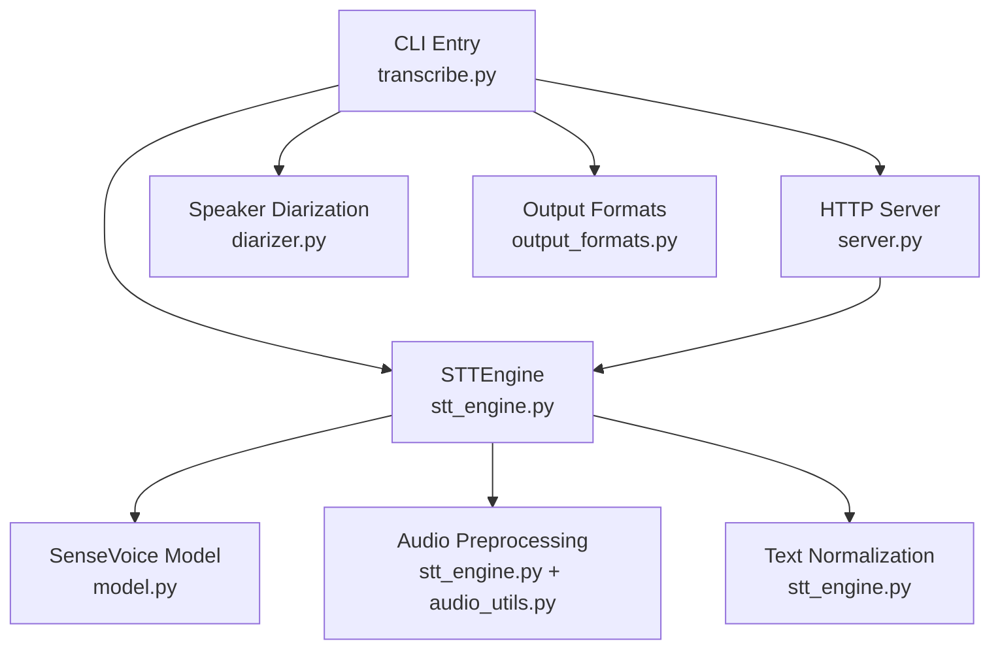
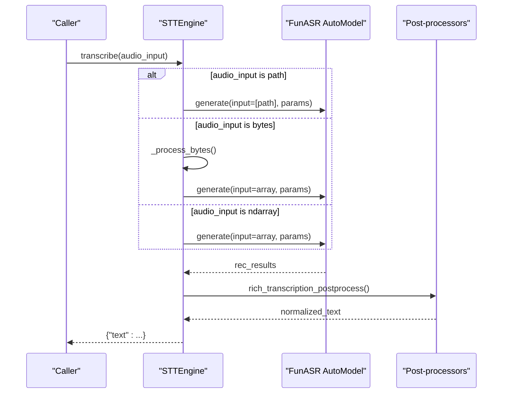
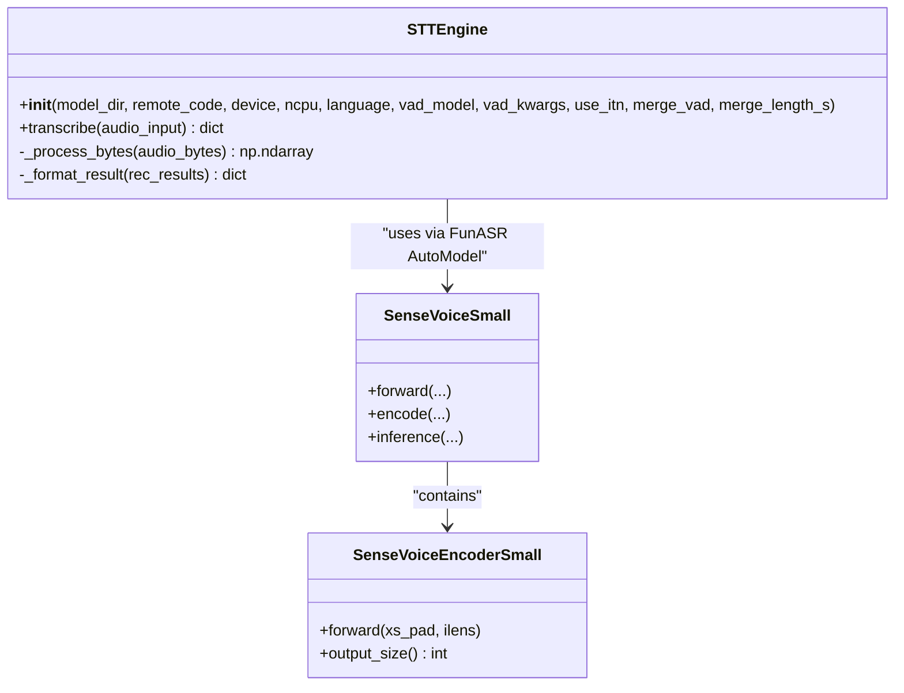
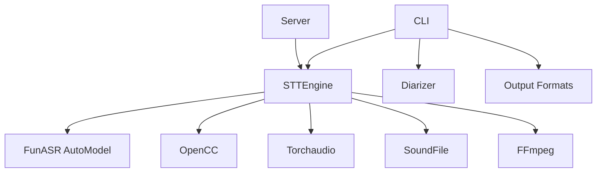

# Speech Recognition Engine

<cite>
**Referenced Files in This Document**
- [stt_engine.py](file://stt_engine.py)
- [model.py](file://model.py)
- [transcribe.py](file://transcribe.py)
- [server.py](file://server.py)
- [diarizer.py](file://diarizer.py)
- [audio_utils.py](file://audio_utils.py)
- [output_formats.py](file://output_formats.py)
- [README.md](file://README.md)
</cite>

## Table of Contents
1. [Introduction](#introduction)
2. [Project Structure](#project-structure)
3. [Core Components](#core-components)
4. [Architecture Overview](#architecture-overview)
5. [Detailed Component Analysis](#detailed-component-analysis)
6. [Dependency Analysis](#dependency-analysis)
7. [Performance Considerations](#performance-considerations)
8. [Troubleshooting Guide](#troubleshooting-guide)
9. [Conclusion](#conclusion)
10. [Appendices](#appendices)

## Introduction
This document describes the Speech Recognition Engine centered on the STTEngine class and its integration with the SenseVoice model via FunASR. It explains initialization parameters, model loading, configuration options, transcription workflow, audio preprocessing, and text normalization. It also covers supported languages, model variants, performance characteristics, and usage examples in both CLI and server contexts, along with memory management and optimization tips for different hardware configurations.

## Project Structure
The project is organized around a CLI entry point, an in-process STT engine, a FastAPI server, audio utilities, speaker diarization, and output formatters. The STT engine wraps FunASR’s AutoModel to perform SenseVoice-based transcription.

**Diagram sources**
- [transcribe.py:45-144](file://transcribe.py#L45-L144)
- [server.py:92-161](file://server.py#L92-L161)
- [stt_engine.py:24-185](file://stt_engine.py#L24-L185)
- [model.py:437-653](file://model.py#L437-L653)
- [diarizer.py:27-110](file://diarizer.py#L27-L110)
- [audio_utils.py:23-120](file://audio_utils.py#L23-L120)
- [output_formats.py:118-160](file://output_formats.py#L118-L160)

**Section sources**
- [README.md:134-173](file://README.md#L134-L173)
- [transcribe.py:45-144](file://transcribe.py#L45-L144)
- [server.py:92-161](file://server.py#L92-L161)

## Core Components
- STTEngine: In-process engine wrapping FunASR AutoModel for SenseVoice transcription. Handles model initialization, audio preprocessing, inference, and result formatting.
- SenseVoice Small model: Encapsulated in model.py with encoder and CTC/attention hybrid components.
- CLI and Server: Unified CLI entry point and optional HTTP server for transcription requests.
- Utilities: Audio conversion, segmentation, and output formatting.

Key responsibilities:
- Initialization: Configure device, VAD, language, ITN, and merging options.
- Transcription: Accept file path, bytes, or numpy arrays; preprocess audio; run model.generate; post-process and normalize text.
- Server: Expose OpenAI-compatible endpoints for HTTP-based transcription.

**Section sources**
- [stt_engine.py:24-185](file://stt_engine.py#L24-L185)
- [model.py:437-653](file://model.py#L437-L653)
- [transcribe.py:45-144](file://transcribe.py#L45-L144)
- [server.py:92-161](file://server.py#L92-L161)

## Architecture Overview
The engine integrates with FunASR’s AutoModel to perform end-to-end speech recognition. The pipeline includes optional VAD, audio resampling and mono conversion, model inference, and post-processing including rich transcription formatting and Simplified-to-Traditional Chinese conversion.

**Diagram sources**
- [stt_engine.py:71-105](file://stt_engine.py#L71-L105)
- [stt_engine.py:111-139](file://stt_engine.py#L111-L139)

## Detailed Component Analysis

### STTEngine Class
Responsibilities:
- Initialize model with configurable device, VAD, language, ITN, and merging parameters.
- Transcribe audio from file path, bytes, or numpy array.
- Preprocess audio using torchaudio/soundfile or ffmpeg fallback.
- Post-process and normalize text.

Initialization parameters:
- model_dir: SenseVoice model identifier or local path (default: iic/SenseVoiceSmall).
- remote_code: Remote model code path (default: ./model.py).
- device: Torch device string (default: cpu).
- ncpu: Number of CPU threads for model loader (default: 4).
- language: Target language or auto (default: auto).
- vad_model: VAD model name or None to disable (default: fsmn-vad).
- vad_kwargs: VAD max single segment time (default: 30000).
- use_itn: Enable inverse text normalization (default: True).
- merge_vad: Merge VAD segments (default: True).
- merge_length_s: Max merged segment length in seconds (default: 15).

Public API:
- transcribe(audio_input): Returns a dictionary with the processed text.

Internal helpers:
- _process_bytes(): Decode bytes to 16 kHz mono float32 array using torchaudio or ffmpeg fallback.
- _format_result(): Apply rich transcription post-processing and Simplified-to-Traditional Chinese conversion.

Audio preprocessing:
- Torchaudio/soundfile decoding to float32 waveform.
- Mono mixdown if multi-channel.
- Resample to 16 kHz if needed.
- Fallback to ffmpeg PCM s16le decode when torchaudio fails.

Text normalization:
- Rich transcription post-processing.
- OpenCC Simplified-to-Traditional Chinese conversion.

Method signature references:
- STTEngine.__init__: [stt_engine.py:27-65](file://stt_engine.py#L27-L65)
- STTEngine.transcribe: [stt_engine.py:71-105](file://stt_engine.py#L71-L105)
- STTEngine._process_bytes: [stt_engine.py:111-128](file://stt_engine.py#L111-L128)
- STTEngine._format_result: [stt_engine.py:130-139](file://stt_engine.py#L130-L139)
- Internal audio decoders: [stt_engine.py:147-184](file://stt_engine.py#L147-L184)

**Section sources**
- [stt_engine.py:24-185](file://stt_engine.py#L24-L185)

### SenseVoice Model Integration
SenseVoiceSmall model encapsulates:
- An encoder stack (SANM-based) with configurable attention heads, blocks, and dropout.
- CTC and attention hybrid training components.
- Language identification and text normalization embeddings.
- Forward/inference methods for encoder and combined loss computation.

Model configuration highlights:
- Encoder: SenseVoiceEncoderSmall with SANM attention and position-wise feed-forward.
- CTC: Connectionist Temporal Classification head.
- Text normalization: Embeddings for “with itn” and “without itn” modes.
- Language IDs: Mapping for auto, zh, en, yue, ja, ko, nospeech.

Method references:
- SenseVoiceSmall class: [model.py:580-653](file://model.py#L580-L653)
- SenseVoiceEncoderSmall: [model.py:437-577](file://model.py#L437-L577)

**Diagram sources**
- [stt_engine.py:24-185](file://stt_engine.py#L24-L185)
- [model.py:437-653](file://model.py#L437-L653)

**Section sources**
- [model.py:437-653](file://model.py#L437-L653)

### CLI Usage (In-Process)
The CLI orchestrates audio conversion, speaker diarization, segment extraction, and transcription using the STTEngine. It disables internal VAD when using pre-segmented audio from the diarizer to avoid double segmentation.

Key behaviors:
- Converts input to WAV at 16 kHz mono.
- Runs speaker diarization to detect segments.
- Extracts waveform segments with optional padding.
- Transcribes each segment using STTEngine.
- Saves outputs in requested formats.

Command-line references:
- CLI entry and arguments: [transcribe.py:173-220](file://transcribe.py#L173-L220)
- In-process pipeline: [transcribe.py:45-144](file://transcribe.py#L45-L144)
- Diarizer integration: [diarizer.py:27-110](file://diarizer.py#L27-L110)
- Audio buffer preparation: [audio_utils.py:53-94](file://audio_utils.py#L53-L94)

Example usage references:
- Basic CLI invocation: [README.md:44-60](file://README.md#L44-L60)
- Server mode: [README.md:74-89](file://README.md#L74-L89)

**Section sources**
- [transcribe.py:45-144](file://transcribe.py#L45-L144)
- [diarizer.py:27-110](file://diarizer.py#L27-L110)
- [audio_utils.py:53-94](file://audio_utils.py#L53-L94)
- [README.md:44-89](file://README.md#L44-L89)

### HTTP Server (OpenAI-Compatible)
The server exposes:
- POST /v1/audio/transcriptions (OpenAI Whisper API compatible)
- POST /recognition (legacy endpoint)

It binds an STTEngine instance and streams uploaded audio to the engine for transcription, returning formatted responses.

Endpoints and server references:
- Server factory and endpoints: [server.py:92-161](file://server.py#L92-L161)
- Runner and engine creation: [server.py:169-197](file://server.py#L169-L197)

Response formatting helpers:
- SRT/VTT time formatting and content generation: [server.py:30-84](file://server.py#L30-L84)

**Section sources**
- [server.py:92-197](file://server.py#L92-L197)

### Audio Preprocessing and Normalization
Preprocessing pipeline:
- Torchaudio/soundfile decoding to float32 waveform.
- Mono mixdown if multi-channel.
- Resample to 16 kHz if needed.
- Fallback to ffmpeg PCM s16le decode when torchaudio fails.
- Post-processing: rich transcription formatting and Simplified-to-Traditional Chinese conversion.

Normalization references:
- STTEngine post-processing: [stt_engine.py:130-139](file://stt_engine.py#L130-L139)
- Audio decoding utilities: [stt_engine.py:147-184](file://stt_engine.py#L147-L184)
- Utility functions: [audio_utils.py:23-120](file://audio_utils.py#L23-L120)

**Section sources**
- [stt_engine.py:111-184](file://stt_engine.py#L111-L184)
- [audio_utils.py:23-120](file://audio_utils.py#L23-L120)

## Dependency Analysis
High-level dependencies:
- STTEngine depends on FunASR AutoModel and OpenCC for post-processing.
- CLI depends on STTEngine, Diarizer, and output formatters.
- Server depends on STTEngine and FastAPI.
- Audio utilities support both torchaudio and ffmpeg fallbacks.

**Diagram sources**
- [stt_engine.py:12-19](file://stt_engine.py#L12-L19)
- [transcribe.py:49-53](file://transcribe.py#L49-L53)
- [server.py:16-21](file://server.py#L16-L21)
- [audio_utils.py:15-18](file://audio_utils.py#L15-L18)

**Section sources**
- [stt_engine.py:12-19](file://stt_engine.py#L12-L19)
- [transcribe.py:49-53](file://transcribe.py#L49-L53)
- [server.py:16-21](file://server.py#L16-L21)
- [audio_utils.py:15-18](file://audio_utils.py#L15-L18)

## Performance Considerations
- Device allocation: Choose device according to hardware availability (cpu, mps, cuda). The CLI defaults to cpu; specify device explicitly for GPU acceleration.
- VAD behavior: Disable internal VAD when using pre-segmented audio from diarizer to avoid redundant segmentation.
- Concurrency: In-process mode uses a semaphore to limit concurrent transcriptions; adjust max_workers accordingly.
- Audio sampling: Ensure 16 kHz mono input to minimize resampling overhead.
- Memory management: Prefer passing numpy arrays directly when available to avoid repeated decoding; clean up temporary files after ffmpeg fallback.
- Model variants: Use appropriate model_dir for desired accuracy/performance trade-offs.

References:
- Device and concurrency options: [transcribe.py:195-218](file://transcribe.py#L195-L218)
- VAD configuration: [stt_engine.py:52-54](file://stt_engine.py#L52-L54)
- Audio conversion: [audio_utils.py:23-50](file://audio_utils.py#L23-L50)

[No sources needed since this section provides general guidance]

## Troubleshooting Guide
Common issues and resolutions:
- FFmpeg version compatibility: Ensure FFmpeg 4–8 is installed; conversion failures indicate version mismatch.
- torchcodec/torchaudio compatibility: Align versions to avoid NameError related to AudioDecoder.
- HuggingFace token: Diarizer requires a valid HF token; set HF_TOKEN in environment.
- Audio decoding errors: The engine falls back to ffmpeg when torchaudio fails; check logs for torchaudio exceptions.

References:
- FFmpeg troubleshooting: [README.md:187-203](file://README.md#L187-L203)
- torchcodec compatibility: [README.md:177-181](file://README.md#L177-L181)
- HF token requirement: [diarizer.py:36-40](file://diarizer.py#L36-L40)
- Decoding fallback: [stt_engine.py:115-128](file://stt_engine.py#L115-L128)

**Section sources**
- [README.md:177-203](file://README.md#L177-L203)
- [diarizer.py:36-40](file://diarizer.py#L36-L40)
- [stt_engine.py:115-128](file://stt_engine.py#L115-L128)

## Conclusion
The STT engine provides a robust, in-process transcription solution integrating FunASR’s SenseVoice model with practical audio preprocessing and text normalization. It supports flexible device allocation, optional VAD, and dual CLI and HTTP server usage. Following the configuration and optimization guidelines ensures reliable performance across diverse hardware environments.

[No sources needed since this section summarizes without analyzing specific files]

## Appendices

### Supported Languages and Model Variants
Supported languages:
- auto, zh, en, yue, ja, ko

Model variants:
- iic/SenseVoiceSmall (default)
- Local model directories or custom SenseVoice variants via model_dir

References:
- Language options: [README.md:123-132](file://README.md#L123-L132)
- CLI language option: [transcribe.py:200](file://transcribe.py#L200)
- Model directory option: [transcribe.py:196](file://transcribe.py#L196)

**Section sources**
- [README.md:123-132](file://README.md#L123-L132)
- [transcribe.py:196-200](file://transcribe.py#L196-L200)

### Example Usage References
- CLI transcription: [README.md:44-60](file://README.md#L44-L60)
- Server startup: [README.md:74-89](file://README.md#L74-L89)
- CLI arguments: [transcribe.py:173-220](file://transcribe.py#L173-L220)

**Section sources**
- [README.md:44-89](file://README.md#L44-L89)
- [transcribe.py:173-220](file://transcribe.py#L173-L220)