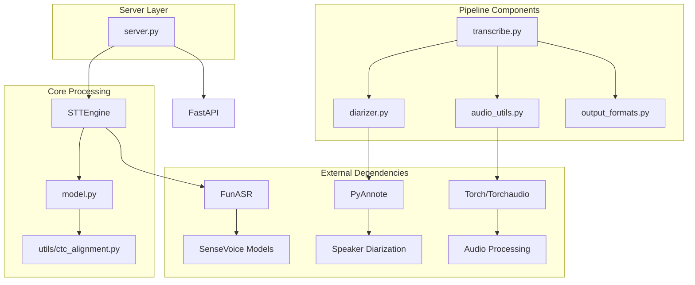
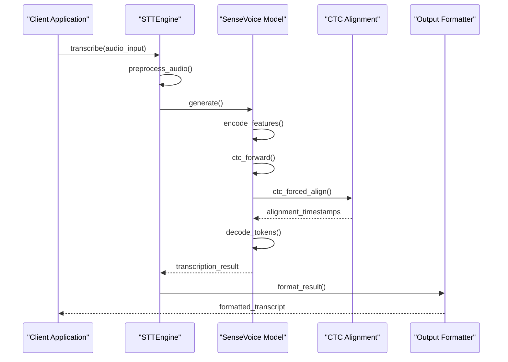
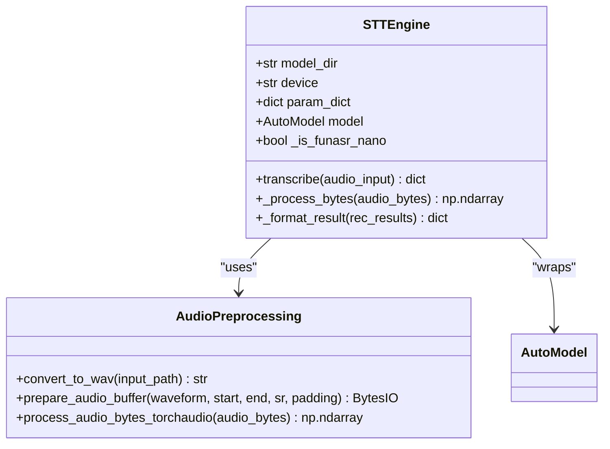
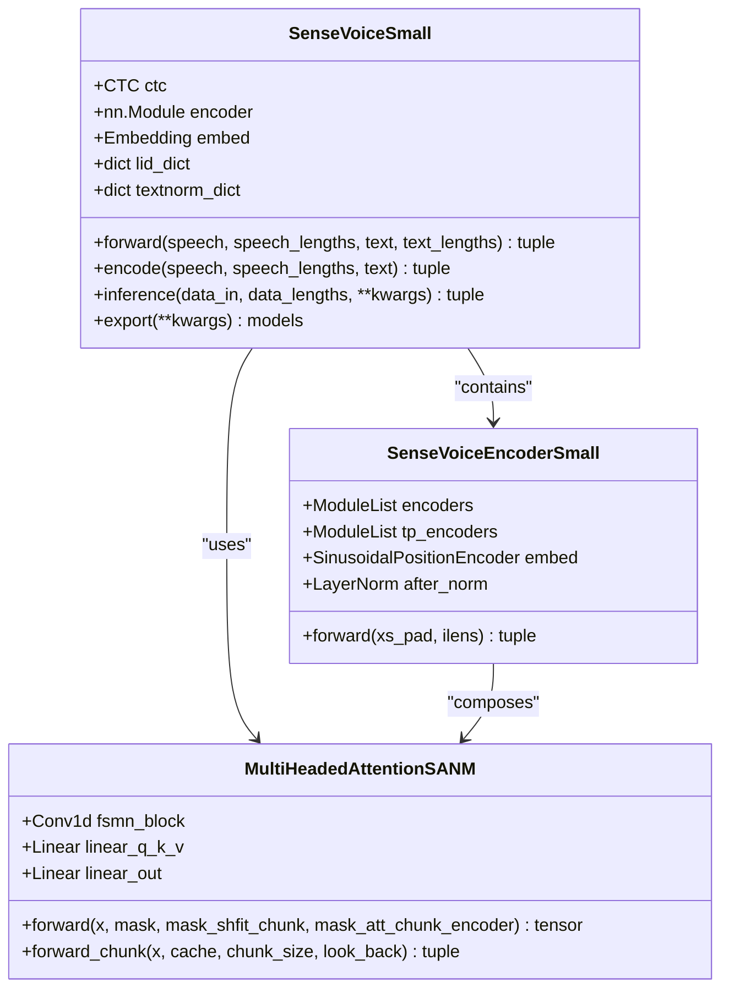
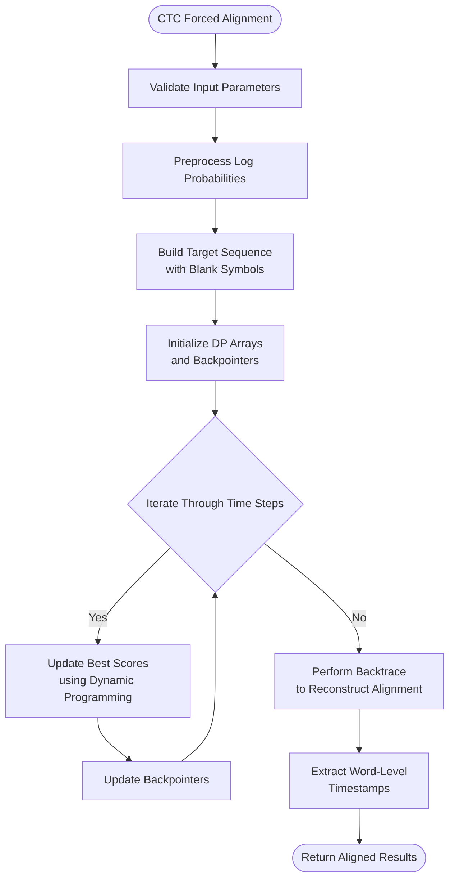
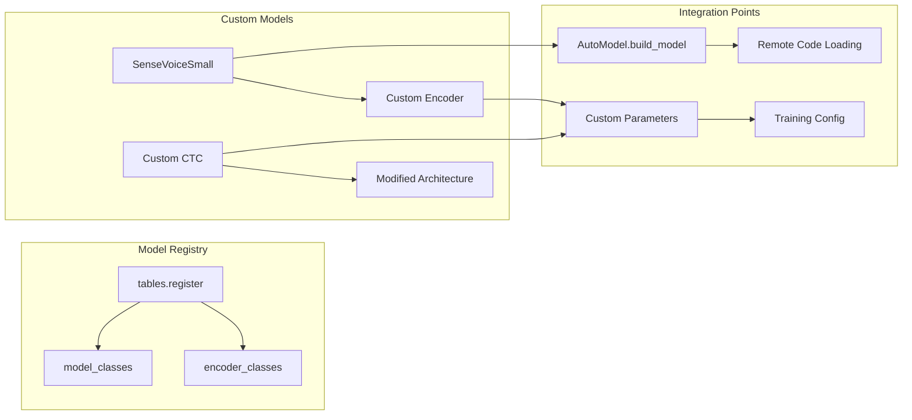
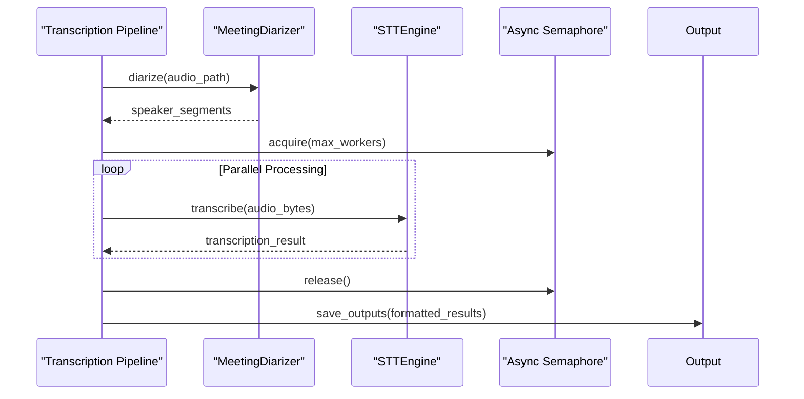
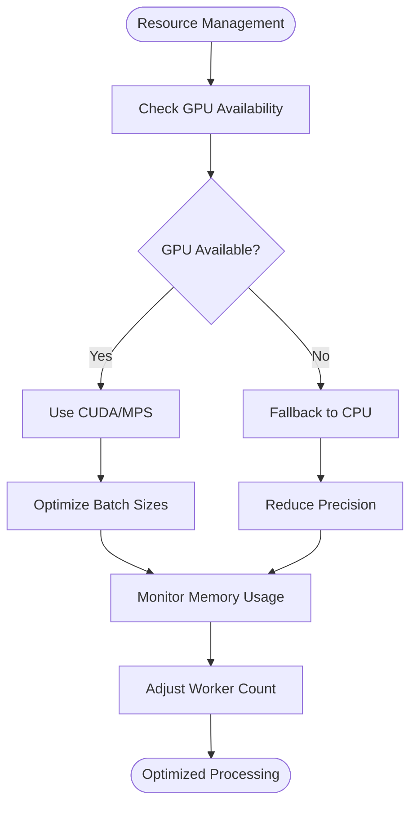

# Advanced Features

<cite>
**Referenced Files in This Document**
- [utils/ctc_alignment.py](file://utils/ctc_alignment.py)
- [model.py](file://model.py)
- [stt_engine.py](file://stt_engine.py)
- [transcribe.py](file://transcribe.py)
- [diarizer.py](file://diarizer.py)
- [audio_utils.py](file://audio_utils.py)
- [output_formats.py](file://output_formats.py)
- [server.py](file://server.py)
- [README.md](file://README.md)
- [pyproject.toml](file://pyproject.toml)
</cite>

## Table of Contents
1. [Introduction](#introduction)
2. [Project Structure](#project-structure)
3. [Core Components](#core-components)
4. [Architecture Overview](#architecture-overview)
5. [Detailed Component Analysis](#detailed-component-analysis)
6. [Advanced CTC Alignment Implementation](#advanced-ctc-alignment-implementation)
7. [Custom Model Integration](#custom-model-integration)
8. [Processing Pipeline Extensions](#processing-pipeline-extensions)
9. [Configuration Options](#configuration-options)
10. [Performance Optimization](#performance-optimization)
11. [Memory Management Strategies](#memory-management-strategies)
12. [Integration Examples](#integration-examples)
13. [Troubleshooting Guide](#troubleshooting-guide)
14. [Conclusion](#conclusion)

## Introduction

This document provides comprehensive coverage of the advanced features in the meeting transcription system, focusing on Connectionist Temporal Classification (CTC) forced alignment algorithms, custom model integration capabilities, and extension mechanisms for specialized use cases. The system combines automatic speaker diarization with SenseVoice speech recognition to produce synchronized transcripts with precise timing information.

The advanced features enable sophisticated processing workflows including custom pipeline development, model modification, and integration with external systems while maintaining high performance and memory efficiency.

## Project Structure

The project follows a modular architecture with clear separation of concerns:

**Diagram sources**
- [stt_engine.py:24-65](file://stt_engine.py#L24-L65)
- [model.py:580-780](file://model.py#L580-L780)
- [transcribe.py:45-144](file://transcribe.py#L45-L144)

**Section sources**
- [README.md:134-173](file://README.md#L134-L173)
- [pyproject.toml:1-24](file://pyproject.toml#L1-L24)

## Core Components

The system consists of several interconnected components that work together to provide advanced speech processing capabilities:

### STTEngine
The primary interface for speech-to-text processing, wrapping FunASR's AutoModel with additional functionality for audio preprocessing and result formatting.

### SenseVoice Model Architecture
A hybrid CTC-attention model with specialized components for multilingual support and rich text processing.

### CTC Alignment System
Advanced forced alignment implementation enabling precise timestamp extraction for individual words and phrases.

### Processing Pipeline
Modular pipeline supporting both in-process and server modes with configurable processing parameters.

**Section sources**
- [stt_engine.py:24-185](file://stt_engine.py#L24-L185)
- [model.py:580-931](file://model.py#L580-L931)

## Architecture Overview

The advanced architecture supports multiple processing modes and integration patterns:

**Diagram sources**
- [stt_engine.py:71-105](file://stt_engine.py#L71-L105)
- [model.py:896-922](file://model.py#L896-L922)

## Detailed Component Analysis

### STTEngine Advanced Features

The STTEngine provides comprehensive audio processing capabilities with advanced configuration options:

**Diagram sources**
- [stt_engine.py:24-185](file://stt_engine.py#L24-L185)
- [audio_utils.py:23-120](file://audio_utils.py#L23-L120)

### SenseVoice Model Advanced Architecture

The model incorporates sophisticated components for multilingual and rich text processing:

**Diagram sources**
- [model.py:580-931](file://model.py#L580-L931)
- [model.py:437-577](file://model.py#L437-L577)

**Section sources**
- [model.py:580-931](file://model.py#L580-L931)
- [stt_engine.py:24-185](file://stt_engine.py#L24-L185)

## Advanced CTC Alignment Implementation

The CTC alignment system provides precise word-level timing information through dynamic programming:

**Diagram sources**
- [utils/ctc_alignment.py:3-77](file://utils/ctc_alignment.py#L3-L77)

### Implementation Details

The CTC alignment algorithm implements a sophisticated dynamic programming approach:

1. **Input Validation**: Validates tensor shapes and dimensions for batch processing
2. **Target Construction**: Creates expanded target sequences with interleaved blank symbols
3. **Dynamic Programming**: Uses a trellis-based approach with efficient memory management
4. **Backtracking**: Reconstructs optimal alignment path through backpointers
5. **Timestamp Extraction**: Converts frame-level alignments to word-level timestamps

**Section sources**
- [utils/ctc_alignment.py:3-77](file://utils/ctc_alignment.py#L3-L77)
- [model.py:896-922](file://model.py#L896-L922)

## Custom Model Integration

The system provides extensive customization capabilities through multiple integration points:

### Model Registration System

**Diagram sources**
- [model.py:580-653](file://model.py#L580-L653)

### Extension Mechanisms

The system supports advanced customization through:

1. **Custom Encoder Architectures**: Extensible encoder framework allowing custom attention mechanisms
2. **CTC Configuration**: Flexible CTC layer configuration with custom parameters
3. **Model Loading**: Remote code execution for custom model implementations
4. **Post-processing Hooks**: Pluggable post-processing stages for specialized formatting

**Section sources**
- [model.py:580-780](file://model.py#L580-L780)
- [model.py:896-931](file://model.py#L896-L931)

## Processing Pipeline Extensions

The pipeline supports sophisticated extension mechanisms for custom processing workflows:

### Async Processing Architecture

**Diagram sources**
- [transcribe.py:45-144](file://transcribe.py#L45-L144)

### Custom Processing Stages

The pipeline can be extended with custom processing stages:

1. **Pre-processing Hooks**: Custom audio enhancement or feature extraction
2. **Post-processing Filters**: Specialized text normalization or formatting
3. **Output Adapters**: Custom output format generation
4. **Quality Control**: Custom validation and error handling

**Section sources**
- [transcribe.py:45-144](file://transcribe.py#L45-L144)
- [diarizer.py:27-110](file://diarizer.py#L27-L110)

## Configuration Options

The system provides comprehensive configuration options for advanced processing:

### STTEngine Configuration

| Parameter | Type | Default | Description |
|-----------|------|---------|-------------|
| `model_dir` | str | `"iic/SenseVoiceSmall"` | Model directory or identifier |
| `device` | str | `"cpu"` | Execution device (`cpu`, `mps`, `cuda`) |
| `language` | str | `"auto"` | Language detection mode |
| `vad_model` | str | `"fsmn-vad"` | Voice Activity Detection model |
| `use_itn` | bool | `True` | Inverse Text Normalization |
| `merge_vad` | bool | `True` | Merge VAD segments |
| `merge_length_s` | int | `15` | Maximum VAD merge length (seconds) |

### Advanced Processing Parameters

| Parameter | Type | Default | Description |
|-----------|------|---------|-------------|
| `max_workers` | int | `1` | Maximum concurrent transcriptions |
| `padding` | float | `0.3` | Audio segment padding (seconds) |
| `max_gap` | float | `2.0` | Maximum gap for segment merging |
| `ncpu` | int | `4` | Number of CPU threads for processing |

**Section sources**
- [stt_engine.py:27-65](file://stt_engine.py#L27-L65)
- [transcribe.py:195-220](file://transcribe.py#L195-L220)

## Performance Optimization

The system implements several performance optimization strategies:

### Memory Management

1. **Streaming Processing**: Chunk-based processing for large audio files
2. **Efficient Tensor Operations**: Optimized PyTorch operations for batch processing
3. **Memory Pooling**: Reused buffers for audio processing
4. **Lazy Evaluation**: Deferred computation until results are needed

### Computational Efficiency

1. **Asynchronous Processing**: Concurrent processing of audio segments
2. **GPU Acceleration**: Automatic device selection and utilization
3. **Optimized Data Flow**: Minimized data copying and transformations
4. **Caching Strategies**: Result caching for repeated processing

### Resource Management

**Section sources**
- [stt_engine.py:27-65](file://stt_engine.py#L27-L65)
- [transcribe.py:96-124](file://transcribe.py#L96-L124)

## Memory Management Strategies

Advanced memory management techniques ensure efficient resource utilization:

### Audio Processing Memory Optimization

1. **Streaming Decoding**: Process audio in chunks rather than loading entire files
2. **Buffer Reuse**: Shared buffers for intermediate processing results
3. **Garbage Collection**: Strategic cleanup of temporary tensors and arrays
4. **Memory Mapping**: Use of memory-mapped files for large audio datasets

### Model Memory Optimization

1. **Quantization**: Optional model quantization for reduced memory footprint
2. **Layer Pruning**: Selective activation of model components
3. **Gradient Checkpointing**: Reduced memory during training scenarios
4. **Mixed Precision**: Automatic mixed precision for inference

**Section sources**
- [audio_utils.py:53-94](file://audio_utils.py#L53-L94)
- [stt_engine.py:111-130](file://stt_engine.py#L111-L130)

## Integration Examples

### Custom Pipeline Development

Example workflow for developing custom processing pipelines:

1. **Define Processing Stages**: Create custom preprocessing and postprocessing functions
2. **Configure Model Parameters**: Set up custom model configurations
3. **Implement Error Handling**: Add robust error handling and validation
4. **Test Integration**: Validate integration with existing pipeline components

### Model Modification Workflows

Common model modification scenarios:

1. **Custom Feature Extraction**: Implement custom audio feature extraction
2. **Modified Attention Mechanisms**: Replace standard attention with custom implementations
3. **Extended Vocabulary**: Add custom tokens to the model vocabulary
4. **Training Custom Data**: Adapt models for domain-specific speech recognition

### External System Integration

Integration patterns with external systems:

1. **API Gateway Integration**: Connect to external transcription services
2. **Real-time Processing**: Stream audio data to external processing systems
3. **Cloud Service Integration**: Integrate with cloud-based speech recognition APIs
4. **Database Integration**: Store processed results in external databases

**Section sources**
- [model.py:580-780](file://model.py#L580-L780)
- [server.py:92-161](file://server.py#L92-L161)

## Troubleshooting Guide

### Common Configuration Issues

1. **CUDA/CPU Compatibility**: Ensure proper device selection and memory allocation
2. **Model Loading Failures**: Verify model paths and remote code execution permissions
3. **Audio Format Issues**: Check FFmpeg installation and audio codec support
4. **Memory Allocation Errors**: Monitor GPU/CPU memory usage and adjust batch sizes

### Performance Optimization Tips

1. **Batch Size Tuning**: Experiment with different batch sizes for optimal throughput
2. **Device Selection**: Choose appropriate devices based on available hardware
3. **Async Processing**: Utilize asynchronous processing for improved concurrency
4. **Memory Management**: Implement proper cleanup and garbage collection

### Advanced Debugging Techniques

1. **Logging Configuration**: Enable detailed logging for troubleshooting
2. **Profiling Tools**: Use profiling tools to identify performance bottlenecks
3. **Memory Monitoring**: Track memory usage patterns during processing
4. **Error Analysis**: Implement comprehensive error handling and reporting

**Section sources**
- [README.md:175-203](file://README.md#L175-L203)
- [stt_engine.py:84-105](file://stt_engine.py#L84-L105)

## Conclusion

The advanced features of the meeting transcription system provide a comprehensive foundation for sophisticated speech processing applications. The CTC alignment algorithms enable precise timing information, while the custom model integration capabilities support extensive customization for specialized use cases.

Key strengths include:

- **Robust CTC Alignment**: Accurate word-level timestamp extraction
- **Flexible Model Architecture**: Extensible model design supporting custom implementations
- **High Performance**: Optimized processing with efficient memory management
- **Extensive Integration**: Multiple integration patterns for diverse deployment scenarios
- **Advanced Configuration**: Comprehensive parameter control for fine-tuning

These features make the system suitable for advanced research applications, production deployments requiring precise timing information, and custom speech processing workflows with specialized requirements.