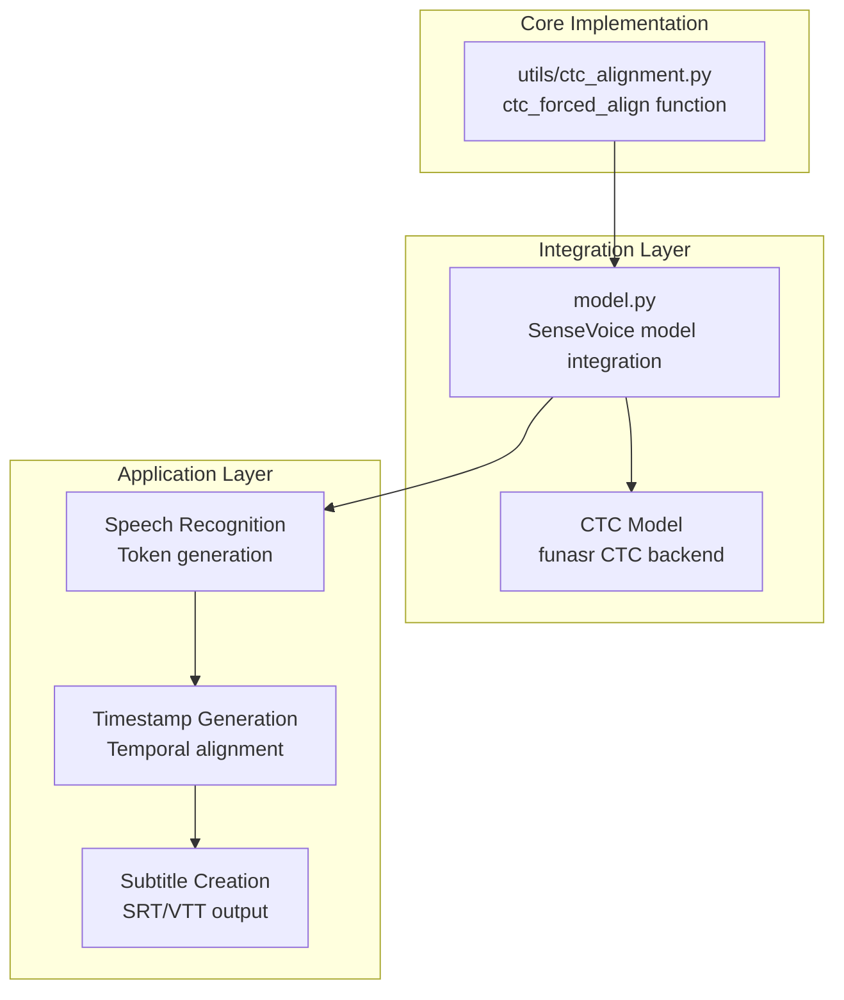
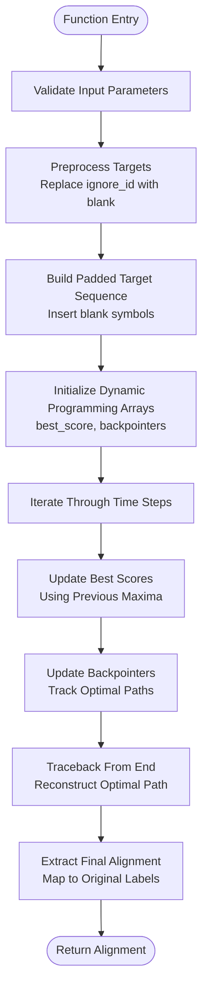
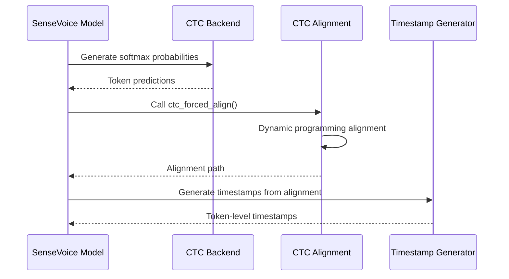
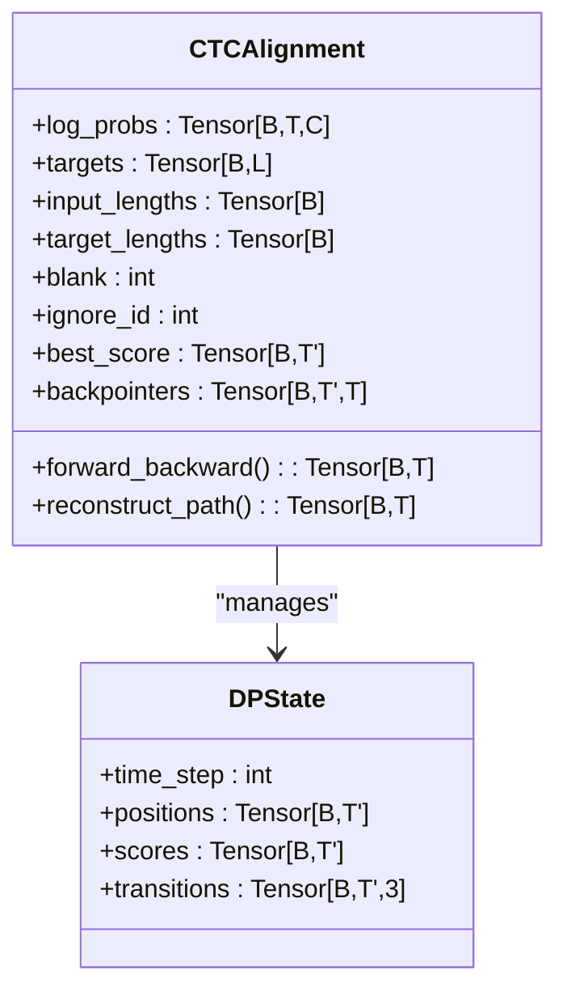
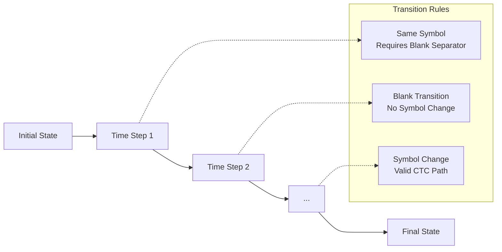
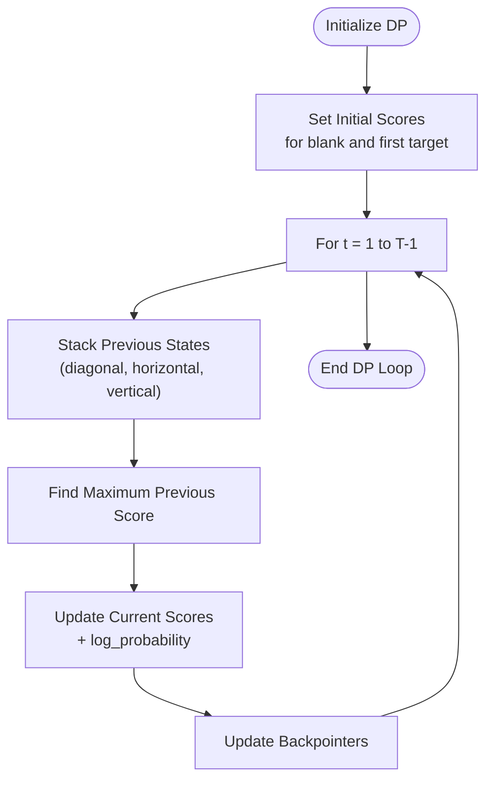
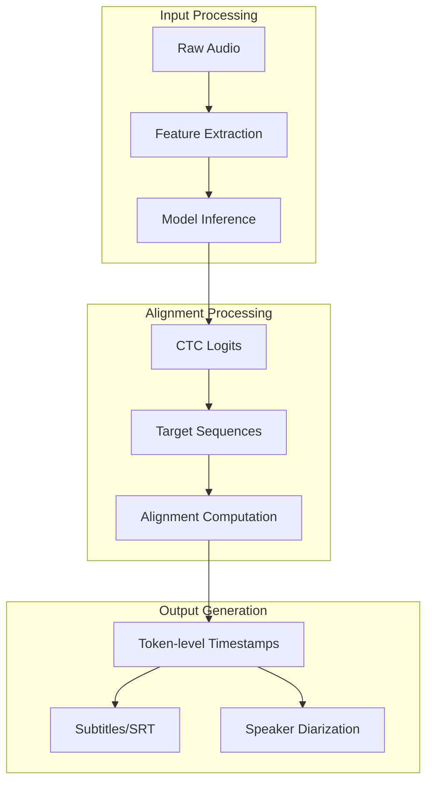

# CTC Alignment Algorithms

<cite>
**Referenced Files in This Document**
- [utils/ctc_alignment.py](file://utils/ctc_alignment.py)
- [model.py](file://model.py)
- [README.md](file://README.md)
</cite>

## Table of Contents
1. [Introduction](#introduction)
2. [Project Structure](#project-structure)
3. [Core Components](#core-components)
4. [Architecture Overview](#architecture-overview)
5. [Detailed Component Analysis](#detailed-component-analysis)
6. [Mathematical Foundations](#mathematical-foundations)
7. [Implementation Details](#implementation-details)
8. [Performance Considerations](#performance-considerations)
9. [Practical Use Cases](#practical-use-cases)
10. [Troubleshooting Guide](#troubleshooting-guide)
11. [Conclusion](#conclusion)

## Introduction

This document provides comprehensive documentation for Connectionist Temporal Classification (CTC) forced alignment algorithms implemented in the meeting transcription system. CTC forced alignment enables precise temporal alignment between acoustic emissions and target sequences, enabling applications such as speech recognition, audio segmentation, and timestamp generation for subtitle creation.

The implementation consists of two primary components:
- A pure-PyTorch CTC forced alignment function that performs dynamic programming alignment
- Integration within the SenseVoice speech recognition pipeline for generating token-level timestamps

## Project Structure

The CTC alignment functionality is organized within a focused module structure:



**Diagram sources**
- [utils/ctc_alignment.py:1-77](file://utils/ctc_alignment.py#L1-L77)
- [model.py:16-17](file://model.py#L16-L17)
- [model.py:895-902](file://model.py#L895-L902)

**Section sources**
- [README.md:134-149](file://README.md#L134-L149)
- [utils/ctc_alignment.py:1-77](file://utils/ctc_alignment.py#L1-L77)
- [model.py:16-17](file://model.py#L16-L17)

## Core Components

### CTC Forced Alignment Function

The primary implementation is encapsulated in a single function that performs dynamic programming alignment:



**Diagram sources**
- [utils/ctc_alignment.py:3-76](file://utils/ctc_alignment.py#L3-L76)

### Integration with Speech Recognition Pipeline

The alignment function integrates seamlessly with the SenseVoice model during inference:



**Diagram sources**
- [model.py:895-902](file://model.py#L895-L902)
- [utils/ctc_alignment.py:3-76](file://utils/ctc_alignment.py#L3-L76)

**Section sources**
- [utils/ctc_alignment.py:3-76](file://utils/ctc_alignment.py#L3-L76)
- [model.py:895-902](file://model.py#L895-L902)

## Architecture Overview

The CTC alignment system follows a layered architecture designed for efficient temporal alignment:

```mermaid
graph TB
subgraph "Input Layer"
A[Log Probabilities<br/>(B, T, C)]
B[Target Sequences<br/>(B, L)]
C[Length Specifications<br/>(B,)]
end
subgraph "Processing Layer"
D[Target Preprocessing<br/>Ignore ID Replacement]
E[Label Construction<br/>Blank Insertion]
F[Dynamic Programming<br/>Best Score Tracking]
G[Backpointer Management<br/>Path Reconstruction]
end
subgraph "Output Layer"
H[Alignment Path<br/>(B, T)]
I[Temporal Segments<br/>Token-level timestamps]
end
A --> D
B --> D
C --> F
D --> E
E --> F
F --> G
G --> H
H --> I
```

**Diagram sources**
- [utils/ctc_alignment.py:26-76](file://utils/ctc_alignment.py#L26-L76)

### Mathematical Foundation

The algorithm implements a modified CTC topology where each target symbol is represented by a pair of consecutive positions (blank, target) to handle the CTC constraint that repeated symbols require blank separators.

**Section sources**
- [utils/ctc_alignment.py:31-44](file://utils/ctc_alignment.py#L31-L44)
- [utils/ctc_alignment.py:46-51](file://utils/ctc_alignment.py#L46-L51)

## Detailed Component Analysis

### CTC Forced Alignment Function Parameters

The function accepts four primary parameters with specific tensor shapes and constraints:

| Parameter | Type | Shape | Description |
|-----------|------|-------|-------------|
| `log_probs` | torch.Tensor | `(B, T, C)` | Log probability distribution over vocabulary at each time step |
| `targets` | torch.Tensor | `(B, L)` | Target sequence indices (excluding blank positions) |
| `input_lengths` | torch.Tensor | `(B,)` | Actual length of each input sequence (≤ T) |
| `target_lengths` | torch.Tensor | `(B,)` | Actual length of each target sequence (≤ L) |

Additional configuration parameters:
- `blank`: Integer index representing blank symbol (default: 0)
- `ignore_id`: Integer index for ignored tokens (default: -1)

### Dynamic Programming Implementation

The algorithm maintains two key arrays throughout the computation:



**Diagram sources**
- [utils/ctc_alignment.py:49-53](file://utils/ctc_alignment.py#L49-L53)

### Memory Management and Computational Complexity

The implementation optimizes memory usage through careful tensor allocation and reuse:

- **Memory Complexity**: O(B × T × (2L + 2)) for the best_score array
- **Time Complexity**: O(B × T × L) for the dynamic programming loop
- **Peak Memory**: Allocated once at initialization, reused throughout computation

**Section sources**
- [utils/ctc_alignment.py:49-53](file://utils/ctc_alignment.py#L49-L53)
- [utils/ctc_alignment.py:55-61](file://utils/ctc_alignment.py#L55-L61)

## Mathematical Foundations

### CTC Topology and Blank Symbols

The algorithm implements a standard CTC topology where:
- Blank symbols serve as separators between repeated characters
- The target sequence is transformed to include blank positions
- Dynamic programming ensures valid CTC paths

### Forward-Backward Algorithm Implementation

While the implementation focuses on Viterbi alignment rather than full forward-backward, it incorporates key concepts:



**Diagram sources**
- [utils/ctc_alignment.py:55-61](file://utils/ctc_alignment.py#L55-L61)

### Dynamic Programming Formulation

The algorithm solves the optimization problem:

```
best_score[t, pos] = max(best_score[t-1, prev_pos]) + log_prob(observation)
```

Where the maximization considers three possible previous states based on the current target position.

**Section sources**
- [utils/ctc_alignment.py:55-61](file://utils/ctc_alignment.py#L55-L61)
- [utils/ctc_alignment.py:63-68](file://utils/ctc_alignment.py#L63-L68)

## Implementation Details

### Target Preprocessing

The function handles special cases through preprocessing:

1. **Ignore ID Replacement**: Targets matching `ignore_id` are replaced with `blank`
2. **Label Construction**: Original targets are expanded with blank symbols
3. **Padding Management**: Arrays are padded to accommodate CTC topology

### Dynamic Programming Loop

The core algorithm iterates through time steps, maintaining optimal scores:



**Diagram sources**
- [utils/ctc_alignment.py:55-61](file://utils/ctc_alignment.py#L55-L61)

### Path Reconstruction

The traceback phase reconstructs the optimal alignment:

1. **Final Selection**: Choose optimal ending positions based on target length
2. **Backward Traversal**: Follow backpointers to reconstruct path
3. **Alignment Extraction**: Map positions back to original target labels

**Section sources**
- [utils/ctc_alignment.py:63-76](file://utils/ctc_alignment.py#L63-L76)

## Performance Considerations

### Memory Optimization Strategies

The implementation employs several memory-efficient techniques:

- **Single Allocation Pattern**: Arrays are allocated once and reused
- **In-place Operations**: Minimizes temporary tensor creation
- **Efficient Indexing**: Uses advanced tensor indexing to avoid loops

### Computational Efficiency

- **Vectorized Operations**: Leverages PyTorch's optimized tensor operations
- **Broadcasting**: Utilizes broadcasting for efficient score computations
- **Early Termination**: Respects input_lengths to avoid unnecessary computation

### Scalability Considerations

For large-scale audio processing:
- **Batch Processing**: Handles multiple sequences efficiently
- **Memory Scaling**: Linear scaling with sequence length and vocabulary size
- **Device Placement**: Supports GPU acceleration through tensor device placement

**Section sources**
- [utils/ctc_alignment.py:28-29](file://utils/ctc_alignment.py#L28-L29)
- [utils/ctc_alignment.py:53-54](file://utils/ctc_alignment.py#L53-L54)

## Practical Use Cases

### Speech Recognition Enhancement

The CTC alignment enables precise temporal analysis of speech recognition results:



**Diagram sources**
- [model.py:895-918](file://model.py#L895-L918)

### Audio Segmentation Applications

The alignment results support various audio segmentation tasks:

- **Word-level segmentation**: Precise word boundaries for subtitle timing
- **Phoneme-level analysis**: Fine-grained temporal resolution for phonetic studies
- **Prosody detection**: Temporal patterns for speech rhythm and emphasis

### Timestamp Generation Workflow

The integration generates timestamps through a multi-step process:

1. **Token Generation**: Extract tokens from CTC softmax outputs
2. **Alignment Computation**: Apply CTC forced alignment to map tokens to frames
3. **Timestamp Calculation**: Convert frame indices to time coordinates
4. **Post-processing**: Refine timestamps for subtitle synchronization

**Section sources**
- [model.py:895-918](file://model.py#L895-L918)

## Troubleshooting Guide

### Common Issues and Solutions

**Issue**: Mismatched tensor shapes
- **Cause**: Incorrect input tensor dimensions
- **Solution**: Verify shapes match documented specifications

**Issue**: Memory errors for long sequences  
- **Cause**: Insufficient GPU/CPU memory
- **Solution**: Process shorter segments or reduce batch size

**Issue**: Incorrect alignment results
- **Cause**: Improper blank symbol configuration
- **Solution**: Verify blank_id parameter matches model configuration

**Issue**: Performance bottlenecks
- **Cause**: Inefficient tensor operations
- **Solution**: Ensure tensors are on appropriate devices

### Debugging Strategies

1. **Shape Validation**: Verify tensor dimensions before computation
2. **Memory Monitoring**: Track memory usage during batch processing
3. **Gradient Checking**: Validate numerical stability of log probability inputs
4. **Unit Testing**: Test with synthetic data to validate algorithm correctness

**Section sources**
- [utils/ctc_alignment.py:13-25](file://utils/ctc_alignment.py#L13-L25)
- [model.py:895-902](file://model.py#L895-L902)

## Conclusion

The CTC forced alignment implementation provides a robust foundation for temporal alignment in speech recognition systems. Its integration with the SenseVoice pipeline demonstrates practical applications in generating precise timestamps for subtitle creation and audio segmentation. The algorithm's mathematical rigor, combined with efficient implementation strategies, makes it suitable for large-scale audio processing applications while maintaining computational efficiency and memory optimization.

The modular design allows for easy extension and adaptation to different speech recognition models and temporal analysis requirements, positioning it as a valuable component in modern automatic speech recognition systems.