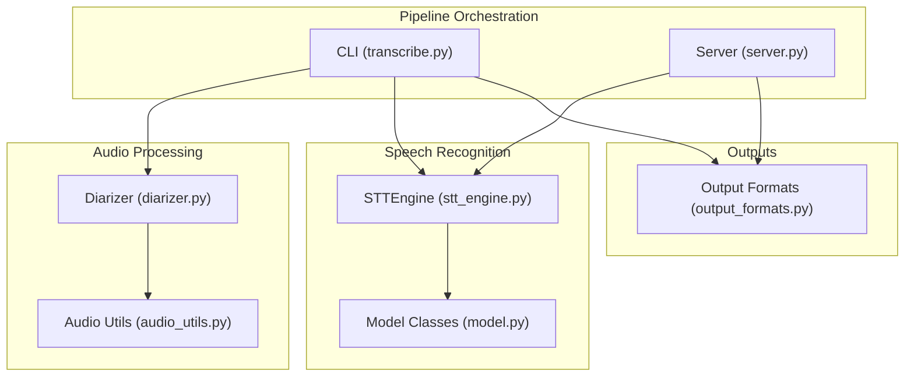
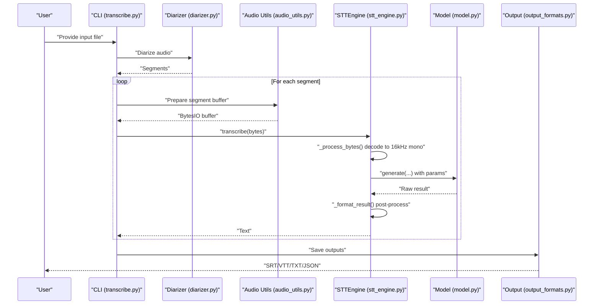
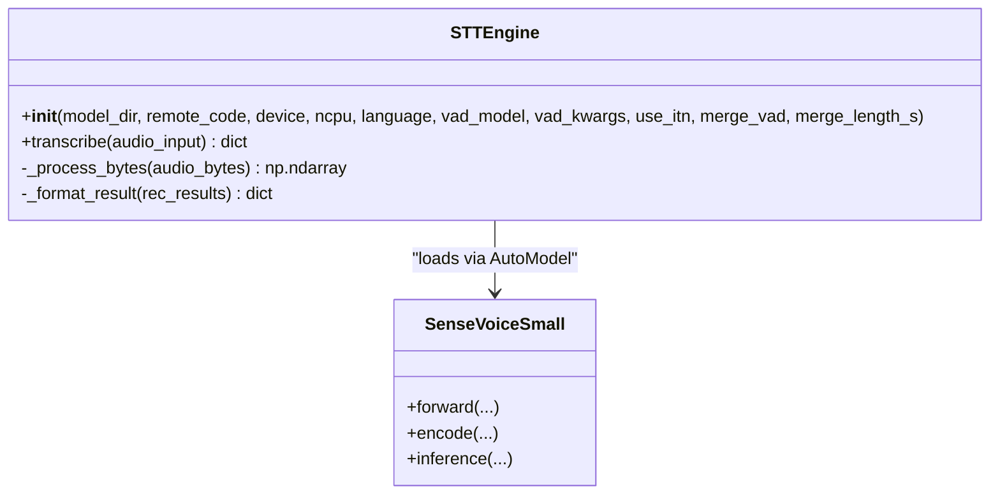
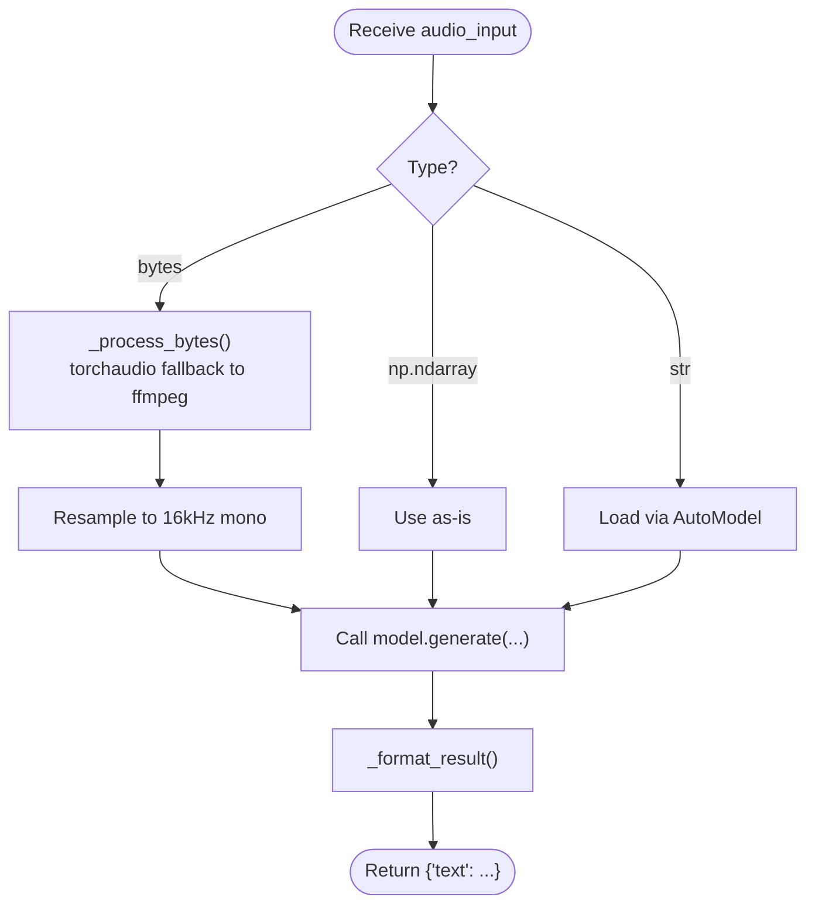
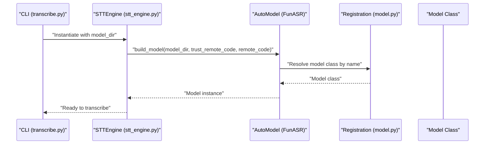
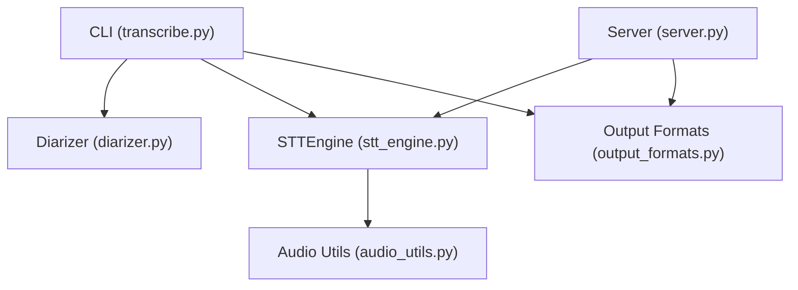

# Custom Model Integration

<cite>
**Referenced Files in This Document**
- [stt_engine.py](file://stt_engine.py)
- [model.py](file://model.py)
- [transcribe.py](file://transcribe.py)
- [server.py](file://server.py)
- [audio_utils.py](file://audio_utils.py)
- [diarizer.py](file://diarizer.py)
- [output_formats.py](file://output_formats.py)
- [README.md](file://README.md)
- [pyproject.toml](file://pyproject.toml)
- [utils/ctc_alignment.py](file://utils/ctc_alignment.py)
</cite>

## Table of Contents
1. [Introduction](#introduction)
2. [Project Structure](#project-structure)
3. [Core Components](#core-components)
4. [Architecture Overview](#architecture-overview)
5. [Detailed Component Analysis](#detailed-component-analysis)
6. [Dependency Analysis](#dependency-analysis)
7. [Performance Considerations](#performance-considerations)
8. [Troubleshooting Guide](#troubleshooting-guide)
9. [Conclusion](#conclusion)
10. [Appendices](#appendices)

## Introduction
This document explains how to extend the meeting transcriber’s STTEngine with custom speech recognition models while maintaining compatibility with the existing audio processing pipeline. It covers:
- Extending STTEngine with new models
- Model loading patterns and inference interfaces
- Compatibility requirements for audio inputs and outputs
- Factory-style model selection and integration points
- Step-by-step guides for implementing custom models, including preprocessing, output formats, and performance optimization
- Practical examples for integrating alternative ASR models, adapting existing models, and managing memory/GPU resources and caching

## Project Structure
The system is organized around a clear separation of concerns:
- STTEngine encapsulates model loading and inference
- Audio utilities provide robust decoding and resampling
- Diarizer segments audio by speaker
- Output formatters produce SRT/VTT/TXT/JSON
- CLI and server orchestrate the pipeline and expose HTTP endpoints

**Diagram sources**
- [transcribe.py:45-144](file://transcribe.py#L45-L144)
- [server.py:92-161](file://server.py#L92-L161)
- [audio_utils.py:23-120](file://audio_utils.py#L23-L120)
- [diarizer.py:27-110](file://diarizer.py#L27-L110)
- [stt_engine.py:24-185](file://stt_engine.py#L24-L185)
- [model.py:437-823](file://model.py#L437-L823)
- [output_formats.py:118-160](file://output_formats.py#L118-L160)

**Section sources**
- [README.md:134-173](file://README.md#L134-L173)
- [pyproject.toml:1-24](file://pyproject.toml#L1-L24)

## Core Components
- STTEngine: Loads a model via FunASR AutoModel, performs preprocessing, runs inference, and formats results. It supports multiple input types (file path, bytes, numpy arrays) and integrates with VAD and post-processing.
- Audio Utilities: Provide robust decoding and resampling to 16 kHz mono float32 arrays, with fallbacks to ffmpeg when needed.
- Diarizer: Runs speaker diarization and merges adjacent segments by the same speaker.
- Output Formats: Generate SRT/VTT/TXT/JSON outputs from segment lists.
- CLI and Server: Orchestrate the pipeline and expose HTTP endpoints compatible with OpenAI Whisper API.

Key integration points:
- STTEngine.transcribe accepts bytes or numpy arrays and delegates to model.generate with parameters controlling language, ITN, and VAD merging.
- The pipeline passes bytes buffers produced by audio_utils.prepare_audio_buffer to STTEngine.

**Section sources**
- [stt_engine.py:24-185](file://stt_engine.py#L24-L185)
- [audio_utils.py:53-120](file://audio_utils.py#L53-L120)
- [diarizer.py:55-110](file://diarizer.py#L55-L110)
- [output_formats.py:118-160](file://output_formats.py#L118-L160)
- [transcribe.py:45-144](file://transcribe.py#L45-L144)
- [server.py:92-161](file://server.py#L92-L161)

## Architecture Overview
The system follows a modular pipeline:
- Input audio is converted to WAV and optionally segmented by diarizer
- Segments are extracted as in-memory buffers and passed to STTEngine
- STTEngine decodes bytes to 16 kHz mono arrays, runs model inference, and applies post-processing
- Results are formatted and persisted to requested output formats

**Diagram sources**
- [transcribe.py:45-144](file://transcribe.py#L45-L144)
- [diarizer.py:55-110](file://diarizer.py#L55-L110)
- [audio_utils.py:53-120](file://audio_utils.py#L53-L120)
- [stt_engine.py:71-106](file://stt_engine.py#L71-L106)
- [model.py:580-823](file://model.py#L580-L823)
- [output_formats.py:118-160](file://output_formats.py#L118-L160)

## Detailed Component Analysis

### STTEngine: Extending with Custom Models
STTEngine wraps FunASR’s AutoModel and exposes a simple transcribe API. To integrate a custom model:
- Ensure the model is loadable via AutoModel with trust_remote_code and remote_code support
- Implement an inference interface that accepts the same input types as STTEngine.transcribe
- Maintain the expected output format: a dictionary with a “text” field and optional “error”

Key behaviors:
- Input handling supports str (file path), bytes (in-memory audio), and np.ndarray (already decoded)
- Audio decoding prefers torchaudio/soundfile with ffmpeg fallback
- Post-processing applies rich transcription and simplified-to-traditional Chinese conversion

**Diagram sources**
- [stt_engine.py:24-185](file://stt_engine.py#L24-L185)
- [model.py:580-823](file://model.py#L580-L823)

**Section sources**
- [stt_engine.py:27-65](file://stt_engine.py#L27-L65)
- [stt_engine.py:71-106](file://stt_engine.py#L71-L106)
- [stt_engine.py:111-140](file://stt_engine.py#L111-L140)

### Audio Preprocessing: Requirements and Patterns
To ensure compatibility with STTEngine:
- Input audio must be resampled to 16 kHz mono
- Prefer float32 arrays for numerical stability
- Provide either bytes (decoded in-engine) or numpy arrays directly

Preprocessing patterns:
- Use torchaudio/soundfile for decoding with automatic resampling
- Fallback to ffmpeg for unsupported formats
- Merge VAD segments when using external diarizers to avoid double segmentation

**Diagram sources**
- [stt_engine.py:71-106](file://stt_engine.py#L71-L106)
- [stt_engine.py:111-140](file://stt_engine.py#L111-L140)
- [audio_utils.py:96-120](file://audio_utils.py#L96-L120)

**Section sources**
- [audio_utils.py:23-51](file://audio_utils.py#L23-L51)
- [audio_utils.py:96-120](file://audio_utils.py#L96-L120)
- [stt_engine.py:111-140](file://stt_engine.py#L111-L140)

### Output Formatting: Specification and Integration
STTEngine returns a dictionary with “text”. The pipeline expects a list of segments with keys: start, end, speaker, text. Output formatters accept this list and produce SRT/VTT/TXT/JSON.

Integration points:
- Server endpoints call engine.transcribe and format responses according to OpenAI-compatible specs
- CLI orchestrates saving outputs to requested formats

**Section sources**
- [stt_engine.py:130-139](file://stt_engine.py#L130-L139)
- [output_formats.py:43-103](file://output_formats.py#L43-L103)
- [server.py:121-160](file://server.py#L121-L160)

### Factory Pattern for Dynamic Model Selection
The system uses a registration mechanism to dynamically select models:
- model.py registers model classes under “model_classes”
- STTEngine initializes models via AutoModel with trust_remote_code and remote_code parameters
- The pipeline remains agnostic of the specific model class as long as it adheres to the expected interface

**Diagram sources**
- [stt_engine.py:43-56](file://stt_engine.py#L43-L56)
- [model.py:580-581](file://model.py#L580-L581)

**Section sources**
- [model.py:580-581](file://model.py#L580-L581)
- [stt_engine.py:43-56](file://stt_engine.py#L43-L56)

## Dependency Analysis
External dependencies relevant to custom model integration:
- FunASR and ModelScope for model loading and registration
- Torch/Torchaudio for tensor operations and resampling
- Soundfile and FFmpeg for audio decoding and conversion
- OpenCC for simplified/traditional Chinese conversion

**Diagram sources**
- [pyproject.toml:7-23](file://pyproject.toml#L7-L23)
- [stt_engine.py:17-19](file://stt_engine.py#L17-L19)
- [audio_utils.py:16-18](file://audio_utils.py#L16-L18)
- [diarizer.py:12](file://diarizer.py#L12)
- [output_formats.py:7-11](file://output_formats.py#L7-L11)

**Section sources**
- [pyproject.toml:7-23](file://pyproject.toml#L7-L23)

## Performance Considerations
- Device placement: Choose device (“cpu”, “mps”, “cuda”) based on hardware availability and model size
- Batch size: STTEngine sets batch_size=1; larger batches require model support
- VAD and merging: Disable internal VAD when using external diarizers to avoid redundant segmentation
- Memory management: Prefer passing bytes to STTEngine so decoding happens in-process; avoid unnecessary copies
- GPU utilization: Ensure CUDA-capable devices and drivers; monitor VRAM usage during inference
- Model caching: AutoModel caches models; reuse STTEngine instances across requests in server mode

[No sources needed since this section provides general guidance]

## Troubleshooting Guide
Common issues and resolutions:
- Audio decoding failures: STTEngine falls back to ffmpeg when torchaudio fails; verify FFmpeg installation and permissions
- Model loading errors: Ensure trust_remote_code and remote_code are set appropriately; confirm model registration
- Device mismatches: Verify device string and availability; adjust accordingly
- Output formatting errors: Confirm segment dictionaries include required keys (start, end, speaker, text)

**Section sources**
- [stt_engine.py:111-140](file://stt_engine.py#L111-L140)
- [stt_engine.py:43-56](file://stt_engine.py#L43-L56)
- [diarizer.py:36-53](file://diarizer.py#L36-L53)

## Conclusion
By following the patterns demonstrated in STTEngine and model.py, you can integrate custom ASR models while preserving compatibility with the audio processing pipeline. Focus on:
- Consistent input/output interfaces
- Robust preprocessing and resampling
- Registration and initialization via AutoModel
- Efficient memory and GPU resource management

[No sources needed since this section summarizes without analyzing specific files]

## Appendices

### Step-by-Step: Implementing a Custom Model Adapter
1. Define a model class compatible with AutoModel and register it under “model_classes”
2. Implement an inference method that accepts bytes or tensors and returns a text string
3. Integrate with STTEngine by setting model_dir to your model identifier and remote_code to your adapter file
4. Test with CLI and server modes; verify output formats

**Section sources**
- [model.py:580-581](file://model.py#L580-L581)
- [stt_engine.py:43-56](file://stt_engine.py#L43-L56)
- [transcribe.py:173-240](file://transcribe.py#L173-L240)
- [server.py:169-196](file://server.py#L169-L196)

### Example: Integrating Alternative ASR Models
- Replace model_dir with the identifier of another FunASR-compatible model
- Adjust language and VAD parameters as needed
- Validate that the model supports the generate interface and returns a text field

**Section sources**
- [stt_engine.py:27-65](file://stt_engine.py#L27-L65)
- [README.md:94-122](file://README.md#L94-L122)

### Fine-Tuning Existing Models
- Use the model’s forward/inference methods to adapt features and outputs
- Leverage CTC alignment utilities for forced alignment tasks
- Retain the registration and AutoModel integration for seamless deployment

**Section sources**
- [model.py:747-778](file://model.py#L747-L778)
- [utils/ctc_alignment.py:3-77](file://utils/ctc_alignment.py#L3-L77)

### Memory Management and GPU Utilization
- Prefer bytes input to STTEngine to minimize intermediate copies
- Reuse STTEngine instances in server mode to benefit from model caching
- Monitor device usage and adjust batch sizes and workers accordingly

**Section sources**
- [stt_engine.py:71-106](file://stt_engine.py#L71-L106)
- [server.py:169-196](file://server.py#L169-L196)