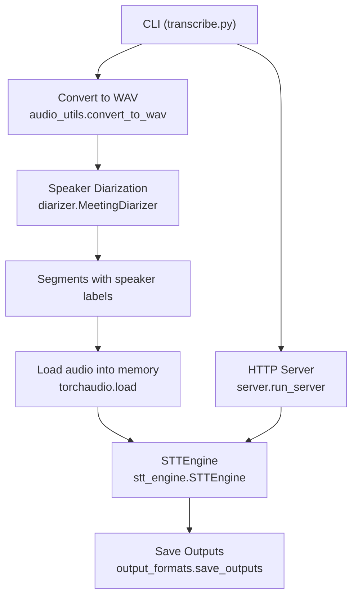
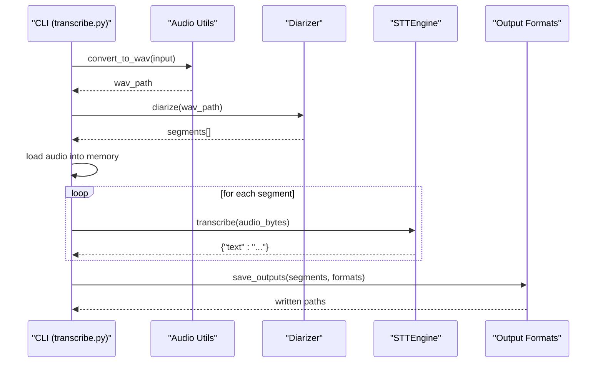
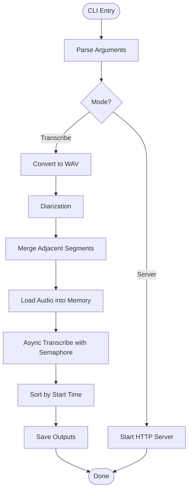
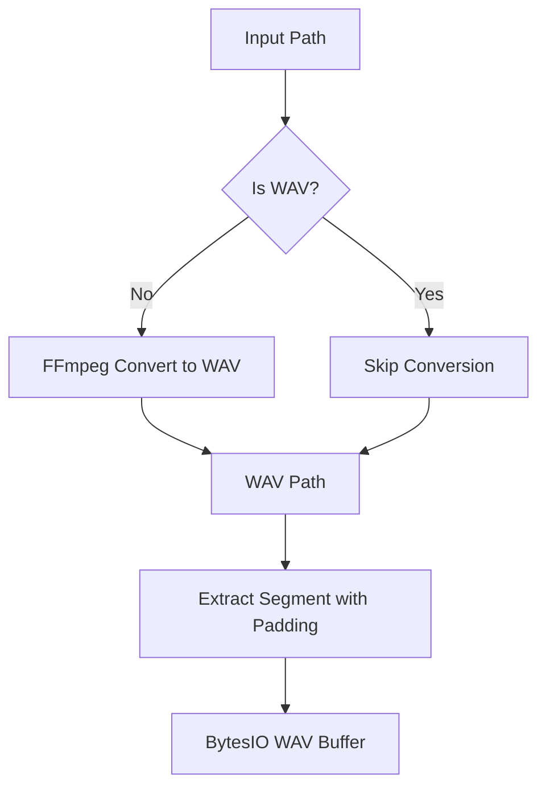
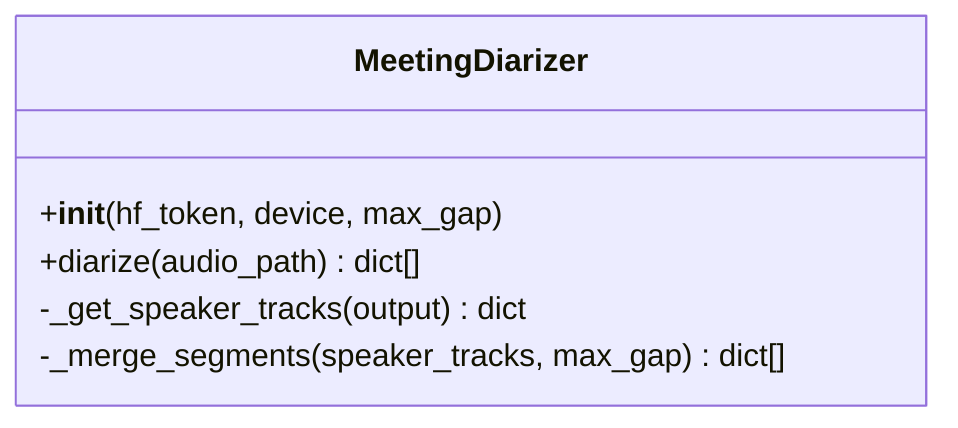
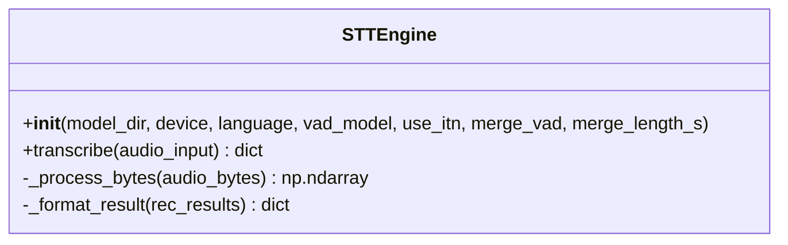
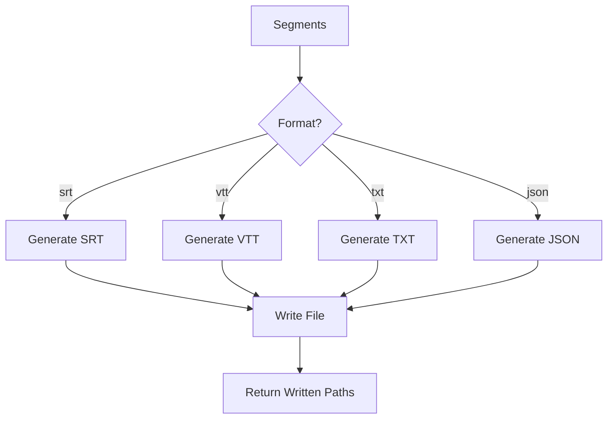
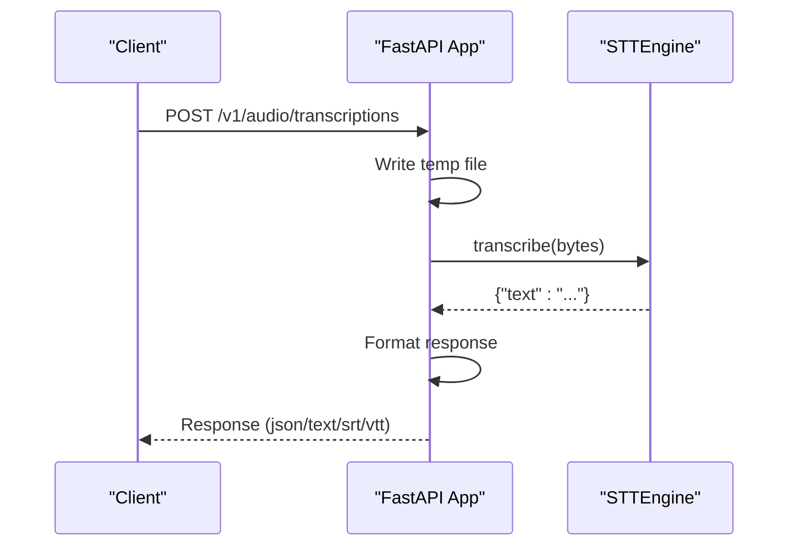
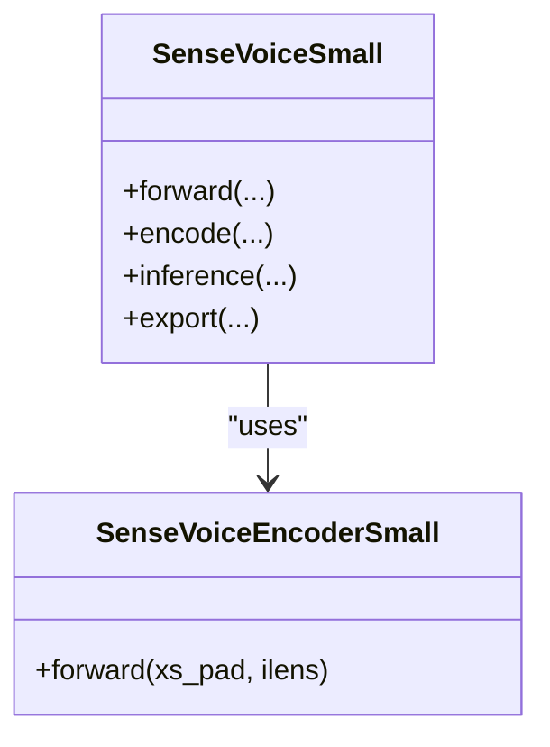
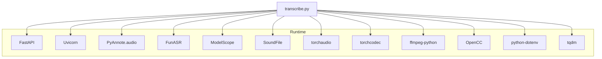

# Custom Processing Pipelines

<cite>
**Referenced Files in This Document**
- [README.md](file://README.md)
- [transcribe.py](file://transcribe.py)
- [stt_engine.py](file://stt_engine.py)
- [diarizer.py](file://diarizer.py)
- [audio_utils.py](file://audio_utils.py)
- [output_formats.py](file://output_formats.py)
- [server.py](file://server.py)
- [model.py](file://model.py)
- [utils/ctc_alignment.py](file://utils/ctc_alignment.py)
- [run.sh](file://run.sh)
- [pyproject.toml](file://pyproject.toml)
</cite>

## Table of Contents
1. [Introduction](#introduction)
2. [Project Structure](#project-structure)
3. [Core Components](#core-components)
4. [Architecture Overview](#architecture-overview)
5. [Detailed Component Analysis](#detailed-component-analysis)
6. [Dependency Analysis](#dependency-analysis)
7. [Performance Considerations](#performance-considerations)
8. [Troubleshooting Guide](#troubleshooting-guide)
9. [Conclusion](#conclusion)
10. [Appendices](#appendices)

## Introduction
This document explains how to develop custom processing pipelines beyond the default meeting transcriber workflow. It focuses on the pipeline architecture, stage coordination, and data flow patterns used in the system. You will learn how to create custom processing stages, integrate them into existing workflows, propagate errors, and optimize performance. Specialized pipeline examples are provided for podcast transcription, interview processing, and multilingual content. Guidance is included for parallel processing, batch optimization, resource management, monitoring, logging, and debugging.

## Project Structure
The project is organized around a modular pipeline with clear separation of concerns:
- CLI entry point orchestrating the pipeline
- Audio preprocessing and segmentation utilities
- Speaker diarization stage
- In-process STT engine wrapping SenseVoice
- Output generation and persistence
- Optional HTTP server exposing OpenAI-compatible endpoints

**Diagram sources**
- [transcribe.py:45-144](file://transcribe.py#L45-L144)
- [audio_utils.py:23-51](file://audio_utils.py#L23-L51)
- [diarizer.py:55-70](file://diarizer.py#L55-L70)
- [stt_engine.py:24-66](file://stt_engine.py#L24-L66)
- [output_formats.py:118-159](file://output_formats.py#L118-L159)
- [server.py:169-196](file://server.py#L169-L196)

**Section sources**
- [README.md:134-173](file://README.md#L134-L173)
- [transcribe.py:173-240](file://transcribe.py#L173-L240)

## Core Components
- CLI orchestration: parses arguments, selects mode (in-process transcription vs. HTTP server), and coordinates pipeline stages.
- Audio utilities: format conversion, segment extraction, and in-memory decoding.
- Diarizer: PyAnnote-based speaker diarization with merging of adjacent segments.
- STT engine: in-process SenseVoice wrapper with robust fallback decoding and post-processing.
- Output generators: SRT, VTT, TXT, JSON writers and persistence.
- HTTP server: FastAPI endpoints compatible with OpenAI Whisper API.

Key responsibilities and interactions are detailed in later sections.

**Section sources**
- [transcribe.py:45-144](file://transcribe.py#L45-L144)
- [audio_utils.py:23-120](file://audio_utils.py#L23-L120)
- [diarizer.py:27-110](file://diarizer.py#L27-L110)
- [stt_engine.py:24-185](file://stt_engine.py#L24-L185)
- [output_formats.py:118-160](file://output_formats.py#L118-L160)
- [server.py:92-196](file://server.py#L92-L196)

## Architecture Overview
The default pipeline follows a strict, sequential flow:
1. Convert input audio/video to 16 kHz mono WAV
2. Detect speakers and segment audio into per-speaker turns
3. Merge adjacent segments within a configured gap threshold
4. Extract segments from memory and transcribe using the STT engine
5. Post-process and save outputs in requested formats

**Diagram sources**
- [transcribe.py:63-144](file://transcribe.py#L63-L144)
- [audio_utils.py:23-51](file://audio_utils.py#L23-L51)
- [diarizer.py:55-70](file://diarizer.py#L55-L70)
- [stt_engine.py:71-106](file://stt_engine.py#L71-L106)
- [output_formats.py:118-159](file://output_formats.py#L118-L159)

## Detailed Component Analysis

### Pipeline Orchestration (CLI)
The CLI coordinates the entire pipeline:
- Parses arguments and selects mode
- Converts input to WAV if needed
- Runs diarization and merges segments
- Loads audio into memory and transcribes segments concurrently
- Generates and persists outputs

Concurrency is achieved via an asyncio semaphore controlling max workers. Each segment is processed asynchronously, with results collected and sorted by start time.

**Diagram sources**
- [transcribe.py:228-240](file://transcribe.py#L228-L240)
- [transcribe.py:45-144](file://transcribe.py#L45-L144)

**Section sources**
- [transcribe.py:45-144](file://transcribe.py#L45-L144)

### Audio Utilities
Provides:
- Format conversion using FFmpeg to 16 kHz mono WAV
- Segment extraction from a loaded waveform with optional padding
- In-memory decoding with fallback to FFmpeg

These utilities support both the default pipeline and custom pipelines requiring precise audio manipulation.

**Diagram sources**
- [audio_utils.py:23-51](file://audio_utils.py#L23-L51)
- [audio_utils.py:53-94](file://audio_utils.py#L53-L94)

**Section sources**
- [audio_utils.py:23-120](file://audio_utils.py#L23-L120)

### Speaker Diarization
Encapsulated in a class that:
- Loads the PyAnnote pipeline with a HuggingFace token
- Runs diarization on the input file
- Groups segments by speaker and merges adjacent segments within a configurable gap

**Diagram sources**
- [diarizer.py:27-110](file://diarizer.py#L27-L110)

**Section sources**
- [diarizer.py:27-110](file://diarizer.py#L27-L110)

### STT Engine (SenseVoice via FunASR)
The engine wraps the SenseVoice model and provides:
- Model initialization with device selection and optional VAD
- Transcription from file path, bytes, or numpy arrays
- Robust decoding with torchaudio and FFmpeg fallback
- Post-processing and simplified Traditional to Simplified Chinese conversion

**Diagram sources**
- [stt_engine.py:24-185](file://stt_engine.py#L24-L185)

**Section sources**
- [stt_engine.py:24-185](file://stt_engine.py#L24-L185)

### Output Generators
Generates SRT, VTT, TXT, and JSON outputs. Supports saving multiple formats in a single run and handles unknown formats gracefully.

**Diagram sources**
- [output_formats.py:118-159](file://output_formats.py#L118-L159)

**Section sources**
- [output_formats.py:118-160](file://output_formats.py#L118-L160)

### HTTP Server (OpenAI-Compatible)
Exposes two endpoints:
- POST /v1/audio/transcriptions (OpenAI Whisper API compatible)
- POST /recognition (legacy)

The server reads uploaded audio, writes it to a temporary file, invokes the STT engine, and formats the response according to the requested format.

**Diagram sources**
- [server.py:121-160](file://server.py#L121-L160)
- [server.py:169-196](file://server.py#L169-L196)

**Section sources**
- [server.py:92-196](file://server.py#L92-L196)

### Model Implementation (SenseVoice)
The model integrates with FunASR and includes:
- Language identification and text normalization embeddings
- Encoder layers with SANM attention
- CTC and rich CE losses
- Inference path with optional timestamp alignment using CTC forced alignment

**Diagram sources**
- [model.py:580-780](file://model.py#L580-L780)
- [model.py:437-578](file://model.py#L437-L578)

**Section sources**
- [model.py:580-931](file://model.py#L580-L931)

## Dependency Analysis
External dependencies and their roles:
- FastAPI, Uvicorn: HTTP server stack
- PyAnnote.audio: Speaker diarization
- FunASR, ModelScope: SenseVoice model runtime
- SoundFile, torchaudio, torchcodec: Audio I/O and resampling
- ffmpeg-python: Audio conversion
- OpenCC: Simplified/Traditional Chinese conversion
- python-dotenv: Environment variables
- tqdm: Progress bars

**Diagram sources**
- [pyproject.toml:7-23](file://pyproject.toml#L7-L23)
- [transcribe.py:47-52](file://transcribe.py#L47-L52)

**Section sources**
- [pyproject.toml:1-24](file://pyproject.toml#L1-L24)

## Performance Considerations
- Concurrency control: The CLI uses an asyncio semaphore to limit concurrent transcriptions. Adjust max_workers to balance throughput and GPU/CPU memory usage.
- I/O optimization: Prefer in-memory audio buffers for segment extraction to reduce disk I/O.
- Device selection: Use CUDA or MPS when available for faster inference.
- VAD handling: Disable internal VAD in the STT engine when using pre-segmented audio to avoid double segmentation artifacts.
- Batch-like processing: While individual segments are transcribed, the underlying model supports batch_size=1; consider batching at higher levels if extending the pipeline.
- Resource management: Monitor memory usage during diarization and transcription; reduce max_workers or increase padding to manage memory spikes.

[No sources needed since this section provides general guidance]

## Troubleshooting Guide
Common issues and resolutions:
- torchcodec version mismatch: Ensure torchcodec version compatibility with torch to avoid NameError related to AudioDecoder.
- PyAnnote model access: Agree to the model’s terms on HuggingFace and set HF_TOKEN in .env.
- FFmpeg availability: Confirm FFmpeg installation and version compatibility; the project supports FFmpeg 4–8.
- Logging and progress: The CLI logs informational messages and uses tqdm for progress bars; enable INFO logging to observe pipeline stages.

**Section sources**
- [README.md:175-203](file://README.md#L175-L203)
- [transcribe.py:32-37](file://transcribe.py#L32-L37)

## Conclusion
The meeting transcriber provides a robust foundation for building custom processing pipelines. By leveraging the modular components—audio utilities, diarizer, STT engine, and output generators—you can extend the pipeline to meet diverse use cases. The provided concurrency model, error handling patterns, and HTTP server interface offer practical templates for integrating custom stages, optimizing performance, and maintaining observability.

[No sources needed since this section summarizes without analyzing specific files]

## Appendices

### Creating Custom Processing Stages
To add a new stage to the pipeline:
- Define a callable stage that accepts the current data payload and returns an updated payload.
- Integrate the stage into the CLI orchestration by inserting it between existing stages.
- Handle errors by returning a standardized error marker in the payload and logging exceptions.
- Preserve ordering semantics: ensure downstream stages receive the expected keys (e.g., start, end, speaker, text).

Example patterns:
- Pre-stage: Normalize audio or apply noise reduction before diarization.
- Mid-stage: Add sentiment analysis or speaker identity verification.
- Post-stage: Apply custom post-processing or metadata enrichment.

[No sources needed since this section provides general guidance]

### Integrating into Existing Workflows
- For in-process mode: Insert your stage into the CLI orchestration loop and ensure it preserves segment metadata.
- For server mode: Expose a new endpoint that invokes your stage and returns a standardized response format.

[No sources needed since this section provides general guidance]

### Error Propagation
- Use standardized error markers in the payload (e.g., a field indicating an audio or transcription error).
- Log exceptions with contextual information (stage name, input identifiers).
- Fail fast when critical prerequisites are missing (e.g., missing environment variables or invalid inputs).

[No sources needed since this section provides general guidance]

### Parallel Processing and Batch Optimization
- Leverage the existing asyncio semaphore to control concurrency.
- Consider batching at the STT engine level if extending the model interface to accept multiple segments.
- Optimize segment sizes to balance accuracy and latency.

[No sources needed since this section provides general guidance]

### Resource Management
- Monitor memory usage during diarization and transcription; adjust max_workers accordingly.
- Use appropriate devices (CPU, MPS, CUDA) and tune ncpu for the STT engine.
- Clean up temporary files and buffers promptly.

[No sources needed since this section provides general guidance]

### Monitoring, Logging, and Debugging
- Enable INFO-level logging to track stage transitions and durations.
- Use tqdm progress bars to visualize throughput.
- For server mode, instrument endpoints to capture request/response metrics and error rates.

[No sources needed since this section provides general guidance]

### Specialized Pipeline Examples

#### Podcast Transcription
- Use longer segment padding to reduce silence artifacts.
- Disable speaker diarization or merge short segments to reduce overhead.
- Focus on text normalization and punctuation improvements.

[No sources needed since this section provides general guidance]

#### Interview Processing
- Increase max-gap to merge brief interjections while preserving speaker turns.
- Add a post-stage to clean filler words or repeated phrases.

[No sources needed since this section provides general guidance]

#### Multilingual Content
- Configure language detection and normalization in the STT engine.
- Use the model’s language identification embeddings to improve accuracy.

[No sources needed since this section provides general guidance]