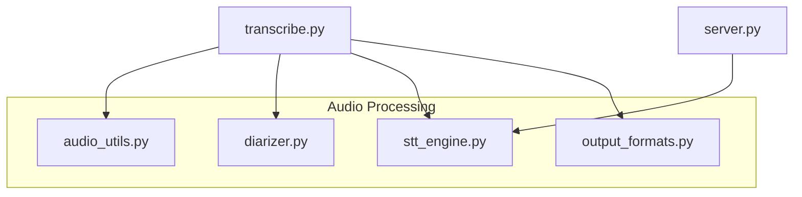
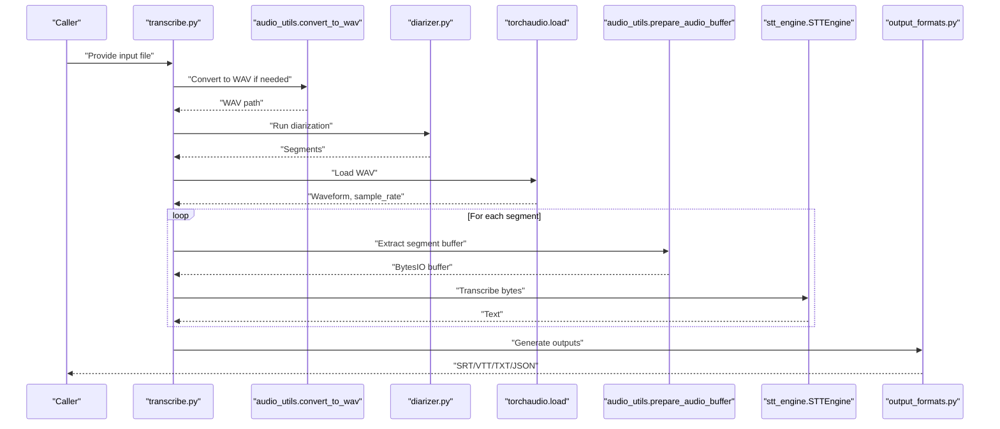
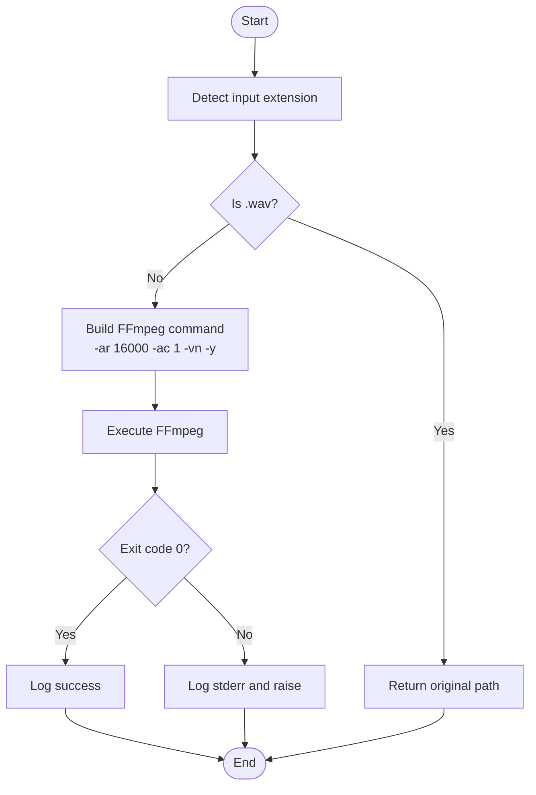
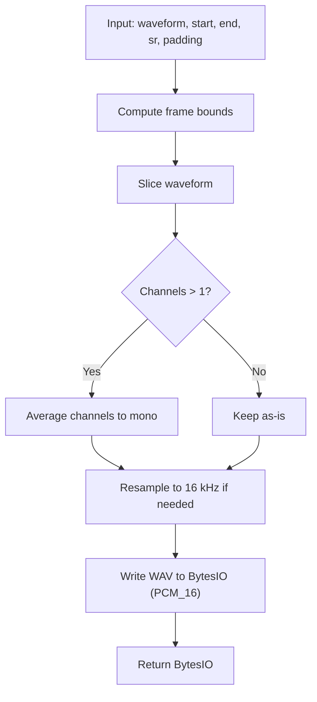
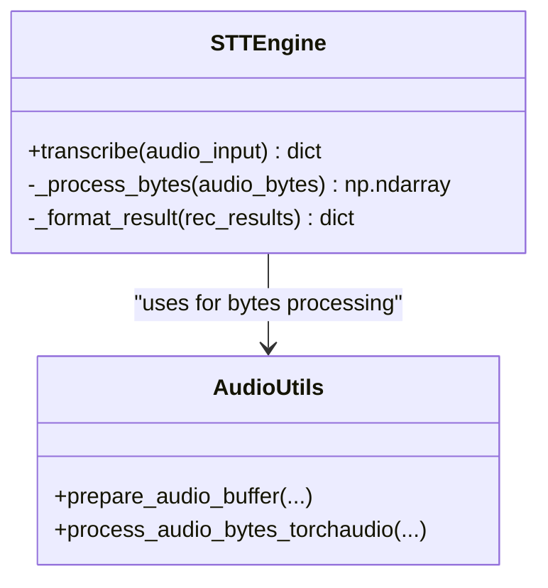
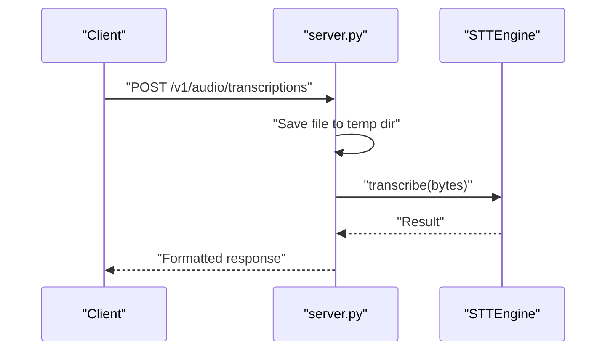
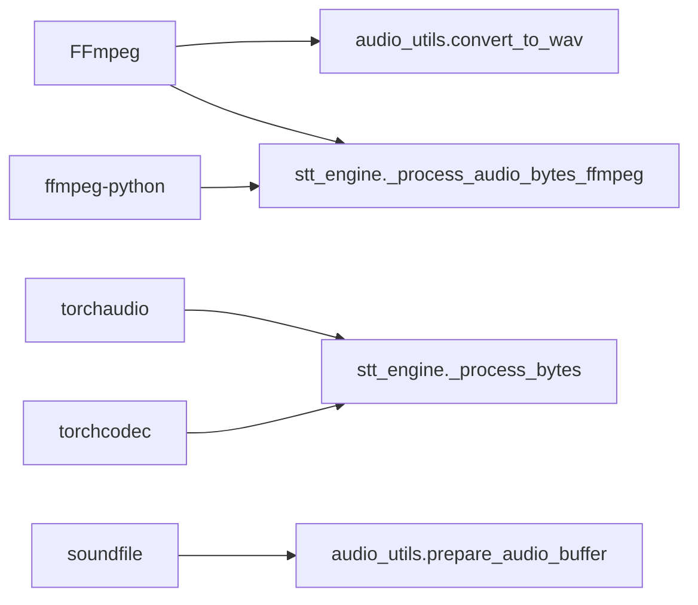

# Audio Processing Module

<cite>
**Referenced Files in This Document**
- [audio_utils.py](file://audio_utils.py)
- [stt_engine.py](file://stt_engine.py)
- [transcribe.py](file://transcribe.py)
- [diarizer.py](file://diarizer.py)
- [output_formats.py](file://output_formats.py)
- [server.py](file://server.py)
- [README.md](file://README.md)
- [pyproject.toml](file://pyproject.toml)
</cite>

## Table of Contents
1. [Introduction](#introduction)
2. [Project Structure](#project-structure)
3. [Core Components](#core-components)
4. [Architecture Overview](#architecture-overview)
5. [Detailed Component Analysis](#detailed-component-analysis)
6. [Dependency Analysis](#dependency-analysis)
7. [Performance Considerations](#performance-considerations)
8. [Troubleshooting Guide](#troubleshooting-guide)
9. [Conclusion](#conclusion)
10. [Appendices](#appendices)

## Introduction
This document explains the audio processing module that powers the meeting transcription pipeline. It covers:
- Audio format conversion using FFmpeg
- Preprocessing utilities for normalization and resampling
- Format support matrix for MP4, MP3, M4A, and WAV
- Configuration options for audio quality settings, segment extraction parameters, and format conversion workflows
- Concrete examples from the codebase showing audio processing pipelines
- Relationships with downstream components and external dependencies
- Common audio processing issues and their solutions

## Project Structure
The audio processing module is centered around a small set of focused utilities and integrates with the broader transcription pipeline:
- audio_utils.py: FFmpeg-based format conversion, in-memory segment extraction, and audio decoding fallbacks
- stt_engine.py: In-process STT engine that consumes normalized audio and provides transcription results
- transcribe.py: Orchestrates the full pipeline, including format conversion, diarization, segmentation, and output generation
- diarizer.py: Speaker diarization stage that produces per-speaker segments
- output_formats.py: Generates SRT, VTT, TXT, and JSON outputs
- server.py: HTTP server exposing OpenAI-compatible endpoints that reuse the STT engine
- README.md and pyproject.toml: Provide usage guidance and dependency declarations

**Diagram sources**
- [audio_utils.py:1-120](file://audio_utils.py#L1-L120)
- [stt_engine.py:1-185](file://stt_engine.py#L1-L185)
- [transcribe.py:1-240](file://transcribe.py#L1-L240)
- [diarizer.py:1-110](file://diarizer.py#L1-L110)
- [output_formats.py:1-160](file://output_formats.py#L1-L160)
- [server.py:1-197](file://server.py#L1-L197)

**Section sources**
- [README.md:134-173](file://README.md#L134-L173)
- [pyproject.toml:1-24](file://pyproject.toml#L1-L24)

## Core Components
- Audio format conversion: Converts any supported audio/video input to 16 kHz mono WAV using FFmpeg. See [convert_to_wav:23-50](file://audio_utils.py#L23-L50).
- Segment extraction: Extracts time-aligned audio segments from a loaded waveform and returns an in-memory WAV buffer. See [prepare_audio_buffer:53-94](file://audio_utils.py#L53-L94).
- In-memory decoding: Decodes audio bytes to a 16 kHz mono float32 NumPy array using soundfile and torchaudio, with a fallback to FFmpeg. See [STTEngine._process_bytes:111-129](file://stt_engine.py#L111-L129) and [stt_engine._process_audio_bytes_torchaudio:147-170](file://stt_engine.py#L147-L170), [stt_engine._process_audio_bytes_ffmpeg:173-184](file://stt_engine.py#L173-L184).
- Downstream integration: The STT engine accepts either file paths, raw bytes, or preprocessed arrays. See [STTEngine.transcribe:71-105](file://stt_engine.py#L71-L105).

**Section sources**
- [audio_utils.py:23-50](file://audio_utils.py#L23-L50)
- [audio_utils.py:53-94](file://audio_utils.py#L53-L94)
- [stt_engine.py:71-105](file://stt_engine.py#L71-L105)
- [stt_engine.py:111-129](file://stt_engine.py#L111-L129)
- [stt_engine.py:147-184](file://stt_engine.py#L147-L184)

## Architecture Overview
The audio processing pipeline transforms arbitrary audio/video inputs into normalized audio suitable for speaker diarization and transcription, then generates multiple output formats.

**Diagram sources**
- [transcribe.py:45-144](file://transcribe.py#L45-L144)
- [audio_utils.py:23-50](file://audio_utils.py#L23-L50)
- [diarizer.py:55-70](file://diarizer.py#L55-L70)
- [audio_utils.py:53-94](file://audio_utils.py#L53-L94)
- [stt_engine.py:71-105](file://stt_engine.py#L71-L105)
- [output_formats.py:118-159](file://output_formats.py#L118-L159)

## Detailed Component Analysis

### Audio Format Conversion (FFmpeg)
- Purpose: Normalize any supported audio/video input to 16 kHz mono WAV for downstream processing.
- Implementation: Uses FFmpeg to decode input and encode to WAV with explicit sample rate and channel configuration.
- Behavior:
  - Input: Any supported audio/video file path
  - Output: WAV file path in the same directory
  - Quality: Fixed 16 kHz sample rate, mono channel
- Error handling: Captures and logs FFmpeg errors; re-raises subprocess errors.

Key references:
- [convert_to_wav:23-50](file://audio_utils.py#L23-L50)

**Diagram sources**
- [audio_utils.py:23-50](file://audio_utils.py#L23-L50)

**Section sources**
- [audio_utils.py:23-50](file://audio_utils.py#L23-L50)
- [README.md:12-12](file://README.md#L12-L12)

### Segment Extraction and Normalization
- Purpose: Extract time-aligned audio segments from a loaded waveform and normalize to 16 kHz mono float32 for STT.
- Implementation:
  - Extracts a segment bounded by start_time and end_time with optional padding.
  - Converts to WAV in-memory using soundfile and returns a BytesIO buffer.
  - Decoding path: soundfile + torchaudio for in-memory bytes; fallback to FFmpeg PCM s16le.
- Resampling: If input sample rate differs from 16 kHz, applies torchaudio resampling.

Key references:
- [prepare_audio_buffer:53-94](file://audio_utils.py#L53-L94)
- [STTEngine._process_bytes:111-129](file://stt_engine.py#L111-L129)
- [stt_engine._process_audio_bytes_torchaudio:147-170](file://stt_engine.py#L147-L170)
- [stt_engine._process_audio_bytes_ffmpeg:173-184](file://stt_engine.py#L173-L184)

**Diagram sources**
- [audio_utils.py:53-94](file://audio_utils.py#L53-L94)
- [stt_engine.py:147-170](file://stt_engine.py#L147-L170)

**Section sources**
- [audio_utils.py:53-94](file://audio_utils.py#L53-L94)
- [stt_engine.py:111-129](file://stt_engine.py#L111-L129)
- [stt_engine.py:147-170](file://stt_engine.py#L147-L170)
- [stt_engine.py:173-184](file://stt_engine.py#L173-L184)

### STT Engine Integration
- Purpose: Provide a unified interface for transcription from file paths, bytes, or preprocessed arrays.
- Behavior:
  - Accepts str (file path), bytes (raw audio), or np.ndarray (preprocessed).
  - For bytes, attempts torchaudio decoding with soundfile fallback to FFmpeg PCM s16le.
  - Applies post-processing and language conversion.
- Downstream integration: Used by both the CLI pipeline and HTTP server.

Key references:
- [STTEngine.transcribe:71-105](file://stt_engine.py#L71-L105)
- [STTEngine._process_bytes:111-129](file://stt_engine.py#L111-L129)

**Diagram sources**
- [stt_engine.py:24-105](file://stt_engine.py#L24-L105)
- [audio_utils.py:53-94](file://audio_utils.py#L53-L94)

**Section sources**
- [stt_engine.py:24-105](file://stt_engine.py#L24-L105)
- [stt_engine.py:111-129](file://stt_engine.py#L111-L129)

### HTTP Server Integration
- Purpose: Expose OpenAI-compatible endpoints for transcription, leveraging the same STT engine.
- Endpoints:
  - POST /v1/audio/transcriptions (OpenAI Whisper API compatible)
  - POST /recognition (legacy)
- Behavior: Reads uploaded audio bytes, writes to a temporary file, and calls STTEngine.transcribe.

Key references:
- [server.create_app:92-161](file://server.py#L92-L161)
- [server.run_server:169-196](file://server.py#L169-L196)

**Diagram sources**
- [server.py:92-161](file://server.py#L92-L161)
- [stt_engine.py:71-105](file://stt_engine.py#L71-L105)

**Section sources**
- [server.py:92-161](file://server.py#L92-L161)
- [server.py:169-196](file://server.py#L169-L196)

## Dependency Analysis
External dependencies and their roles:
- FFmpeg: Required for format conversion and PCM decoding fallback. Version compatibility is documented.
- torchaudio: Provides resampling and audio loading for in-memory processing.
- soundfile: Enables writing WAV buffers to BytesIO during segment extraction.
- ffmpeg-python: Python bindings used by the STT engine’s FFmpeg fallback.
- torchcodec: Required for audio decoding in certain environments; version compatibility is documented.

**Diagram sources**
- [audio_utils.py:23-50](file://audio_utils.py#L23-L50)
- [audio_utils.py:53-94](file://audio_utils.py#L53-L94)
- [stt_engine.py:111-129](file://stt_engine.py#L111-L129)
- [stt_engine.py:173-184](file://stt_engine.py#L173-L184)
- [pyproject.toml:1-24](file://pyproject.toml#L1-L24)

**Section sources**
- [pyproject.toml:1-24](file://pyproject.toml#L1-L24)
- [README.md:17-19](file://README.md#L17-L19)

## Performance Considerations
- Conversion cost: FFmpeg conversion is CPU-bound; it is executed once per input file and cached as a WAV path for subsequent steps.
- Resampling: Resampling occurs only when the input sample rate differs from 16 kHz; this avoids unnecessary processing.
- In-memory buffers: Using BytesIO for segments reduces disk I/O during segmentation.
- Parallelism: The CLI pipeline supports configurable concurrency for segment transcription; balancing this with device resources improves throughput.
- Device selection: Prefer GPU devices (e.g., mps/cuda) for STT inference when available.

[No sources needed since this section provides general guidance]

## Troubleshooting Guide
Common audio processing issues and resolutions:
- FFmpeg not installed or incompatible:
  - Symptom: Conversion failures or missing executables.
  - Resolution: Install FFmpeg 4–8 as documented; verify installation with the version command.
  - Reference: [README.md FFmpeg section:187-203](file://README.md#L187-L203)
- torchcodec version mismatch:
  - Symptom: NameError related to AudioDecoder.
  - Resolution: Ensure torchcodec version compatibility with torch as documented.
  - Reference: [README.md torchcodec section:177-181](file://README.md#L177-L181)
- PyAnnote model access:
  - Symptom: Authentication errors when loading the diarization pipeline.
  - Resolution: Agree to the model terms on HuggingFace and set HF_TOKEN.
  - Reference: [README.md PyAnnote section:183-185](file://README.md#L183-L185)
- Audio decoding failures:
  - Symptom: Errors when decoding audio bytes.
  - Resolution: The STT engine falls back from torchaudio to FFmpeg PCM s16le; ensure FFmpeg is available.
  - Reference: [stt_engine._process_bytes:111-129](file://stt_engine.py#L111-L129)

**Section sources**
- [README.md:177-203](file://README.md#L177-L203)
- [stt_engine.py:111-129](file://stt_engine.py#L111-L129)

## Conclusion
The audio processing module provides a robust, dependency-driven pipeline that converts diverse audio/video inputs into a standardized 16 kHz mono WAV stream, extracts time-aligned segments, and normalizes audio for high-quality transcription. Its integration with the STT engine, diarizer, and output formatters enables end-to-end meeting transcription with flexible configuration and reliable fallbacks.

[No sources needed since this section summarizes without analyzing specific files]

## Appendices

### Format Support Matrix
- MP4: Supported via FFmpeg conversion to WAV.
- MP3: Supported via FFmpeg conversion to WAV.
- M4A: Supported via FFmpeg conversion to WAV.
- WAV: Native input; conversion is skipped when input is already WAV.

References:
- [README.md format support:12-12](file://README.md#L12-L12)
- [audio_utils.convert_to_wav:23-50](file://audio_utils.py#L23-L50)

**Section sources**
- [README.md:12-12](file://README.md#L12-L12)
- [audio_utils.py:23-50](file://audio_utils.py#L23-L50)

### Configuration Options
- Audio quality settings:
  - Sample rate: 16 kHz enforced during conversion and decoding.
  - Channel: Mono enforced during conversion and decoding.
  - Reference: [audio_utils.convert_to_wav:23-50](file://audio_utils.py#L23-L50), [stt_engine._process_audio_bytes_torchaudio:147-170](file://stt_engine.py#L147-L170)
- Segment extraction parameters:
  - Padding: Seconds added to each side of a segment (default 0.3).
  - Max gap for merging adjacent segments: Default 2.0 seconds.
  - References: [transcribe.py CLI arguments:199-210](file://transcribe.py#L199-L210), [diarizer._merge_segments:90-109](file://diarizer.py#L90-L109)
- Format conversion workflows:
  - Default mode: Convert to WAV if input is not WAV, then proceed with diarization and transcription.
  - References: [transcribe.py pipeline:63-67](file://transcribe.py#L63-L67), [transcribe.py run_transcription:45-144](file://transcribe.py#L45-L144)

**Section sources**
- [audio_utils.py:23-50](file://audio_utils.py#L23-L50)
- [audio_utils.py:53-94](file://audio_utils.py#L53-L94)
- [stt_engine.py:147-170](file://stt_engine.py#L147-L170)
- [transcribe.py:199-210](file://transcribe.py#L199-L210)
- [diarizer.py:90-109](file://diarizer.py#L90-L109)
- [transcribe.py:45-144](file://transcribe.py#L45-L144)

### Concrete Examples from the Codebase
- Full pipeline example (CLI):
  - Steps: Convert to WAV → Diarize → Load audio → Transcribe segments → Save outputs
  - References: [transcribe.py run_transcription:45-144](file://transcribe.py#L45-L144)
- HTTP server example:
  - Endpoints: /v1/audio/transcriptions and /recognition
  - References: [server.create_app:92-161](file://server.py#L92-L161)

**Section sources**
- [transcribe.py:45-144](file://transcribe.py#L45-L144)
- [server.py:92-161](file://server.py#L92-L161)