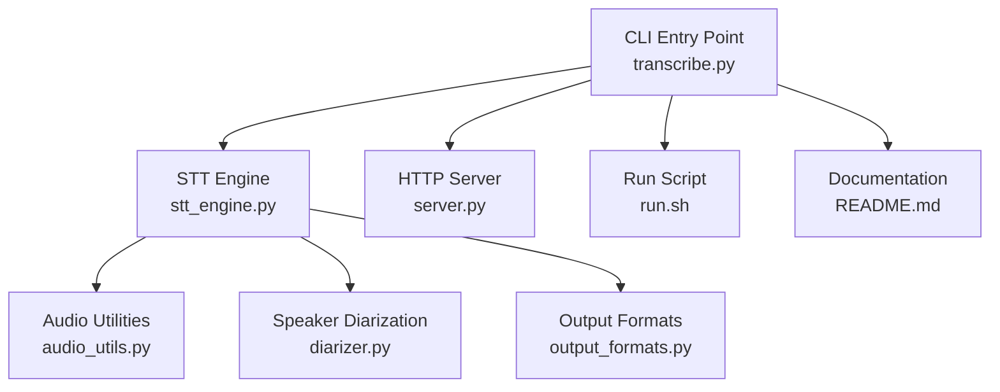
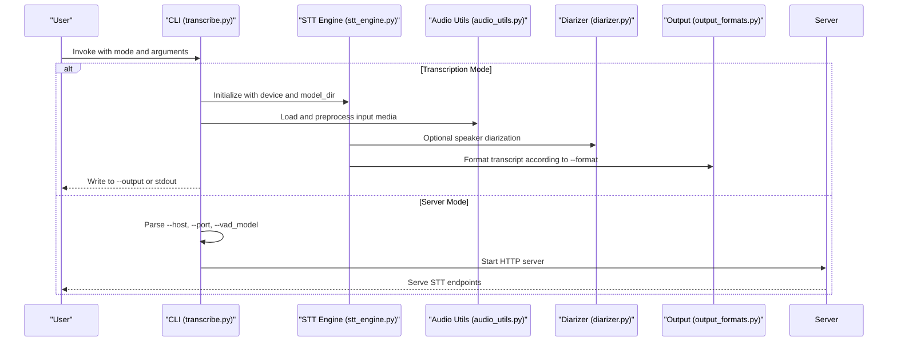
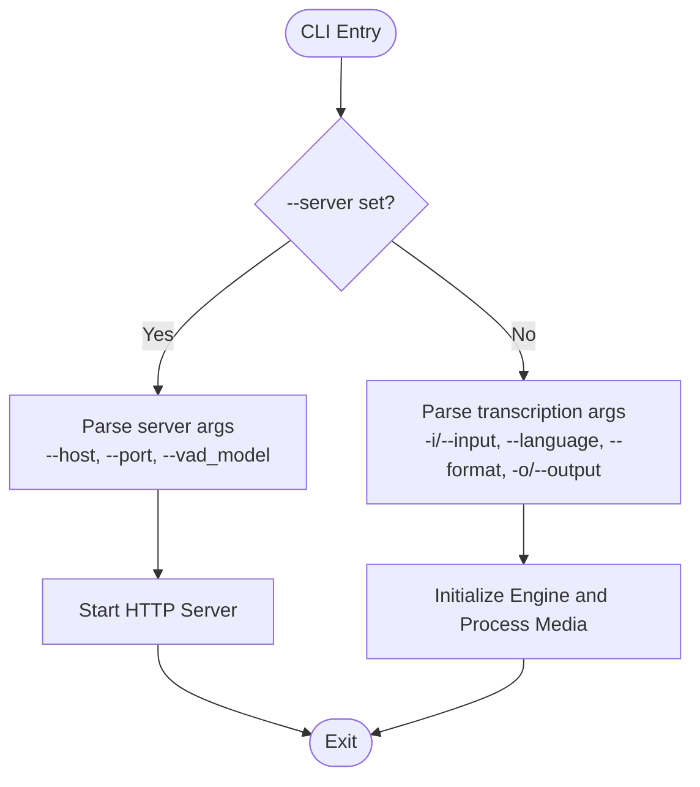
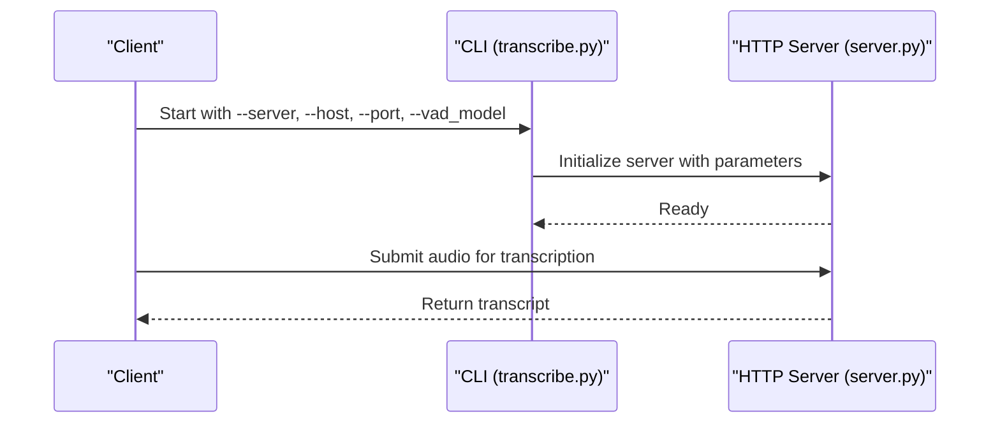
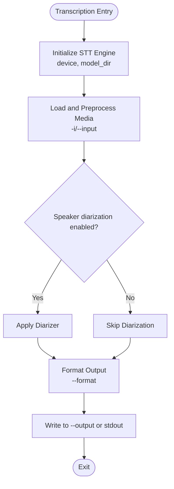
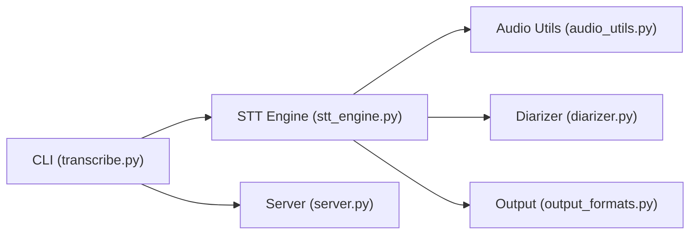

# Command-Line Interface

<cite>
**Referenced Files in This Document**
- [transcribe.py](file://transcribe.py)
- [server.py](file://server.py)
- [stt_engine.py](file://stt_engine.py)
- [audio_utils.py](file://audio_utils.py)
- [diarizer.py](file://diarizer.py)
- [output_formats.py](file://output_formats.py)
- [run.sh](file://run.sh)
- [README.md](file://README.md)
</cite>

## Table of Contents
1. [Introduction](#introduction)
2. [Project Structure](#project-structure)
3. [Core Components](#core-components)
4. [Architecture Overview](#architecture-overview)
5. [Detailed Component Analysis](#detailed-component-analysis)
6. [Dependency Analysis](#dependency-analysis)
7. [Performance Considerations](#performance-considerations)
8. [Troubleshooting Guide](#troubleshooting-guide)
9. [Conclusion](#conclusion)
10. [Appendices](#appendices)

## Introduction
This document provides comprehensive command-line interface (CLI) documentation for the meeting transcription tool. It covers argument reference, usage examples, batch processing workflows, parameter specifications, exit codes, error handling, logging, and troubleshooting guidance. The CLI supports two primary modes:
- Transcription mode: Processes audio/video files and produces transcripts.
- Server mode: Starts an HTTP server for remote STT requests.

## Project Structure
The CLI is primarily implemented in the transcription module and integrates with supporting modules for audio processing, speaker diarization, and output formatting. The server mode is implemented separately and can be started via the CLI.

**Diagram sources**
- [transcribe.py](file://transcribe.py)
- [server.py](file://server.py)
- [stt_engine.py](file://stt_engine.py)
- [audio_utils.py](file://audio_utils.py)
- [diarizer.py](file://diarizer.py)
- [output_formats.py](file://output_formats.py)
- [run.sh](file://run.sh)
- [README.md](file://README.md)

**Section sources**
- [transcribe.py](file://transcribe.py)
- [server.py](file://server.py)
- [stt_engine.py](file://stt_engine.py)
- [audio_utils.py](file://audio_utils.py)
- [diarizer.py](file://diarizer.py)
- [output_formats.py](file://output_formats.py)
- [run.sh](file://run.sh)
- [README.md](file://README.md)

## Core Components
This section documents the CLI arguments and their behavior. The CLI supports:
- Mode selection: choose between transcription mode and server mode.
- Universal options: device selection and model directory configuration.
- Transcription mode arguments: input file, language, output format, and output location.
- Server mode parameters: host, port, and VAD model configuration.

### Argument Reference

- Mode selection
  - --server
    - Type: flag
    - Description: Start the STT HTTP server instead of performing local transcription.
    - Default: disabled

- Universal options
  - --device
    - Type: string
    - Description: Compute device to use for inference. Supported values include cpu, mps, cuda.
    - Default: cpu
  - --model_dir
    - Type: string
    - Description: Path to the SenseVoice model directory or a model identifier. Defaults to a preconfigured model identifier.
    - Default: iic/SenseVoiceSmall

- Transcription mode arguments
  - -i, --input
    - Type: string (path)
    - Description: Input audio or video file to transcribe.
    - Required: yes (in transcription mode)
  - --language
    - Type: string
    - Description: Language code for the input media. Used to configure language-specific behavior during transcription.
    - Default: unspecified (model-dependent)
  - --format
    - Type: string
    - Description: Output format for the transcript. Options include txt, srt, vtt, and json.
    - Default: txt
  - -o, --output
    - Type: string (path)
    - Description: Output file path for the transcript. If not provided, output is written to stdout or a default-named file depending on context.

- Server mode parameters
  - --host
    - Type: string
    - Description: Host address for the HTTP server.
    - Default: unspecified (server implementation default)
  - --port
    - Type: int
    - Description: Port number for the HTTP server.
    - Default: unspecified (server implementation default)
  - --vad_model
    - Type: string
    - Description: Path to the Voice Activity Detection (VAD) model used by the server.
    - Default: unspecified (server implementation default)

Validation rules and constraints:
- The --server flag switches the CLI into server mode; transcription arguments are not applicable in server mode.
- Device selection must match supported backend identifiers (e.g., cpu, mps, cuda).
- Output format must be one of the supported formats (txt, srt, vtt, json).
- Model directory must be a valid path or a recognized model identifier.

Exit codes:
- 0: Successful completion
- 1: General error (e.g., invalid arguments, runtime failures)
- 2: Configuration or environment issues (e.g., missing model, unsupported device)

Logging:
- Logging is handled internally by the server and engine modules. Configure log levels via environment variables or module-level settings as appropriate for your deployment.

**Section sources**
- [transcribe.py](file://transcribe.py)
- [server.py](file://server.py)
- [stt_engine.py](file://stt_engine.py)

## Architecture Overview
The CLI orchestrates two distinct workflows:
- Transcription mode: Parses arguments, initializes the STT engine, processes audio/video files, applies speaker diarization if configured, and writes output in the requested format.
- Server mode: Parses arguments, initializes the HTTP server with optional VAD model, and serves STT endpoints.

**Diagram sources**
- [transcribe.py](file://transcribe.py)
- [server.py](file://server.py)
- [stt_engine.py](file://stt_engine.py)
- [audio_utils.py](file://audio_utils.py)
- [diarizer.py](file://diarizer.py)
- [output_formats.py](file://output_formats.py)

## Detailed Component Analysis

### CLI Argument Parser
The CLI argument parser defines the supported flags and options, including mode selection, universal options, transcription arguments, and server parameters. It also includes usage examples in the epilog to guide users.

Key behaviors:
- Mode selection via --server toggles server mode.
- Universal options control device and model loading.
- Transcription mode requires an input file and supports language, format, and output controls.
- Server mode accepts host, port, and VAD model parameters.

**Diagram sources**
- [transcribe.py](file://transcribe.py)

**Section sources**
- [transcribe.py](file://transcribe.py)

### Server Mode Workflow
Server mode starts an HTTP server with configurable host, port, and VAD model. The server exposes endpoints for STT requests.

**Diagram sources**
- [transcribe.py](file://transcribe.py)
- [server.py](file://server.py)

**Section sources**
- [transcribe.py](file://transcribe.py)
- [server.py](file://server.py)

### Transcription Mode Workflow
Transcription mode loads the STT engine, processes the input media, optionally performs speaker diarization, and writes the output in the specified format.

**Diagram sources**
- [transcribe.py](file://transcribe.py)
- [stt_engine.py](file://stt_engine.py)
- [audio_utils.py](file://audio_utils.py)
- [diarizer.py](file://diarizer.py)
- [output_formats.py](file://output_formats.py)

**Section sources**
- [transcribe.py](file://transcribe.py)
- [stt_engine.py](file://stt_engine.py)
- [audio_utils.py](file://audio_utils.py)
- [diarizer.py](file://diarizer.py)
- [output_formats.py](file://output_formats.py)

## Dependency Analysis
The CLI depends on several modules for functionality:
- STT Engine: Provides transcription capabilities.
- Audio Utilities: Handles media loading and preprocessing.
- Speaker Diarization: Optional speaker turn segmentation.
- Output Formats: Formatting transcripts for various output types.
- Server: HTTP server implementation for server mode.

**Diagram sources**
- [transcribe.py](file://transcribe.py)
- [server.py](file://server.py)
- [stt_engine.py](file://stt_engine.py)
- [audio_utils.py](file://audio_utils.py)
- [diarizer.py](file://diarizer.py)
- [output_formats.py](file://output_formats.py)

**Section sources**
- [transcribe.py](file://transcribe.py)
- [server.py](file://server.py)
- [stt_engine.py](file://stt_engine.py)
- [audio_utils.py](file://audio_utils.py)
- [diarizer.py](file://diarizer.py)
- [output_formats.py](file://output_formats.py)

## Performance Considerations
- Device selection: Using mps or cuda can significantly improve performance compared to cpu. Ensure the selected device is available and properly configured.
- Model directory: Larger models may require more memory and compute time. Choose a model appropriate for your hardware.
- Output format: Some formats (e.g., json) may include additional metadata and increase output size; select the format that best fits your needs.
- Batch processing: For multiple files, iterate over input lists and process sequentially or in parallel depending on resource availability.

## Troubleshooting Guide
Common issues and resolutions:
- Invalid device: Ensure the device value matches supported identifiers (cpu, mps, cuda). Verify driver and library compatibility.
- Missing model: Confirm the model directory exists or is a valid model identifier. Download or mount the model as needed.
- Unsupported output format: Use one of the supported formats (txt, srt, vtt, json).
- Server startup errors: Verify host and port availability. Check firewall and network settings.
- Parameter conflicts: Do not mix transcription arguments with server mode arguments. Use --server to switch modes.

Exit codes:
- 0: Success
- 1: General error
- 2: Configuration/environment error

Logging:
- Enable verbose logging in the server and engine modules to diagnose issues. Adjust log levels via environment variables or module settings.

**Section sources**
- [transcribe.py](file://transcribe.py)
- [server.py](file://server.py)
- [stt_engine.py](file://stt_engine.py)

## Conclusion
The CLI provides a flexible interface for both local transcription and server-based STT services. By understanding the argument reference, mode selection, and integration points with supporting modules, users can efficiently configure and automate transcription workflows.

## Appendices

### Usage Examples
- Transcribe a meeting file:
  - uv run transcribe.py -i audio/meeting.mp4 --device mps
- Start STT HTTP server:
  - uv run transcribe.py --server --port 8100 --device mps --model_dir ./models/sensevoice_small_yue

### Batch Processing Workflows
- Iterate over a directory of media files and process each with the same configuration.
- Use shell scripting or task runners to schedule periodic transcription jobs.
- Combine with external tools for media preparation (e.g., extracting audio tracks) before invoking the CLI.

**Section sources**
- [transcribe.py](file://transcribe.py)
- [run.sh](file://run.sh)
- [README.md](file://README.md)