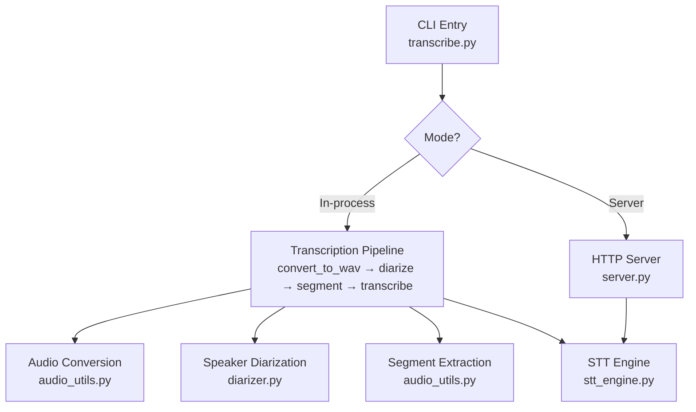
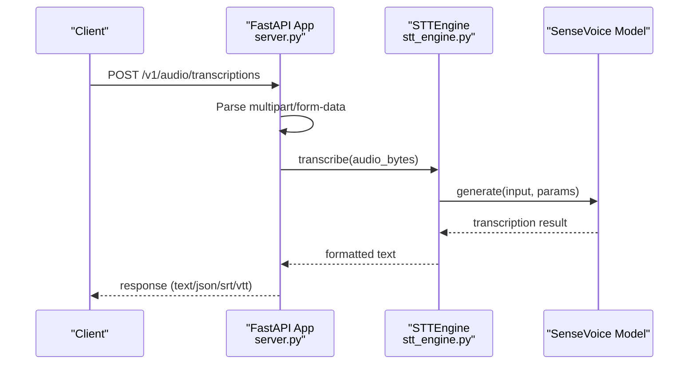
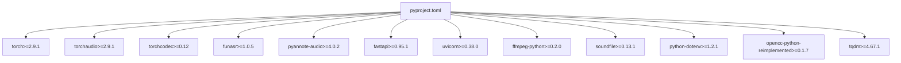

# Configuration and Tuning

<cite>
**Referenced Files in This Document**
- [README.md](file://README.md)
- [transcribe.py](file://transcribe.py)
- [server.py](file://server.py)
- [stt_engine.py](file://stt_engine.py)
- [diarizer.py](file://diarizer.py)
- [audio_utils.py](file://audio_utils.py)
- [output_formats.py](file://output_formats.py)
- [pyproject.toml](file://pyproject.toml)
- [run.sh](file://run.sh)
</cite>

## Table of Contents
1. [Introduction](#introduction)
2. [Project Structure](#project-structure)
3. [Core Components](#core-components)
4. [Architecture Overview](#architecture-overview)
5. [Detailed Component Analysis](#detailed-component-analysis)
6. [Dependency Analysis](#dependency-analysis)
7. [Performance Considerations](#performance-considerations)
8. [Troubleshooting Guide](#troubleshooting-guide)
9. [Conclusion](#conclusion)
10. [Appendices](#appendices)

## Introduction
This document provides comprehensive configuration and tuning guidance for the meeting transcription system. It covers parameter reference, performance optimization, resource management, and troubleshooting. The system supports two operational modes:
- In-process transcription mode: runs speaker diarization and SenseVoice STT within a single process.
- HTTP server mode: exposes an OpenAI Whisper API-compatible endpoint for external clients.

Key configuration areas include:
- Audio processing parameters: padding and max-gap for segment preparation.
- Model settings: device selection and model directory.
- Server configuration: host, port, and Voice Activity Detection (VAD) settings.
- Environment and runtime: logging, concurrency, and platform-specific dependencies.

## Project Structure
The project is organized around a CLI entry point that orchestrates audio conversion, speaker diarization, segmentation, and transcription. An optional HTTP server exposes the STT engine.

**Diagram sources**
- [transcribe.py:45-144](file://transcribe.py#L45-L144)
- [server.py:92-161](file://server.py#L92-L161)
- [audio_utils.py:23-94](file://audio_utils.py#L23-L94)
- [diarizer.py:55-70](file://diarizer.py#L55-L70)
- [stt_engine.py:71-105](file://stt_engine.py#L71-L105)

**Section sources**
- [README.md:134-149](file://README.md#L134-L149)
- [transcribe.py:173-221](file://transcribe.py#L173-L221)

## Core Components
This section documents the primary configuration parameters and their effects.

- Device selection
  - Purpose: Select computation backend for model inference.
  - Options: cpu, mps, cuda.
  - Defaults and usage: See CLI arguments and engine initialization.
  - Impact: Determines GPU/CPU utilization and memory allocation.

- Model directory
  - Purpose: Path to SenseVoice model or model identifier.
  - Default: iic/SenseVoiceSmall.
  - Behavior: Passed to the STT engine; supports local paths or remote identifiers.

- Audio processing parameters
  - padding: Seconds of extra audio appended to each segment during extraction.
  - max-gap: Maximum gap (in seconds) to merge adjacent segments from the same speaker during diarization.

- Server configuration
  - host: Network interface to bind.
  - port: TCP port for the HTTP server.
  - vad_model: Name of the VAD model used by the STT engine.
  - use_itn: Enable inverse text normalization in post-processing.
  - merge_vad: Merge contiguous VAD segments.
  - merge_length_s: Maximum length for VAD merges in seconds.

- Language and output
  - language: Target language for transcription (auto, zh, en, yue, ja, ko).
  - format: Comma-separated output formats (srt, vtt, txt, json).
  - output: Output directory for generated files.

- Concurrency and workers
  - max_workers: Maximum concurrent transcription tasks in in-process mode.

- Environment and logging
  - HF_TOKEN: Required for PyAnnote model access.
  - Logging level: Configured via basicConfig in the CLI.

**Section sources**
- [README.md:90-122](file://README.md#L90-L122)
- [transcribe.py:194-219](file://transcribe.py#L194-L219)
- [stt_engine.py:27-65](file://stt_engine.py#L27-L65)
- [server.py:169-196](file://server.py#L169-L196)
- [diarizer.py:30-53](file://diarizer.py#L30-L53)
- [audio_utils.py:53-94](file://audio_utils.py#L53-L94)

## Architecture Overview
The system integrates audio conversion, speaker diarization, segment preparation, and STT inference. In server mode, the STT engine is exposed via FastAPI endpoints.

**Diagram sources**
- [server.py:121-160](file://server.py#L121-L160)
- [stt_engine.py:71-105](file://stt_engine.py#L71-L105)

## Detailed Component Analysis

### CLI Parameter Reference
- Mode selection
  - --server: Starts HTTP server instead of running in-process transcription.
- Common options
  - --device: cpu, mps, cuda.
  - --model_dir: Path or identifier for SenseVoice model.
- In-process transcription options
  - -i/--input: Required input audio/video file.
  - --language: auto, zh, en, yue, ja, ko.
  - --format: Comma-separated output formats.
  - -o/--output: Output directory.
  - --max-workers: Concurrency limit for segment transcription.
  - --padding: Segment padding in seconds.
  - --max-gap: Merge threshold for diarized segments.
- Server options
  - --host: Bind address.
  - --port: Port number.
  - --vad_model: VAD model name.
  - --use_itn: Enable ITN.
  - --merge_vad: Merge VAD segments.
  - --merge_length_s: Max VAD merge length in seconds.

**Section sources**
- [README.md:90-122](file://README.md#L90-L122)
- [transcribe.py:173-221](file://transcribe.py#L173-L221)

### STT Engine Configuration
- Initialization parameters
  - model_dir: SenseVoice model path or identifier.
  - device: Computation device.
  - ncpu: Number of CPU threads for model internals.
  - language: Default language for transcription.
  - vad_model: VAD model name; set to None to bypass VAD.
  - use_itn: Enable ITN in post-processing.
  - merge_vad: Merge VAD segments.
  - merge_length_s: Max VAD merge length.
- Transcription behavior
  - Accepts file path, bytes, or preprocessed waveform.
  - Applies post-processing and simplified-to-traditional Chinese conversion.

**Section sources**
- [stt_engine.py:27-65](file://stt_engine.py#L27-L65)
- [stt_engine.py:71-105](file://stt_engine.py#L71-L105)

### Server Configuration
- Host and port
  - Controlled by --host and --port CLI flags.
- SSL/TLS
  - Optional ssl_certfile and ssl_keyfile parameters for HTTPS.
- Endpoint compatibility
  - Supports OpenAI Whisper API-compatible requests.
- Temporary file handling
  - Uploaded audio is written to a temporary directory and removed after processing.

**Section sources**
- [server.py:169-196](file://server.py#L169-L196)
- [transcribe.py:151-165](file://transcribe.py#L151-L165)

### Audio Processing Parameters
- Padding
  - Adds seconds before and after each segment to reduce edge artifacts.
- Max-gap
  - Merges adjacent segments from the same speaker if the gap is within threshold.

These parameters influence accuracy and runtime. Larger padding improves robustness at the cost of increased processing time and memory usage.

**Section sources**
- [audio_utils.py:53-94](file://audio_utils.py#L53-L94)
- [diarizer.py:90-109](file://diarizer.py#L90-L109)
- [transcribe.py:209-210](file://transcribe.py#L209-L210)

### VAD Settings
- VAD model selection
  - --vad_model controls the VAD used by the STT engine.
- VAD merging
  - merge_vad and merge_length_s control segment consolidation for continuous speech detection.

**Section sources**
- [README.md:112-122](file://README.md#L112-L122)
- [stt_engine.py:34-38](file://stt_engine.py#L34-L38)

## Dependency Analysis
Runtime dependencies include audio processing, machine learning frameworks, and web server components. The project uses uv for dependency management and provides a convenience script to run commands via uv.

**Diagram sources**
- [pyproject.toml:7-23](file://pyproject.toml#L7-L23)

**Section sources**
- [pyproject.toml:1-24](file://pyproject.toml#L1-L24)
- [run.sh:1-7](file://run.sh#L1-L7)

## Performance Considerations
This section provides practical guidance for optimizing performance across hardware configurations and workloads.

- Device selection
  - Prefer CUDA for NVIDIA GPUs to accelerate inference.
  - Use MPS on Apple Silicon for acceleration when available.
  - CPU is suitable for low-throughput or constrained environments.

- Concurrency and throughput
  - max_workers controls parallel segment transcription in in-process mode.
  - Increase cautiously to match CPU/GPU capacity; monitor resource saturation.
  - For HTTP server mode, tune worker count and connection limits based on deployment needs.

- Memory optimization
  - Reduce padding to minimize per-segment memory usage.
  - Use smaller merge_length_s to reduce intermediate buffers.
  - Limit format outputs to required ones to reduce I/O overhead.

- Audio preprocessing
  - Ensure input is 16 kHz mono WAV to avoid resampling overhead.
  - Convert non-WAV inputs once and reuse converted files when feasible.

- Model settings
  - Choose appropriate model_dir for accuracy vs. speed trade-offs.
  - Disable VAD (set vad_model=None) when using pre-segmented audio to avoid redundant segmentation.

- Platform-specific tips
  - Ensure FFmpeg 4–8 is installed for torchcodec compatibility.
  - On macOS, use Homebrew to install FFmpeg if needed.

[No sources needed since this section provides general guidance]

## Troubleshooting Guide
Common issues and remedies:

- torchcodec version mismatch
  - Symptom: NameError related to AudioDecoder.
  - Cause: Incompatible torchcodec and torch versions.
  - Fix: Align versions per the compatibility guidance.

- PyAnnote model access
  - Symptom: Access denied errors for speaker diarization model.
  - Cause: Missing or invalid HF_TOKEN.
  - Fix: Accept terms on Hugging Face and set HF_TOKEN in .env.

- FFmpeg availability and version
  - Symptom: Conversion failures or codec errors.
  - Cause: Missing or incompatible FFmpeg installation.
  - Fix: Install FFmpeg 4–8; verify with ffmpeg -version.

- CUDA memory issues
  - Symptom: Out-of-memory errors during inference.
  - Actions:
    - Switch to CPU or MPS.
    - Reduce padding and max_workers.
    - Lower merge_length_s and use smaller models.

- CPU bottleneck
  - Symptom: Slow transcription despite available cores.
  - Actions:
    - Increase max_workers up to hardware limits.
    - Ensure device is set appropriately for acceleration.
    - Minimize padding and output formats.

- Network connectivity (server mode)
  - Symptom: Clients cannot reach the server.
  - Actions:
    - Verify --host and --port.
    - Check firewall and container/network settings.
    - Confirm endpoint compatibility with client expectations.

- Logging and diagnostics
  - Configure logging level via basicConfig in the CLI.
  - Inspect server logs for upload/read/formatting errors.
  - Use verbose client requests to capture detailed error messages.

**Section sources**
- [README.md:175-203](file://README.md#L175-L203)
- [transcribe.py:32-37](file://transcribe.py#L32-L37)
- [server.py:113-118](file://server.py#L113-L118)
- [server.py:142-144](file://server.py#L142-L144)

## Conclusion
This document outlined configuration parameters, performance tuning strategies, and troubleshooting steps for the meeting transcription system. By aligning device selection, concurrency, and audio processing parameters with workload characteristics and hardware capabilities, users can achieve reliable and efficient transcription across in-process and server deployments.

[No sources needed since this section summarizes without analyzing specific files]

## Appendices

### Appendix A: Parameter Reference Summary
- Device selection: --device (cpu, mps, cuda)
- Model directory: --model_dir
- Language: --language
- Output formats: --format
- Output directory: -o/--output
- Concurrency: --max-workers
- Audio padding: --padding
- Diarization merge gap: --max-gap
- Server host/port: --host, --port
- VAD settings: --vad_model, --merge_vad, --merge_length_s
- ITN toggle: --use_itn

**Section sources**
- [README.md:90-122](file://README.md#L90-L122)
- [transcribe.py:194-219](file://transcribe.py#L194-L219)