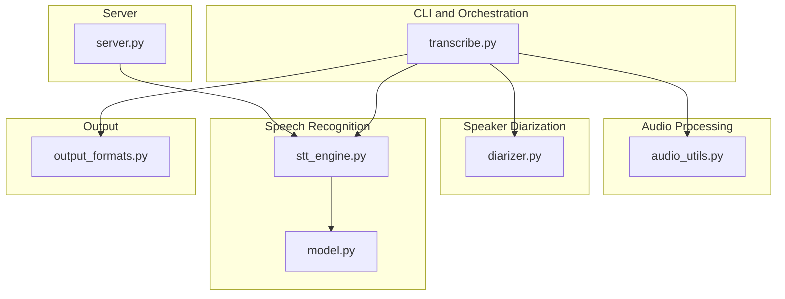
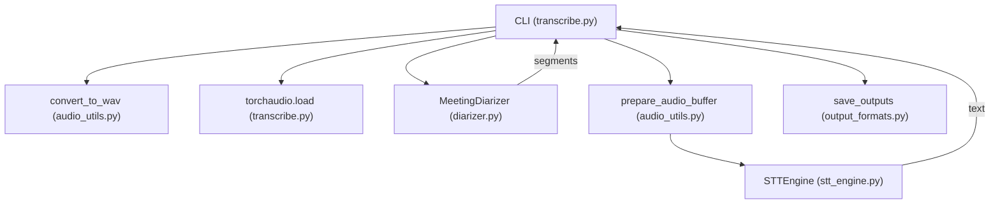
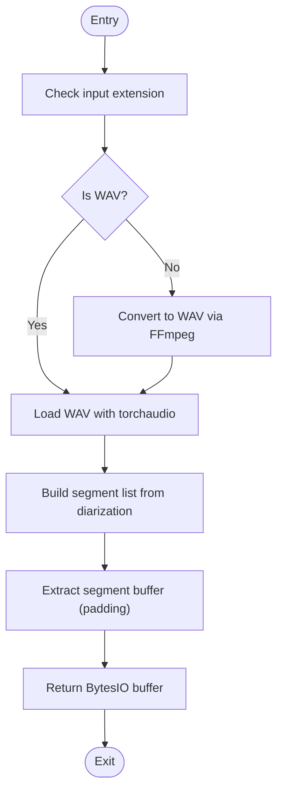
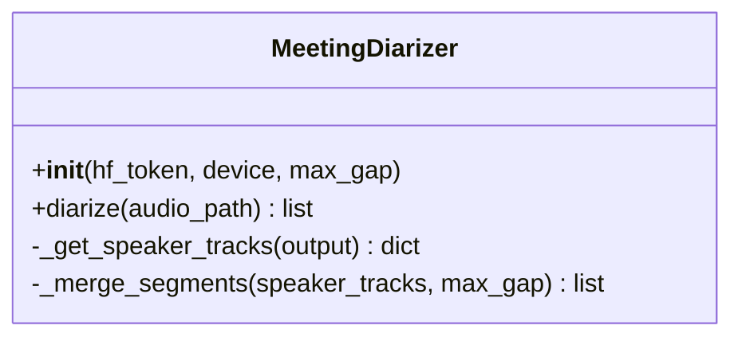
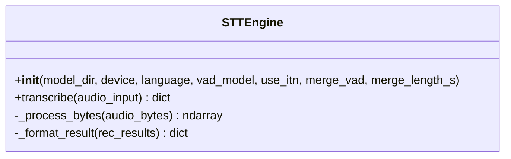
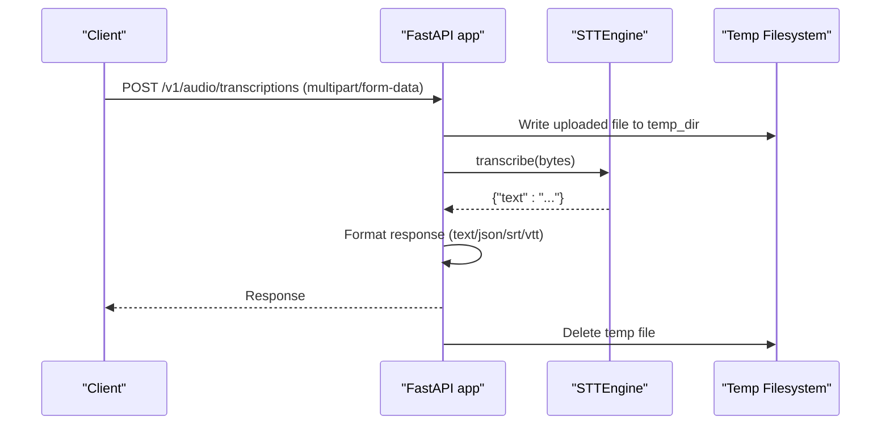
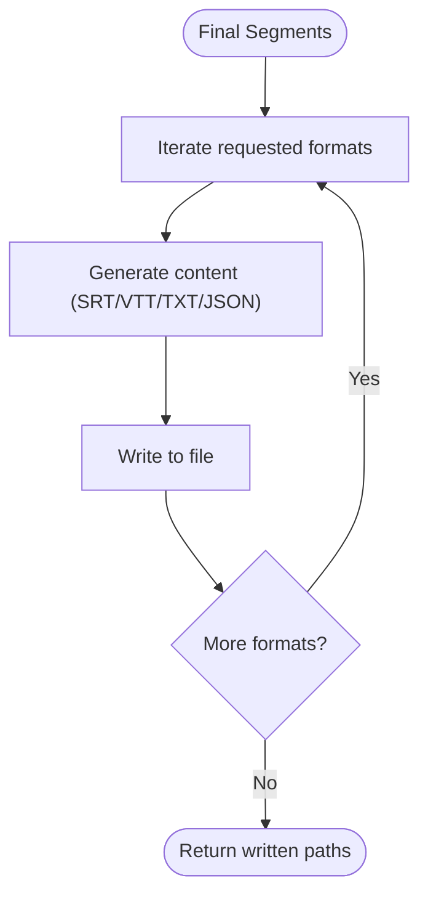
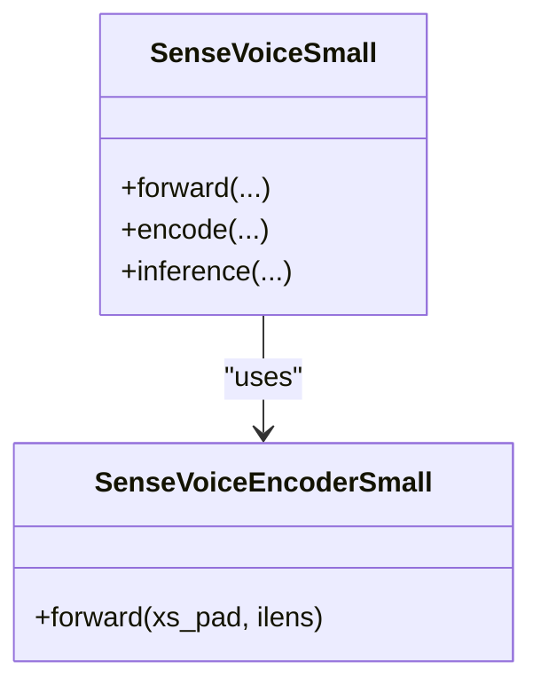
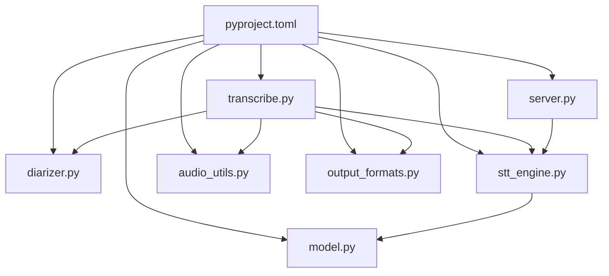

# Component Interactions

<cite>
**Referenced Files in This Document**
- [README.md](file://README.md)
- [transcribe.py](file://transcribe.py)
- [stt_engine.py](file://stt_engine.py)
- [diarizer.py](file://diarizer.py)
- [audio_utils.py](file://audio_utils.py)
- [server.py](file://server.py)
- [output_formats.py](file://output_formats.py)
- [model.py](file://model.py)
- [utils/ctc_alignment.py](file://utils/ctc_alignment.py)
- [pyproject.toml](file://pyproject.toml)
</cite>

## Table of Contents
1. [Introduction](#introduction)
2. [Project Structure](#project-structure)
3. [Core Components](#core-components)
4. [Architecture Overview](#architecture-overview)
5. [Detailed Component Analysis](#detailed-component-analysis)
6. [Dependency Analysis](#dependency-analysis)
7. [Performance Considerations](#performance-considerations)
8. [Troubleshooting Guide](#troubleshooting-guide)
9. [Conclusion](#conclusion)

## Introduction
This document explains the component interaction patterns within the Meeting Transcriber system. It focuses on how audio processing, speaker diarization, and speech recognition modules collaborate, the data flow across these components, and the interface contracts and communication protocols. It also documents the factory pattern for dynamic component instantiation, dependency injection mechanisms, and shared resource management. Sequence diagrams illustrate typical interaction flows, error propagation, and state synchronization between components.

## Project Structure
The system is organized around a small set of focused modules:
- CLI orchestration and pipeline control
- Audio preprocessing and segmentation
- Speaker diarization
- Speech recognition engine
- HTTP server for external clients
- Output formatting and persistence

**Diagram sources**
- [transcribe.py](file://transcribe.py)
- [audio_utils.py](file://audio_utils.py)
- [diarizer.py](file://diarizer.py)
- [stt_engine.py](file://stt_engine.py)
- [model.py](file://model.py)
- [server.py](file://server.py)
- [output_formats.py](file://output_formats.py)

**Section sources**
- [README.md](file://README.md)
- [pyproject.toml](file://pyproject.toml)

## Core Components
- CLI orchestrator: parses arguments, selects mode (in-process transcription vs. HTTP server), and coordinates the pipeline.
- Audio utilities: format conversion, segment extraction, and in-memory decoding.
- Speaker diarizer: loads and runs the PyAnnote pipeline to detect speakers and produce time-aligned segments.
- STT engine: wraps FunASR’s AutoModel to perform in-process transcription with configurable VAD and post-processing.
- Server: exposes OpenAI Whisper-compatible endpoints backed by the STT engine.
- Output formatters: generate SRT, VTT, TXT, and JSON outputs from segment lists.

**Section sources**
- [transcribe.py](file://transcribe.py)
- [audio_utils.py](file://audio_utils.py)
- [diarizer.py](file://diarizer.py)
- [stt_engine.py](file://stt_engine.py)
- [server.py](file://server.py)
- [output_formats.py](file://output_formats.py)

## Architecture Overview
The system supports two primary modes:
- In-process transcription: CLI mode that converts audio, runs diarization, extracts segments, and transcribes them concurrently.
- HTTP server mode: FastAPI server that serves transcription requests and delegates to the STT engine.

**Diagram sources**
- [transcribe.py](file://transcribe.py)
- [audio_utils.py](file://audio_utils.py)
- [diarizer.py](file://diarizer.py)
- [stt_engine.py](file://stt_engine.py)
- [output_formats.py](file://output_formats.py)

## Detailed Component Analysis

### Audio Processing Pipeline
Responsibilities:
- Convert input audio/video to 16 kHz mono WAV using FFmpeg.
- Load audio into memory and extract time-aligned segments with optional padding.
- Provide in-memory decoding fallbacks when torchaudio fails.

Key interactions:
- The CLI invokes conversion and loads the waveform.
- Diarization produces time-aligned segments.
- Segment extraction uses the loaded waveform and segment boundaries to create per-turn audio buffers.
- The STT engine accepts either file paths or in-memory audio bytes.

**Diagram sources**
- [transcribe.py](file://transcribe.py)
- [audio_utils.py](file://audio_utils.py)

**Section sources**
- [transcribe.py](file://transcribe.py)
- [audio_utils.py](file://audio_utils.py)

### Speaker Diarization
Responsibilities:
- Initialize PyAnnote pipeline with a HuggingFace token and device.
- Run diarization on the converted audio file.
- Aggregate speaker turns and merge adjacent segments within a configured gap threshold.

Interface contract:
- Input: audio file path.
- Output: sorted list of segments with start, end, and speaker label.

**Diagram sources**
- [diarizer.py](file://diarizer.py)

**Section sources**
- [diarizer.py](file://diarizer.py)

### Speech Recognition Engine (STTEngine)
Responsibilities:
- Initialize FunASR AutoModel with configurable device, VAD, and post-processing.
- Transcribe audio from file path, in-memory bytes, or preprocessed arrays.
- Normalize and post-process results, including Traditional to Simplified Chinese conversion.

Factory pattern and dependency injection:
- Factory: STTEngine constructor builds the AutoModel with injected parameters (device, VAD, language, ITN, merge settings).
- DI: Arguments passed from CLI or server are forwarded to the engine.

Error handling:
- Catches exceptions during model generation and returns structured error results.
- Provides fallback decoding using FFmpeg when torchaudio fails.

**Diagram sources**
- [stt_engine.py](file://stt_engine.py)

**Section sources**
- [stt_engine.py](file://stt_engine.py)

### HTTP Server Mode
Responsibilities:
- Expose OpenAI Whisper-compatible endpoints for transcription.
- Manage temporary files for uploaded audio.
- Format responses according to requested format (text, json, verbose_json, srt, vtt).

Factory pattern:
- Factory: create_app(engine, temp_dir) binds an STTEngine instance to the FastAPI app.
- DI: run_server constructs the STTEngine with server-specific parameters and starts the server.

**Diagram sources**
- [server.py](file://server.py)
- [stt_engine.py](file://stt_engine.py)

**Section sources**
- [server.py](file://server.py)

### Output Generation
Responsibilities:
- Generate SRT, VTT, TXT, and JSON outputs from the final segment list.
- Persist outputs to disk with consistent filenames and extensions.

Interface contract:
- Input: list of segment dictionaries with keys start, end, speaker, text.
- Output: list of written file paths.

**Diagram sources**
- [output_formats.py](file://output_formats.py)

**Section sources**
- [output_formats.py](file://output_formats.py)

### Model Implementation (SenseVoice)
Responsibilities:
- Defines the SenseVoice model architecture and integrates with FunASR’s registration system.
- Supports language identification and text normalization embeddings.
- Provides inference and training utilities used by the STT engine.

**Diagram sources**
- [model.py](file://model.py)

**Section sources**
- [model.py](file://model.py)

## Dependency Analysis
External dependencies and integration points:
- Audio decoding/encoding: torchaudio, soundfile, ffmpeg-python
- Diarization: pyannote.audio
- Speech recognition: funasr, modelscope
- Web server: fastapi, uvicorn
- Utilities: python-dotenv, tqdm, aiofiles, opencc-python-reimplemented

**Diagram sources**
- [pyproject.toml](file://pyproject.toml)
- [transcribe.py](file://transcribe.py)
- [server.py](file://server.py)
- [diarizer.py](file://diarizer.py)
- [stt_engine.py](file://stt_engine.py)
- [audio_utils.py](file://audio_utils.py)
- [output_formats.py](file://output_formats.py)
- [model.py](file://model.py)

**Section sources**
- [pyproject.toml](file://pyproject.toml)

## Performance Considerations
- Concurrency: The CLI mode uses an asyncio semaphore to limit concurrent transcriptions, balancing throughput and resource usage.
- Memory: Full audio is loaded into memory; consider streaming or chunked processing for very long recordings.
- Device selection: Prefer GPU acceleration when available; MPS for Apple Silicon; CPU fallback otherwise.
- VAD: Disable internal VAD in the STT engine when using pre-segmented audio from diarization to avoid redundant segmentation artifacts.
- Post-processing: ITN and character normalization add overhead; disable if not needed.

[No sources needed since this section provides general guidance]

## Troubleshooting Guide
Common issues and resolutions:
- FFmpeg version: Ensure FFmpeg 4–8 is installed; the project relies on torchcodec’s support for this range.
- HuggingFace token: Diarization requires a valid HF token; configure it in the environment.
- torchcodec version: Align torchcodec with the installed torch version to avoid import errors.
- Audio decoding failures: The STT engine falls back to FFmpeg when torchaudio decoding fails.

**Section sources**
- [README.md](file://README.md)
- [diarizer.py](file://diarizer.py)
- [stt_engine.py](file://stt_engine.py)

## Conclusion
The Meeting Transcriber system composes a clear pipeline: audio conversion, speaker diarization, segment extraction, and in-process transcription. The CLI orchestrates these steps, while the STT engine and server expose a consistent interface for both batch processing and external clients. The factory pattern and dependency injection enable flexible configuration across modes. Robust error handling and output formatting ensure reliable results across multiple formats.