# Core Architecture

<cite>
**Referenced Files in This Document**
- [README.md](file://README.md)
- [transcribe.py](file://transcribe.py)
- [stt_engine.py](file://stt_engine.py)
- [diarizer.py](file://diarizer.py)
- [server.py](file://server.py)
- [audio_utils.py](file://audio_utils.py)
- [output_formats.py](file://output_formats.py)
- [model.py](file://model.py)
- [utils/ctc_alignment.py](file://utils/ctc_alignment.py)
- [pyproject.toml](file://pyproject.toml)
- [run.sh](file://run.sh)
</cite>

## Table of Contents
1. [Introduction](#introduction)
2. [Project Structure](#project-structure)
3. [Core Components](#core-components)
4. [Architecture Overview](#architecture-overview)
5. [Detailed Component Analysis](#detailed-component-analysis)
6. [Dependency Analysis](#dependency-analysis)
7. [Performance Considerations](#performance-considerations)
8. [Troubleshooting Guide](#troubleshooting-guide)
9. [Conclusion](#conclusion)
10. [Appendices](#appendices)

## Introduction
This document describes the core architecture of the Meeting Transcriber system. It explains the high-level pipeline design, sequential processing stages, and component interactions among audio processing, speaker diarization, and speech recognition modules. It documents data flows from input audio through format conversion, speaker separation, segment processing, and output generation. It also covers technical decisions such as in-process versus server modes, design patterns (pipeline and factory), system boundaries, infrastructure requirements, scalability considerations, and deployment topology.

## Project Structure
The project is organized around a small set of focused modules:
- CLI entry point orchestrating the pipeline and optional HTTP server
- Audio utilities for format conversion and segment extraction
- Speaker diarization wrapper around PyAnnote
- Speech-to-text engine using SenseVoice via FunASR
- Output formatters for SRT, VTT, TXT, and JSON
- Model definition and CTC alignment utilities
- Server adapter exposing OpenAI Whisper-compatible endpoints

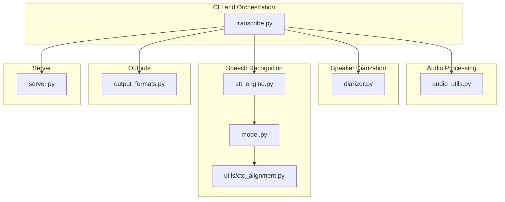

**Diagram sources**
- [transcribe.py:45-144](file://transcribe.py#L45-L144)
- [audio_utils.py:23-94](file://audio_utils.py#L23-L94)
- [diarizer.py:27-110](file://diarizer.py#L27-L110)
- [stt_engine.py:24-185](file://stt_engine.py#L24-L185)
- [model.py:437-800](file://model.py#L437-L800)
- [utils/ctc_alignment.py:1-77](file://utils/ctc_alignment.py#L1-L77)
- [output_formats.py:118-160](file://output_formats.py#L118-L160)
- [server.py:92-197](file://server.py#L92-L197)

**Section sources**
- [README.md:134-149](file://README.md#L134-L149)
- [pyproject.toml:1-24](file://pyproject.toml#L1-L24)

## Core Components
- CLI and Pipeline Orchestrator: Provides both in-process transcription and HTTP server modes. It coordinates format conversion, diarization, segment extraction, STT, and output generation.
- Audio Utilities: Converts input audio/video to 16 kHz mono WAV and extracts audio segments with optional padding.
- Speaker Diarization: Wraps PyAnnote.audio to detect speakers and produce contiguous segments with speaker labels.
- STT Engine: In-process wrapper around SenseVoice (FunASR) with robust audio decoding and post-processing.
- Output Formats: Generates SRT, VTT, TXT, and JSON outputs from processed segments.
- Server Adapter: Exposes FastAPI endpoints compatible with OpenAI Whisper API for external clients.

**Section sources**
- [transcribe.py:45-144](file://transcribe.py#L45-L144)
- [audio_utils.py:23-94](file://audio_utils.py#L23-L94)
- [diarizer.py:27-110](file://diarizer.py#L27-L110)
- [stt_engine.py:24-185](file://stt_engine.py#L24-L185)
- [output_formats.py:118-160](file://output_formats.py#L118-L160)
- [server.py:92-197](file://server.py#L92-L197)

## Architecture Overview
The system follows a sequential pipeline with two primary modes:
- In-process mode: Runs the entire pipeline in a single process, converting audio, detecting speakers, transcribing segments, and writing outputs.
- Server mode: Starts an HTTP server exposing OpenAI Whisper-compatible endpoints backed by the STT engine.

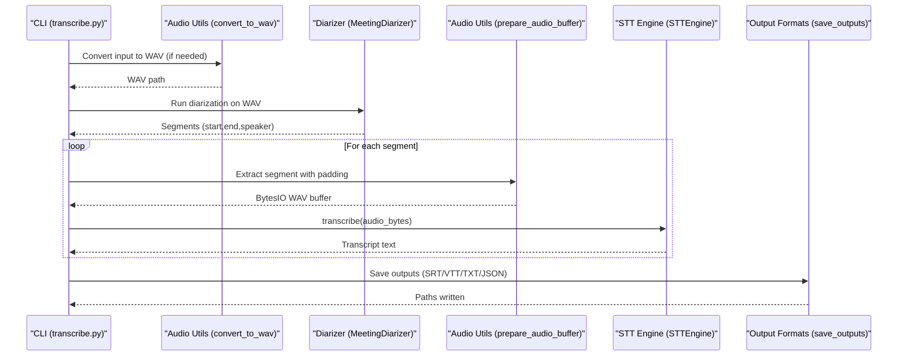

**Diagram sources**
- [transcribe.py:63-143](file://transcribe.py#L63-L143)
- [audio_utils.py:23-94](file://audio_utils.py#L23-L94)
- [diarizer.py:55-110](file://diarizer.py#L55-L110)
- [stt_engine.py:71-106](file://stt_engine.py#L71-L106)
- [output_formats.py:118-160](file://output_formats.py#L118-L160)

## Detailed Component Analysis

### Pipeline Orchestration (transcribe.py)
- Responsibilities:
  - Parse CLI arguments and select mode (in-process or server).
  - Execute the transcription pipeline: format conversion, diarization, segment processing, STT, and output generation.
  - Manage concurrency via asyncio semaphore for segment transcription.
- Design patterns:
  - Pipeline pattern: sequential stages orchestrated by a single entry point.
  - Factory-like creation of STT engine and server runner.
- Key behaviors:
  - Skips VAD in STT when using pre-segmented audio from diarizer.
  - Uses torchaudio for in-memory audio loading and soundfile for WAV writing.

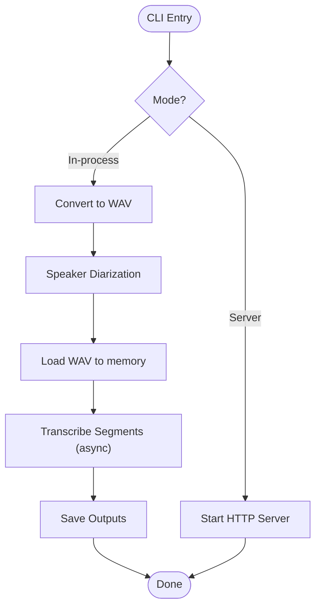

**Diagram sources**
- [transcribe.py:228-240](file://transcribe.py#L228-L240)
- [transcribe.py:45-144](file://transcribe.py#L45-L144)
- [server.py:169-197](file://server.py#L169-L197)

**Section sources**
- [transcribe.py:45-144](file://transcribe.py#L45-L144)
- [transcribe.py:151-166](file://transcribe.py#L151-L166)

### Audio Utilities (audio_utils.py)
- Responsibilities:
  - Convert any supported audio/video to 16 kHz mono WAV using ffmpeg.
  - Extract audio segments from a waveform tensor with optional padding and return an in-memory WAV buffer.
  - Provide in-memory decoding fallbacks using soundfile and torchaudio.
- Data structures:
  - Waveform tensors (channels, samples) and BytesIO buffers for audio data.
- Complexity:
  - Conversion is O(n) with respect to input frames.
  - Segment extraction is O(k) for segment length k.

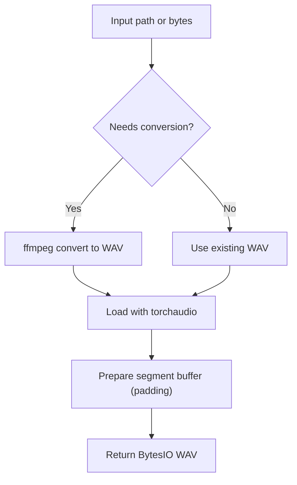

**Diagram sources**
- [audio_utils.py:23-94](file://audio_utils.py#L23-L94)

**Section sources**
- [audio_utils.py:23-94](file://audio_utils.py#L23-L94)

### Speaker Diarization (diarizer.py)
- Responsibilities:
  - Initialize PyAnnote pipeline with HF token and device.
  - Run diarization on an audio file and return speaker-labeled segments.
  - Merge adjacent segments from the same speaker within a configurable gap threshold.
- Data structures:
  - Segments represented as dictionaries with start, end, and speaker keys.
- Complexity:
  - Merging is O(n log n) due to sorting per speaker plus linear merge passes.

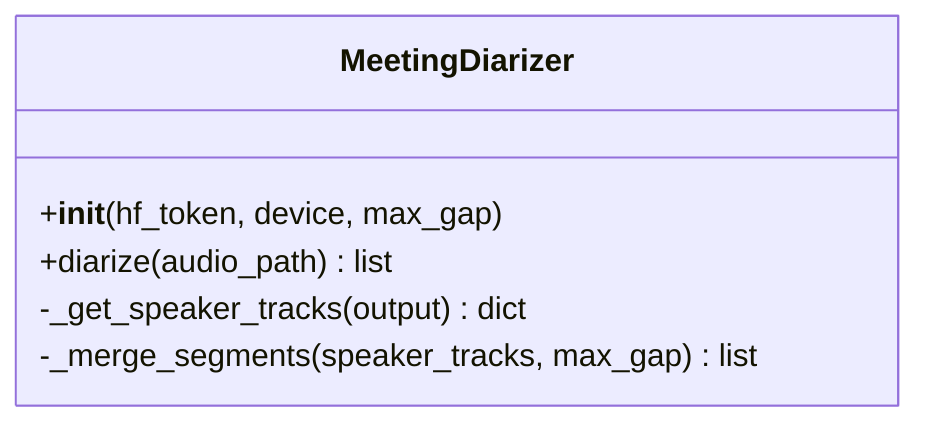

**Diagram sources**
- [diarizer.py:27-110](file://diarizer.py#L27-L110)

**Section sources**
- [diarizer.py:27-110](file://diarizer.py#L27-L110)

### Speech-to-Text Engine (stt_engine.py)
- Responsibilities:
  - Wrap FunASR AutoModel to perform in-process transcription.
  - Decode audio bytes to 16 kHz mono float arrays using torchaudio or ffmpeg fallback.
  - Apply post-processing and Traditional to Simplified Chinese conversion.
  - Support disabling internal VAD when pre-segmented audio is provided.
- Data structures:
  - Audio input variants: file path, bytes, or numpy array.
  - Model parameters dictionary controlling language, ITN, and VAD merging.
- Complexity:
  - Decoding is O(n) with respect to input frames.
  - Model generation depends on model internals.

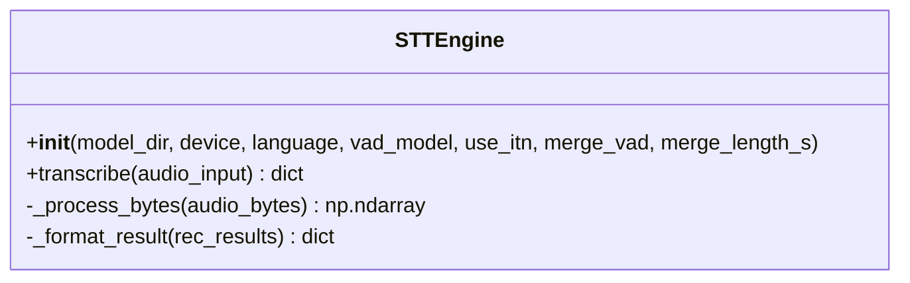

**Diagram sources**
- [stt_engine.py:24-185](file://stt_engine.py#L24-L185)

**Section sources**
- [stt_engine.py:24-185](file://stt_engine.py#L24-L185)

### Output Formats (output_formats.py)
- Responsibilities:
  - Generate SRT, VTT, TXT, and JSON outputs from segment lists.
  - Persist outputs to disk and return written paths.
- Data structures:
  - Segment dictionaries with start, end, speaker, and text fields.
  - Format map mapping format identifiers to generator functions and extensions.

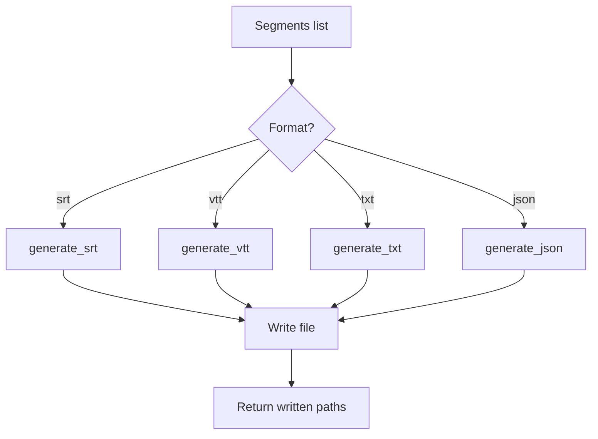

**Diagram sources**
- [output_formats.py:118-160](file://output_formats.py#L118-L160)

**Section sources**
- [output_formats.py:118-160](file://output_formats.py#L118-L160)

### Server Adapter (server.py)
- Responsibilities:
  - Create a FastAPI app bound to an STTEngine instance.
  - Provide legacy and OpenAI Whisper-compatible endpoints for audio transcription.
  - Format responses according to requested format (text/json/verbose_json/srt/vtt).
- Design patterns:
  - Factory pattern: create_app builds the FastAPI app with injected engine.
- Scalability:
  - Concurrency handled by FastAPI/uvicorn; worker count configured by runtime.

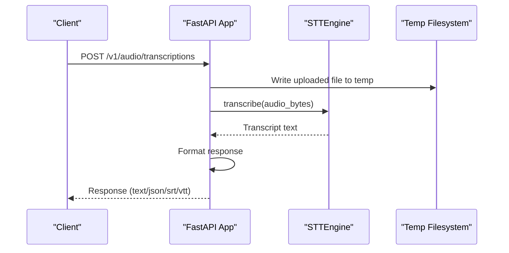

**Diagram sources**
- [server.py:92-161](file://server.py#L92-L161)
- [server.py:169-197](file://server.py#L169-L197)

**Section sources**
- [server.py:92-197](file://server.py#L92-L197)

### Model Definition and Alignment (model.py, utils/ctc_alignment.py)
- Responsibilities:
  - Define SenseVoice model components (encoders, attention, CTC) used by the STT engine.
  - Provide CTC forced alignment utilities for advanced alignment scenarios.
- Integration:
  - STT engine relies on FunASR’s AutoModel, which internally uses these components.

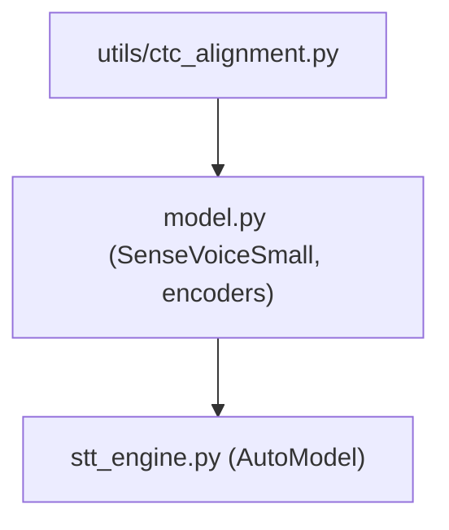

**Diagram sources**
- [model.py:437-800](file://model.py#L437-L800)
- [utils/ctc_alignment.py:1-77](file://utils/ctc_alignment.py#L1-L77)
- [stt_engine.py:27-55](file://stt_engine.py#L27-L55)

**Section sources**
- [model.py:437-800](file://model.py#L437-L800)
- [utils/ctc_alignment.py:1-77](file://utils/ctc_alignment.py#L1-L77)

## Dependency Analysis
External dependencies and their roles:
- FastAPI/uvicorn: HTTP server framework and ASGI server
- PyAnnote.audio: Speaker diarization pipeline
- FunASR/ModelScope: SenseVoice speech recognition
- torchaudio/soundfile: Audio I/O and resampling
- ffmpeg-python: Audio format conversion
- python-dotenv: Environment configuration
- opencc-python-reimplemented: Traditional to Simplified Chinese conversion

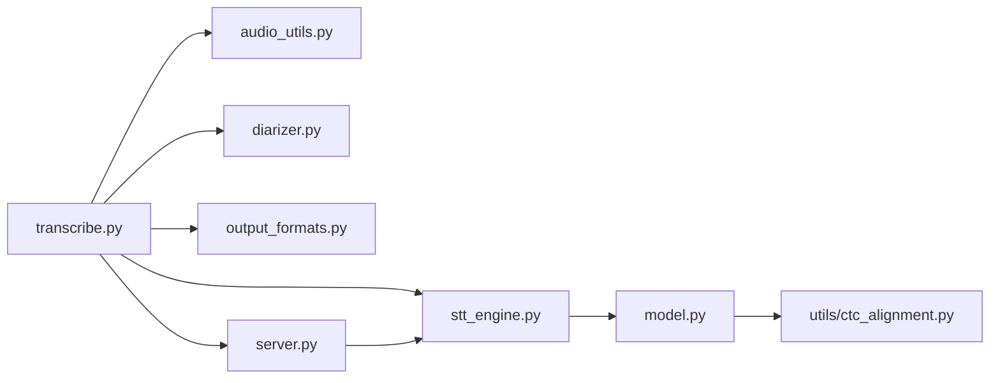

**Diagram sources**
- [pyproject.toml:7-23](file://pyproject.toml#L7-L23)
- [transcribe.py:49-52](file://transcribe.py#L49-L52)
- [server.py](file://server.py#L21)

**Section sources**
- [pyproject.toml:7-23](file://pyproject.toml#L7-L23)

## Performance Considerations
- Concurrency:
  - In-process mode uses an asyncio semaphore to limit concurrent segment transcription. The default worker count is low to avoid GPU/CPU saturation during model inference.
- Audio I/O:
  - Prefer torchaudio for in-memory decoding; ffmpeg fallback ensures compatibility when torchaudio fails.
- Memory usage:
  - Entire audio is loaded into memory for segment extraction. Large files increase memory footprint.
- Device selection:
  - Device choice (cpu/mps/cuda) affects throughput and latency. MPS is preferred on Apple Silicon; CUDA on NVIDIA GPUs.
- VAD behavior:
  - When using pre-segmented audio from diarizer, VAD is disabled in STT to prevent double segmentation artifacts.

[No sources needed since this section provides general guidance]

## Troubleshooting Guide
- torchcodec version mismatch:
  - Symptom: NameError related to AudioDecoder.
  - Resolution: Ensure torchcodec version satisfies the requirement for compatibility with torch.
- PyAnnote model access:
  - Symptom: Access denied to diarization model.
  - Resolution: Agree to terms on HuggingFace and set HF_TOKEN in environment.
- FFmpeg availability:
  - Symptom: Conversion failures or missing executables.
  - Resolution: Install FFmpeg 4–8 and ensure it is on PATH.

**Section sources**
- [README.md:177-203](file://README.md#L177-L203)

## Conclusion
The Meeting Transcriber system is designed as a modular, sequential pipeline with clear boundaries between audio processing, speaker diarization, and speech recognition. It supports both in-process and server modes, enabling flexible deployment. The architecture leverages well-defined components and a factory-style server adapter, while maintaining simplicity and reliability through explicit data flows and robust fallbacks.

[No sources needed since this section summarizes without analyzing specific files]

## Appendices

### System Context and Deployment Topology
- In-process mode:
  - Single process handles conversion, diarization, transcription, and output generation.
  - Suitable for local execution and batch processing.
- Server mode:
  - HTTP server exposes OpenAI Whisper-compatible endpoints for external clients.
  - Can be deployed behind reverse proxies and scaled horizontally with multiple workers.

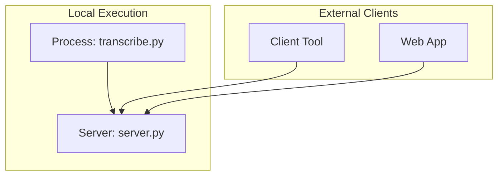

[No sources needed since this diagram shows conceptual workflow, not actual code structure]

### Infrastructure Requirements
- Python 3.11+ and uv for dependency management
- FFmpeg 4–8 for audio conversion
- HuggingFace token for PyAnnote model access
- SenseVoice model (local path or remote download via FunASR)
- Optional GPU acceleration (CUDA/MPS) for improved performance

**Section sources**
- [README.md:14-20](file://README.md#L14-L20)
- [pyproject.toml:1-24](file://pyproject.toml#L1-L24)

### CLI and Server Parameters
- Common parameters:
  - device: cpu, mps, cuda
  - model_dir: SenseVoice model directory
- In-process mode:
  - input: audio/video file path
  - language: auto, zh, en, yue, ja, ko
  - format: comma-separated list of outputs
  - max_workers: concurrency limit
  - padding: segment padding seconds
  - max_gap: merge gap for same-speaker segments
- Server mode:
  - host/port: listening address and port
  - vad_model/use_itn/merge_vad/merge_length_s: STT engine tuning

**Section sources**
- [README.md:90-122](file://README.md#L90-L122)
- [transcribe.py:173-221](file://transcribe.py#L173-L221)
- [server.py:169-197](file://server.py#L169-L197)