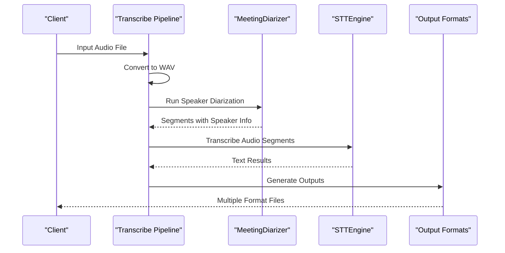
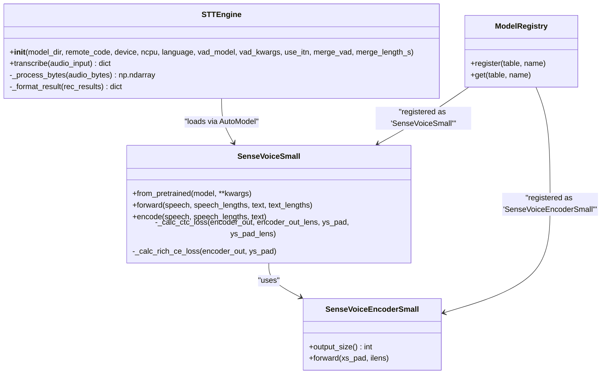
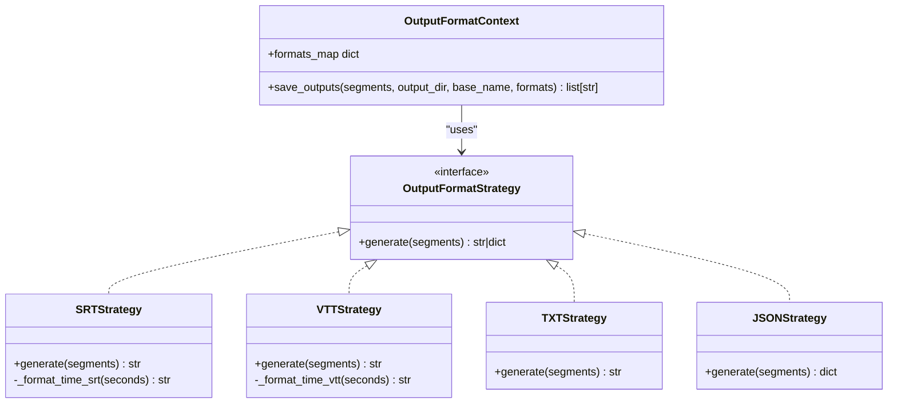
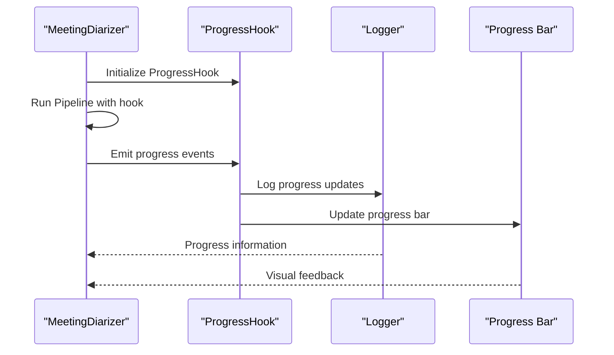
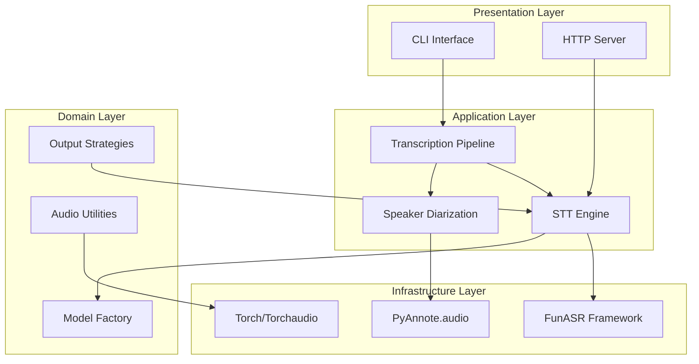

# Design Patterns

<cite>
**Referenced Files in This Document**
- [stt_engine.py](file://stt_engine.py)
- [model.py](file://model.py)
- [output_formats.py](file://output_formats.py)
- [transcribe.py](file://transcribe.py)
- [server.py](file://server.py)
- [diarizer.py](file://diarizer.py)
- [audio_utils.py](file://audio_utils.py)
- [utils/ctc_alignment.py](file://utils/ctc_alignment.py)
- [README.md](file://README.md)
- [pyproject.toml](file://pyproject.toml)
</cite>

## Table of Contents
1. [Introduction](#introduction)
2. [Pipeline Pattern](#pipeline-pattern)
3. [Factory Pattern](#factory-pattern)
4. [Strategy Pattern](#strategy-pattern)
5. [Observer Pattern](#observer-pattern)
6. [Pattern Implementation Analysis](#pattern-implementation-analysis)
7. [Extension Points and Best Practices](#extension-points-and-best-practices)
8. [Architecture Overview](#architecture-overview)
9. [Conclusion](#conclusion)

## Introduction

The Meeting Transcriber system implements several key design patterns to achieve maintainability, extensibility, and clean separation of concerns. The system follows a modular architecture where each component has a specific responsibility, enabling easy modification and extension without affecting other parts of the system.

The primary design patterns implemented are:
- **Pipeline Pattern**: For sequential processing of audio through multiple stages
- **Factory Pattern**: For dynamic model loading and creation
- **Strategy Pattern**: For pluggable output format generation
- **Observer Pattern**: For progress tracking during long-running operations

These patterns work together to create a robust, extensible transcription system that can handle various audio processing workflows while maintaining clean code organization and clear interfaces.

## Pipeline Pattern

The Pipeline Pattern is implemented throughout the transcription workflow, where audio data flows through a series of processing stages in a defined sequence. This pattern ensures that each stage focuses on a specific aspect of audio processing while maintaining clear boundaries between components.

### Pipeline Architecture

**Diagram sources**
- [transcribe.py:45-144](file://transcribe.py#L45-L144)
- [diarizer.py:55-70](file://diarizer.py#L55-L70)
- [stt_engine.py:71-105](file://stt_engine.py#L71-L105)
- [output_formats.py:118-159](file://output_formats.py#L118-L159)

### Pipeline Implementation Details

The pipeline consists of five distinct stages:

1. **Audio Conversion**: Converts input audio/video files to 16kHz mono WAV format
2. **Speaker Diarization**: Detects speakers and segments audio into per-speaker turns
3. **Segment Merging**: Merges adjacent segments from the same speaker
4. **Transcription**: Processes each segment through the STT engine
5. **Output Generation**: Creates multiple output formats from transcription results

Each stage operates independently and passes data through well-defined interfaces, allowing for easy testing, debugging, and modification of individual components.

**Section sources**
- [transcribe.py:45-144](file://transcribe.py#L45-L144)
- [audio_utils.py:23-51](file://audio_utils.py#L23-L51)
- [diarizer.py:55-110](file://diarizer.py#L55-L110)

## Factory Pattern

The Factory Pattern is implemented through the model registration system and dynamic model loading mechanism. This pattern enables the system to create instances of different model types without hard-coding specific class references, promoting flexibility and extensibility.

### Model Factory Implementation

**Diagram sources**
- [model.py:580-780](file://model.py#L580-L780)
- [model.py:437-578](file://model.py#L437-L578)
- [stt_engine.py:27-65](file://stt_engine.py#L27-L65)

### Dynamic Model Loading

The system uses a registration-based factory pattern through the FunASR framework:

- **Model Registration**: Models are registered using decorators (`@tables.register`)
- **Dynamic Loading**: Models are loaded dynamically via `AutoModel.build_model()`
- **Type Safety**: The factory maintains type safety through the registration system
- **Extensibility**: New model types can be added without modifying existing code

The factory pattern enables:
- Runtime model selection based on configuration
- Support for multiple model architectures
- Easy addition of new model types
- Clean separation between model definition and instantiation

**Section sources**
- [model.py:580-780](file://model.py#L580-L780)
- [model.py:437-578](file://model.py#L437-L578)
- [stt_engine.py:43-55](file://stt_engine.py#L43-L55)

## Strategy Pattern

The Strategy Pattern is implemented for output format generation, allowing the system to support multiple output formats without modifying the core transcription logic. Each format has its own strategy class with a common interface.

### Output Format Strategy Implementation

**Diagram sources**
- [output_formats.py:43-103](file://output_formats.py#L43-L103)
- [output_formats.py:118-159](file://output_formats.py#L118-L159)

### Strategy Implementation Details

The strategy pattern is implemented through:

1. **Format Generators**: Individual functions for each output format
2. **Format Registry**: A mapping of format names to generator functions
3. **Context Class**: The main interface that orchestrates format generation
4. **Consistent Interface**: All strategies accept the same input format

Supported formats include:
- **SRT**: SubRip subtitle format with speaker information
- **VTT**: Web Video Text Tracks format
- **TXT**: Plain text with timestamps and speaker labels
- **JSON**: Structured JSON with segment metadata

The strategy pattern enables:
- Easy addition of new output formats
- Independent testing of each format generator
- Flexible format selection at runtime
- Clear separation of format-specific logic

**Section sources**
- [output_formats.py:43-103](file://output_formats.py#L43-L103)
- [output_formats.py:110-159](file://output_formats.py#L110-L159)

## Observer Pattern

The Observer Pattern is implemented for progress tracking during long-running operations, particularly speaker diarization. This pattern allows components to observe and react to state changes without creating tight coupling between observers and subjects.

### Progress Tracking Implementation

**Diagram sources**
- [diarizer.py:63-64](file://diarizer.py#L63-L64)

### Observer Implementation Details

The observer pattern is implemented through:

1. **ProgressHook**: A context manager that tracks pipeline progress
2. **Event Emission**: Automatic progress notifications during processing
3. **Multiple Observers**: Both logging and UI progress tracking
4. **Non-blocking**: Observers don't interfere with the main processing flow

The pattern provides:
- Real-time progress monitoring
- Decoupled progress reporting
- Support for multiple observation mechanisms
- Non-intrusive progress tracking

**Section sources**
- [diarizer.py:27-70](file://diarizer.py#L27-L70)

## Pattern Implementation Analysis

### Pattern Consistency

The system demonstrates excellent pattern consistency across all major components:

| Pattern | Implementation Location | Benefits Achieved |
|---------|------------------------|-------------------|
| Pipeline | `transcribe.py` | Clear processing stages, easy debugging |
| Factory | `model.py`, `stt_engine.py` | Dynamic model loading, extensible architecture |
| Strategy | `output_formats.py` | Pluggable output formats, independent testing |
| Observer | `diarizer.py` | Progress monitoring, non-intrusive |

### Design Benefits

1. **Maintainability**: Each pattern encapsulates specific concerns
2. **Extensibility**: New components can be added without modifying existing code
3. **Testability**: Clear interfaces enable isolated testing
4. **Flexibility**: Runtime configuration and dynamic loading capabilities

### Code Quality Indicators

- **Single Responsibility**: Each component has a focused purpose
- **Interface Abstraction**: Well-defined contracts between components
- **Dependency Injection**: Loose coupling through parameters and configuration
- **Error Handling**: Comprehensive error handling at each processing stage

**Section sources**
- [stt_engine.py:24-105](file://stt_engine.py#L24-L105)
- [output_formats.py:110-159](file://output_formats.py#L110-L159)
- [diarizer.py:27-70](file://diarizer.py#L27-L70)

## Extension Points and Best Practices

### Adding New Output Formats

To add a new output format following the Strategy Pattern:

1. **Create a Generator Function**: Implement a function that accepts segments and returns formatted content
2. **Add to Registry**: Register the format in `_FORMAT_MAP` with appropriate file extension
3. **Handle Special Cases**: Implement format-specific file writing logic if needed
4. **Testing**: Add unit tests for the new format generator

Example extension point:
- [output_formats.py:110-115](file://output_formats.py#L110-L115)

### Extending the Pipeline

To add new processing stages to the Pipeline Pattern:

1. **Define Stage Interface**: Create a function that accepts previous stage output
2. **Implement Processing Logic**: Add the new processing functionality
3. **Integrate into Pipeline**: Add the stage to the main processing sequence
4. **Error Handling**: Ensure proper error handling and logging

Example integration point:
- [transcribe.py:45-144](file://transcribe.py#L45-L144)

### Factory Pattern Extensions

To add new model types following the Factory Pattern:

1. **Create Model Class**: Implement the new model with proper interface
2. **Add Registration**: Use `@tables.register` decorator for model registration
3. **Update Configuration**: Add model configuration options
4. **Testing**: Verify model loading and functionality

Example registration point:
- [model.py:580](file://model.py#L580)
- [model.py:437](file://model.py#L437)

### Observer Pattern Extensions

To add new progress monitoring mechanisms:

1. **Create Observer Class**: Implement an observer that handles progress events
2. **Register Observer**: Add the observer to the progress tracking system
3. **Define Notification Interface**: Specify what events should trigger notifications
4. **Error Handling**: Ensure observers don't interfere with main processing

Example observer implementation:
- [diarizer.py:63-64](file://diarizer.py#L63-L64)

### Best Practices for Pattern Consistency

1. **Interface Contracts**: Maintain consistent function signatures across pattern implementations
2. **Error Propagation**: Ensure errors are properly handled and propagated through the system
3. **Logging**: Implement comprehensive logging for all pattern operations
4. **Configuration Management**: Use configuration objects for pattern parameters
5. **Testing Strategy**: Implement unit tests for each pattern component

## Architecture Overview

The Meeting Transcriber system follows a layered architecture with clear separation of concerns:

**Diagram sources**
- [transcribe.py:45-144](file://transcribe.py#L45-L144)
- [server.py:169-196](file://server.py#L169-L196)
- [diarizer.py:43-53](file://diarizer.py#L43-L53)
- [stt_engine.py:43-55](file://stt_engine.py#L43-L55)

### Component Interactions

The system demonstrates excellent component interaction patterns:

1. **Pipeline Flow**: Data flows sequentially through processing stages
2. **Factory Creation**: Components are created dynamically based on configuration
3. **Strategy Selection**: Output formats are selected at runtime
4. **Observer Notifications**: Progress is tracked without interfering with processing

### Design Principles

The system adheres to several key design principles:

- **Separation of Concerns**: Each component has a specific responsibility
- **Open/Closed Principle**: Systems are open for extension but closed for modification
- **Dependency Inversion**: High-level modules don't depend on low-level modules
- **Single Responsibility**: Each class has one reason to change

**Section sources**
- [README.md:134-173](file://README.md#L134-L173)
- [pyproject.toml:7-23](file://pyproject.toml#L7-L23)

## Conclusion

The Meeting Transcriber system successfully implements four key design patterns that work together to create a maintainable, extensible, and robust transcription platform. Each pattern serves a specific purpose and contributes to the overall system architecture:

- **Pipeline Pattern** provides clear sequential processing with well-defined boundaries
- **Factory Pattern** enables dynamic model loading and creation without hard-coded dependencies  
- **Strategy Pattern** offers flexible output format generation through pluggable components
- **Observer Pattern** provides non-intrusive progress tracking for long-running operations

The implementation demonstrates excellent adherence to object-oriented design principles and provides clear extension points for future enhancements. The system's modular architecture ensures that new features can be added with minimal impact on existing functionality, while maintaining clean interfaces and comprehensive error handling.

The design patterns chosen align perfectly with the system's requirements for handling complex audio processing workflows, supporting multiple output formats, and providing both command-line and HTTP server interfaces. This architectural foundation positions the system well for future growth and feature expansion.