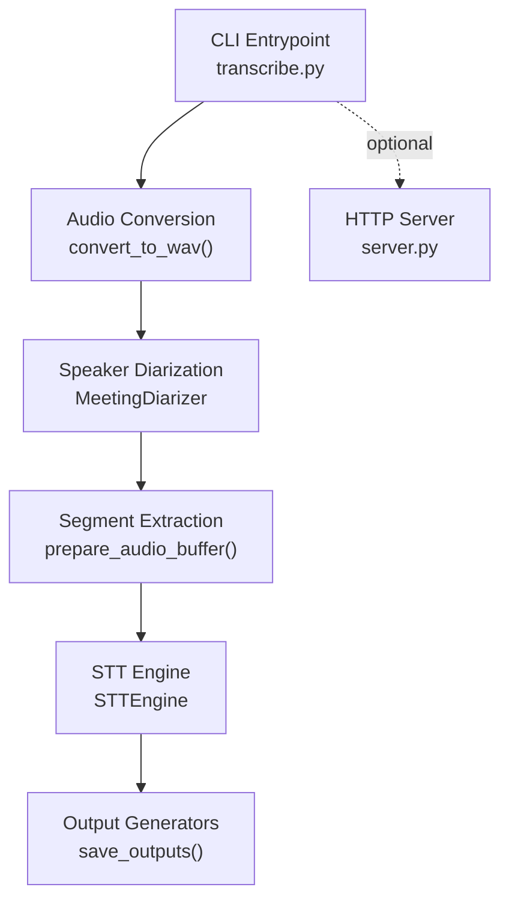
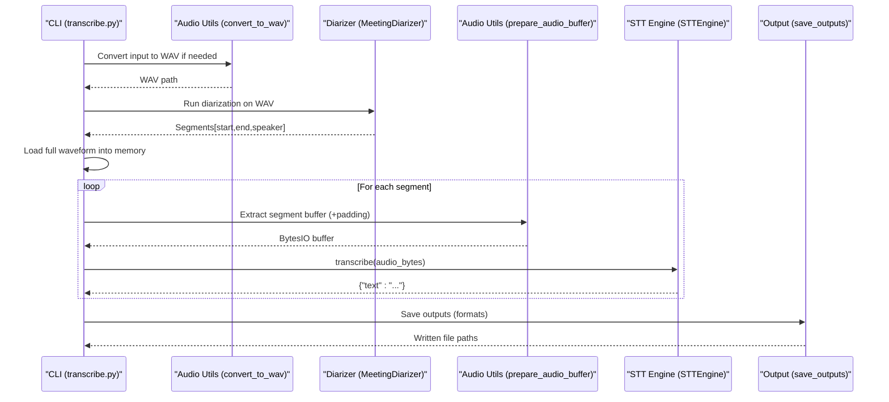
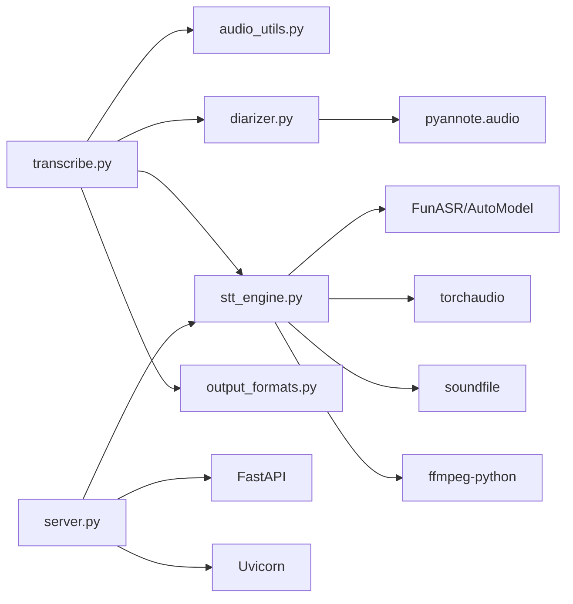

# Pipeline Architecture

<cite>
**Referenced Files in This Document**
- [README.md](file://README.md)
- [transcribe.py](file://transcribe.py)
- [stt_engine.py](file://stt_engine.py)
- [diarizer.py](file://diarizer.py)
- [audio_utils.py](file://audio_utils.py)
- [output_formats.py](file://output_formats.py)
- [server.py](file://server.py)
- [model.py](file://model.py)
- [utils/ctc_alignment.py](file://utils/ctc_alignment.py)
- [run.sh](file://run.sh)
- [pyproject.toml](file://pyproject.toml)
</cite>

## Table of Contents
1. [Introduction](#introduction)
2. [Project Structure](#project-structure)
3. [Core Components](#core-components)
4. [Architecture Overview](#architecture-overview)
5. [Detailed Component Analysis](#detailed-component-analysis)
6. [Dependency Analysis](#dependency-analysis)
7. [Performance Considerations](#performance-considerations)
8. [Troubleshooting Guide](#troubleshooting-guide)
9. [Conclusion](#conclusion)
10. [Appendices](#appendices)

## Introduction
This document explains the end-to-end transcription pipeline architecture used to convert audio/video inputs into synchronized, speaker-tagged transcripts. It covers the sequential stages from audio format conversion, speaker diarization, segment processing, and output generation. It also documents the pipeline’s asynchronous execution model using asyncio, worker thread management, integration patterns (dependency injection, shared state), and robust error handling strategies. Practical configuration examples, performance optimization techniques, and troubleshooting guidance are included to help operators deploy and tune the pipeline effectively.

## Project Structure
The project is organized around a clear separation of concerns:
- CLI entry point orchestrating the pipeline
- Audio utilities for format conversion and segment extraction
- Diarizer for speaker segmentation
- STT engine for in-process transcription
- Output formatters for SRT, VTT, TXT, and JSON
- HTTP server for OpenAI Whisper-compatible API
- Model code for SenseVoice integration
- Utility modules for alignment and configuration

**Diagram sources**
- [transcribe.py:45-144](file://transcribe.py#L45-L144)
- [audio_utils.py:23-51](file://audio_utils.py#L23-L51)
- [diarizer.py:55-70](file://diarizer.py#L55-L70)
- [audio_utils.py:53-94](file://audio_utils.py#L53-L94)
- [stt_engine.py:71-106](file://stt_engine.py#L71-L106)
- [output_formats.py:118-160](file://output_formats.py#L118-L160)
- [server.py:169-197](file://server.py#L169-L197)

**Section sources**
- [README.md:134-149](file://README.md#L134-L149)
- [pyproject.toml:1-24](file://pyproject.toml#L1-L24)

## Core Components
- CLI orchestration and pipeline control
- Audio conversion and segment preparation
- Speaker diarization and segment merging
- In-process STT engine with fallback decoding
- Output generation for multiple formats
- HTTP server with OpenAI-compatible endpoints

Key responsibilities:
- transcribe.py: Parses CLI, runs pipeline stages, manages concurrency, and writes outputs
- audio_utils.py: Converts audio/video to WAV and extracts per-segment buffers
- diarizer.py: Loads PyAnnote pipeline, runs diarization, merges adjacent segments
- stt_engine.py: Initializes SenseVoice via FunASR, decodes audio bytes, performs transcription, and formats results
- output_formats.py: Generates SRT/VTT/TXT/JSON outputs and persists to disk
- server.py: Exposes HTTP endpoints compatible with OpenAI Whisper API

**Section sources**
- [transcribe.py:45-144](file://transcribe.py#L45-L144)
- [audio_utils.py:23-120](file://audio_utils.py#L23-L120)
- [diarizer.py:27-110](file://diarizer.py#L27-L110)
- [stt_engine.py:24-185](file://stt_engine.py#L24-L185)
- [output_formats.py:15-160](file://output_formats.py#L15-L160)
- [server.py:92-197](file://server.py#L92-L197)

## Architecture Overview
The pipeline follows a strict sequential flow with asynchronous concurrency for independent segment transcription. The diagram below maps the actual code components and their interactions.

**Diagram sources**
- [transcribe.py:63-144](file://transcribe.py#L63-L144)
- [audio_utils.py:23-94](file://audio_utils.py#L23-L94)
- [diarizer.py:55-70](file://diarizer.py#L55-L70)
- [stt_engine.py:71-106](file://stt_engine.py#L71-L106)
- [output_formats.py:118-160](file://output_formats.py#L118-L160)

## Detailed Component Analysis

### CLI Orchestration and Asynchronous Execution
- Entry point parses arguments and selects mode (in-process transcription vs. HTTP server)
- In-process mode:
  - Validates input file
  - Converts to WAV if needed
  - Runs diarization to obtain speaker segments
  - Loads full waveform into memory
  - Uses asyncio semaphore to cap concurrent segment transcription
  - Processes segments asynchronously with progress reporting
  - Sorts and saves outputs in requested formats

Concurrency model:
- A semaphore limits max_workers to control GPU/CPU resource usage
- Each segment transcription runs in a separate coroutine
- Results are collected as they complete and later sorted by start time

Integration patterns:
- Dependency injection: STTEngine is constructed with device, language, and VAD parameters
- Shared state: waveform and sample_rate are shared across segment processing
- Error handling: missing input, conversion errors, and transcription exceptions are handled gracefully

**Section sources**
- [transcribe.py:45-144](file://transcribe.py#L45-L144)
- [transcribe.py:173-221](file://transcribe.py#L173-L221)

### Audio Conversion and Segment Preparation
- convert_to_wav: Uses FFmpeg to convert any supported audio/video to 16 kHz mono WAV
- prepare_audio_buffer: Extracts a segment from a loaded waveform, applies optional padding, and writes to an in-memory WAV buffer using soundfile

Worker thread management:
- Segment extraction and audio decoding are executed in separate threads via asyncio.to_thread to avoid blocking the event loop

Error handling:
- FFmpeg conversion failures are logged and re-raised
- Buffer extraction errors return None to signal downstream to mark segment as “[Audio Error]”

**Section sources**
- [audio_utils.py:23-51](file://audio_utils.py#L23-L51)
- [audio_utils.py:53-94](file://audio_utils.py#L53-L94)

### Speaker Diarization and Segment Merging
- MeetingDiarizer loads the PyAnnote speaker-diarization pipeline, sets device, and runs diarization on the input WAV
- Segments are grouped by speaker and merged when inter-segment gaps are less than or equal to max_gap
- Output is a sorted list of segments with start, end, and speaker keys

Safety note:
- The pipeline disables SenseVoice’s internal VAD because PyAnnote already segmented the audio to prevent double-segmentation artifacts

**Section sources**
- [diarizer.py:27-110](file://diarizer.py#L27-L110)
- [transcribe.py:84-94](file://transcribe.py#L84-L94)

### STT Engine and Audio Decoding
- STTEngine initializes FunASR AutoModel with configurable device, VAD, and post-processing options
- transcribe accepts:
  - File path (handled by FunASR)
  - Raw audio bytes (decoded in-memory)
  - Pre-processed 16 kHz mono float32 arrays
- Fallback decoding:
  - Attempts torchaudio-based decoding
  - Falls back to ffmpeg decoding if torchaudio fails
- Post-processing:
  - Rich transcription post-processing
  - Simplified to Traditional Chinese conversion

Error handling:
- Exceptions during transcription are caught and returned as structured error results

**Section sources**
- [stt_engine.py:24-185](file://stt_engine.py#L24-L185)

### Output Generation and Persistence
- Output generators:
  - SRT: Timestamps formatted as HH:MM:SS,mmm
  - VTT: Timestamps formatted as HH:MM:SS.mmm
  - TXT: Line-per-segment with bracketed timestamps and speaker tag
  - JSON: Structured segments list
- save_outputs:
  - Creates output directory
  - Writes each requested format to disk
  - Returns list of written file paths

**Section sources**
- [output_formats.py:15-160](file://output_formats.py#L15-L160)

### HTTP Server and OpenAI-Compatible API
- FastAPI endpoints:
  - POST /recognition: Legacy endpoint for audio uploads
  - POST /v1/audio/transcriptions: OpenAI Whisper-compatible
- Request handling:
  - Reads uploaded file, writes to temporary file, invokes STTEngine.transcribe
  - Formats response according to response_format (json, text, verbose_json, srt, vtt)
- Server startup:
  - Builds STTEngine with provided parameters and starts Uvicorn server

**Section sources**
- [server.py:92-197](file://server.py#L92-L197)

### Model Integration and Alignment Utilities
- model.py: Provides SenseVoice encoder and model classes used by FunASR
- utils/ctc_alignment.py: Implements forced CTC alignment for label sequences

These components support the STT engine’s internal processing and are registered with FunASR for model loading.

**Section sources**
- [model.py:437-800](file://model.py#L437-L800)
- [utils/ctc_alignment.py:1-77](file://utils/ctc_alignment.py#L1-L77)

## Dependency Analysis
The pipeline exhibits low coupling and high cohesion:
- transcribe.py depends on audio_utils, diarizer, stt_engine, and output_formats
- stt_engine depends on FunASR, torchaudio, soundfile, ffmpeg-python, and OpenCC
- diarizer depends on PyAnnote.audio and torch
- server.py depends on FastAPI, Uvicorn, and STTEngine
- audio_utils bridges torchaudio and soundfile with ffmpeg fallback

**Diagram sources**
- [transcribe.py:49-52](file://transcribe.py#L49-L52)
- [stt_engine.py:17-185](file://stt_engine.py#L17-L185)
- [diarizer.py:10-13](file://diarizer.py#L10-L13)
- [server.py:18-22](file://server.py#L18-L22)

**Section sources**
- [pyproject.toml:7-23](file://pyproject.toml#L7-L23)

## Performance Considerations
- Concurrency control:
  - Use max_workers to balance throughput and resource usage; default is conservative for in-process safety
- Segment padding:
  - Adjust padding to reduce edge effects while avoiding excessive silence
- Merge strategy:
  - Tune max_gap to merge short pauses without collapsing distinct speakers
- Device selection:
  - Prefer CUDA or MPS for GPU acceleration; CPU is suitable for small jobs
- Memory footprint:
  - Full waveform loading improves accuracy but increases RAM usage; consider streaming for very long files
- I/O and decoding:
  - Ensure FFmpeg availability and correct version; torchaudio fallback is available but slower
- Model initialization:
  - Reuse STTEngine across requests in server mode to avoid repeated warm-up costs

[No sources needed since this section provides general guidance]

## Troubleshooting Guide
Common issues and resolutions:
- FFmpeg conversion failures:
  - Verify FFmpeg installation and version compatibility; refer to project notes for supported versions
- PyAnnote model access:
  - Ensure HF_TOKEN is set and accepted on HuggingFace; otherwise, diarization will fail
- torchcodec version mismatch:
  - Align torchcodec with torch; see project notes for compatibility guidance
- Audio decoding errors:
  - The engine falls back to ffmpeg decoding; if both fail, segment may be marked as “[Audio Error]”
- Server startup and endpoints:
  - Confirm host/port settings and SSL parameters if used
- Output not generated:
  - Check output directory permissions and requested formats

**Section sources**
- [README.md:175-203](file://README.md#L175-L203)
- [audio_utils.py:44-50](file://audio_utils.py#L44-L50)
- [diarizer.py:36-40](file://diarizer.py#L36-L40)
- [stt_engine.py:111-128](file://stt_engine.py#L111-L128)
- [server.py:169-197](file://server.py#L169-L197)

## Conclusion
The pipeline integrates audio conversion, speaker diarization, and in-process transcription with robust error handling and flexible output formats. Its asynchronous design enables efficient segment-level concurrency while maintaining simplicity and reliability. Operators can tune parameters such as max_workers, padding, and max_gap to optimize for speed, accuracy, and resource usage. The HTTP server provides an OpenAI-compatible interface for external integrations.

[No sources needed since this section summarizes without analyzing specific files]

## Appendices

### Pipeline Flow Control and Worker Management
- Flow control:
  - Sequential stages: conversion → diarization → segment extraction → transcription → output
  - Sorting ensures chronological order regardless of completion timing
- Worker management:
  - asyncio.Semaphore controls concurrency
  - asyncio.to_thread offloads CPU-bound tasks (segment extraction and audio decoding)
  - Progress bar tracks completion of asynchronous tasks

**Section sources**
- [transcribe.py:96-124](file://transcribe.py#L96-L124)
- [audio_utils.py:101-119](file://audio_utils.py#L101-L119)

### Practical Configuration Examples
- Basic transcription:
  - Use CLI to specify input, device, language, and output formats
- Server mode:
  - Start HTTP server with host, port, and model parameters
- Advanced tuning:
  - Increase max_workers cautiously
  - Adjust padding and max_gap for speaker continuity
  - Choose device based on hardware availability

**Section sources**
- [README.md:40-89](file://README.md#L40-L89)
- [transcribe.py:173-221](file://transcribe.py#L173-L221)
- [server.py:169-197](file://server.py#L169-L197)

### Integration Patterns and Best Practices
- Dependency injection:
  - STTEngine is constructed with explicit parameters from CLI
- Shared state:
  - Full waveform and sample_rate are shared across segments
- Error handling:
  - Failures in conversion, segment extraction, or transcription are logged and surfaced as placeholder text
- Logging:
  - Centralized logging configuration for consistent diagnostics

**Section sources**
- [transcribe.py:32-37](file://transcribe.py#L32-L37)
- [transcribe.py:84-94](file://transcribe.py#L84-L94)
- [stt_engine.py:84-105](file://stt_engine.py#L84-L105)