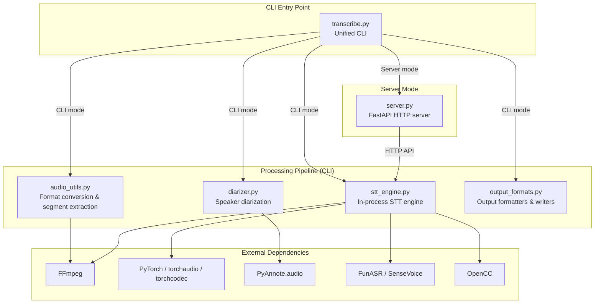
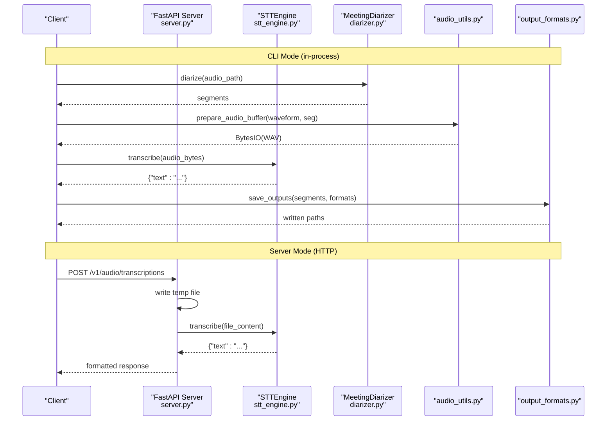
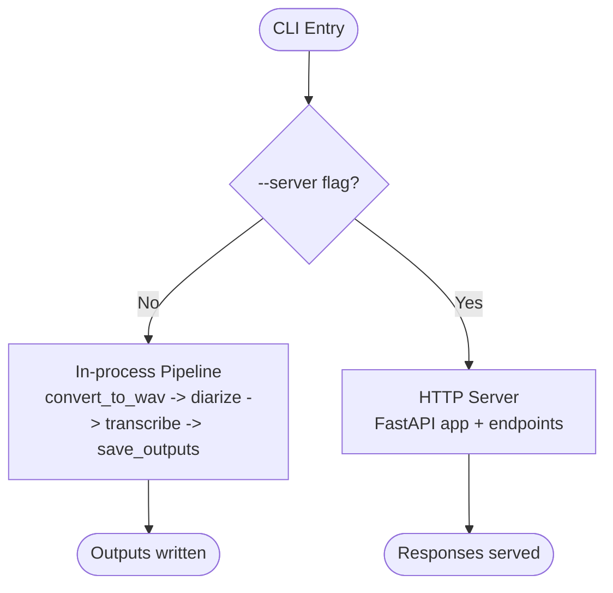
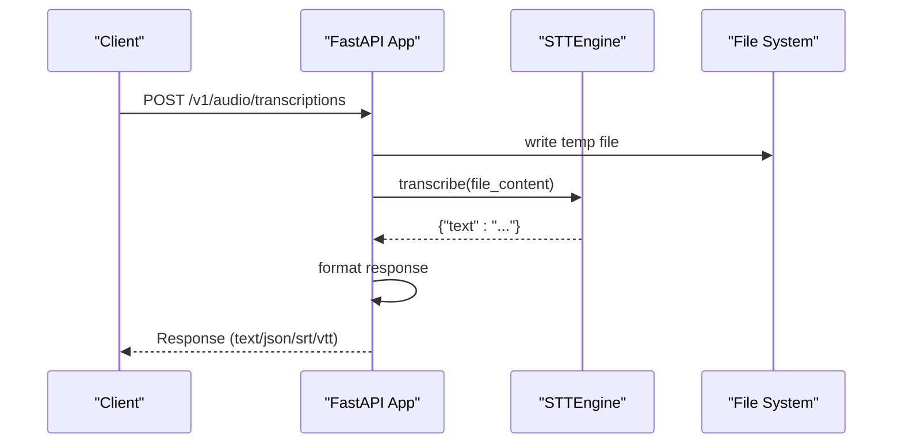
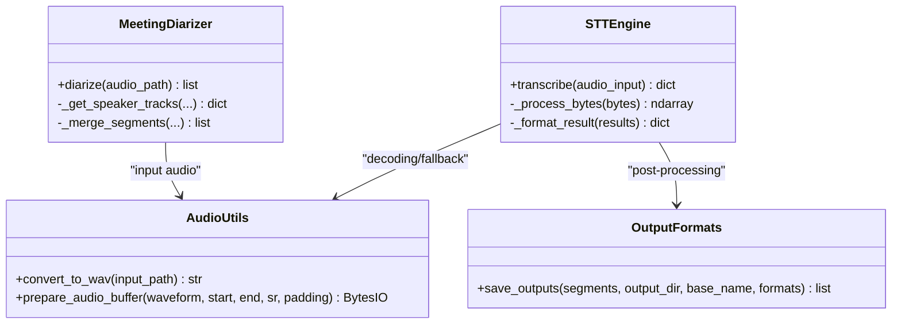
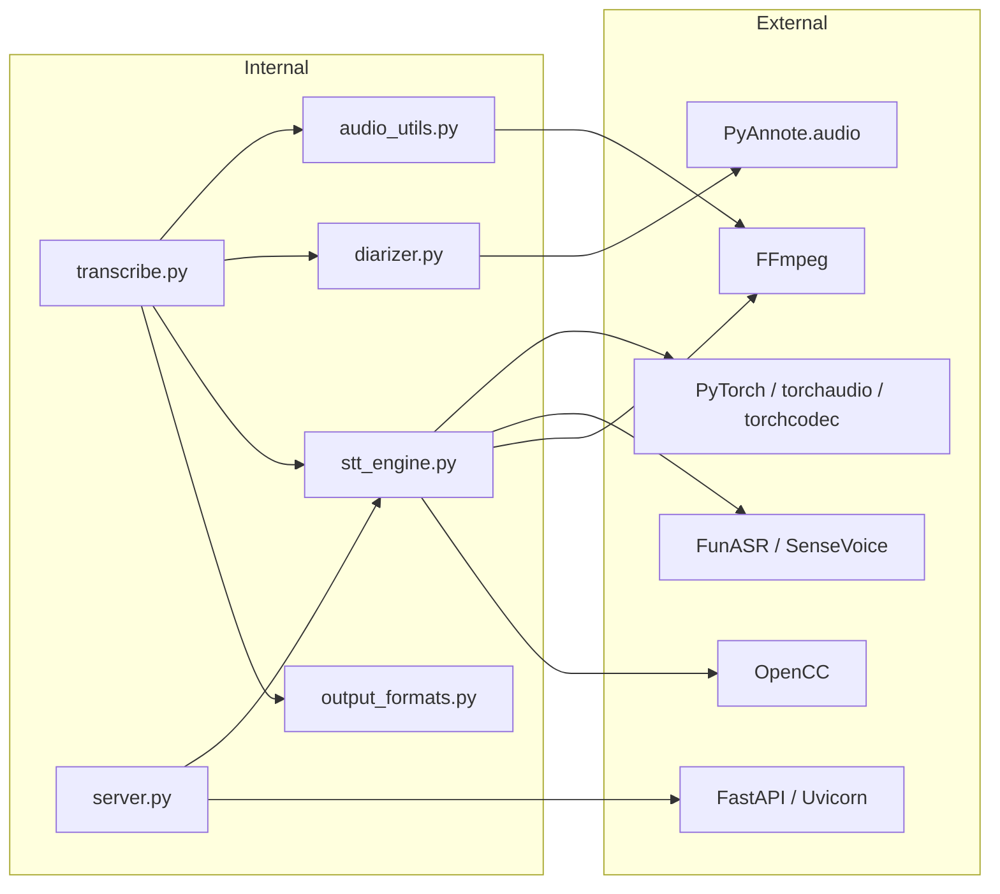
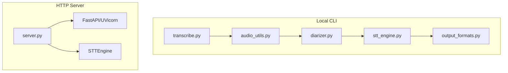
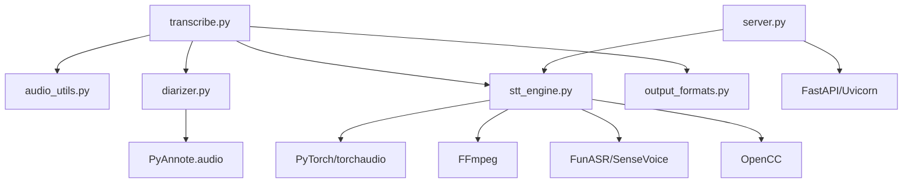

# System Boundaries

<cite>
**Referenced Files in This Document**
- [README.md](file://README.md)
- [transcribe.py](file://transcribe.py)
- [server.py](file://server.py)
- [stt_engine.py](file://stt_engine.py)
- [diarizer.py](file://diarizer.py)
- [audio_utils.py](file://audio_utils.py)
- [output_formats.py](file://output_formats.py)
- [model.py](file://model.py)
- [utils/ctc_alignment.py](file://utils/ctc_alignment.py)
- [run.sh](file://run.sh)
- [pyproject.toml](file://pyproject.toml)
</cite>

## Table of Contents
1. [Introduction](#introduction)
2. [Project Structure](#project-structure)
3. [Core Components](#core-components)
4. [Architecture Overview](#architecture-overview)
5. [Detailed Component Analysis](#detailed-component-analysis)
6. [Dependency Analysis](#dependency-analysis)
7. [Performance Considerations](#performance-considerations)
8. [Troubleshooting Guide](#troubleshooting-guide)
9. [Conclusion](#conclusion)

## Introduction
This document describes the system boundaries and integration points of the meeting transcription system. It explains the separation between CLI mode and server mode, documents the HTTP API boundary and request/response handling, and details the service abstraction layers. It also outlines external dependency boundaries for FFmpeg integration, PyTorch model loading, and third-party library interfaces. Finally, it covers deployment topology considerations, scalability boundaries, and performance constraints that define system limits.

## Project Structure
The system is organized around a unified CLI entry point that supports two operational modes:
- In-process transcription mode (CLI default): runs the full pipeline locally without an HTTP server.
- HTTP server mode (--server): exposes an OpenAI Whisper API-compatible endpoint for external clients.

**Diagram sources**
- [transcribe.py:1-240](file://transcribe.py#L1-L240)
- [server.py:1-197](file://server.py#L1-L197)
- [stt_engine.py:1-185](file://stt_engine.py#L1-L185)
- [diarizer.py:1-110](file://diarizer.py#L1-L110)
- [audio_utils.py:1-120](file://audio_utils.py#L1-L120)
- [output_formats.py:1-160](file://output_formats.py#L1-L160)

**Section sources**
- [README.md:134-173](file://README.md#L134-L173)
- [transcribe.py:173-240](file://transcribe.py#L173-L240)

## Core Components
- Unified CLI entry point: parses arguments, selects mode, and orchestrates either the in-process pipeline or starts the HTTP server.
- In-process STT engine: wraps FunASR’s AutoModel, handles audio decoding/resampling, and applies post-processing.
- Speaker diarizer: PyAnnote-based pipeline for detecting speakers and merging adjacent segments.
- Audio utilities: FFmpeg-based conversion to 16 kHz mono WAV and in-memory segment extraction.
- Output formatters: SRT/VTT/TXT/JSON generators and persistence.
- HTTP server: FastAPI endpoints compatible with OpenAI Whisper API for transcription requests.

**Section sources**
- [transcribe.py:45-144](file://transcribe.py#L45-L144)
- [stt_engine.py:24-106](file://stt_engine.py#L24-L106)
- [diarizer.py:27-71](file://diarizer.py#L27-L71)
- [audio_utils.py:23-94](file://audio_utils.py#L23-L94)
- [output_formats.py:43-160](file://output_formats.py#L43-L160)
- [server.py:92-161](file://server.py#L92-L161)

## Architecture Overview
The system maintains two distinct operational modes to serve different use cases:
- CLI mode: end-to-end processing in a single process with local file I/O and output generation.
- Server mode: HTTP API that accepts uploaded audio, delegates to the STT engine, and returns formatted results.

**Diagram sources**
- [transcribe.py:45-144](file://transcribe.py#L45-L144)
- [server.py:121-161](file://server.py#L121-L161)
- [stt_engine.py:71-106](file://stt_engine.py#L71-L106)
- [diarizer.py:55-71](file://diarizer.py#L55-L71)
- [audio_utils.py:53-94](file://audio_utils.py#L53-L94)
- [output_formats.py:118-160](file://output_formats.py#L118-L160)

## Detailed Component Analysis

### CLI Mode vs Server Mode Separation
- CLI mode:
  - Converts input to WAV if needed.
  - Runs speaker diarization to produce per-speaker segments.
  - Loads audio into memory and transcribes segments using the in-process STT engine.
  - Generates outputs in requested formats and writes to disk.
- Server mode:
  - Starts a FastAPI app with two endpoints: legacy and OpenAI Whisper-compatible.
  - Reads uploaded audio, writes to a temporary file, and invokes the STT engine.
  - Formats results according to response_format and returns appropriate media type.

**Diagram sources**
- [transcribe.py:228-240](file://transcribe.py#L228-L240)
- [transcribe.py:151-166](file://transcribe.py#L151-L166)
- [server.py:92-161](file://server.py#L92-L161)

**Section sources**
- [transcribe.py:45-144](file://transcribe.py#L45-L144)
- [transcribe.py:151-166](file://transcribe.py#L151-L166)
- [README.md:74-89](file://README.md#L74-L89)

### HTTP API Boundary and Request/Response Handling
- Endpoints:
  - POST /v1/audio/transcriptions: OpenAI Whisper API compatible.
  - POST /recognition: Legacy endpoint for compatibility.
- Request handling:
  - Reads multipart/form-data file and form fields (model, language, prompt, response_format, temperature).
  - Writes uploaded file to a temporary path and passes content to the STT engine.
- Response formatting:
  - Supports text, json, verbose_json, srt, vtt.
  - Returns appropriate media types for text/srt/vtt; JSON for others.
- Error handling:
  - Logs errors and returns structured error messages for audio processing/formatting failures.

**Diagram sources**
- [server.py:121-161](file://server.py#L121-L161)
- [stt_engine.py:71-106](file://stt_engine.py#L71-L106)

**Section sources**
- [server.py:121-161](file://server.py#L121-L161)
- [README.md:82-88](file://README.md#L82-L88)

### Service Abstraction Layers
- STTEngine:
  - Encapsulates FunASR model initialization and inference.
  - Handles audio input variants (file path, bytes, ndarray).
  - Provides decoding fallbacks (torchaudio -> ffmpeg) and post-processing.
- MeetingDiarizer:
  - Wraps PyAnnote pipeline with device selection and safe globals registration.
  - Exposes diarize() returning sorted, merged speaker segments.
- Audio utilities:
  - Provides convert_to_wav() using FFmpeg.
  - Provides prepare_audio_buffer() for in-memory segment extraction.
- Output formatters:
  - Centralized generators for SRT/VTT/TXT/JSON and persistence.

**Diagram sources**
- [stt_engine.py:24-106](file://stt_engine.py#L24-L106)
- [diarizer.py:27-71](file://diarizer.py#L27-L71)
- [audio_utils.py:23-94](file://audio_utils.py#L23-L94)
- [output_formats.py:118-160](file://output_formats.py#L118-L160)

**Section sources**
- [stt_engine.py:24-106](file://stt_engine.py#L24-L106)
- [diarizer.py:27-71](file://diarizer.py#L27-L71)
- [audio_utils.py:23-94](file://audio_utils.py#L23-L94)
- [output_formats.py:118-160](file://output_formats.py#L118-L160)

### External Dependency Boundaries
- FFmpeg integration:
  - Used for audio conversion to 16 kHz mono WAV and PCM s16le fallback decoding.
  - Invoked via subprocess and ffmpeg-python.
- PyTorch model loading:
  - STT engine initializes FunASR AutoModel with device selection and optional VAD.
  - Audio decoding uses torchaudio and soundfile; falls back to ffmpeg when needed.
- PyAnnote audio:
  - Speaker diarization pipeline requires HF token and safe globals registration for torch serialization.
- Third-party library interfaces:
  - FastAPI/UVicorn for HTTP server.
  - OpenCC for simplified-to-traditional Chinese conversion.
  - python-multipart for form parsing.

**Diagram sources**
- [pyproject.toml:7-23](file://pyproject.toml#L7-L23)
- [stt_engine.py:12-19](file://stt_engine.py#L12-L19)
- [diarizer.py:10-13](file://diarizer.py#L10-L13)
- [audio_utils.py:32-50](file://audio_utils.py#L32-L50)
- [server.py:16-19](file://server.py#L16-L19)

**Section sources**
- [pyproject.toml:7-23](file://pyproject.toml#L7-L23)
- [stt_engine.py:12-19](file://stt_engine.py#L12-L19)
- [diarizer.py:10-13](file://diarizer.py#L10-L13)
- [audio_utils.py:32-50](file://audio_utils.py#L32-L50)
- [README.md:17-20](file://README.md#L17-L20)

### Deployment Topology Considerations
- Single-process CLI deployment:
  - Suitable for local or containerized environments where the entire pipeline runs in one process.
  - Uses local file I/O and writes outputs to disk.
- HTTP server deployment:
  - Requires a network-accessible host/port and optional SSL certificates.
  - Uses temporary files for uploaded audio; ensure adequate disk space and permissions.
  - Can be scaled horizontally behind a reverse proxy/load balancer.

**Diagram sources**
- [transcribe.py:151-166](file://transcribe.py#L151-L166)
- [server.py:169-197](file://server.py#L169-L197)

**Section sources**
- [README.md:74-89](file://README.md#L74-L89)
- [server.py:169-197](file://server.py#L169-L197)

## Dependency Analysis
The system exhibits clear layering:
- CLI orchestration depends on audio utilities, diarizer, STT engine, and output formatters.
- Server mode depends on STT engine and FastAPI stack.
- STT engine depends on PyTorch, FFmpeg, FunASR, and OpenCC.
- Diarizer depends on PyAnnote.audio and requires HF token configuration.

**Diagram sources**
- [transcribe.py:45-144](file://transcribe.py#L45-L144)
- [server.py:92-161](file://server.py#L92-L161)
- [stt_engine.py:12-19](file://stt_engine.py#L12-L19)
- [diarizer.py:42-53](file://diarizer.py#L42-L53)

**Section sources**
- [pyproject.toml:7-23](file://pyproject.toml#L7-L23)
- [transcribe.py:45-144](file://transcribe.py#L45-L144)
- [server.py:92-161](file://server.py#L92-L161)

## Performance Considerations
- Device selection:
  - CLI mode defaults to CPU; GPU acceleration (cuda) or Apple Silicon (mps) can be selected via --device.
- Concurrency:
  - CLI mode uses asyncio semaphore to limit concurrent transcriptions; default is 1 for in-process safety.
- Audio preprocessing:
  - Conversion to 16 kHz mono WAV and in-memory resampling add overhead; ensure sufficient RAM for long files.
- Model initialization:
  - STT engine loads SenseVoice model on first use; warm-up time varies by device and model size.
- I/O and temporary files:
  - Server mode writes uploaded audio to temporary files; ensure disk throughput and space for large uploads.
- FFmpeg compatibility:
  - torchcodec >= 0.12 supports FFmpeg 4–8; ensure system FFmpeg version alignment.

[No sources needed since this section provides general guidance]

## Troubleshooting Guide
- torchcodec version mismatch:
  - Symptom: NameError related to AudioDecoder.
  - Resolution: Align torchcodec version with torch per compatibility table.
- PyAnnote model access:
  - Symptom: Access denied for speaker diarization model.
  - Resolution: Accept terms on HuggingFace and set HF_TOKEN in .env.
- FFmpeg version:
  - Symptom: Conversion failures or unsupported codecs.
  - Resolution: Install FFmpeg 4–8 and verify with ffmpeg -version.

**Section sources**
- [README.md:177-203](file://README.md#L177-L203)

## Conclusion
The system cleanly separates CLI and server modes while sharing a common STT engine and processing utilities. The HTTP API boundary adheres to an OpenAI Whisper-compatible interface, enabling integration with external tools. External dependencies are encapsulated through well-defined modules for FFmpeg, PyTorch, PyAnnote, and FunASR. Deployment can be tailored to local CLI or HTTP server configurations, with performance and scalability constrained by device capabilities, concurrency settings, and I/O throughput.