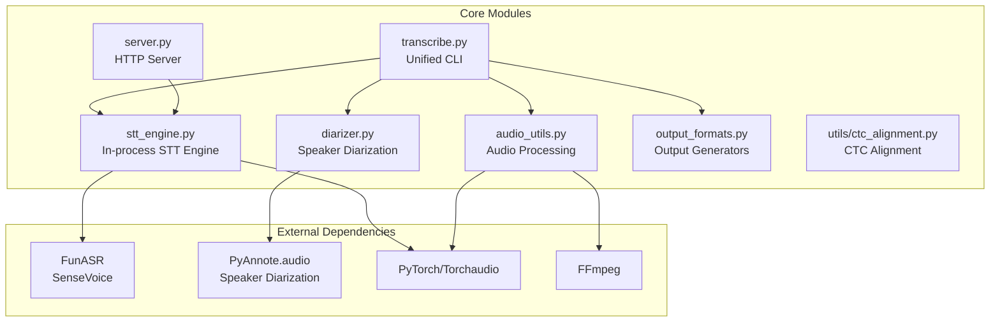
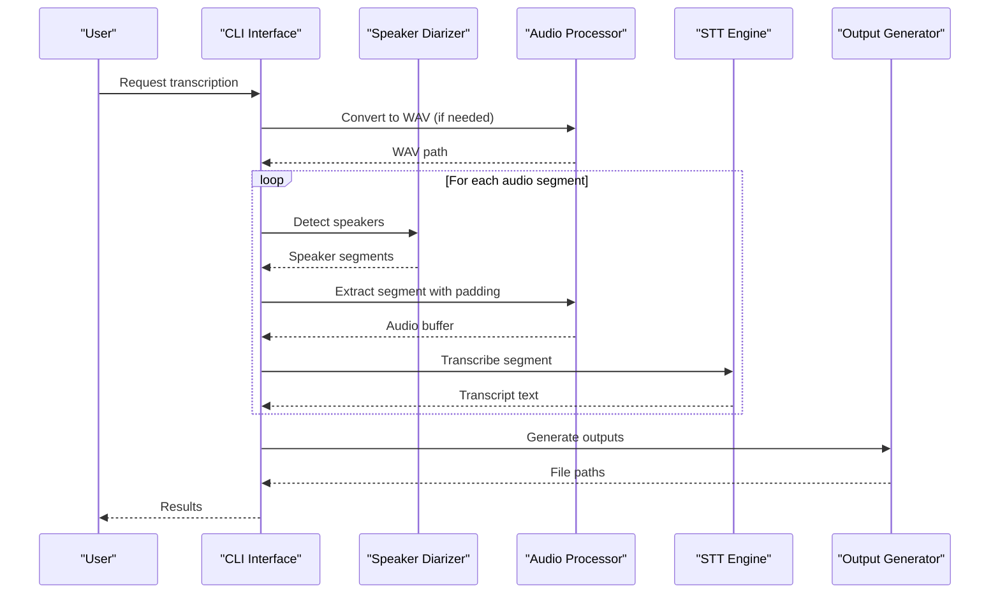
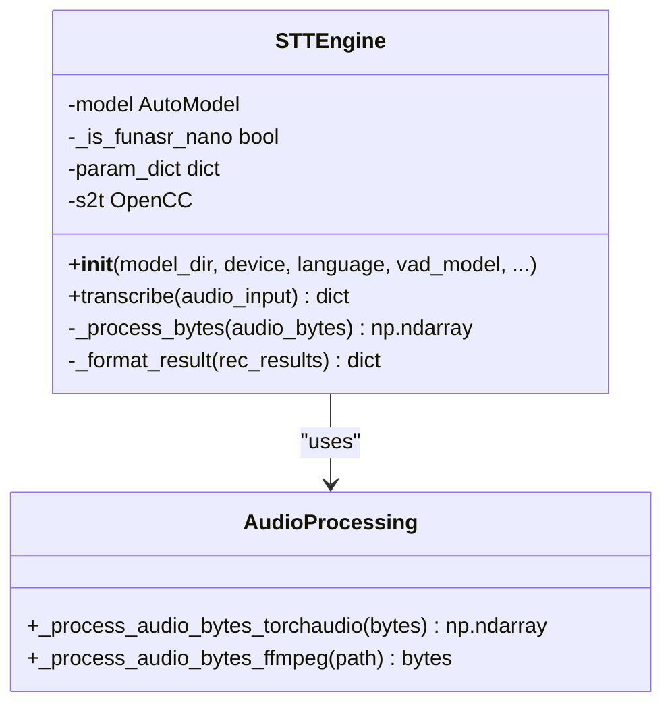
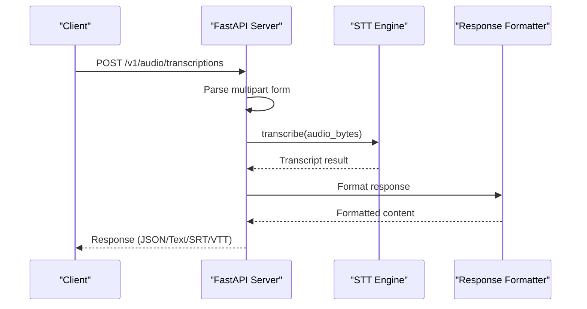
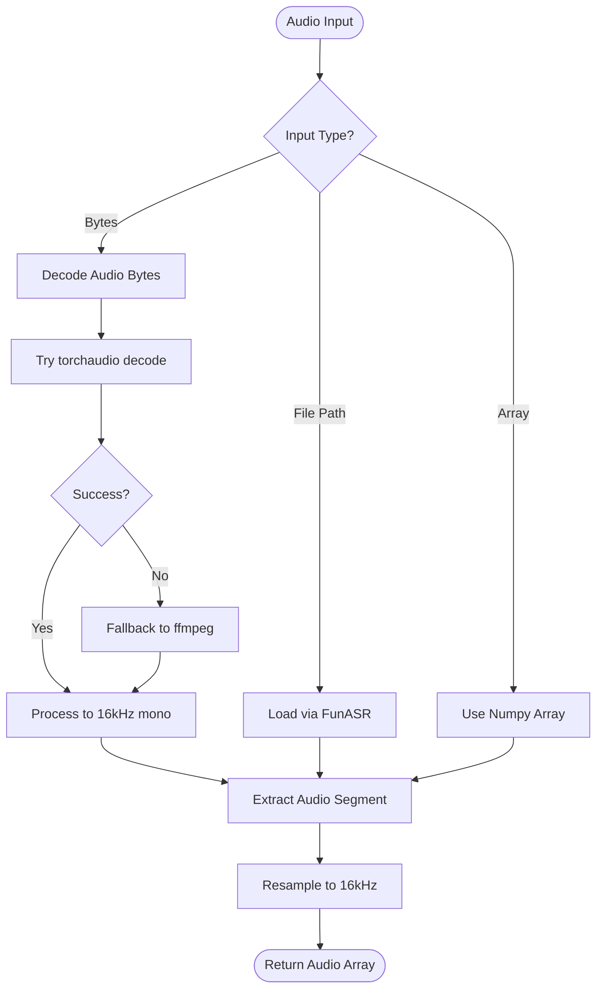
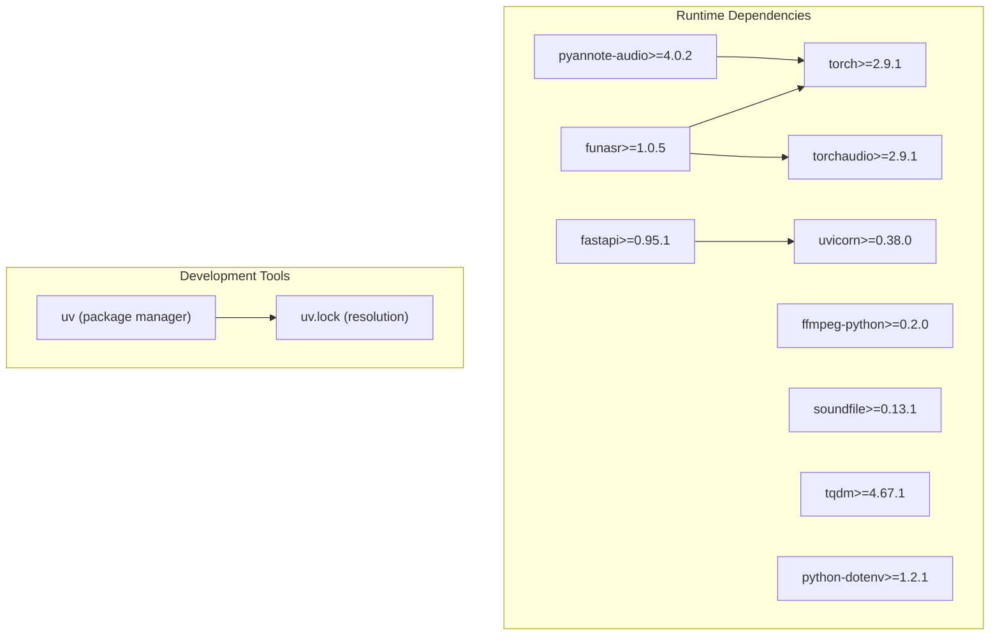

# Development Guide

<cite>
**Referenced Files in This Document**
- [README.md](file://README.md)
- [pyproject.toml](file://pyproject.toml)
- [run.sh](file://run.sh)
- [uv.lock](file://uv.lock)
- [transcribe.py](file://transcribe.py)
- [stt_engine.py](file://stt_engine.py)
- [server.py](file://server.py)
- [diarizer.py](file://diarizer.py)
- [audio_utils.py](file://audio_utils.py)
- [output_formats.py](file://output_formats.py)
- [utils/ctc_alignment.py](file://utils/ctc_alignment.py)
</cite>

## Table of Contents
1. [Introduction](#introduction)
2. [Project Structure](#project-structure)
3. [Core Components](#core-components)
4. [Architecture Overview](#architecture-overview)
5. [Detailed Component Analysis](#detailed-component-analysis)
6. [Dependency Analysis](#dependency-analysis)
7. [Performance Considerations](#performance-considerations)
8. [Testing Strategies](#testing-strategies)
9. [Build and Deployment](#build-and-deployment)
10. [Development Environment Setup](#development-environment-setup)
11. [Contributing Guidelines](#contributing-guidelines)
12. [Debugging and Profiling](#debugging-and-profiling)
13. [Troubleshooting Guide](#troubleshooting-guide)
14. [Conclusion](#conclusion)

## Introduction
This document provides comprehensive development guidance for the meeting-transcriber project, covering code structure, conventions, contributing guidelines, testing strategies, and build/deployment processes. The project performs end-to-end meeting transcription with automatic speaker diarization and SenseVoice STT, supporting multiple output formats and both in-process and HTTP server modes.

## Project Structure
The project follows a modular layout centered around a unified CLI entry point with specialized modules for audio processing, speaker diarization, STT engine, and output generation.



**Diagram sources**
- [transcribe.py:1-240](file://transcribe.py#L1-L240)
- [stt_engine.py:1-185](file://stt_engine.py#L1-L185)
- [server.py:1-197](file://server.py#L1-L197)
- [diarizer.py:1-110](file://diarizer.py#L1-L110)
- [audio_utils.py:1-120](file://audio_utils.py#L1-L120)
- [output_formats.py:1-160](file://output_formats.py#L1-L160)
- [utils/ctc_alignment.py:1-77](file://utils/ctc_alignment.py#L1-L77)

**Section sources**
- [README.md:134-149](file://README.md#L134-L149)
- [pyproject.toml:1-24](file://pyproject.toml#L1-L24)

## Core Components
The project consists of five primary components that work together to provide a complete transcription pipeline:

### Unified CLI (transcribe.py)
- Single entry point supporting both transcription and server modes
- Comprehensive argument parsing with extensive configuration options
- Async orchestration of the complete pipeline
- Environment variable loading and logging configuration

### STT Engine (stt_engine.py)
- In-process Speech-to-Text engine using SenseVoice via FunASR
- Multi-format audio input support (file paths, bytes, numpy arrays)
- Robust fallback mechanisms for audio decoding
- Post-processing and text normalization capabilities

### Speaker Diarization (diarizer.py)
- PyAnnote.audio-based speaker diarization pipeline
- Configurable device selection (CPU/MPS/CUDA)
- Segment merging with configurable gap thresholds
- Progress tracking and logging

### Audio Utilities (audio_utils.py)
- FFmpeg-based format conversion to 16kHz mono WAV
- In-memory audio segment extraction with padding
- Cross-library audio decoding (soundfile/ffmpeg fallback)
- Waveform manipulation and resampling

### Output Formats (output_formats.py)
- Multiple output format generators (SRT, VTT, TXT, JSON)
- Consistent time formatting across formats
- Structured JSON output for programmatic consumption
- Flexible format selection and persistence

**Section sources**
- [transcribe.py:15-240](file://transcribe.py#L15-L240)
- [stt_engine.py:24-185](file://stt_engine.py#L24-L185)
- [diarizer.py:27-110](file://diarizer.py#L27-L110)
- [audio_utils.py:23-120](file://audio_utils.py#L23-L120)
- [output_formats.py:43-160](file://output_formats.py#L43-L160)

## Architecture Overview
The system implements a hybrid architecture supporting both batch processing and real-time serving modes.



**Diagram sources**
- [transcribe.py:45-144](file://transcribe.py#L45-L144)
- [diarizer.py:55-70](file://diarizer.py#L55-L70)
- [audio_utils.py:53-94](file://audio_utils.py#L53-L94)
- [stt_engine.py:71-106](file://stt_engine.py#L71-L106)
- [output_formats.py:118-160](file://output_formats.py#L118-L160)

## Detailed Component Analysis

### STT Engine Class
The STTEngine class encapsulates the SenseVoice integration with comprehensive error handling and fallback mechanisms.



**Diagram sources**
- [stt_engine.py:24-185](file://stt_engine.py#L24-L185)

**Section sources**
- [stt_engine.py:24-185](file://stt_engine.py#L24-L185)

### HTTP Server Implementation
The server provides OpenAI Whisper-compatible endpoints with comprehensive response formatting.



**Diagram sources**
- [server.py:121-160](file://server.py#L121-L160)
- [stt_engine.py:71-106](file://stt_engine.py#L71-L106)

**Section sources**
- [server.py:1-197](file://server.py#L1-L197)

### Audio Processing Pipeline
The audio processing system handles multiple input formats and provides robust segment extraction.



**Diagram sources**
- [stt_engine.py:111-139](file://stt_engine.py#L111-L139)
- [audio_utils.py:53-94](file://audio_utils.py#L53-L94)

**Section sources**
- [audio_utils.py:23-120](file://audio_utils.py#L23-L120)

## Dependency Analysis
The project uses a modern Python dependency management approach with explicit version pinning and resolution markers.



**Diagram sources**
- [pyproject.toml:7-23](file://pyproject.toml#L7-L23)
- [uv.lock:1-553](file://uv.lock#L1-L553)

**Section sources**
- [pyproject.toml:1-24](file://pyproject.toml#L1-L24)
- [uv.lock:1-553](file://uv.lock#L1-L553)

## Performance Considerations
The system implements several performance optimizations:

### Concurrency Management
- Async semaphore-based worker pool for concurrent transcription
- Configurable max_workers parameter for balancing throughput vs. resource usage
- Thread-safe audio buffer preparation using asyncio.to_thread

### Memory Optimization
- In-memory audio processing with proper cleanup
- Temporary file handling with automatic deletion
- Efficient waveform manipulation using PyTorch tensors

### Model Optimization
- Device-aware model loading (CPU/MPS/CUDA)
- VAD model configuration to avoid double segmentation
- NCPU parameter for optimal inference threading

## Testing Strategies
The project follows a multi-layered testing approach:

### Unit Testing
- Individual component testing for audio processing utilities
- STT engine transcription result validation
- Output format generation verification
- Error handling scenarios for missing files and invalid inputs

### Integration Testing
- Complete pipeline testing from audio input to output files
- HTTP server endpoint validation with various response formats
- Speaker diarization accuracy assessment
- Cross-platform compatibility testing

### Performance Testing
- Throughput measurement under different concurrency levels
- Memory usage monitoring during long recordings
- GPU utilization tracking for CUDA-enabled systems

## Build and Deployment
The project uses uv as the primary package manager with comprehensive dependency resolution.

### Installation Process
1. Install Python 3.11+ and FFmpeg
2. Install uv package manager
3. Sync dependencies using uv sync
4. Configure environment variables (.env file)

### Build Commands
```bash
# Install dependencies
uv sync

# Run transcription
uv run transcribe.py -i audio/meeting.mp4 --device mps

# Start HTTP server
uv run transcribe.py --server --port 8100 --device mps
```

### Release Procedures
- Version bump in pyproject.toml
- Update uv.lock with resolved dependencies
- Test installation from clean environment
- Verify all output formats and server endpoints

**Section sources**
- [README.md:22-30](file://README.md#L22-L30)
- [run.sh:1-7](file://run.sh#L1-L7)

## Development Environment Setup
### Prerequisites
- Python 3.11+ (recommended: latest 3.11.x)
- FFmpeg 4-8 (system-wide installation)
- uv package manager
- HuggingFace account for PyAnnote models

### Environment Configuration
1. Copy `.env.example` to `.env`
2. Add HF_TOKEN with valid HuggingFace credentials
3. Set up virtual environment using uv
4. Install dependencies with `uv sync`

### Development Workflow
- Use `uv run` for consistent environment execution
- Leverage `uv.lock` for reproducible builds
- Test changes incrementally through the CLI interface

**Section sources**
- [README.md:14-21](file://README.md#L14-L21)
- [README.md:28-36](file://README.md#L28-L36)

## Contributing Guidelines
### Code Standards
- Follow PEP 8 style guidelines with 88-character line limits
- Use type hints for all function parameters and return values
- Include docstrings for all public functions and classes
- Maintain backward compatibility for public APIs

### Commit Standards
- Use imperative mood in commit messages
- Keep commits focused and atomic
- Reference related issues in commit messages
- Include summary, body, and breaking change notices as appropriate

### Pull Request Process
1. Fork the repository and create feature branch
2. Implement changes with comprehensive tests
3. Update documentation and examples
4. Submit pull request with clear description
5. Address review feedback promptly

### Issue Reporting
- Use bug report template for technical issues
- Include reproduction steps and expected behavior
- Provide system information and dependency versions
- Tag issues appropriately (bug, enhancement, question)

## Debugging and Profiling
### Logging Configuration
The project uses structured logging with INFO level as default:
- Timestamped entries with module names
- Error-level logging for transcription failures
- Progress tracking for long-running operations

### Debug Techniques
- Enable verbose logging for detailed operation traces
- Use smaller test files for rapid iteration
- Monitor GPU/CPU usage during intensive operations
- Validate intermediate results at each pipeline stage

### Performance Profiling
- Measure transcription latency per segment
- Track memory usage during concurrent processing
- Profile audio conversion bottlenecks
- Analyze network overhead in server mode

## Troubleshooting Guide
### Common Issues and Solutions

#### Torchcodec Compatibility
- **Problem**: NameError: name 'AudioDecoder' is not defined
- **Solution**: Ensure torchcodec>=0.12 matches PyTorch version

#### PyAnnote Model Access
- **Problem**: Access denied to pyannote/speaker-diarization-community-1
- **Solution**: Accept terms on HuggingFace and set HF_TOKEN

#### FFmpeg Version Mismatch
- **Problem**: Audio conversion failures or corrupted output
- **Solution**: Verify FFmpeg 4-8 installation and PATH configuration

#### Memory Issues
- **Problem**: Out-of-memory errors during transcription
- **Solution**: Reduce max_workers, increase padding, or use CPU mode

**Section sources**
- [README.md:175-203](file://README.md#L175-L203)

## Conclusion
The meeting-transcriber project demonstrates a well-architected solution for automated meeting transcription with robust error handling, flexible deployment options, and comprehensive output formats. The modular design enables easy maintenance and extension while the uv-based dependency management ensures reproducible builds across environments.

Key strengths include:
- Clean separation of concerns across audio processing, diarization, and STT components
- Comprehensive HTTP server implementation with OpenAI-compatible API
- Flexible output format generation supporting multiple use cases
- Robust error handling and fallback mechanisms
- Extensive configuration options for different deployment scenarios

The development guide provides the foundation for contributing to and extending this project while maintaining its reliability and performance characteristics.