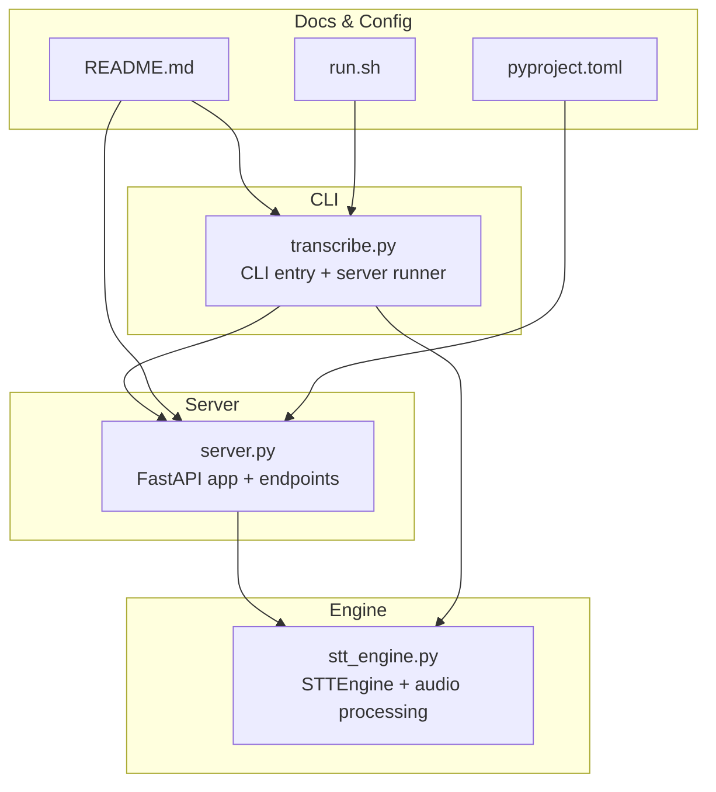
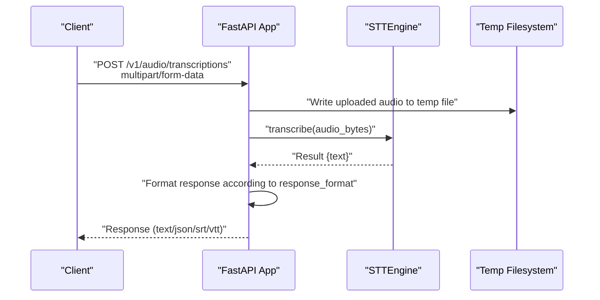
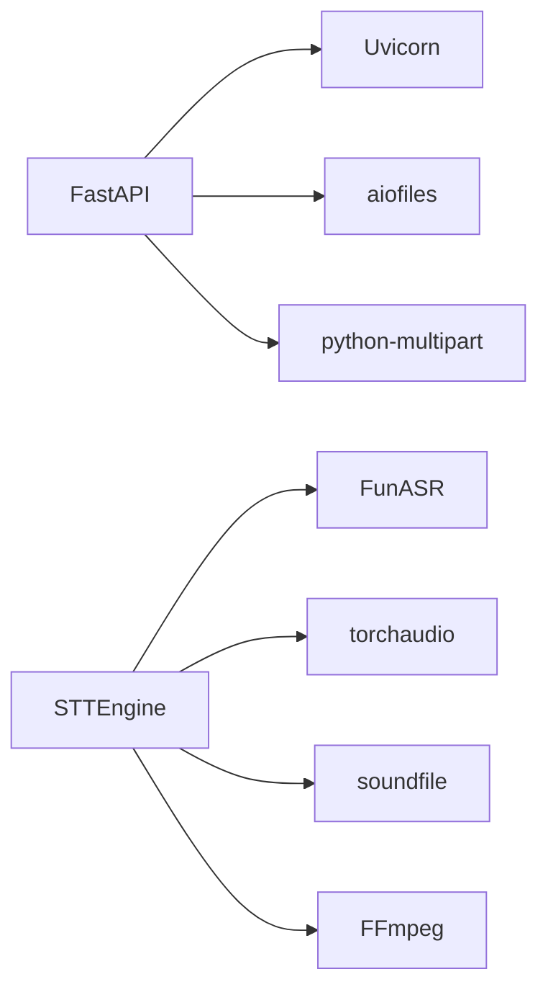

# HTTP API Server

<cite>
**Referenced Files in This Document**
- [server.py](file://server.py)
- [stt_engine.py](file://stt_engine.py)
- [transcribe.py](file://transcribe.py)
- [README.md](file://README.md)
- [pyproject.toml](file://pyproject.toml)
- [run.sh](file://run.sh)
</cite>

## Table of Contents
1. [Introduction](#introduction)
2. [Project Structure](#project-structure)
3. [Core Components](#core-components)
4. [Architecture Overview](#architecture-overview)
5. [Detailed Component Analysis](#detailed-component-analysis)
6. [Dependency Analysis](#dependency-analysis)
7. [Performance Considerations](#performance-considerations)
8. [Troubleshooting Guide](#troubleshooting-guide)
9. [Conclusion](#conclusion)
10. [Appendices](#appendices)

## Introduction
This document describes the HTTP API server that exposes OpenAI Whisper-compatible endpoints for real-time speech-to-text transcription. It provides:
- REST API specifications for the endpoints
- Request and response schemas
- Authentication and security considerations
- Rate limiting guidance
- Performance optimization tips
- Debugging and monitoring approaches
- Migration guidance for existing Whisper API users

The server is implemented with FastAPI and runs on Uvicorn. It integrates with the SenseVoice STT engine to perform transcription and supports multiple output formats.

## Project Structure
The HTTP server is part of a larger project that includes in-process transcription, speaker diarization, and output formatting. The server module defines the API endpoints and delegates transcription to the STT engine.

**Diagram sources**
- [server.py:92-161](file://server.py#L92-L161)
- [stt_engine.py:24-105](file://stt_engine.py#L24-L105)
- [transcribe.py:151-165](file://transcribe.py#L151-L165)
- [README.md:74-88](file://README.md#L74-L88)
- [pyproject.toml:1-24](file://pyproject.toml#L1-L24)
- [run.sh:1-7](file://run.sh#L1-L7)

**Section sources**
- [README.md:134-149](file://README.md#L134-L149)
- [pyproject.toml:1-24](file://pyproject.toml#L1-L24)

## Core Components
- FastAPI application factory that creates routes for:
  - POST /v1/audio/transcriptions (OpenAI Whisper-compatible)
  - POST /recognition (legacy endpoint)
- STTEngine that performs transcription and audio preprocessing
- CLI entrypoint that starts the server with configurable parameters

Key behaviors:
- Audio uploads are streamed to temporary files and processed by the STT engine
- Responses support multiple formats: text, json, verbose_json, srt, vtt
- Errors are returned in OpenAI-style error objects for the Whisper-compatible endpoint

**Section sources**
- [server.py:92-161](file://server.py#L92-L161)
- [stt_engine.py:24-105](file://stt_engine.py#L24-L105)
- [transcribe.py:151-165](file://transcribe.py#L151-L165)

## Architecture Overview
The server exposes two endpoints. The OpenAI-compatible endpoint accepts multipart form data and returns transcription results in the requested format. The legacy endpoint returns a simplified JSON object.

**Diagram sources**
- [server.py:121-159](file://server.py#L121-L159)
- [stt_engine.py:71-105](file://stt_engine.py#L71-L105)

## Detailed Component Analysis

### Endpoint: POST /v1/audio/transcriptions (OpenAI Whisper-compatible)
Purpose:
- Accepts audio uploads and returns transcription results in various formats

Parameters (multipart/form-data):
- file: audio file (required)
- model: model identifier (alias: model); defaults to "sensevoice"
- language: target language hint (optional)
- prompt: prompt text (optional)
- response_format: output format; one of text, json, verbose_json, srt, vtt; defaults to json
- temperature: sampling temperature (ignored in current implementation)

Behavior:
- Reads the uploaded file bytes
- Writes to a temporary file with a generated filename
- Calls engine.transcribe(audio_bytes)
- Formats the result according to response_format
- Returns either raw text/plain or JSON depending on response_format

Response formats:
- text: returns raw text
- json: returns {"text": "..."}
- verbose_json: returns {"task": "transcribe", "language": "...", "duration": null, "text": "..."}
- srt: returns SRT-formatted subtitle content
- vtt: returns WebVTT-formatted subtitle content

Error handling:
- On upload/read errors: returns OpenAI-style error object with message and type
- On formatting errors: returns OpenAI-style error object with message and type

Security considerations:
- No authentication is enforced by the server
- Consider deploying behind a reverse proxy with TLS and rate limiting

Performance considerations:
- Audio is written to disk; ensure sufficient disk space and I/O throughput
- Large audio files increase latency; consider chunking or streaming clients

**Section sources**
- [server.py:121-159](file://server.py#L121-L159)
- [server.py:62-84](file://server.py#L62-L84)

### Endpoint: POST /recognition (Legacy)
Purpose:
- Provides a simpler interface returning a JSON object with text and a numeric code

Parameters:
- audio: audio file (required)

Behavior:
- Reads the uploaded file bytes
- Writes to a temporary file with a generated filename
- Calls engine.transcribe(audio_bytes)
- Removes the temporary file
- Returns {"text": "...", "code": 0}

Error handling:
- On read errors: returns {"msg": "...", "code": 1}

Security considerations:
- No authentication is enforced by the server

**Section sources**
- [server.py:100-117](file://server.py#L100-L117)

### STTEngine
Responsibilities:
- Loads the SenseVoice model (via FunASR)
- Preprocesses audio bytes to 16 kHz mono float32 arrays
- Performs transcription and applies post-processing
- Converts Simplified to Traditional Chinese if enabled

Key methods:
- transcribe(audio_input): accepts file path, bytes, or numpy array
- _process_bytes(audio_bytes): decodes audio bytes using torchaudio or ffmpeg fallback
- _format_result(rec_results): post-processes raw model output

Notes:
- The server passes raw bytes to engine.transcribe
- The engine handles audio decoding and model inference internally

**Section sources**
- [stt_engine.py:24-105](file://stt_engine.py#L24-L105)
- [stt_engine.py:111-129](file://stt_engine.py#L111-L129)
- [stt_engine.py:130-139](file://stt_engine.py#L130-L139)

### Server Runner and CLI
The CLI supports starting the server with configurable parameters:
- --server: enable HTTP server mode
- --host, --port: bind address and port
- --device: compute device (cpu, mps, cuda)
- --model_dir: SenseVoice model directory or hub identifier
- --vad_model, --use_itn, --merge_vad, --merge_length_s: engine configuration

The server runner constructs an STTEngine and starts Uvicorn with optional SSL parameters.

**Section sources**
- [transcribe.py:151-165](file://transcribe.py#L151-L165)
- [server.py:169-196](file://server.py#L169-L196)
- [README.md:74-88](file://README.md#L74-L88)

## Dependency Analysis
External dependencies relevant to the HTTP server:
- FastAPI and Uvicorn for the HTTP server runtime
- aiofiles for asynchronous file writes
- python-multipart for parsing multipart/form-data
- STTEngine depends on FunASR, torchaudio, soundfile, and FFmpeg

**Diagram sources**
- [pyproject.toml:8-23](file://pyproject.toml#L8-L23)
- [stt_engine.py:12-18](file://stt_engine.py#L12-L18)

**Section sources**
- [pyproject.toml:1-24](file://pyproject.toml#L1-L24)

## Performance Considerations
- Disk I/O: Audio is temporarily written to disk; ensure fast local storage to minimize latency
- Model size and device: Larger models or CPU-only inference will increase latency
- Concurrency: The server does not enforce concurrency limits; deploy behind a reverse proxy with connection limits
- Audio quality: Higher sample rates or stereo audio are automatically converted to 16 kHz mono
- Output format: SRT/VTT generation adds formatting overhead; prefer JSON for minimal processing

[No sources needed since this section provides general guidance]

## Troubleshooting Guide
Common issues and resolutions:
- Audio decoding failures: The engine falls back from torchaudio to FFmpeg; ensure FFmpeg is installed and accessible
- Torchcodec/torchaudio version mismatches: See project README for compatibility notes
- HuggingFace token required for speaker diarization; however, the HTTP server does not require it
- Port conflicts: Change --port or stop other services listening on the same port

Operational checks:
- Verify server startup logs and model loading messages
- Test endpoints with small audio files to isolate network vs. processing issues
- Monitor disk usage during long sessions due to temporary audio files

**Section sources**
- [README.md:175-203](file://README.md#L175-L203)
- [stt_engine.py:111-129](file://stt_engine.py#L111-L129)

## Conclusion
The HTTP server provides an OpenAI Whisper-compatible interface for SenseVoice-based transcription. It supports multiple output formats and is suitable for integration with existing Whisper API clients. For production use, deploy behind a reverse proxy with TLS termination, rate limiting, and authentication as appropriate.

[No sources needed since this section summarizes without analyzing specific files]

## Appendices

### API Specifications

- Base URL
  - http://host:port

- Endpoints
  - POST /v1/audio/transcriptions
  - POST /recognition

- Headers
  - Content-Type: multipart/form-data

- POST /v1/audio/transcriptions
  - Body fields:
    - file: audio file (required)
    - model: model identifier (alias: model); defaults to "sensevoice"
    - language: target language hint (optional)
    - prompt: prompt text (optional)
    - response_format: output format; one of text, json, verbose_json, srt, vtt; defaults to json
    - temperature: sampling temperature (ignored in current implementation)
  - Successful response:
    - text/plain for response_format=text, srt, vtt
    - JSON for response_format=json, verbose_json
  - Error response:
    - OpenAI-style error object with message and type

- POST /recognition
  - Body fields:
    - audio: audio file (required)
  - Successful response:
    - JSON: {"text": "...", "code": 0}
  - Error response:
    - JSON: {"msg": "...", "code": 1}

- Example curl commands
  - Basic transcription:
    - curl -X POST http://localhost:8000/v1/audio/transcriptions -F file=@audio/example.wav -F model=sensevoice
  - Specify language and format:
    - curl -X POST http://localhost:8000/v1/audio/transcriptions -F file=@audio/example.wav -F language=en -F response_format=json

- Authentication
  - Not implemented by the server; consider adding API keys or JWT tokens behind a reverse proxy

- Security
  - Enable TLS by passing ssl_certfile and ssl_keyfile to the server runner
  - Place behind a reverse proxy with rate limiting and request size limits

- Monitoring and debugging
  - Use server logs for request handling and error traces
  - For client-side debugging, log request payloads and response bodies
  - Consider adding middleware for request/response logging

- Migration from OpenAI Whisper API
  - Endpoint: /v1/audio/transcriptions replaces /v1/audio/transcriptions
  - Parameters: model is aliased to model; language and prompt are supported
  - Response formats: text, json, verbose_json, srt, vtt are supported
  - Differences: temperature is ignored; additional fields in verbose_json may differ

**Section sources**
- [README.md:74-88](file://README.md#L74-L88)
- [server.py:121-159](file://server.py#L121-L159)
- [server.py:100-117](file://server.py#L100-L117)