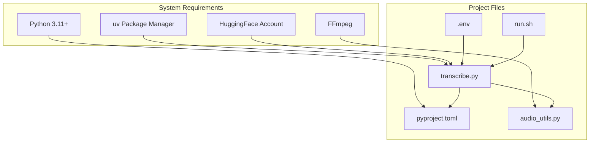

# Installation and Setup

<cite>
**Referenced Files in This Document**
- [README.md](file://README.md)
- [pyproject.toml](file://pyproject.toml)
- [transcribe.py](file://transcribe.py)
- [audio_utils.py](file://audio_utils.py)
- [run.sh](file://run.sh)
</cite>

## Table of Contents
1. [Introduction](#introduction)
2. [Prerequisites](#prerequisites)
3. [Platform-Specific Installation](#platform-specific-installation)
4. [Step-by-Step Installation](#step-by-step-installation)
5. [Environment Variables and Configuration](#environment-variables-and-configuration)
6. [Verification Commands](#verification-commands)
7. [Common Installation Issues and Troubleshooting](#common-installation-issues-and-troubleshooting)
8. [Architecture Overview](#architecture-overview)
9. [Conclusion](#conclusion)

## Introduction
This guide provides comprehensive installation and setup instructions for Meeting Transcriber. It covers prerequisites, platform-specific installation steps, environment configuration, verification procedures, and troubleshooting tips. The content is designed to be accessible to beginners while offering sufficient technical depth for system administrators.

## Prerequisites
Before installing Meeting Transcriber, ensure your system meets the following requirements:

- Python 3.11 or newer
- FFmpeg installed and available in PATH
- uv package manager installed
- HuggingFace account with access to the required models

These prerequisites are documented in the project's README and enforced by the project metadata.

**Section sources**
- [README.md:14-21](file://README.md#L14-L21)
- [pyproject.toml:6](file://pyproject.toml#L6)

## Platform-Specific Installation

### macOS (Homebrew)
Install FFmpeg using Homebrew as documented in the project's README.

```bash
brew install ffmpeg
```

Verify installation:
```bash
ffmpeg -version
```

### Ubuntu/Debian (apt-get)
Install FFmpeg using the system package manager.

```bash
sudo apt-get install ffmpeg
```

Verify installation:
```bash
ffmpeg -version
```

**Section sources**
- [README.md:17](file://README.md#L17)
- [README.md:197-203](file://README.md#L197-L203)

## Step-by-Step Installation

### 1. Install Python Dependencies with uv
Use uv to synchronize dependencies as described in the README.

```bash
uv sync
```

This command reads the project configuration and installs all required packages.

**Section sources**
- [README.md:24-30](file://README.md#L24-L30)

### 2. Prepare Environment Configuration
Copy the example environment file and configure your HuggingFace token.

```bash
cp .env.example .env
```

Edit `.env` to set your HuggingFace token:
```
HF_TOKEN=hf_xxxxxxxxxxxxxxxxxxxx
```

The application loads environment variables at startup using python-dotenv.

**Section sources**
- [README.md:28-36](file://README.md#L28-L36)
- [transcribe.py:23-30](file://transcribe.py#L23-L30)

### 3. Verify FFmpeg Availability
Ensure FFmpeg is installed and accessible in PATH before running the application.

```bash
ffmpeg -version
```

The application uses FFmpeg for audio format conversion during transcription.

**Section sources**
- [audio_utils.py:32-43](file://audio_utils.py#L32-L43)

## Environment Variables and Configuration

### Required Environment Variable
- `HF_TOKEN`: Required for accessing PyAnnote models hosted on HuggingFace. The README explicitly instructs users to set this token in `.env`.

### Application Behavior
- The CLI loads environment variables from the current working directory using python-dotenv.
- The application expects a `.env` file present in the project root.

**Section sources**
- [README.md:32-36](file://README.md#L32-L36)
- [transcribe.py:23-30](file://transcribe.py#L23-L30)

## Verification Commands

### Verify FFmpeg Installation
Confirm FFmpeg is available in PATH.

```bash
ffmpeg -version
```

### Verify uv Installation and Sync
Ensure uv is installed and can synchronize dependencies.

```bash
uv --version
uv sync
```

### Verify Python Version
Confirm your Python version meets the requirement.

```bash
python --version
```

**Section sources**
- [README.md:16](file://README.md#L16)
- [README.md:191-193](file://README.md#L191-L193)

## Common Installation Issues and Troubleshooting

### FFmpeg Not Found or Incorrect Version
Symptoms:
- Conversion failures during audio preprocessing
- Errors indicating missing or incompatible FFmpeg

Resolution:
- Install FFmpeg using the platform-specific instructions above
- Verify installation with `ffmpeg -version`
- Ensure FFmpeg version is compatible with torchcodec requirements

**Section sources**
- [README.md:187-203](file://README.md#L187-L203)
- [audio_utils.py:32-43](file://audio_utils.py#L32-L43)

### HuggingFace Token Not Set
Symptoms:
- Access denied errors when loading PyAnnote models
- Failure to download required model artifacts

Resolution:
- Set `HF_TOKEN` in `.env` as documented in the README
- Ensure the token has permissions for the required model repository

**Section sources**
- [README.md:32-36](file://README.md#L32-L36)
- [README.md:183-185](file://README.md#L183-L185)

### torchcodec Version Compatibility
Symptoms:
- NameError related to AudioDecoder when importing torchcodec
- Incompatibility between torch and torchcodec versions

Resolution:
- Ensure the project uses a compatible torchcodec version as specified in pyproject.toml
- Review the compatibility matrix referenced in the README

**Section sources**
- [README.md:177-181](file://README.md#L177-L181)
- [pyproject.toml:20](file://pyproject.toml#L20)

## Architecture Overview

The installation and runtime architecture involves several components:



**Diagram sources**
- [pyproject.toml:1-24](file://pyproject.toml#L1-L24)
- [transcribe.py:15-37](file://transcribe.py#L15-L37)
- [audio_utils.py:9-21](file://audio_utils.py#L9-L21)
- [run.sh:1-7](file://run.sh#L1-L7)

## Conclusion
Meeting Transcriber requires a modern Python environment, uv for dependency management, FFmpeg for audio processing, and a configured HuggingFace token for model access. By following the platform-specific installation steps, configuring environment variables, and verifying prerequisites, you can successfully deploy the system. The troubleshooting section addresses common issues related to FFmpeg availability, model access, and library compatibility.