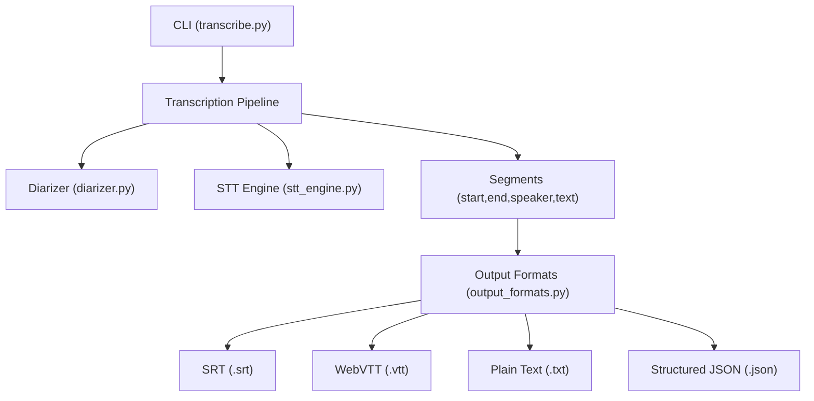
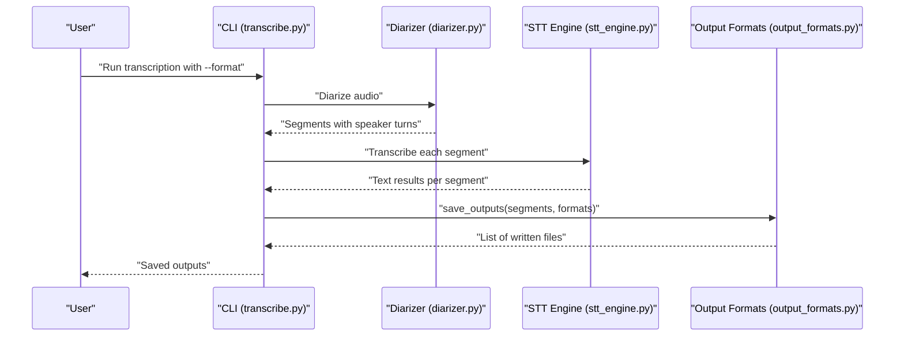
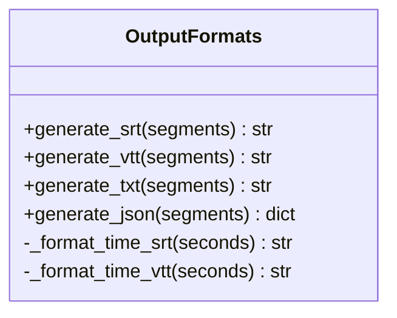
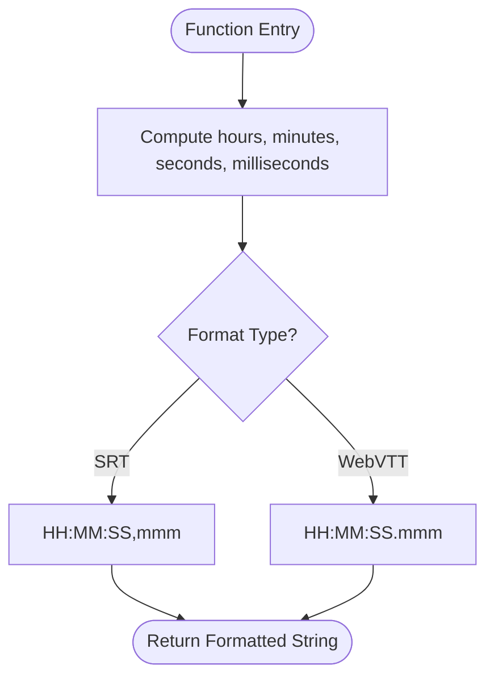
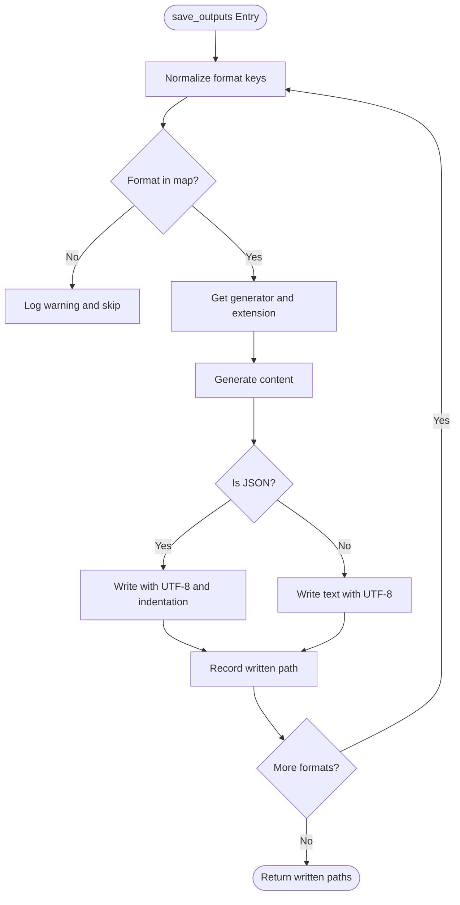
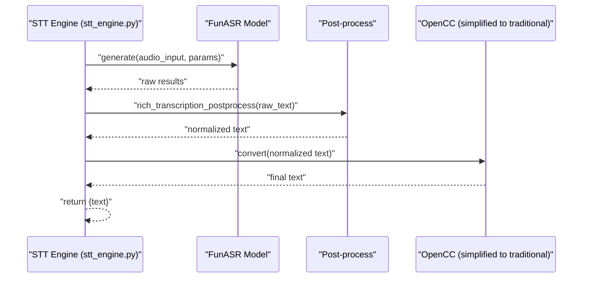
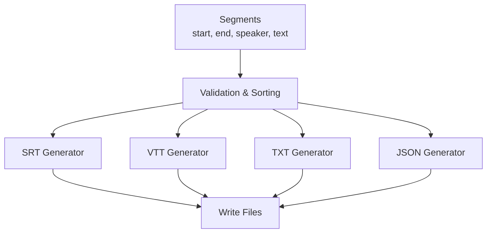
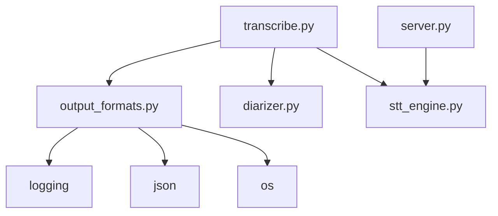

# Output Generation System

<cite>
**Referenced Files in This Document**
- [README.md](file://README.md)
- [output_formats.py](file://output_formats.py)
- [transcribe.py](file://transcribe.py)
- [stt_engine.py](file://stt_engine.py)
- [server.py](file://server.py)
- [diarizer.py](file://diarizer.py)
- [audio_utils.py](file://audio_utils.py)
</cite>

## Table of Contents
1. [Introduction](#introduction)
2. [Project Structure](#project-structure)
3. [Core Components](#core-components)
4. [Architecture Overview](#architecture-overview)
5. [Detailed Component Analysis](#detailed-component-analysis)
6. [Dependency Analysis](#dependency-analysis)
7. [Performance Considerations](#performance-considerations)
8. [Troubleshooting Guide](#troubleshooting-guide)
9. [Conclusion](#conclusion)

## Introduction
This document describes the output generation system that produces multiple formats from meeting transcription results. It covers the implementation of SRT subtitle format generation, WebVTT format support, plain text with timestamps, and structured JSON output. It also documents custom output formatting options, post-processing capabilities, and quality assurance measures. The relationships with transcription results and timing synchronization requirements are explained, along with format-specific considerations, encoding standards, and compatibility requirements. Finally, troubleshooting guidance is provided for output generation issues and format validation problems.

## Project Structure
The output generation system is centered around a dedicated module that generates multiple output formats from a standardized segment list. The CLI orchestrates the full pipeline and delegates output writing to the format generator module.

**Diagram sources**
- [transcribe.py:45-144](file://transcribe.py#L45-L144)
- [diarizer.py:55-70](file://diarizer.py#L55-L70)
- [stt_engine.py:71-105](file://stt_engine.py#L71-L105)
- [output_formats.py:118-159](file://output_formats.py#L118-L159)

**Section sources**
- [README.md:134-173](file://README.md#L134-L173)
- [transcribe.py:127-143](file://transcribe.py#L127-L143)

## Core Components
- Output format generators: Functions that produce SRT, WebVTT, plain text, and JSON from a list of segments.
- Time formatting helpers: Consistent formatting for SRT and WebVTT timestamps.
- Output persistence: A dispatcher that writes files in the requested formats with UTF-8 encoding.
- Post-processing: Text normalization and simplified-to-traditional Chinese conversion applied during transcription.

Key responsibilities:
- Standardize segment structure: start, end, speaker, text.
- Generate human-readable and machine-parseable outputs.
- Maintain timestamp precision and format compatibility.
- Ensure consistent encoding and formatting across formats.

**Section sources**
- [output_formats.py:43-103](file://output_formats.py#L43-L103)
- [output_formats.py:118-159](file://output_formats.py#L118-L159)
- [stt_engine.py:130-139](file://stt_engine.py#L130-L139)

## Architecture Overview
The output generation system integrates with the transcription pipeline and server modes. The CLI builds segments from diarization and STT results, then saves outputs in the requested formats.

**Diagram sources**
- [transcribe.py:45-144](file://transcribe.py#L45-L144)
- [diarizer.py:55-70](file://diarizer.py#L55-L70)
- [stt_engine.py:71-105](file://stt_engine.py#L71-L105)
- [output_formats.py:118-159](file://output_formats.py#L118-L159)

## Detailed Component Analysis

### Output Format Generators
The format generators accept a list of segments and produce content for each target format. They rely on shared time formatting helpers to ensure consistent timestamp representation.

**Diagram sources**
- [output_formats.py:43-103](file://output_formats.py#L43-L103)

Implementation highlights:
- SRT: Uses comma-based milliseconds and a numeric index per block.
- WebVTT: Starts with a header and uses dot-based milliseconds.
- Plain text: One line per segment with bracketed timestamps and speaker label.
- Structured JSON: Top-level segments list with normalized fields.

Format-specific considerations:
- SRT and WebVTT differ in timestamp separators and optional header presence.
- Plain text is designed for readability and simple parsing.
- JSON provides a robust, machine-friendly structure for downstream tools.

**Section sources**
- [output_formats.py:43-103](file://output_formats.py#L43-L103)

### Time Formatting Helpers
Timestamp formatting ensures compatibility with SRT and WebVTT standards.

**Diagram sources**
- [output_formats.py:20-35](file://output_formats.py#L20-L35)

**Section sources**
- [output_formats.py:20-35](file://output_formats.py#L20-L35)

### Output Persistence and Dispatch
The dispatcher writes files for each requested format, handling encoding and file extensions.

**Diagram sources**
- [output_formats.py:118-159](file://output_formats.py#L118-L159)

**Section sources**
- [output_formats.py:118-159](file://output_formats.py#L118-L159)

### Post-Processing and Quality Assurance
Post-processing occurs during transcription to improve text quality and normalize language variants.

**Diagram sources**
- [stt_engine.py:130-139](file://stt_engine.py#L130-L139)

Quality assurance measures:
- Logging of errors and warnings during transcription and audio processing.
- Graceful handling of missing or empty results.
- Consistent UTF-8 encoding for all text outputs.

**Section sources**
- [stt_engine.py:101-103](file://stt_engine.py#L101-L103)
- [audio_utils.py:48-50](file://audio_utils.py#L48-L50)
- [audio_utils.py:91-93](file://audio_utils.py#L91-L93)

### Relationship with Transcription Results and Timing Synchronization
The output generation relies on a consistent segment structure produced by the pipeline. Timing synchronization is critical for accurate subtitle and caption rendering.

**Diagram sources**
- [transcribe.py:125-126](file://transcribe.py#L125-L126)
- [output_formats.py:43-103](file://output_formats.py#L43-L103)

**Section sources**
- [transcribe.py:125-126](file://transcribe.py#L125-L126)
- [diarizer.py:66-70](file://diarizer.py#L66-L70)

## Dependency Analysis
The output generation system has clear boundaries and minimal coupling. The CLI orchestrates the pipeline and delegates output writing to the format module.

**Diagram sources**
- [transcribe.py:45-144](file://transcribe.py#L45-L144)
- [output_formats.py:7-13](file://output_formats.py#L7-L13)
- [server.py:21-23](file://server.py#L21-L23)

**Section sources**
- [transcribe.py:45-144](file://transcribe.py#L45-L144)
- [output_formats.py:7-13](file://output_formats.py#L7-L13)

## Performance Considerations
- I/O throughput: Writing multiple files in a single pass reduces overhead.
- Encoding: UTF-8 is efficient and widely compatible.
- Memory: Generating content in-memory and writing once minimizes disk operations.
- Concurrency: The CLI uses asynchronous transcription with a semaphore to balance throughput and resource usage.

[No sources needed since this section provides general guidance]

## Troubleshooting Guide
Common issues and resolutions:
- Unknown output format: The dispatcher logs a warning and skips unsupported formats. Verify the format string against supported keys.
- File encoding problems: All text outputs are written with UTF-8. Ensure consuming applications expect UTF-8.
- Empty or missing text: The STT engine returns placeholder text when transcription fails. Re-run with corrected audio or parameters.
- Audio processing errors: Conversion failures or buffer preparation errors are logged. Confirm FFmpeg availability and permissions.
- Server formatting errors: The server handles formatting exceptions and returns appropriate error messages.

**Section sources**
- [output_formats.py:141-143](file://output_formats.py#L141-L143)
- [output_formats.py:149-154](file://output_formats.py#L149-L154)
- [stt_engine.py:101-103](file://stt_engine.py#L101-L103)
- [audio_utils.py:48-50](file://audio_utils.py#L48-L50)
- [audio_utils.py:91-93](file://audio_utils.py#L91-L93)
- [server.py:142-159](file://server.py#L142-L159)

## Conclusion
The output generation system provides a clean separation of concerns: the pipeline produces standardized segments, and the format module generates multiple outputs consistently. With UTF-8 encoding, robust error handling, and format-specific considerations, it delivers reliable results across SRT, WebVTT, plain text, and JSON. The design supports customization via CLI parameters and maintains compatibility with common subtitle and transcription workflows.