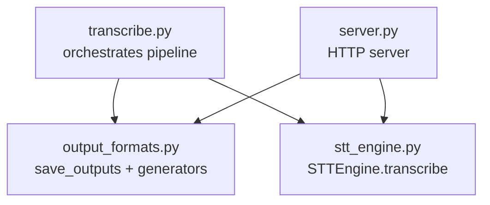
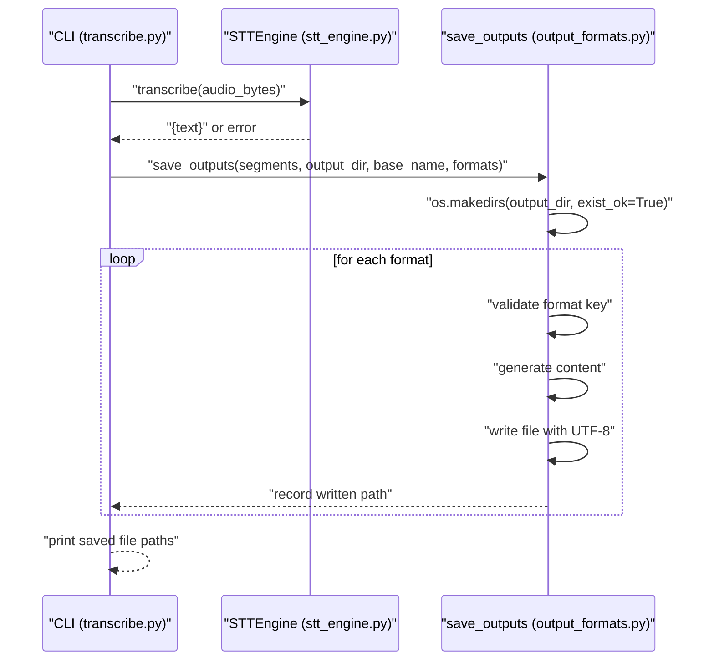
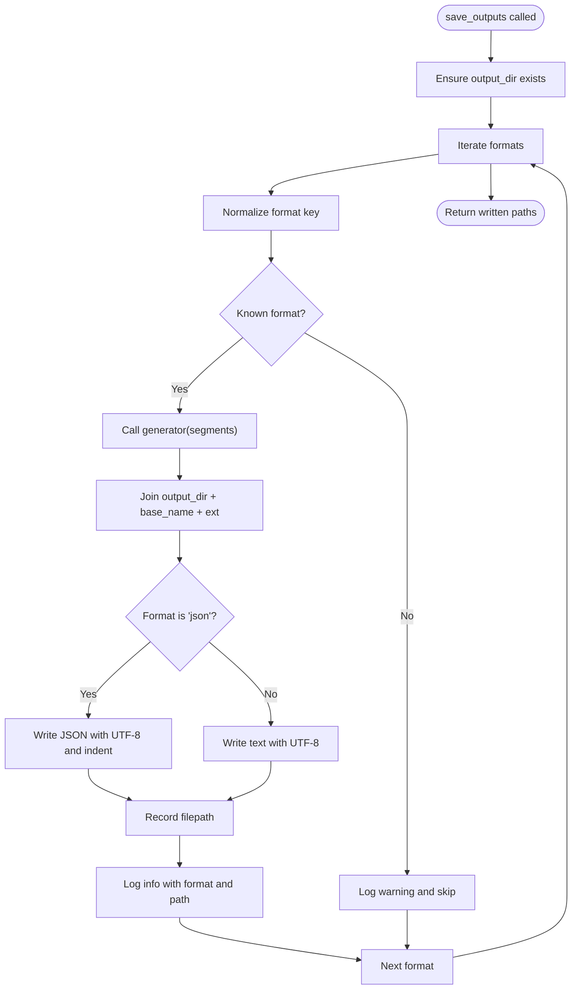
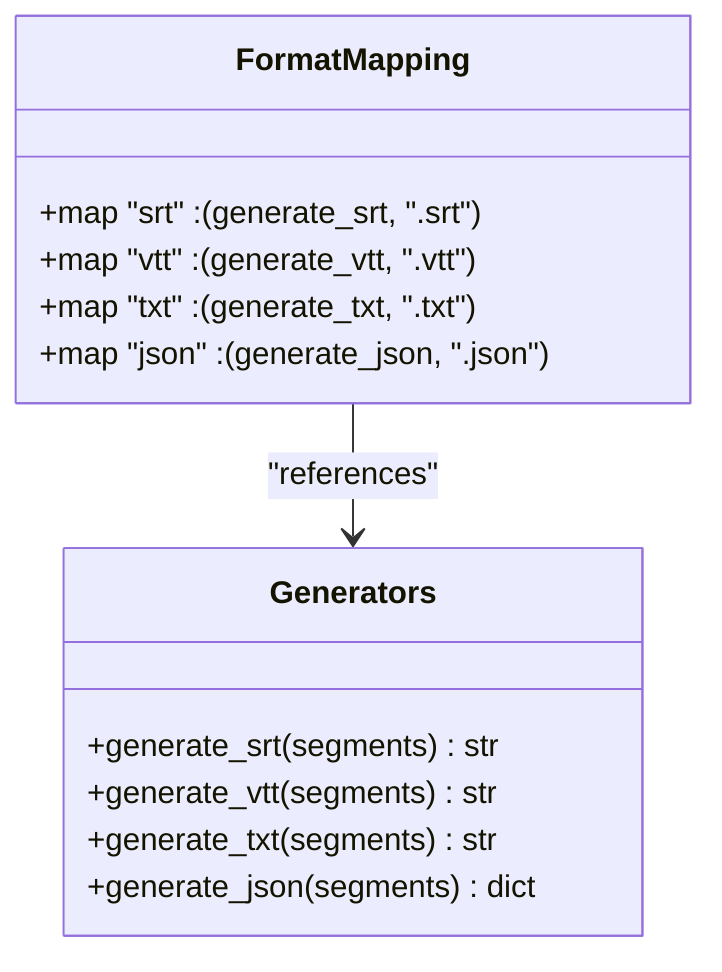
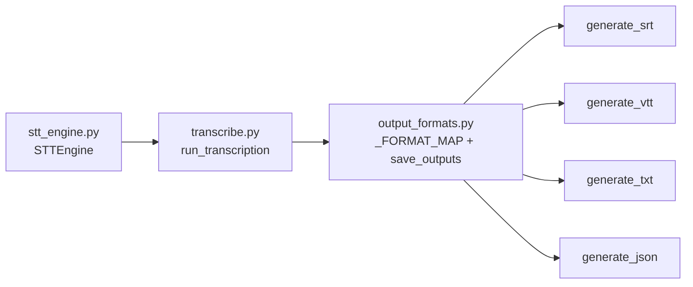

# Output Persistence and Management

<cite>
**Referenced Files in This Document**
- [output_formats.py](file://output_formats.py)
- [transcribe.py](file://transcribe.py)
- [stt_engine.py](file://stt_engine.py)
- [server.py](file://server.py)
</cite>

## Table of Contents
1. [Introduction](#introduction)
2. [Project Structure](#project-structure)
3. [Core Components](#core-components)
4. [Architecture Overview](#architecture-overview)
5. [Detailed Component Analysis](#detailed-component-analysis)
6. [Dependency Analysis](#dependency-analysis)
7. [Performance Considerations](#performance-considerations)
8. [Troubleshooting Guide](#troubleshooting-guide)
9. [Conclusion](#conclusion)

## Introduction
This document explains the output persistence and management system used to save transcription results into multiple formats. It focuses on the save_outputs function, the format mapping mechanism, directory creation, file naming conventions, format-specific handling, error handling for unknown formats, logging, and practical examples for batch output generation and validation. It also covers file system permissions, encoding standards, and troubleshooting output generation failures.

## Project Structure
The output persistence system spans a small set of focused modules:
- output_formats.py: Defines format generators and the save_outputs function that writes files to disk.
- transcribe.py: Orchestrates the transcription pipeline and invokes save_outputs to persist results.
- stt_engine.py: Provides the STT engine used to produce the segment data passed to save_outputs.
- server.py: Demonstrates runtime usage of the STT engine and related file handling patterns.

**Diagram sources**
- [transcribe.py:45-144](file://transcribe.py#L45-L144)
- [output_formats.py:118-159](file://output_formats.py#L118-L159)
- [stt_engine.py:71-105](file://stt_engine.py#L71-L105)
- [server.py:169-196](file://server.py#L169-L196)

**Section sources**
- [transcribe.py:45-144](file://transcribe.py#L45-L144)
- [output_formats.py:118-159](file://output_formats.py#L118-L159)

## Core Components
- Format mapping and generators: A dictionary maps format keys to a tuple of a generator function and a file extension. Generators accept a list of segment dictionaries and produce either a string or a dict depending on the format.
- save_outputs: Creates the output directory, iterates over requested formats, validates each format against the mapping, generates content, writes files with UTF-8 encoding, and logs progress and warnings.

Key responsibilities:
- Directory creation: Ensures the target output directory exists.
- File naming: Uses a base name plus the mapped extension.
- Format-specific handling: Writes JSON with indentation and ASCII-safe encoding; writes textual formats as plain text.
- Logging: Emits info messages for successful saves and warnings for unknown formats.

**Section sources**
- [output_formats.py:110-115](file://output_formats.py#L110-L115)
- [output_formats.py:118-159](file://output_formats.py#L118-L159)

## Architecture Overview
The pipeline integrates the STT engine with the output persistence layer. The CLI orchestrator runs the transcription steps, collects final segments, and delegates persistence to save_outputs.

**Diagram sources**
- [transcribe.py:99-143](file://transcribe.py#L99-L143)
- [stt_engine.py:71-105](file://stt_engine.py#L71-L105)
- [output_formats.py:118-159](file://output_formats.py#L118-L159)

## Detailed Component Analysis

### save_outputs Implementation
- Purpose: Persist transcription results into requested formats.
- Inputs:
  - segments: list of dicts with keys start, end, speaker, text.
  - output_dir: target directory for output files.
  - base_name: filename stem (without extension).
  - formats: iterable of format keys (e.g., srt, vtt, txt, json).
- Behavior:
  - Creates output_dir if missing.
  - Normalizes each format key to lowercase and trims whitespace.
  - Skips unknown formats with a warning log.
  - For each supported format:
    - Calls the corresponding generator to produce content.
    - Writes to output_dir/base_name.ext.
    - Uses UTF-8 encoding for all formats.
    - For JSON, dumps with indentation and ASCII-safe settings.
    - Logs success with the format and file path.
- Output: List of absolute or resolved file paths that were written.

**Diagram sources**
- [output_formats.py:118-159](file://output_formats.py#L118-L159)

**Section sources**
- [output_formats.py:118-159](file://output_formats.py#L118-L159)

### Format Mapping System (_FORMAT_MAP)
- Definition: Maps format keys to tuples of (generator_function, file_extension).
- Supported keys: srt, vtt, txt, json.
- Validation: Unknown keys are skipped with a warning; no exception is raised.

**Diagram sources**
- [output_formats.py:110-115](file://output_formats.py#L110-L115)
- [output_formats.py:43-103](file://output_formats.py#L43-L103)

**Section sources**
- [output_formats.py:110-115](file://output_formats.py#L110-L115)

### File Naming Conventions and Directory Creation
- Directory: Created via os.makedirs with exist_ok enabled to avoid errors if the directory already exists.
- Naming: output_dir/base_name.ext, where ext comes from the format mapping.
- Base name: Typically derived from the input audio file’s stem in the CLI pipeline.

Practical example paths:
- output_dir: results/
- base_name: meeting_20250101_123456
- Files produced:
  - results/meeting_20250101_123456.srt
  - results/meeting_20250101_123456.vtt
  - results/meeting_20250101_123456.txt
  - results/meeting_20250101_123456.json

**Section sources**
- [output_formats.py:136](file://output_formats.py#L136)
- [output_formats.py:147](file://output_formats.py#L147)
- [transcribe.py:130-136](file://transcribe.py#L130-L136)

### Format-Specific Handling
- Textual formats (srt, vtt, txt): Generated as strings and written as UTF-8 text.
- JSON: Generated as a dict and written with UTF-8 using indentation for readability.
- Encoding: All writes use UTF-8 to preserve international characters and punctuation.

**Section sources**
- [output_formats.py:149-154](file://output_formats.py#L149-L154)

### Error Handling for Unknown Formats
- Behavior: Unknown format keys are logged as warnings and skipped.
- Impact: The function continues processing remaining formats without raising exceptions.

**Section sources**
- [output_formats.py:141-143](file://output_formats.py#L141-L143)

### Logging Mechanisms
- save_outputs logs:
  - Info: Successful save with format and file path.
  - Warning: Unknown format key with the offending key.
- CLI prints the list of saved files after save_outputs returns.

**Section sources**
- [output_formats.py:157](file://output_formats.py#L157)
- [output_formats.py:142](file://output_formats.py#L142)
- [transcribe.py:140-141](file://transcribe.py#L140-L141)

### Batch Output Generation Example
- CLI invocation demonstrates generating multiple formats in one run:
  - Formats: srt, json, txt, vtt
  - Output directory: results/
  - Base name: derived from input audio file stem
- The CLI collects final_segments, determines output_dir and base_name, then calls save_outputs with the formats list.

Example usage reference:
- [transcribe.py:128-139](file://transcribe.py#L128-L139)

**Section sources**
- [transcribe.py:128-139](file://transcribe.py#L128-L139)

### File Path Management
- Determining output_dir:
  - If --output is provided, use that directory.
  - Otherwise, default to <input_dir>/output/.
- Determining base_name:
  - Use the stem of the input audio file path.
- Joining paths:
  - Use os.path.join to construct final file paths.

**Section sources**
- [transcribe.py:130-136](file://transcribe.py#L130-L136)

### Output Validation Processes
- Pre-save checks:
  - save_outputs does not validate segment content; it assumes segments contain required keys.
  - If a generator fails due to missing keys, the exception propagates from the generator.
- Post-save verification:
  - The function returns a list of written paths; the caller can check this list for expected files.

**Section sources**
- [output_formats.py:118-159](file://output_formats.py#L118-L159)

## Dependency Analysis
- save_outputs depends on:
  - _FORMAT_MAP for format resolution.
  - Individual generator functions for content production.
  - os.makedirs for directory creation.
  - json for JSON serialization.
- The CLI pipeline depends on save_outputs to persist results after transcription completes.

**Diagram sources**
- [output_formats.py:110-115](file://output_formats.py#L110-L115)
- [output_formats.py:118-159](file://output_formats.py#L118-L159)
- [transcribe.py:45-144](file://transcribe.py#L45-L144)
- [stt_engine.py:71-105](file://stt_engine.py#L71-L105)

**Section sources**
- [output_formats.py:110-115](file://output_formats.py#L110-L115)
- [output_formats.py:118-159](file://output_formats.py#L118-L159)
- [transcribe.py:45-144](file://transcribe.py#L45-L144)
- [stt_engine.py:71-105](file://stt_engine.py#L71-L105)

## Performance Considerations
- save_outputs writes files sequentially; concurrency is not handled here.
- For large batches, consider:
  - Parallelizing file writes if needed.
  - Using buffered I/O or asynchronous file operations.
- JSON indentation improves readability but slightly increases file size; acceptable trade-off for most use cases.

[No sources needed since this section provides general guidance]

## Troubleshooting Guide
Common issues and resolutions:
- Permission denied when writing:
  - Ensure the process has write permissions to output_dir.
  - Verify output_dir exists or can be created by the process.
  - Reference: [output_formats.py:136](file://output_formats.py#L136)
- Unknown format key:
  - Confirm the format string is one of srt, vtt, txt, json.
  - save_outputs logs a warning and skips the key.
  - Reference: [output_formats.py:141-143](file://output_formats.py#L141-L143)
- Missing or invalid segment data:
  - Generators expect segments with keys start, end, speaker, text.
  - If a generator raises an exception, inspect the segment structure.
  - References:
    - [output_formats.py:43-103](file://output_formats.py#L43-L103)
    - [transcribe.py:128](file://transcribe.py#L128)
- Encoding problems:
  - All writes use UTF-8; ensure downstream consumers also interpret UTF-8.
  - References:
    - [output_formats.py:150-154](file://output_formats.py#L150-L154)
- No files saved:
  - Check that formats contains at least one known key.
  - Confirm save_outputs returned a non-empty list.
  - References:
    - [output_formats.py:159](file://output_formats.py#L159)
    - [transcribe.py:140-141](file://transcribe.py#L140-L141)

**Section sources**
- [output_formats.py:136](file://output_formats.py#L136)
- [output_formats.py:141-143](file://output_formats.py#L141-L143)
- [output_formats.py:150-154](file://output_formats.py#L150-L154)
- [output_formats.py:159](file://output_formats.py#L159)
- [transcribe.py:140-141](file://transcribe.py#L140-L141)

## Conclusion
The output persistence system provides a clean, extensible mechanism to export transcription results across multiple formats. save_outputs centralizes directory creation, file naming, format validation, and writing with UTF-8 encoding. Its design allows straightforward addition of new formats by extending the format mapping and adding a generator. The CLI pipeline integrates this system seamlessly, while logging and warnings support operational visibility and troubleshooting.