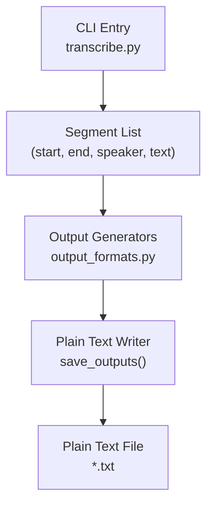
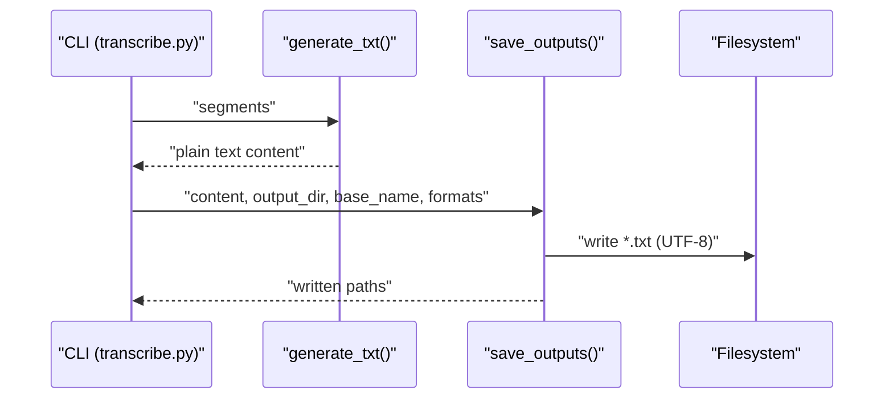
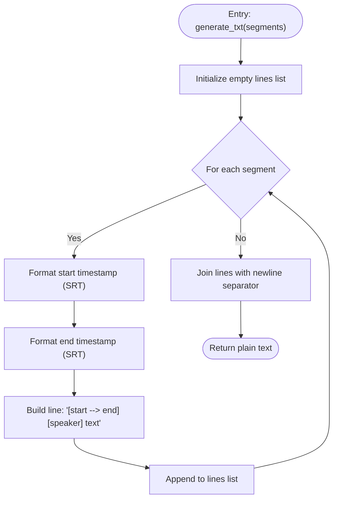
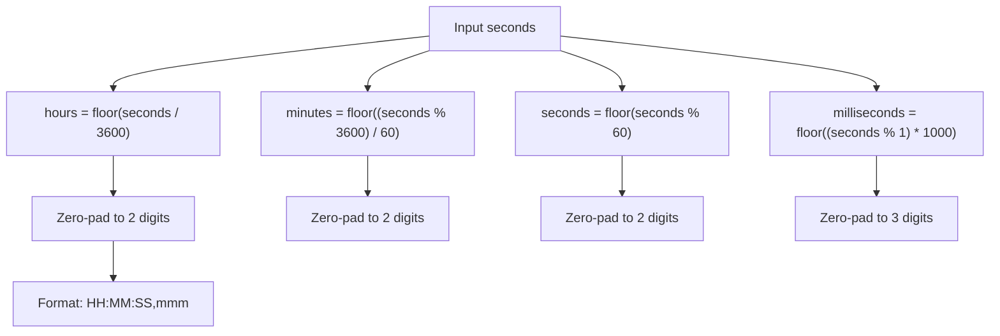
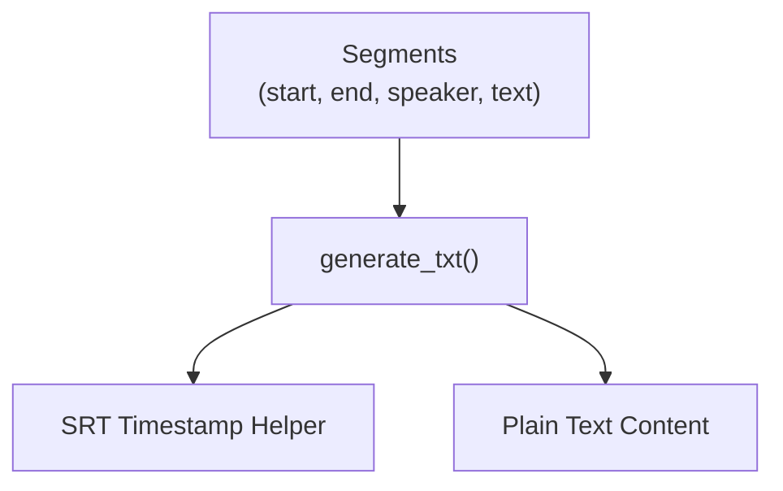

# Plain Text Format

<cite>
**Referenced Files in This Document**
- [output_formats.py](file://output_formats.py)
- [transcribe.py](file://transcribe.py)
- [README.md](file://README.md)
- [audio/output/局長講課1.txt](file://audio/output/局長講課1.txt)
</cite>

## Table of Contents
1. [Introduction](#introduction)
2. [Project Structure](#project-structure)
3. [Core Components](#core-components)
4. [Architecture Overview](#architecture-overview)
5. [Detailed Component Analysis](#detailed-component-analysis)
6. [Dependency Analysis](#dependency-analysis)
7. [Performance Considerations](#performance-considerations)
8. [Troubleshooting Guide](#troubleshooting-guide)
9. [Conclusion](#conclusion)
10. [Appendices](#appendices)

## Introduction
This document explains the plain text transcript format used by the meeting transcription system. It covers the timestamp format, speaker labeling conventions, and the line-by-line output structure produced by the generate_txt function. It also documents time formatting consistency, text formatting rules, examples of plain text output, readability considerations, use cases, character encoding, line break handling, and integration with text processing tools and search systems.

## Project Structure
The plain text output is generated by a dedicated module that formats transcription segments into human-readable lines. The CLI orchestrates the end-to-end pipeline and invokes the output generator.

**Diagram sources**
- [transcribe.py:127-139](file://transcribe.py#L127-L139)
- [output_formats.py:118-159](file://output_formats.py#L118-L159)

**Section sources**
- [transcribe.py:127-139](file://transcribe.py#L127-L139)
- [output_formats.py:118-159](file://output_formats.py#L118-L159)

## Core Components
- Plain text generator: produce a line-per-segment transcript with timestamps and speaker labels.
- Timestamp formatting: consistent SRT-style formatting for HH:MM:SS,mmm.
- Output persistence: write UTF-8 encoded files with platform-appropriate newlines.

Key behaviors:
- Each line follows the pattern: [HH:MM:SS,mmm --> HH:MM:SS,mmm] [SPEAKER] text
- Speaker labels are bracketed and included for each segment.
- Timestamps use comma-based millisecond separators (SRT style) for consistency with other formats.

**Section sources**
- [output_formats.py:73-84](file://output_formats.py#L73-L84)
- [output_formats.py:20-26](file://output_formats.py#L20-L26)

## Architecture Overview
The plain text output is produced by the generate_txt function and persisted via save_outputs. The CLI passes the final segment list to the generator and writes the resulting content to disk.

**Diagram sources**
- [transcribe.py:127-139](file://transcribe.py#L127-L139)
- [output_formats.py:73-84](file://output_formats.py#L73-L84)
- [output_formats.py:118-159](file://output_formats.py#L118-L159)

## Detailed Component Analysis

### Plain Text Generator: generate_txt
- Purpose: transform a list of segments into a plain text transcript.
- Input: list of dicts with keys start, end, speaker, text.
- Output: a single string with one line per segment.
- Line format: [HH:MM:SS,mmm --> HH:MM:SS,mmm] [SPEAKER] text
- Timestamps: formatted using the SRT helper to ensure HH:MM:SS,mmm with zero-padded fields.
- Speaker label: enclosed in brackets, derived from the segment’s speaker field.
- Text: appended verbatim after the speaker label.

**Diagram sources**
- [output_formats.py:73-84](file://output_formats.py#L73-L84)
- [output_formats.py:20-26](file://output_formats.py#L20-L26)

**Section sources**
- [output_formats.py:73-84](file://output_formats.py#L73-L84)
- [output_formats.py:20-26](file://output_formats.py#L20-L26)

### Timestamp Formatting Consistency
- SRT-style formatting is used for plain text to align with the SRT generator and ensure interoperability.
- The helper computes hours, minutes, seconds, and milliseconds, zero-padding each component to two or three digits as needed.
- Milliseconds are separated by a comma (,), not a dot, to match SRT conventions.

**Diagram sources**
- [output_formats.py:20-26](file://output_formats.py#L20-L26)

**Section sources**
- [output_formats.py:20-26](file://output_formats.py#L20-L26)

### Text Formatting Rules
- Each line begins with a timestamp range in square brackets.
- The speaker label is placed immediately after the closing bracket of the timestamp range.
- The text content follows the speaker label with a single space separating them.
- No trailing whitespace is added beyond the newline terminator.

**Section sources**
- [output_formats.py:73-84](file://output_formats.py#L73-L84)

### Examples of Plain Text Output
Below are representative examples of the plain text transcript format. These illustrate typical scenarios such as normal transcription, short segments, and error conditions.

- Normal segment:
  - [00:00:02,899 --> 00:00:03,034] [SPEAKER_00] 各位同
- Multi-word segment:
  - [00:00:07,050 --> 00:00:14,712] [SPEAKER_00] 何恭喜同學咧已經完成咗第一週嘅課程啦咁我哋今日咧就係第二週課程嘅開始嘅夢作咧我哋由梁去面讀
- Error segment:
  - [00:00:22,035 --> 00:24:03,619] [SPEAKER_00] [Transcribe Error]
- Short segment:
  - [00:00:46,774 --> 00:00:51,719] [SPEAKER_01] 要因爲即系即如果幾個鐘頭個腰都系冇嘅話咧可能都比較失過

These examples demonstrate the line-by-line structure, speaker labeling, and timestamp formatting.

**Section sources**
- [audio/output/局長講課1.txt:1-100](file://audio/output/局長講課1.txt#L1-L100)

### Readability Considerations
- The format is designed for easy scanning and manual review.
- Timestamps are concise and machine-parseable while remaining readable.
- Speaker labels clearly indicate who spoke each portion.
- The structure enables quick navigation to specific time ranges.

### Use Cases for Plain Text Transcripts
- Manual editing and proofreading.
- Integration with external text processing tools (e.g., search engines, analytics).
- Accessibility review and captioning preparation.
- Archival storage of spoken content with precise timing.

### Character Encoding and Line Break Handling
- Encoding: UTF-8 is used when writing plain text files, preserving multilingual content.
- Newlines: lines are joined with a single newline character; the file ends with a newline.

**Section sources**
- [output_formats.py:149-154](file://output_formats.py#L149-L154)

### Integration with Text Processing Tools and Search Systems
- The plain text format is compatible with standard text editors, grep-like tools, and search engines.
- Timestamps enable precise time-based filtering and indexing.
- Speaker labels support speaker-aware analytics and filtering.

**Section sources**
- [README.md:62-72](file://README.md#L62-L72)

## Dependency Analysis
The plain text generator depends on the timestamp formatting helper and operates on the standardized segment structure produced by earlier pipeline stages.

**Diagram sources**
- [output_formats.py:73-84](file://output_formats.py#L73-L84)
- [output_formats.py:20-26](file://output_formats.py#L20-L26)

**Section sources**
- [output_formats.py:73-84](file://output_formats.py#L73-L84)
- [output_formats.py:20-26](file://output_formats.py#L20-L26)

## Performance Considerations
- The plain text generator performs simple string concatenations and formatting; overhead is minimal.
- Writing to disk uses UTF-8 encoding and a single join operation, which scales linearly with the number of segments.

## Troubleshooting Guide
- Unexpected speaker labels: verify that the segment list contains a speaker field for each entry.
- Incorrect timestamps: confirm that start and end times are in seconds and non-negative.
- Missing output: ensure the output directory exists or is creatable, and that the format list includes "txt".
- Encoding issues: confirm that the writer uses UTF-8 encoding.

**Section sources**
- [output_formats.py:118-159](file://output_formats.py#L118-L159)

## Conclusion
The plain text transcript format provides a compact, human-readable representation of meeting transcripts with precise timing and speaker attribution. Its design ensures consistency with other output formats, supports robust text processing, and integrates seamlessly with common tools and search systems.

## Appendices

### Appendix A: CLI Integration
- The CLI invokes the output generator and persists files in the chosen output directory with UTF-8 encoding.

**Section sources**
- [transcribe.py:127-139](file://transcribe.py#L127-L139)
- [output_formats.py:118-159](file://output_formats.py#L118-L159)