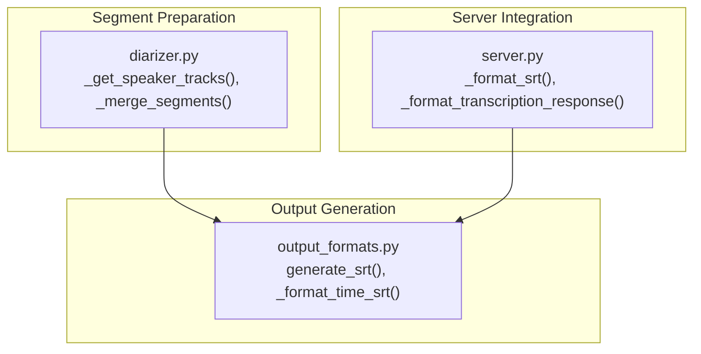
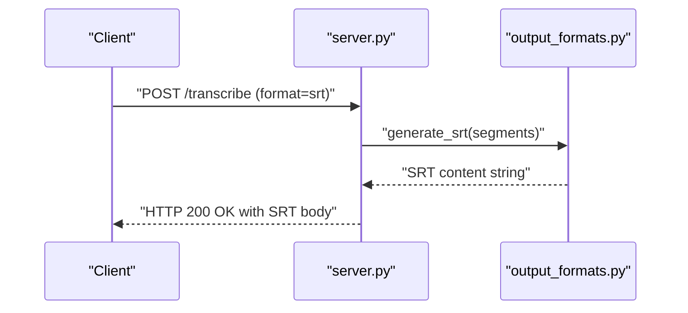
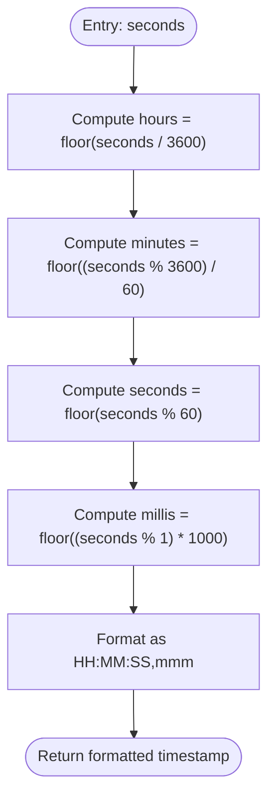
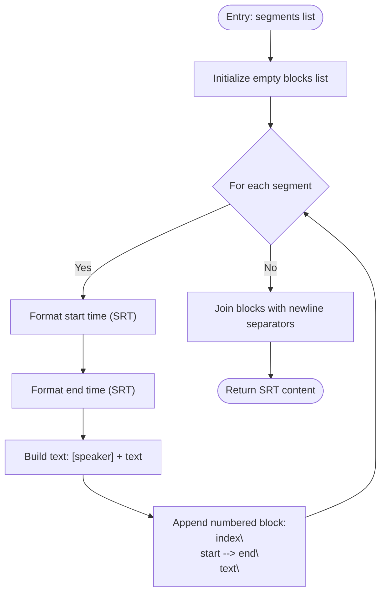
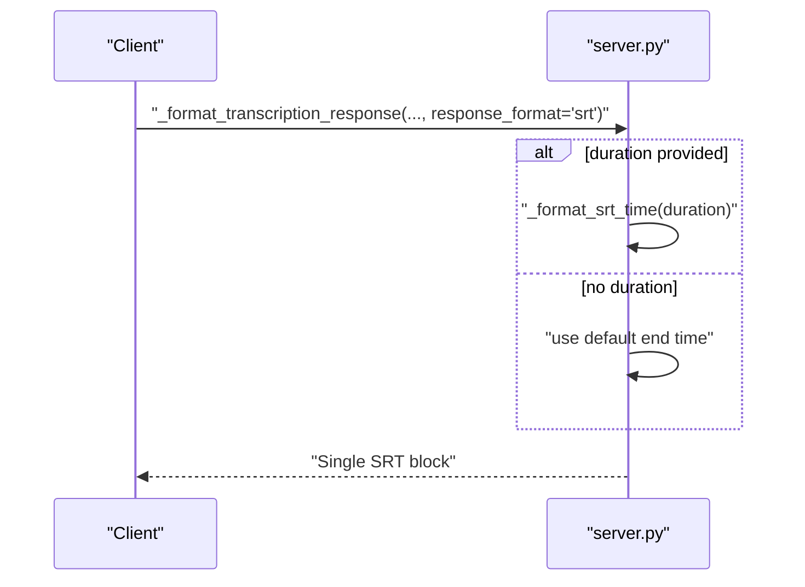
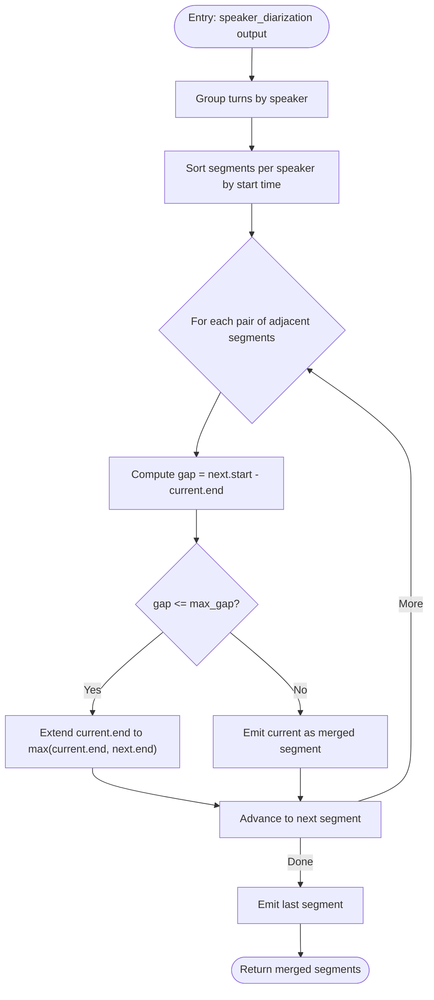
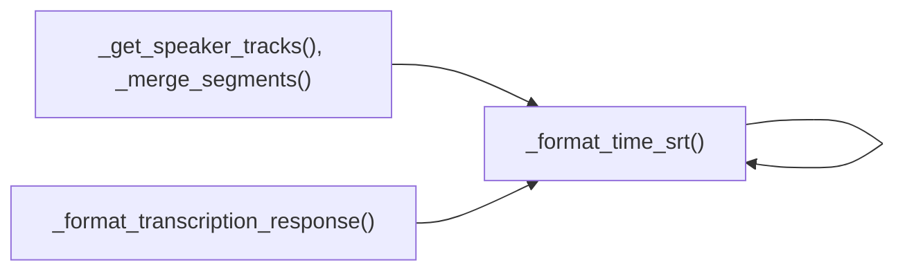

# SRT Subtitle Format

<cite>
**Referenced Files in This Document**
- [output_formats.py](file://output_formats.py)
- [server.py](file://server.py)
- [diarizer.py](file://diarizer.py)
</cite>

## Table of Contents
1. [Introduction](#introduction)
2. [Project Structure](#project-structure)
3. [Core Components](#core-components)
4. [Architecture Overview](#architecture-overview)
5. [Detailed Component Analysis](#detailed-component-analysis)
6. [Dependency Analysis](#dependency-analysis)
7. [Performance Considerations](#performance-considerations)
8. [Troubleshooting Guide](#troubleshooting-guide)
9. [Conclusion](#conclusion)

## Introduction
This document explains how the project generates SRT (SubRip Subtitle) files from transcription segments. It covers the SRT timestamp format (HH:MM:SS,mmm), the block numbering system, and subtitle text formatting with speaker labels. It also documents the generate_srt function implementation, including segment processing, time formatting, and output structure. Finally, it provides format validation requirements, compatibility considerations with video players and editing software, common formatting issues, character encoding standards, and troubleshooting guidance.

## Project Structure
The SRT generation logic is primarily implemented in a dedicated module responsible for output formats. Supporting components include:
- A server module that exposes endpoints returning SRT-formatted content for single-text requests.
- A diarizer module that prepares speaker-aware segments suitable for SRT generation.

**Diagram sources**
- [output_formats.py:20-55](file://output_formats.py#L20-L55)
- [server.py:50-84](file://server.py#L50-L84)
- [diarizer.py:76-109](file://diarizer.py#L76-L109)

**Section sources**
- [output_formats.py:1-137](file://output_formats.py#L1-L137)
- [server.py:50-93](file://server.py#L50-L93)
- [diarizer.py:76-109](file://diarizer.py#L76-L109)

## Core Components
- SRT time formatter: Converts floating-point seconds into the SRT timestamp format HH:MM:SS,mmm.
- SRT generator: Builds SRT blocks from a list of segment dictionaries containing start, end, speaker, and text keys.
- Server-side SRT formatter: Produces a minimal SRT block for single-text responses when duration is provided.
- Segment preparation: Groups diarized turns by speaker and merges adjacent segments from the same speaker to improve continuity.

Key behaviors:
- Timestamp formatting ensures two-digit hours, minutes, and seconds, and three-digit milliseconds separated by a comma.
- Each SRT block includes a sequential number, timestamps in SRT format, speaker label, and text content, followed by a blank line separator.
- Speaker labels are embedded inside brackets as part of the text field.

**Section sources**
- [output_formats.py:20-26](file://output_formats.py#L20-L26)
- [output_formats.py:43-55](file://output_formats.py#L43-L55)
- [server.py:50-53](file://server.py#L50-L53)
- [diarizer.py:76-109](file://diarizer.py#L76-L109)

## Architecture Overview
The SRT pipeline transforms diarized and aligned segments into SRT content. The server can also produce a minimal SRT block for quick responses.

**Diagram sources**
- [server.py:62-84](file://server.py#L62-L84)
- [output_formats.py:43-55](file://output_formats.py#L43-L55)

## Detailed Component Analysis

### SRT Time Formatting
The SRT timestamp formatter converts a floating-point value representing seconds into the HH:MM:SS,mmm format. It computes hours, minutes, seconds, and milliseconds, then returns a zero-padded string with a comma separating the seconds and milliseconds.

**Diagram sources**
- [output_formats.py:20-26](file://output_formats.py#L20-L26)

**Section sources**
- [output_formats.py:20-26](file://output_formats.py#L20-L26)

### SRT Block Generator
The SRT generator iterates over a list of segment dictionaries, formats each segment’s start and end times, constructs the text line with a speaker label, and appends a numbered block with proper separators.

**Diagram sources**
- [output_formats.py:43-55](file://output_formats.py#L43-L55)

**Section sources**
- [output_formats.py:43-55](file://output_formats.py#L43-L55)

### Server-Side SRT Formatter
For single-text responses, the server composes a minimal SRT block with a fixed start time and either a computed end time based on duration or a default interval.

**Diagram sources**
- [server.py:50-53](file://server.py#L50-L53)
- [server.py:62-84](file://server.py#L62-L84)

**Section sources**
- [server.py:50-53](file://server.py#L50-L53)
- [server.py:62-84](file://server.py#L62-L84)

### Segment Preparation for SRT
Speaker tracks are grouped from diarized outputs and merged when the gap between consecutive turns is below a threshold. This improves continuity for SRT generation by reducing small silences or overlaps.

**Diagram sources**
- [diarizer.py:76-109](file://diarizer.py#L76-L109)

**Section sources**
- [diarizer.py:76-109](file://diarizer.py#L76-L109)

## Dependency Analysis
- The SRT generator depends on the SRT time formatter for timestamp conversion.
- The server integrates the SRT generator to serve SRT content via endpoints.
- Diarizer output feeds into the SRT generator as preprocessed segments.

**Diagram sources**
- [output_formats.py:20-26](file://output_formats.py#L20-L26)
- [output_formats.py:43-55](file://output_formats.py#L43-L55)
- [server.py:62-84](file://server.py#L62-L84)
- [diarizer.py:76-109](file://diarizer.py#L76-L109)

**Section sources**
- [output_formats.py:20-26](file://output_formats.py#L20-L26)
- [output_formats.py:43-55](file://output_formats.py#L43-L55)
- [server.py:62-84](file://server.py#L62-L84)
- [diarizer.py:76-109](file://diarizer.py#L76-L109)

## Performance Considerations
- Time formatting is O(n) with respect to the number of segments.
- String concatenation for building blocks is efficient for typical segment counts.
- Merging adjacent segments reduces total block count and can improve playback smoothness.

## Troubleshooting Guide
Common issues and resolutions:
- Invalid segment keys: Ensure each segment dictionary contains start, end, speaker, and text keys. The generator expects these fields by name.
- Non-monotonic timestamps: Verify that end times are greater than or equal to start times and that segments are ordered by increasing start times.
- Overlapping segments: If overlaps occur after alignment, consider adjusting merging thresholds or post-processing to remove duplicates.
- Speaker label formatting: Speaker labels are embedded as [speaker] within the text. Avoid introducing extra brackets in the original speaker value to prevent malformed cues.
- Encoding: Save SRT files with UTF-8 encoding to support international characters and punctuation commonly present in transcripts.
- Player compatibility: Ensure commas separate seconds and milliseconds in timestamps. Some players are strict about HH:MM:SS,mmm versus HH:MM:SS.mmm.
- Large files: For very long transcripts, consider splitting output into multiple files or trimming silence to reduce block count.

Validation checklist:
- Each block contains a sequential integer index.
- Timestamps use HH:MM:SS,mmm format.
- Each block ends with a blank line.
- Text begins with "[speaker] " followed by the transcribed text.

**Section sources**
- [output_formats.py:43-55](file://output_formats.py#L43-L55)
- [output_formats.py:20-26](file://output_formats.py#L20-L26)

## Conclusion
The project provides a straightforward and robust implementation for generating SRT subtitles from diarized and aligned transcription segments. The SRT generator enforces the standard format with precise timestamp formatting, speaker labeling, and block separation. Integrating with the server allows serving SRT content directly, while the diarizer’s merging logic helps produce cleaner, more continuous subtitles suitable for playback and editing.