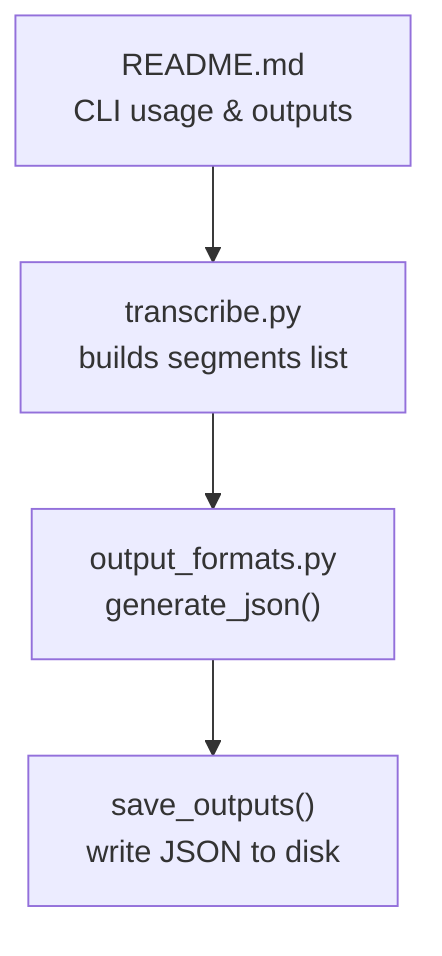
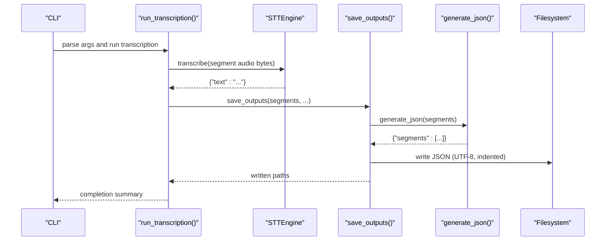
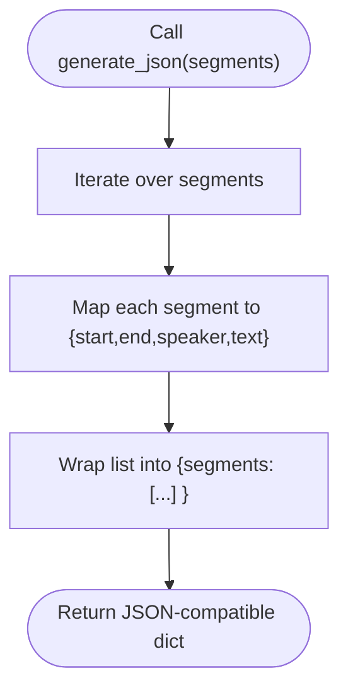
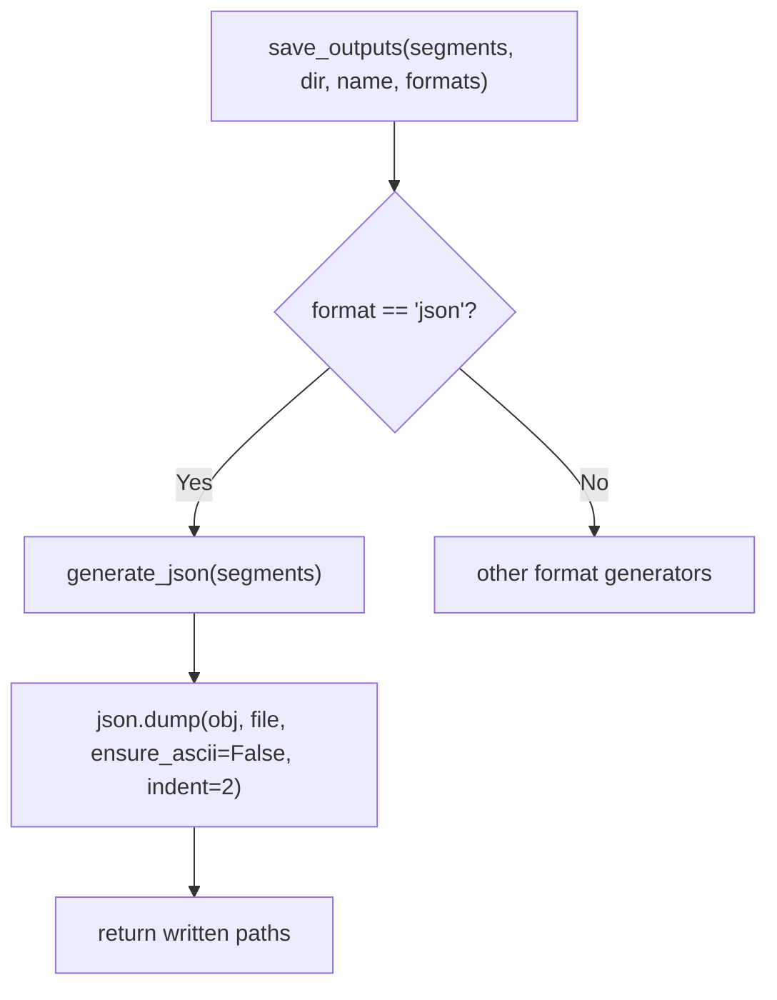
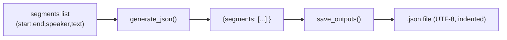

# Structured JSON Format

<cite>
**Referenced Files in This Document**
- [output_formats.py](file://output_formats.py)
- [transcribe.py](file://transcribe.py)
- [README.md](file://README.md)
</cite>

## Table of Contents
1. [Introduction](#introduction)
2. [Project Structure](#project-structure)
3. [Core Components](#core-components)
4. [Architecture Overview](#architecture-overview)
5. [Detailed Component Analysis](#detailed-component-analysis)
6. [Dependency Analysis](#dependency-analysis)
7. [Performance Considerations](#performance-considerations)
8. [Troubleshooting Guide](#troubleshooting-guide)
9. [Conclusion](#conclusion)

## Introduction
This document explains the structured JSON output format produced by the meeting transcription pipeline. It covers the JSON schema structure, the implementation of the JSON generation function, serialization behavior, and practical usage patterns for API consumption and downstream analytics workflows. It also outlines validation considerations and integration guidance for external systems.

## Project Structure
The JSON output is generated as part of the unified transcription pipeline. The relevant components are:
- The JSON generation function resides in the output format module.
- The transcription pipeline constructs the input segments list and invokes the output writer.
- The README documents the CLI usage and output layout.

**Diagram sources**
- [transcribe.py:96-142](file://transcribe.py#L96-L142)
- [output_formats.py:87-160](file://output_formats.py#L87-L160)
- [README.md:40-72](file://README.md#L40-L72)

**Section sources**
- [transcribe.py:96-142](file://transcribe.py#L96-L142)
- [output_formats.py:87-160](file://output_formats.py#L87-L160)
- [README.md:40-72](file://README.md#L40-L72)

## Core Components
- JSON schema structure
  - Top-level object with a single property:
    - segments: array of segment objects
  - Each segment object contains:
    - start: number (seconds)
    - end: number (seconds)
    - speaker: string
    - text: string
- Generation function
  - Function name: generate_json
  - Purpose: transform a list of segment dictionaries into a JSON-compatible dictionary with a top-level segments array
- Serialization behavior
  - Called by save_outputs for JSON format
  - Uses UTF-8 encoding and indented formatting for readability

**Section sources**
- [output_formats.py:87-103](file://output_formats.py#L87-L103)
- [output_formats.py:149-151](file://output_formats.py#L149-L151)

## Architecture Overview
The structured JSON is produced during the transcription pipeline and persisted to disk alongside other formats.

**Diagram sources**
- [transcribe.py:96-142](file://transcribe.py#L96-L142)
- [output_formats.py:118-160](file://output_formats.py#L118-L160)
- [output_formats.py:87-103](file://output_formats.py#L87-L103)

## Detailed Component Analysis

### JSON Schema Definition
- Top-level object
  - Property: segments
    - Type: array
    - Items: object with properties:
      - start: number (seconds), required
      - end: number (seconds), required
      - speaker: string, required
      - text: string, required
- Data types
  - start, end: numeric (float-like) representing seconds
  - speaker: string identifier
  - text: string transcript content
- Ordering
  - Segments are sorted by start time prior to JSON generation

**Section sources**
- [transcribe.py:125-125](file://transcribe.py#L125-L125)
- [output_formats.py:87-103](file://output_formats.py#L87-L103)

### JSON Generation Implementation
- Function: generate_json
- Input: list of segment dictionaries
- Output: dictionary with a top-level segments array
- Behavior: projects each segment to the required fields and wraps them in an object

**Diagram sources**
- [output_formats.py:87-103](file://output_formats.py#L87-L103)

**Section sources**
- [output_formats.py:87-103](file://output_formats.py#L87-L103)

### JSON Serialization and Persistence
- Called by: save_outputs
- Encoding: UTF-8
- Formatting: indented (indent=2)
- File extension: .json
- Output location: derived from base name and output directory

**Diagram sources**
- [output_formats.py:118-160](file://output_formats.py#L118-L160)
- [output_formats.py:149-151](file://output_formats.py#L149-L151)

**Section sources**
- [output_formats.py:118-160](file://output_formats.py#L118-L160)
- [output_formats.py:149-151](file://output_formats.py#L149-L151)

### API Consumption Patterns
- CLI usage
  - Enable JSON output by including json in the comma-separated format list
  - Outputs are placed under the configured output directory with the base name
- Example invocation
  - See the README’s usage examples for specifying formats and output directory
- File discovery
  - The JSON file shares the same base name as the input and has a .json extension

**Section sources**
- [README.md:40-72](file://README.md#L40-L72)
- [README.md:90-122](file://README.md#L90-L122)

### Downstream Processing Workflows
- Analytics platforms
  - Parse the segments array to compute metrics such as speaker duration, average words per segment, or sentiment trends
  - Use start/end timestamps to align transcripts with external event logs or video timelines
- Post-processing
  - Normalize speaker identifiers if needed
  - Filter out placeholder texts for errors or empty segments
- Integration with external systems
  - Stream the JSON to cloud storage or message queues for asynchronous processing
  - Use the structured data as input for summarization, keyword extraction, or indexing services

[No sources needed since this section provides general guidance]

## Dependency Analysis
The JSON generation depends on the pipeline producing a properly ordered list of segments with the required fields.

**Diagram sources**
- [transcribe.py:125-125](file://transcribe.py#L125-L125)
- [output_formats.py:87-103](file://output_formats.py#L87-L103)
- [output_formats.py:149-151](file://output_formats.py#L149-L151)

**Section sources**
- [transcribe.py:125-125](file://transcribe.py#L125-L125)
- [output_formats.py:87-103](file://output_formats.py#L87-L103)
- [output_formats.py:149-151](file://output_formats.py#L149-L151)

## Performance Considerations
- Sorting cost
  - The pipeline sorts segments by start time before generating JSON; this is O(n log n) and acceptable for typical meeting lengths
- Memory footprint
  - The JSON generator creates a new dictionary with a segments array; memory usage scales linearly with the number of segments
- I/O characteristics
  - JSON is written once per run with UTF-8 and indentation enabled for human readability; for machine consumption, consider consuming the file directly without re-parsing

[No sources needed since this section provides general guidance]

## Troubleshooting Guide
- Missing fields in segments
  - Ensure each segment contains start, end, speaker, and text; otherwise, the JSON will omit those entries
- Incorrect ordering
  - The pipeline sorts by start time; if segments appear out of order, verify the upstream diarization and transcription steps
- Encoding issues
  - JSON is written with UTF-8; ensure consumers open the file with UTF-8 decoding
- Placeholder texts
  - The pipeline may insert error placeholders for segments where audio could not be processed; filter or handle these appropriately downstream

**Section sources**
- [transcribe.py:109-114](file://transcribe.py#L109-L114)
- [transcribe.py:125-125](file://transcribe.py#L125-L125)
- [output_formats.py:149-151](file://output_formats.py#L149-L151)

## Conclusion
The structured JSON output provides a compact, ordered representation of transcribed segments suitable for analytics and downstream systems. Its schema is minimal and explicit, enabling straightforward parsing and integration. The generation and serialization are handled consistently within the pipeline, ensuring reliable file output with UTF-8 encoding and readable formatting.