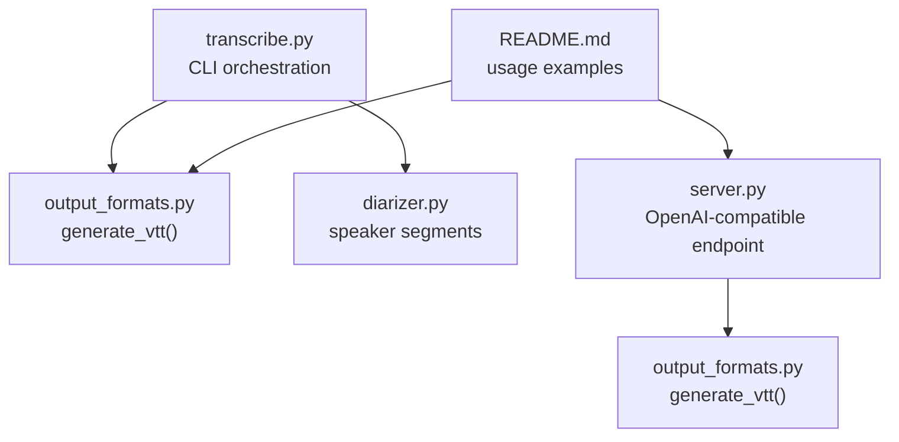
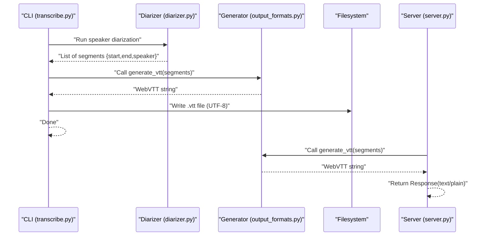
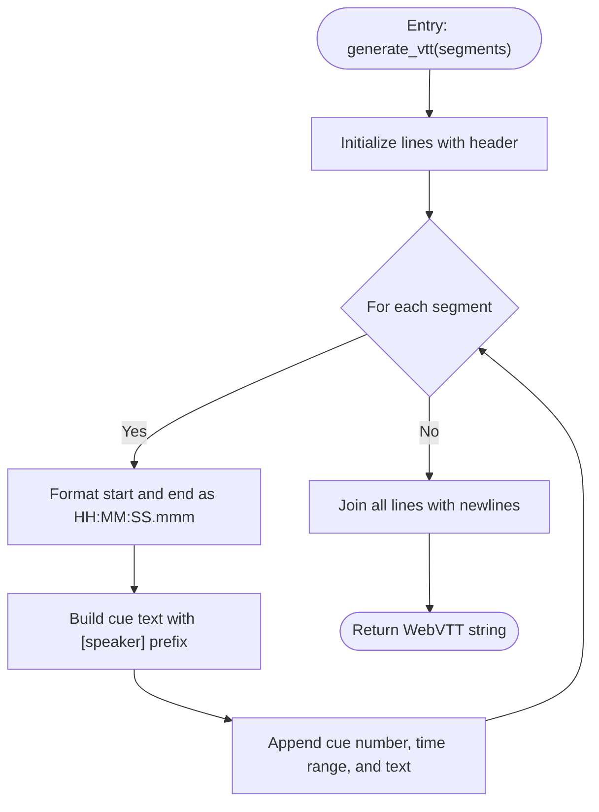
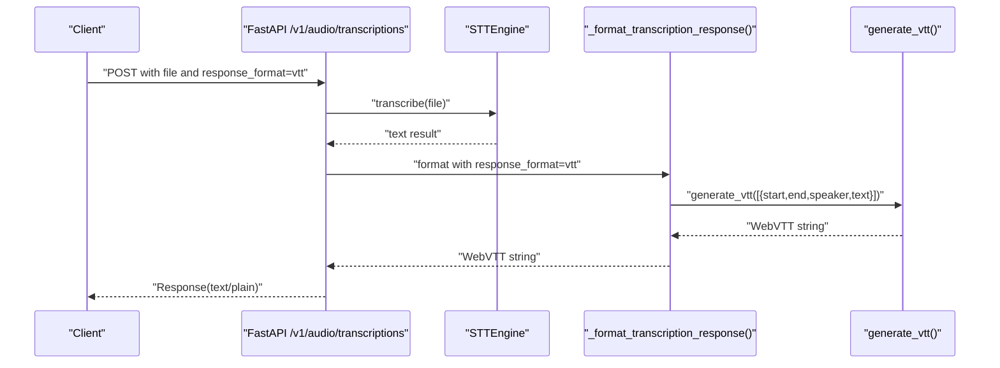
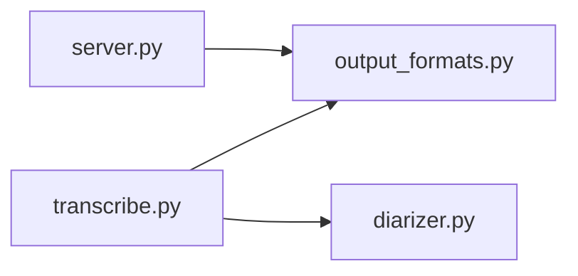

# WebVTT Format

<cite>
**Referenced Files in This Document**
- [output_formats.py](file://output_formats.py)
- [transcribe.py](file://transcribe.py)
- [server.py](file://server.py)
- [diarizer.py](file://diarizer.py)
- [README.md](file://README.md)
</cite>

## Table of Contents
1. [Introduction](#introduction)
2. [Project Structure](#project-structure)
3. [Core Components](#core-components)
4. [Architecture Overview](#architecture-overview)
5. [Detailed Component Analysis](#detailed-component-analysis)
6. [Dependency Analysis](#dependency-analysis)
7. [Performance Considerations](#performance-considerations)
8. [Troubleshooting Guide](#troubleshooting-guide)
9. [Conclusion](#conclusion)
10. [Appendices](#appendices)

## Introduction
This document explains how the project generates WebVTT (Web Video Text Tracks) subtitles from meeting transcription results. It covers the WebVTT specification, header and timestamp formats, cue numbering, and the implementation of the WebVTT generator. It also compares WebVTT with SRT, describes encoding considerations, and provides practical examples for saving WebVTT files and integrating them with HTML5 video players.

## Project Structure
The WebVTT generation is implemented in a dedicated output format module and is invoked by the main transcription pipeline. The server mode also supports returning WebVTT via an OpenAI-compatible endpoint.

**Diagram sources**
- [transcribe.py:118-143](file://transcribe.py#L118-L143)
- [output_formats.py:58-70](file://output_formats.py#L58-L70)
- [diarizer.py:55-70](file://diarizer.py#L55-L70)
- [server.py:121-160](file://server.py#L121-L160)

**Section sources**
- [README.md:62-72](file://README.md#L62-L72)
- [transcribe.py:118-143](file://transcribe.py#L118-L143)
- [server.py:121-160](file://server.py#L121-L160)

## Core Components
- WebVTT generator: produces WebVTT content from a list of segments containing start/end timestamps, speaker label, and text.
- Timestamp formatters: convert floating-point seconds into WebVTT and SRT timestamp formats.
- Output persistence: writes generated WebVTT content to disk with UTF-8 encoding.
- Server-side formatter: formats a single text segment into a WebVTT response for HTTP clients.

Key responsibilities:
- Ensure the WebVTT header is present.
- Render cues with sequential cue numbers.
- Format timestamps as HH:MM:SS.mmm.
- Embed speaker labels inside the cue text.

**Section sources**
- [output_formats.py:58-70](file://output_formats.py#L58-L70)
- [output_formats.py:29-35](file://output_formats.py#L29-L35)
- [output_formats.py:118-159](file://output_formats.py#L118-L159)
- [server.py:56-59](file://server.py#L56-L59)

## Architecture Overview
The WebVTT generation pipeline integrates with the transcription workflow and the HTTP server.

**Diagram sources**
- [transcribe.py:118-143](file://transcribe.py#L118-L143)
- [diarizer.py:55-70](file://diarizer.py#L55-L70)
- [output_formats.py:58-70](file://output_formats.py#L58-L70)
- [server.py:121-160](file://server.py#L121-L160)

## Detailed Component Analysis

### WebVTT Specification and Header
- Header: The WebVTT generator prepends the required header line.
- Cue numbering: Cues are numbered sequentially starting from 1.
- Speaker label integration: The speaker label is embedded inside square brackets at the beginning of the cue text.
- Timestamp format: Hours, minutes, seconds, and milliseconds are rendered as HH:MM:SS.mmm.

Implementation highlights:
- Header emission and cue enumeration occur during generation.
- Timestamp formatting uses a dedicated formatter that emits HH:MM:SS.mmm.

**Section sources**
- [output_formats.py:58-70](file://output_formats.py#L58-L70)
- [output_formats.py:29-35](file://output_formats.py#L29-L35)

### generate_vtt Implementation
The function takes a list of segment dictionaries and returns a WebVTT-formatted string. It:
- Prepends the WebVTT header.
- Iterates over segments, formatting each segment’s start and end timestamps.
- Builds each cue line with a sequential number, the formatted time range, and the cue text that includes the speaker label.
- Joins all lines with newline separators.

**Diagram sources**
- [output_formats.py:58-70](file://output_formats.py#L58-L70)
- [output_formats.py:29-35](file://output_formats.py#L29-L35)

**Section sources**
- [output_formats.py:58-70](file://output_formats.py#L58-L70)

### Timestamp Formatting Differences: WebVTT vs SRT
- WebVTT: Uses a dot as the fractional seconds separator and zero-padded HH:MM:SS.mmm.
- SRT: Uses a comma as the fractional seconds separator and zero-padded HH:MM:SS,mmm.

The project provides separate formatters for each format to ensure compliance.

**Section sources**
- [output_formats.py:20-26](file://output_formats.py#L20-L26)
- [output_formats.py:29-35](file://output_formats.py#L29-L35)

### Speaker Label Integration
Speaker labels are included inside the cue text as “[speaker]” to align with common subtitle conventions. The diarizer supplies speaker identifiers, and the generator embeds them into each cue.

**Section sources**
- [diarizer.py:55-70](file://diarizer.py#L55-L70)
- [output_formats.py:68](file://output_formats.py#L68)

### Practical Examples: Saving WebVTT Files
- Command-line usage saves WebVTT alongside other formats. The output directory defaults to the audio file’s directory under an “output” subfolder.
- The generator writes files with UTF-8 encoding to preserve multilingual text.

Example invocation and outputs are documented in the project’s README.

**Section sources**
- [README.md:62-72](file://README.md#L62-L72)
- [output_formats.py:118-159](file://output_formats.py#L118-L159)

### Browser Compatibility and HTML5 Video Player Integration
- WebVTT is widely supported by modern browsers and HTML5 video players.
- To integrate with an HTML5 video element, add a track element referencing the generated .vtt file.

Note: This section provides general guidance. Consult your player’s documentation for precise integration steps.

[No sources needed since this section does not analyze specific files]

### Server Mode: Returning WebVTT via HTTP
The server exposes an OpenAI-compatible endpoint that can return WebVTT when the response format is set to vtt. The server formats a single text segment into a WebVTT response and returns it as text/plain.

**Diagram sources**
- [server.py:121-160](file://server.py#L121-L160)
- [server.py:62-84](file://server.py#L62-L84)
- [output_formats.py:58-70](file://output_formats.py#L58-L70)

**Section sources**
- [server.py:121-160](file://server.py#L121-L160)
- [server.py:62-84](file://server.py#L62-L84)

## Dependency Analysis
- The CLI orchestrator depends on the diarizer for speaker segments and on the output formatter for generating WebVTT content.
- The server mode depends on the output formatter to produce WebVTT responses for HTTP clients.

**Diagram sources**
- [transcribe.py:118-143](file://transcribe.py#L118-L143)
- [diarizer.py:55-70](file://diarizer.py#L55-L70)
- [server.py:121-160](file://server.py#L121-L160)

**Section sources**
- [transcribe.py:118-143](file://transcribe.py#L118-L143)
- [server.py:121-160](file://server.py#L121-L160)

## Performance Considerations
- WebVTT generation is linear in the number of segments; performance is dominated by the transcription and diarization stages.
- Writing files with UTF-8 encoding is efficient and ensures correct rendering of multilingual text.

[No sources needed since this section provides general guidance]

## Troubleshooting Guide
Common issues and resolutions:
- Incorrect timestamp format: Ensure timestamps are HH:MM:SS.mmm for WebVTT and HH:MM:SS,mmm for SRT.
- Missing header: Verify that the WebVTT header is present at the top of the file.
- Encoding problems: Confirm files are saved with UTF-8 encoding.
- Speaker label anomalies: Confirm that the diarizer assigns speaker labels and that the generator embeds them correctly.

**Section sources**
- [output_formats.py:29-35](file://output_formats.py#L29-L35)
- [output_formats.py:58-70](file://output_formats.py#L58-L70)
- [output_formats.py:118-159](file://output_formats.py#L118-L159)

## Conclusion
The project implements a robust WebVTT generator that adheres to the WebVTT specification, numbering cues sequentially, embedding speaker labels, and formatting timestamps as HH:MM:SS.mmm. It integrates seamlessly with both the CLI pipeline and the HTTP server, enabling straightforward file-based and programmatic delivery of WebVTT subtitles.

[No sources needed since this section summarizes without analyzing specific files]

## Appendices

### Appendix A: WebVTT vs SRT Summary
- Header: WebVTT requires a header; SRT does not.
- Timestamp separator: WebVTT uses a dot; SRT uses a comma.
- Cue numbering: Both use sequential numbers starting from 1.
- Speaker label: Both support speaker labels; the generator embeds them inside the cue text.

**Section sources**
- [output_formats.py:58-70](file://output_formats.py#L58-L70)
- [output_formats.py:20-26](file://output_formats.py#L20-L26)
- [output_formats.py:29-35](file://output_formats.py#L29-L35)

### Appendix B: Example Workflow References
- Saving WebVTT files: See the README’s output directory layout and CLI usage examples.
- Server-side WebVTT: See the server endpoint and response formatting logic.

**Section sources**
- [README.md:62-72](file://README.md#L62-L72)
- [server.py:121-160](file://server.py#L121-L160)