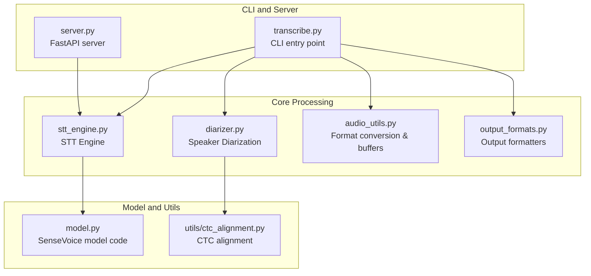
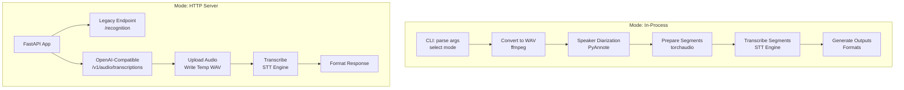
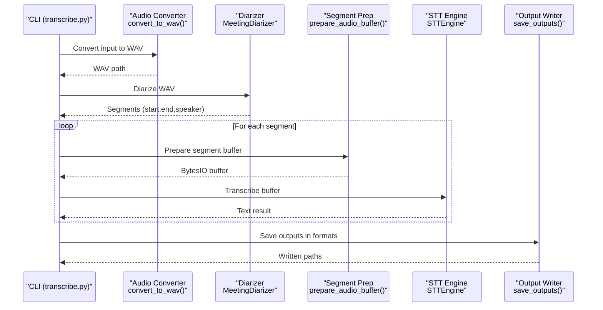
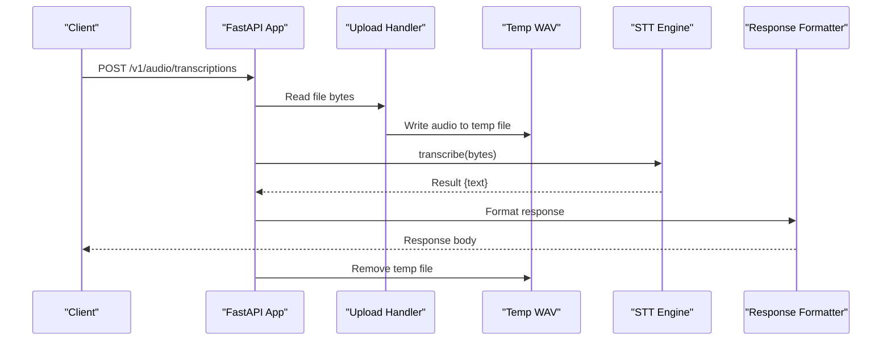
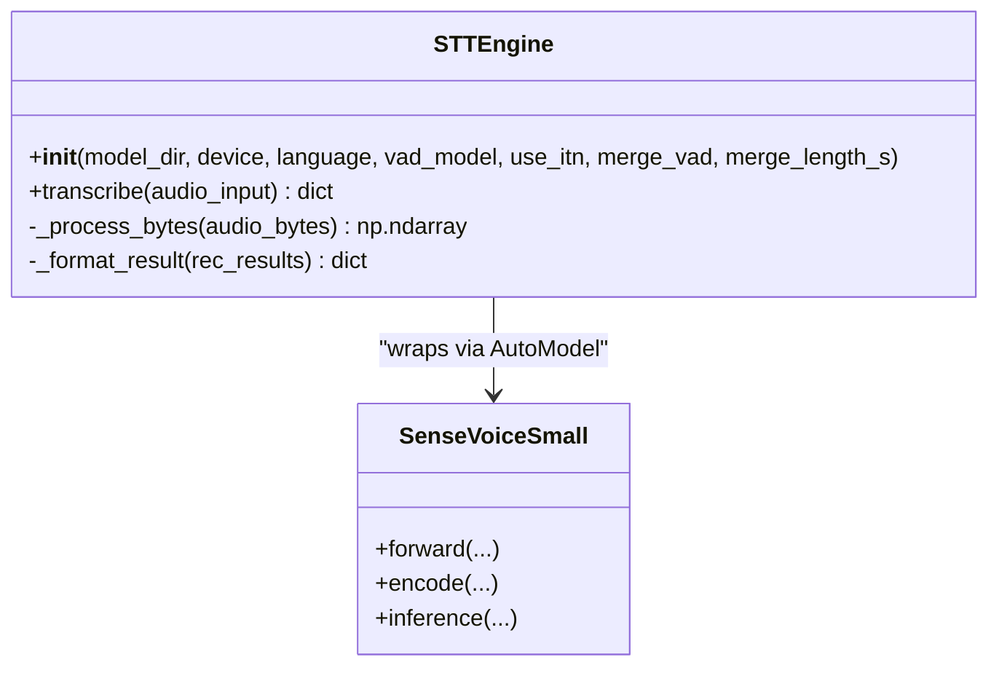
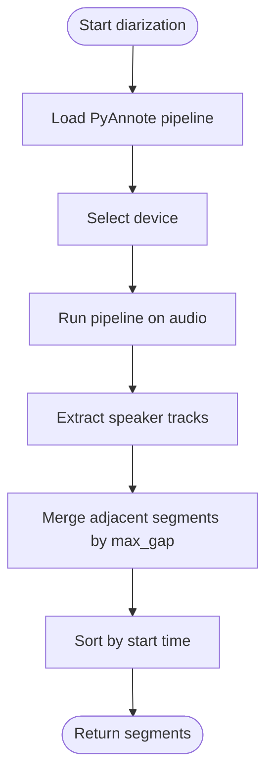
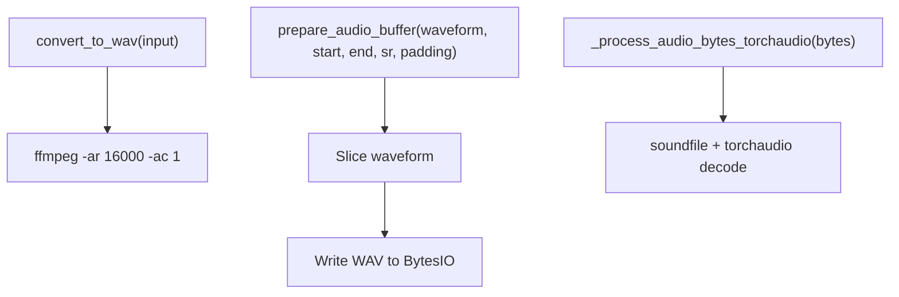
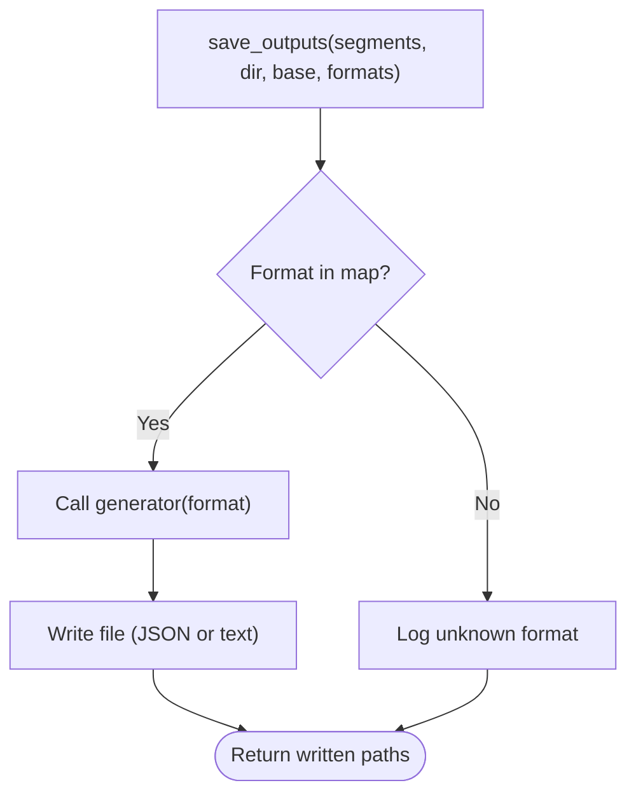
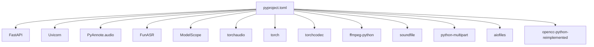

# Architecture Overview

<cite>
**Referenced Files in This Document**
- [README.md](file://README.md)
- [transcribe.py](file://transcribe.py)
- [server.py](file://server.py)
- [stt_engine.py](file://stt_engine.py)
- [diarizer.py](file://diarizer.py)
- [audio_utils.py](file://audio_utils.py)
- [output_formats.py](file://output_formats.py)
- [model.py](file://model.py)
- [utils/ctc_alignment.py](file://utils/ctc_alignment.py)
- [pyproject.toml](file://pyproject.toml)
- [run.sh](file://run.sh)
</cite>

## Table of Contents
1. [Introduction](#introduction)
2. [Project Structure](#project-structure)
3. [Core Components](#core-components)
4. [Architecture Overview](#architecture-overview)
5. [Detailed Component Analysis](#detailed-component-analysis)
6. [Dependency Analysis](#dependency-analysis)
7. [Performance Considerations](#performance-considerations)
8. [Troubleshooting Guide](#troubleshooting-guide)
9. [Conclusion](#conclusion)

## Introduction
This document describes the architecture of the Meeting Transcriber system, focusing on the high-level design and operational modes. The system provides two primary deployment patterns:
- In-process transcription: a unified CLI that orchestrates audio format conversion, speaker diarization, speech recognition, and output generation within a single process.
- HTTP server mode: a FastAPI-based server exposing OpenAI Whisper-compatible endpoints for external clients.

The architecture emphasizes modular design and separation of concerns, enabling flexible deployment and maintenance.

## Project Structure
The project is organized around a small set of focused modules:
- CLI entry point and orchestration
- HTTP server and API endpoints
- Speech-to-text engine and model integration
- Speaker diarization pipeline
- Audio utilities for conversion and segmentation
- Output formatters for multiple formats
- Supporting utilities and model code

**Diagram sources**
- [transcribe.py](file://transcribe.py)
- [server.py](file://server.py)
- [stt_engine.py](file://stt_engine.py)
- [diarizer.py](file://diarizer.py)
- [audio_utils.py](file://audio_utils.py)
- [output_formats.py](file://output_formats.py)
- [model.py](file://model.py)
- [utils/ctc_alignment.py](file://utils/ctc_alignment.py)

**Section sources**
- [README.md](file://README.md)
- [pyproject.toml](file://pyproject.toml)

## Core Components
- CLI entry point: parses arguments, selects mode (in-process vs server), and coordinates the pipeline.
- STT engine: wraps FunASR’s AutoModel to perform speech recognition with configurable language, VAD, and post-processing.
- Speaker diarizer: PyAnnote-based pipeline to detect speakers and segment audio into per-speaker turns.
- Audio utilities: format conversion to 16 kHz mono WAV and in-memory buffer preparation for segment transcription.
- Output formatters: generate SRT, VTT, TXT, and JSON outputs from transcription segments.
- Model code: SenseVoice model definition and related utilities used by the STT engine.

**Section sources**
- [transcribe.py](file://transcribe.py)
- [stt_engine.py](file://stt_engine.py)
- [diarizer.py](file://diarizer.py)
- [audio_utils.py](file://audio_utils.py)
- [output_formats.py](file://output_formats.py)
- [model.py](file://model.py)

## Architecture Overview
The system supports two operational modes:

- In-process transcription mode
  - Converts input audio/video to WAV using ffmpeg.
  - Runs speaker diarization to obtain per-speaker segments.
  - Loads audio into memory and prepares segments with optional padding.
  - Transcribes segments concurrently using the STT engine.
  - Generates outputs in requested formats and writes them to disk.

- HTTP server mode
  - Starts a FastAPI server with two endpoints:
    - Legacy endpoint for basic recognition.
    - OpenAI Whisper-compatible endpoint for modern integrations.
  - Accepts uploaded audio files, converts them to WAV, and performs transcription via the STT engine.
  - Formats responses according to requested output format.

**Diagram sources**
- [transcribe.py](file://transcribe.py)
- [server.py](file://server.py)
- [stt_engine.py](file://stt_engine.py)
- [diarizer.py](file://diarizer.py)
- [audio_utils.py](file://audio_utils.py)
- [output_formats.py](file://output_formats.py)

## Detailed Component Analysis

### CLI Orchestration (transcribe.py)
The CLI orchestrates the in-process transcription pipeline:
- Parses arguments and decides between server mode and transcription mode.
- In transcription mode:
  - Validates input file existence.
  - Converts non-WAV inputs to WAV using ffmpeg.
  - Runs speaker diarization to produce segments.
  - Loads audio into memory and prepares segments with padding.
  - Transcribes segments concurrently with a semaphore-controlled worker pool.
  - Sorts segments by start time and saves outputs in requested formats.

**Diagram sources**
- [transcribe.py](file://transcribe.py)
- [audio_utils.py](file://audio_utils.py)
- [diarizer.py](file://diarizer.py)
- [stt_engine.py](file://stt_engine.py)
- [output_formats.py](file://output_formats.py)

**Section sources**
- [transcribe.py](file://transcribe.py)

### HTTP Server and API Endpoints (server.py)
The server exposes two endpoints:
- Legacy endpoint: accepts an audio file upload and returns a simple JSON with the recognized text.
- OpenAI-compatible endpoint: accepts multipart form data, mirrors OpenAI’s parameters, and returns text or formatted subtitles.

Key behaviors:
- Writes uploaded audio to a temporary file and immediately removes it after processing.
- Delegates transcription to the STT engine.
- Formats responses according to the requested format (text, json, verbose_json, srt, vtt).

**Diagram sources**
- [server.py](file://server.py)
- [stt_engine.py](file://stt_engine.py)

**Section sources**
- [server.py](file://server.py)

### STT Engine (stt_engine.py)
The STT engine encapsulates the SenseVoice model via FunASR:
- Initializes the model with configurable device, language, and VAD settings.
- Provides a transcribe method that accepts file paths, bytes, or pre-processed arrays.
- Decodes audio bytes to 16 kHz mono arrays using torchaudio or ffmpeg fallback.
- Applies post-processing and simplified traditional Chinese conversion.
- Exposes internal helpers for audio processing and result formatting.

**Diagram sources**
- [stt_engine.py](file://stt_engine.py)
- [model.py](file://model.py)

**Section sources**
- [stt_engine.py](file://stt_engine.py)
- [model.py](file://model.py)

### Speaker Diarization (diarizer.py)
The diarizer wraps PyAnnote’s speaker-diarization pipeline:
- Loads the pipeline with a HuggingFace token.
- Supports device selection (mps/cpu).
- Produces speaker tracks and merges adjacent segments up to a configurable gap.
- Returns a sorted list of segments with start/end times and speaker labels.

**Diagram sources**
- [diarizer.py](file://diarizer.py)

**Section sources**
- [diarizer.py](file://diarizer.py)

### Audio Utilities (audio_utils.py)
Provides:
- Format conversion to 16 kHz mono WAV using ffmpeg.
- In-memory buffer preparation for audio segments with optional padding.
- Audio byte decoding helpers for torchaudio and ffmpeg fallback.

**Diagram sources**
- [audio_utils.py](file://audio_utils.py)

**Section sources**
- [audio_utils.py](file://audio_utils.py)

### Output Formatters (output_formats.py)
Generates:
- SRT and VTT subtitle content with speaker tags and timestamps.
- Plain text transcripts with bracketed time ranges and speaker labels.
- Structured JSON with a segments array.

**Diagram sources**
- [output_formats.py](file://output_formats.py)

**Section sources**
- [output_formats.py](file://output_formats.py)

### Model and Utilities (model.py, utils/ctc_alignment.py)
- model.py defines the SenseVoice model architecture and related components used by the STT engine.
- utils/ctc_alignment.py provides a CTC forced alignment utility used during model operations.

**Section sources**
- [model.py](file://model.py)
- [utils/ctc_alignment.py](file://utils/ctc_alignment.py)

## Dependency Analysis
External dependencies are declared in the project configuration and include:
- FastAPI and Uvicorn for HTTP server mode.
- PyAnnote.audio for speaker diarization.
- FunASR and modelscope for SenseVoice integration.
- torchaudio, torch, and torchcodec for audio processing.
- ffmpeg-python and soundfile for audio decoding and conversion.
- python-multipart and aiofiles for multipart uploads and async file writing.
- opencc-python-reimplemented for text normalization.

**Diagram sources**
- [pyproject.toml](file://pyproject.toml)

**Section sources**
- [pyproject.toml](file://pyproject.toml)

## Performance Considerations
- Concurrency: The in-process mode uses an asyncio semaphore to limit concurrent transcriptions, balancing throughput and resource usage.
- Device selection: The STT engine and diarizer support device selection (cpu, mps, cuda) to leverage hardware acceleration.
- Audio preprocessing: Efficient in-memory buffer preparation avoids repeated disk I/O and ensures consistent sampling rates.
- VAD configuration: Disabling VAD in the in-process mode prevents double segmentation when using pre-segmented audio from the diarizer.
- Server concurrency: The HTTP server delegates transcription to the STT engine; consider scaling horizontally or vertically based on workload.

[No sources needed since this section provides general guidance]

## Troubleshooting Guide
Common issues and resolutions:
- Torchcodec version mismatch: Ensure torchcodec is compatible with the installed torch version to avoid codec-related errors.
- PyAnnote model access: Provide a valid HuggingFace token in the environment to download the diarization model.
- FFmpeg availability: Confirm FFmpeg is installed and accessible for audio conversion.
- Environment setup: Use the convenience script to run the application with uv.

**Section sources**
- [README.md](file://README.md)
- [run.sh](file://run.sh)

## Conclusion
The Meeting Transcriber system demonstrates a clean separation of concerns across modules, enabling flexible deployment in either in-process or HTTP server modes. The CLI orchestrates a robust pipeline from audio conversion to output generation, while the HTTP server exposes a practical API for integration. The modular design facilitates maintenance, testing, and future enhancements.