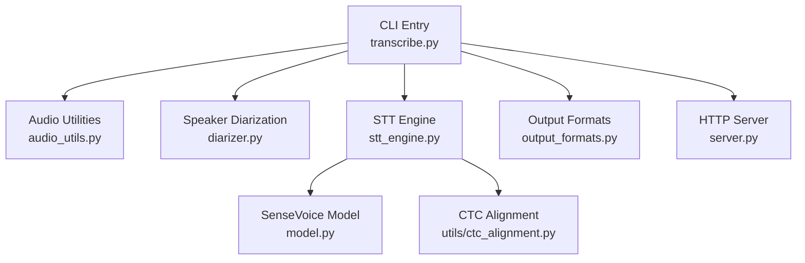
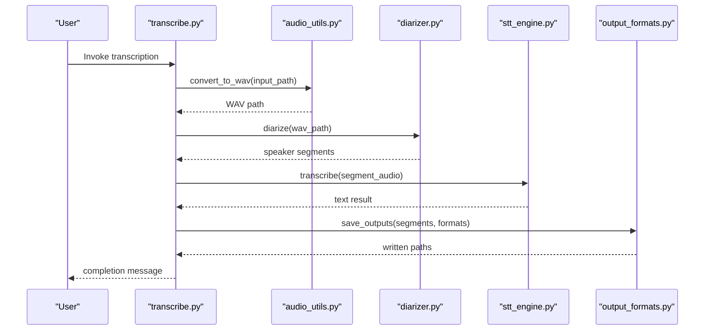
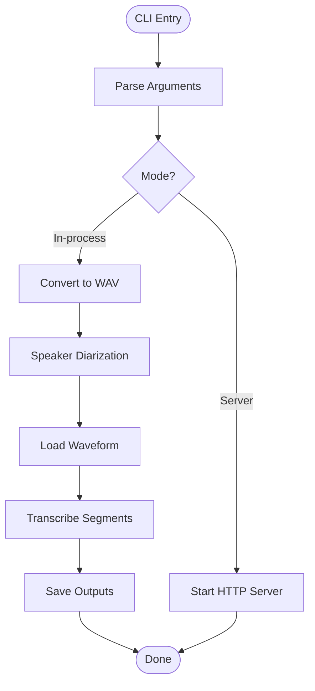
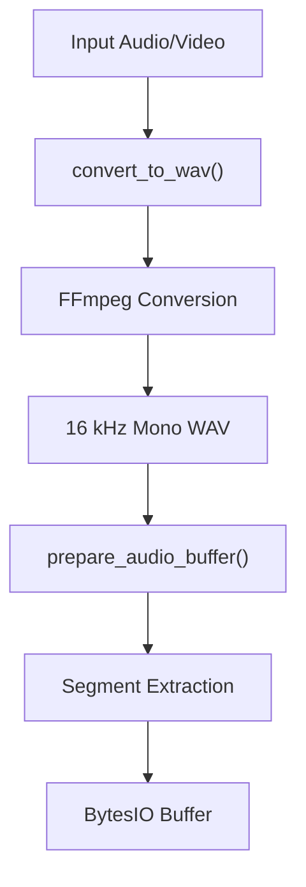
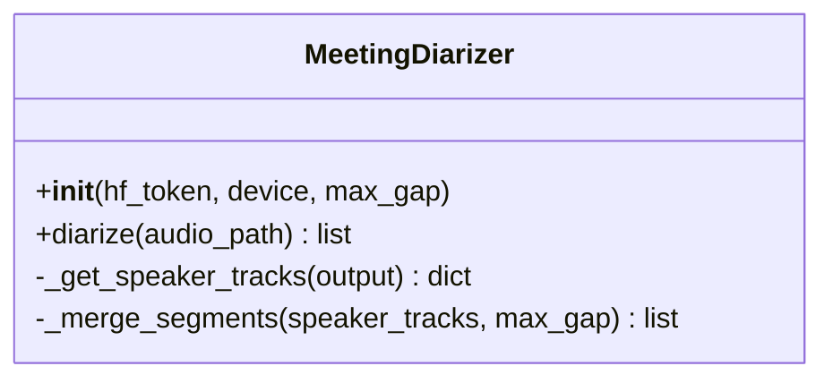
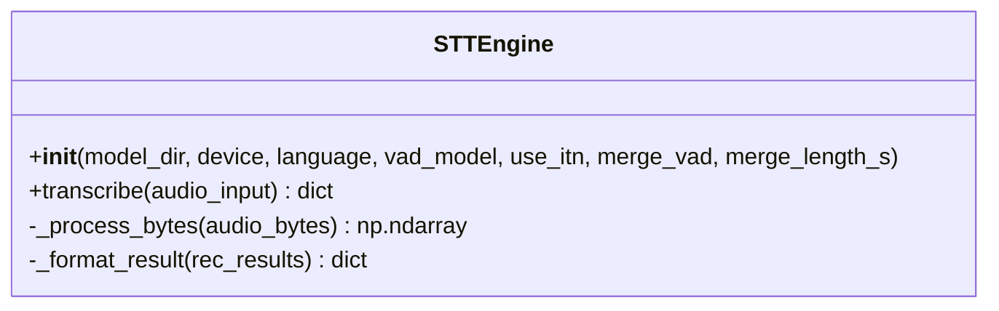
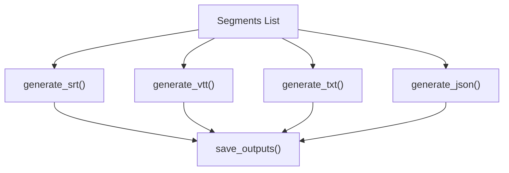
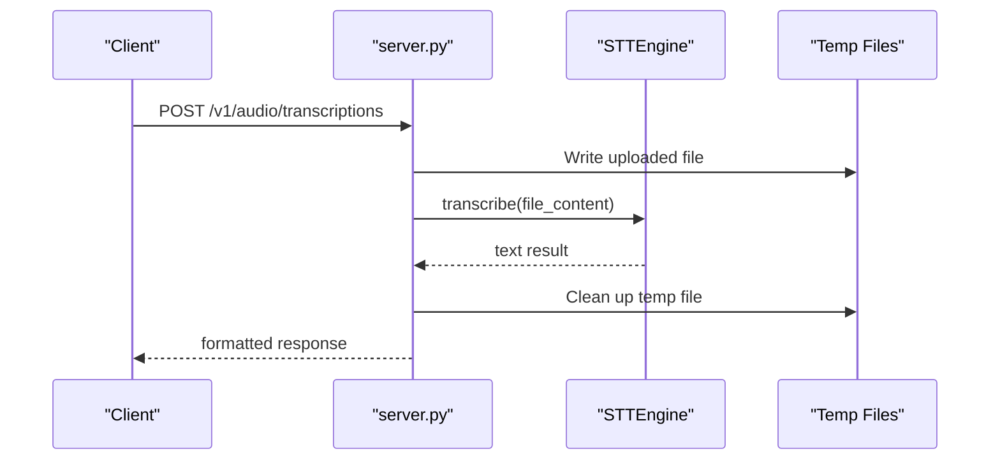
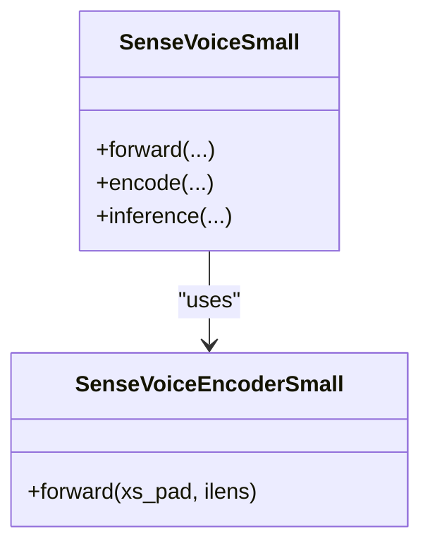
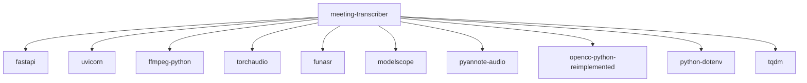

# Introduction

<cite>
**Referenced Files in This Document**
- [README.md](file://README.md)
- [transcribe.py](file://transcribe.py)
- [stt_engine.py](file://stt_engine.py)
- [diarizer.py](file://diarizer.py)
- [audio_utils.py](file://audio_utils.py)
- [output_formats.py](file://output_formats.py)
- [server.py](file://server.py)
- [model.py](file://model.py)
- [utils/ctc_alignment.py](file://utils/ctc_alignment.py)
- [run.sh](file://run.sh)
- [pyproject.toml](file://pyproject.toml)
</cite>

## Table of Contents
1. [Introduction](#introduction)
2. [Project Structure](#project-structure)
3. [Core Components](#core-components)
4. [Architecture Overview](#architecture-overview)
5. [Detailed Component Analysis](#detailed-component-analysis)
6. [Dependency Analysis](#dependency-analysis)
7. [Performance Considerations](#performance-considerations)
8. [Troubleshooting Guide](#troubleshooting-guide)
9. [Conclusion](#conclusion)

## Introduction
Meeting Transcriber is an automatic speech-to-text solution designed to transform meetings and conferences into multiple output formats (SRT, VTT, TXT, JSON). It combines speaker diarization and high-precision speech recognition to deliver accurate transcripts with speaker attribution and timing. The project’s core philosophy emphasizes simplicity and efficiency in audio transcription workflows, enabling users to achieve reliable, multi-format outputs with minimal setup and effort.

Key value propositions:
- Automatic speaker separation powered by PyAnnote.audio
- High-precision speech recognition using SenseVoice (FunASR)
- Multi-format output generation (SRT, VTT, TXT, JSON)
- In-process transcription mode for straightforward local execution
- Optional HTTP server mode compatible with OpenAI Whisper API for external integrations
- Broad language support (auto, Chinese, English, Cantonese, Japanese, Korean)
- Robust audio preprocessing and segmentation for improved accuracy

Target audience:
- Researchers working on spoken language processing and diarization
- Developers integrating automated transcription into applications
- Content creators needing precise, time-aligned transcripts
- Organizations requiring scalable, multi-format meeting transcription

## Project Structure
The repository is organized around a clear separation of concerns:
- CLI entry point orchestrating the end-to-end pipeline
- Audio utilities for format conversion and segmentation
- Diarization pipeline for speaker separation
- STT engine wrapping SenseVoice for in-process transcription
- Output formatters for SRT, VTT, TXT, and JSON
- Optional HTTP server exposing OpenAI-compatible endpoints
- Model code and utilities for advanced processing

**Diagram sources**
- [transcribe.py:1-240](file://transcribe.py#L1-L240)
- [audio_utils.py:1-120](file://audio_utils.py#L1-L120)
- [diarizer.py:1-110](file://diarizer.py#L1-L110)
- [stt_engine.py:1-185](file://stt_engine.py#L1-L185)
- [output_formats.py:1-160](file://output_formats.py#L1-L160)
- [server.py:1-197](file://server.py#L1-L197)
- [model.py:1-931](file://model.py#L1-L931)
- [utils/ctc_alignment.py:1-77](file://utils/ctc_alignment.py#L1-L77)

**Section sources**
- [README.md:134-149](file://README.md#L134-L149)
- [pyproject.toml:1-24](file://pyproject.toml#L1-L24)

## Core Components
- CLI orchestration: Unified entry point for both in-process transcription and HTTP server modes, handling arguments, environment loading, and pipeline execution.
- Audio utilities: Format conversion to 16 kHz mono WAV using FFmpeg, waveform segmentation with configurable padding, and robust in-memory decoding.
- Speaker diarization: PyAnnote.audio-based pipeline for detecting speakers and merging adjacent segments up to a configurable gap threshold.
- STT engine: In-process wrapper around SenseVoice (FunASR) with VAD control, post-processing, and fallback decoding.
- Output formatters: Generators for SRT, VTT, TXT, and JSON, with standardized time formatting and speaker-tagged text.
- HTTP server: FastAPI service exposing OpenAI Whisper-compatible endpoints for transcription requests.
- Model internals: SenseVoice model definition and CTC alignment utilities used during inference and post-processing.

**Section sources**
- [transcribe.py:45-144](file://transcribe.py#L45-L144)
- [audio_utils.py:23-120](file://audio_utils.py#L23-L120)
- [diarizer.py:27-110](file://diarizer.py#L27-L110)
- [stt_engine.py:24-185](file://stt_engine.py#L24-L185)
- [output_formats.py:43-160](file://output_formats.py#L43-L160)
- [server.py:92-197](file://server.py#L92-L197)
- [model.py:580-800](file://model.py#L580-L800)
- [utils/ctc_alignment.py:1-77](file://utils/ctc_alignment.py#L1-L77)

## Architecture Overview
The system follows a modular pipeline:
1. Input audio/video is converted to 16 kHz mono WAV if needed.
2. Speaker diarization detects speaker turns and merges adjacent segments within a configured gap.
3. Segments are extracted from the waveform and transcribed using the in-process STT engine.
4. Results are post-processed and saved in the requested output formats.

**Diagram sources**
- [transcribe.py:45-144](file://transcribe.py#L45-L144)
- [audio_utils.py:23-51](file://audio_utils.py#L23-L51)
- [diarizer.py:55-70](file://diarizer.py#L55-L70)
- [stt_engine.py:71-106](file://stt_engine.py#L71-L106)
- [output_formats.py:118-160](file://output_formats.py#L118-L160)

## Detailed Component Analysis

### CLI Orchestration
The CLI coordinates the entire pipeline, handling environment loading, argument parsing, and mode selection between in-process transcription and HTTP server operation. It ensures robust error handling for missing inputs and invalid configurations.

**Diagram sources**
- [transcribe.py:173-240](file://transcribe.py#L173-L240)

**Section sources**
- [transcribe.py:173-240](file://transcribe.py#L173-L240)

### Audio Utilities
Audio utilities provide essential preprocessing and segmentation:
- Format conversion to 16 kHz mono WAV using FFmpeg
- Waveform segmentation with configurable padding
- In-memory decoding with fallbacks for robustness

**Diagram sources**
- [audio_utils.py:23-94](file://audio_utils.py#L23-L94)

**Section sources**
- [audio_utils.py:23-94](file://audio_utils.py#L23-L94)

### Speaker Diarization
The diarization component wraps PyAnnote.audio to detect speaker turns and merge adjacent segments within a configurable gap threshold. It registers safe globals for torch serialization and manages device selection.

**Diagram sources**
- [diarizer.py:27-110](file://diarizer.py#L27-L110)

**Section sources**
- [diarizer.py:27-110](file://diarizer.py#L27-L110)

### STT Engine
The STT engine encapsulates SenseVoice via FunASR, offering flexible input formats, VAD control, and post-processing:
- Accepts file paths, raw audio bytes, or preprocessed arrays
- Decodes audio with torchaudio or FFmpeg fallback
- Applies post-processing and simplified-to-traditional Chinese conversion
- Supports language selection and ITN toggles

**Diagram sources**
- [stt_engine.py:24-185](file://stt_engine.py#L24-L185)

**Section sources**
- [stt_engine.py:24-185](file://stt_engine.py#L24-L185)

### Output Formats
Output formatters generate standardized transcripts across multiple formats:
- SRT with speaker-tagged lines and comma-separated milliseconds
- VTT with speaker-tagged cues and dot-separated milliseconds
- Plain text with bracketed timestamps and speaker labels
- Structured JSON with a top-level segments array

**Diagram sources**
- [output_formats.py:43-160](file://output_formats.py#L43-L160)

**Section sources**
- [output_formats.py:43-160](file://output_formats.py#L43-L160)

### HTTP Server
The HTTP server exposes OpenAI Whisper-compatible endpoints for transcription requests:
- POST /v1/audio/transcriptions accepts multipart uploads and returns text or formatted subtitles
- POST /recognition provides a legacy endpoint for compatibility
- Integrates with the STT engine and temporary file handling

**Diagram sources**
- [server.py:92-161](file://server.py#L92-L161)

**Section sources**
- [server.py:92-161](file://server.py#L92-L161)

### Model Internals
SenseVoice model internals include encoder layers, attention mechanisms, and CTC alignment utilities used during inference and post-processing.

**Diagram sources**
- [model.py:580-800](file://model.py#L580-L800)

**Section sources**
- [model.py:580-800](file://model.py#L580-L800)

## Dependency Analysis
External dependencies and their roles:
- FastAPI and Uvicorn for HTTP server functionality
- FFmpeg and torchaudio for audio processing
- FunASR and Modelscope for SenseVoice integration
- PyAnnote.audio for speaker diarization
- OpenCC for simplified/traditional Chinese conversion
- python-dotenv for environment configuration
- tqdm for progress reporting

**Diagram sources**
- [pyproject.toml:7-23](file://pyproject.toml#L7-L23)

**Section sources**
- [pyproject.toml:7-23](file://pyproject.toml#L7-L23)

## Performance Considerations
- Device selection: Choose GPU acceleration (CUDA/MPS) when available for faster inference.
- Concurrency: Adjust max_workers to balance throughput and resource usage.
- Padding and merging: Tune padding and max-gap to reduce artifacts while preserving context.
- Model choice: Select appropriate model sizes for accuracy vs. speed trade-offs.
- I/O efficiency: Prefer in-process mode for local runs; use HTTP server for distributed clients.

## Troubleshooting Guide
Common issues and resolutions:
- torchcodec version conflicts: Ensure compatibility with your PyTorch version as documented.
- PyAnnote model access: Agree to terms on Hugging Face and set HF_TOKEN in .env.
- FFmpeg availability: Verify installation and version compatibility with torchcodec.
- Audio decoding errors: The STT engine falls back to FFmpeg decoding when torchaudio fails.

**Section sources**
- [README.md:175-203](file://README.md#L175-L203)
- [stt_engine.py:111-129](file://stt_engine.py#L111-L129)

## Conclusion
Meeting Transcriber delivers a streamlined, efficient solution for converting meetings and conferences into multiple, high-quality output formats. By combining PyAnnote.audio for speaker separation and SenseVoice for accurate speech recognition, it enables researchers, developers, content creators, and organizations to automate transcription workflows with simplicity and precision. The modular architecture supports both in-process execution and HTTP server deployment, accommodating diverse use cases and integration scenarios.