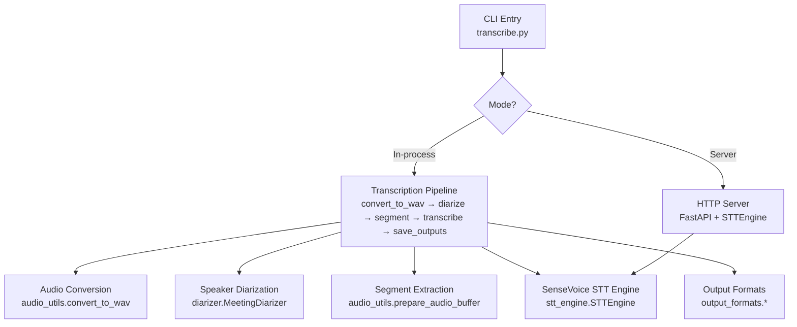
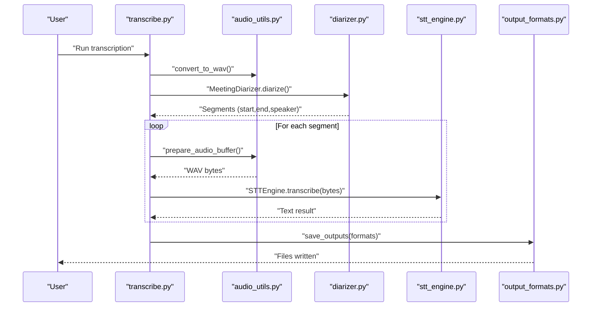
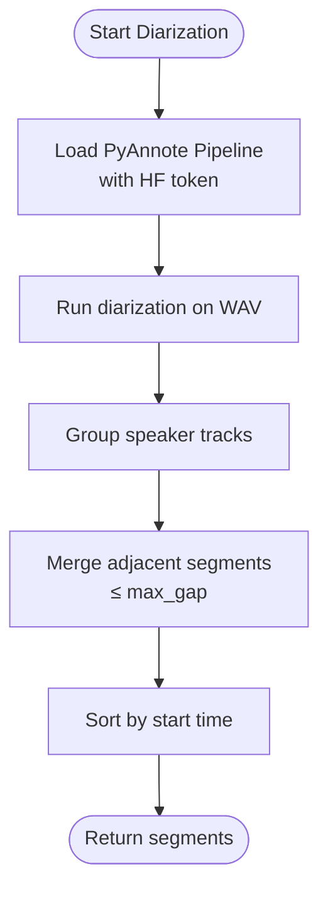
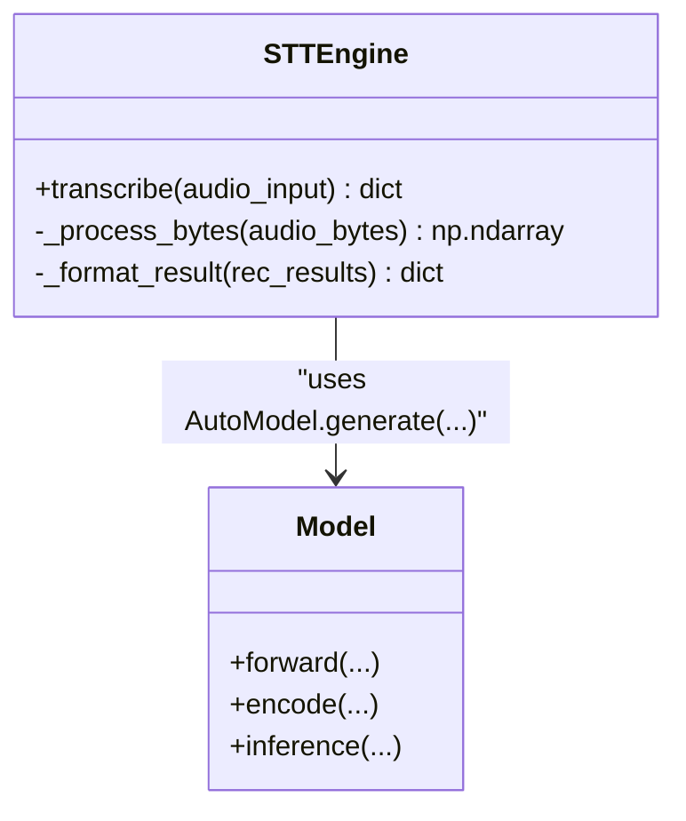
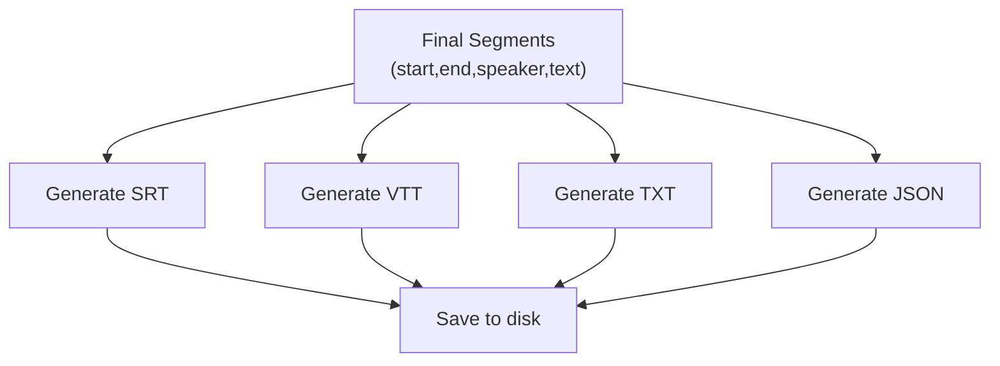
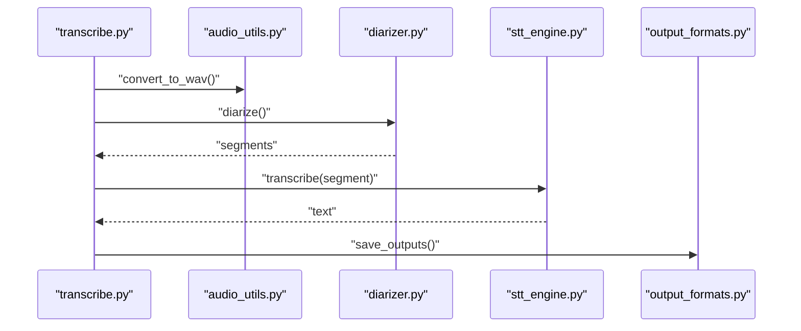
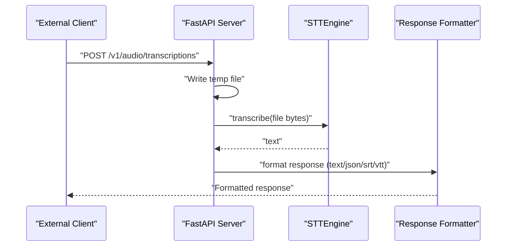
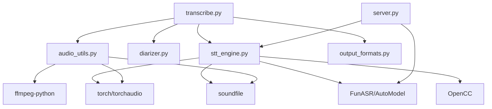

# Key Features

<cite>
**Referenced Files in This Document**
- [README.md](file://README.md)
- [transcribe.py](file://transcribe.py)
- [stt_engine.py](file://stt_engine.py)
- [diarizer.py](file://diarizer.py)
- [output_formats.py](file://output_formats.py)
- [server.py](file://server.py)
- [audio_utils.py](file://audio_utils.py)
- [model.py](file://model.py)
- [utils/ctc_alignment.py](file://utils/ctc_alignment.py)
- [run.sh](file://run.sh)
- [pyproject.toml](file://pyproject.toml)
</cite>

## Table of Contents
1. [Introduction](#introduction)
2. [Project Structure](#project-structure)
3. [Core Components](#core-components)
4. [Architecture Overview](#architecture-overview)
5. [Detailed Component Analysis](#detailed-component-analysis)
6. [Dependency Analysis](#dependency-analysis)
7. [Performance Considerations](#performance-considerations)
8. [Troubleshooting Guide](#troubleshooting-guide)
9. [Conclusion](#conclusion)
10. [Appendices](#appendices)

## Introduction
This document explains the five key features of the Meeting Transcriber and how they work together in typical meeting transcription scenarios. It focuses on:
- Automatic speaker diarization using PyAnnote.audio
- High-precision speech recognition with SenseVoice supporting multiple languages (Chinese, English, Cantonese, Japanese, Korean)
- Multiple output format generation (SRT, VTT, TXT, JSON)
- In-process transcription mode without external dependencies
- HTTP server mode with OpenAI Whisper API compatibility

It also highlights the benefits, use cases, technical implementation approach, and practical examples of combining these features for flexible deployment and usage patterns.

## Project Structure
The project is organized around a unified CLI entry point that supports two operational modes:
- In-process transcription mode: runs speaker diarization, segmentation, and SenseVoice transcription in a single process
- HTTP server mode: exposes an OpenAI Whisper-compatible API for external clients

**Diagram sources**
- [transcribe.py:45-144](file://transcribe.py#L45-L144)
- [audio_utils.py:23-51](file://audio_utils.py#L23-L51)
- [diarizer.py:55-70](file://diarizer.py#L55-L70)
- [audio_utils.py:53-94](file://audio_utils.py#L53-L94)
- [stt_engine.py:71-106](file://stt_engine.py#L71-L106)
- [output_formats.py:118-160](file://output_formats.py#L118-L160)
- [server.py:121-161](file://server.py#L121-L161)

**Section sources**
- [README.md:134-149](file://README.md#L134-L149)
- [transcribe.py:173-240](file://transcribe.py#L173-L240)

## Core Components
- Unified CLI entry point orchestrating either in-process transcription or HTTP server mode
- Audio conversion and segmentation utilities
- Speaker diarization pipeline using PyAnnote.audio
- SenseVoice STT engine wrapping FunASR with robust audio decoding and post-processing
- Output format generators for SRT, VTT, TXT, and JSON
- HTTP server exposing OpenAI Whisper-compatible endpoints

Benefits and use cases:
- In-process mode: zero external dependencies, straightforward local execution, suitable for offline environments
- Server mode: integrates with existing systems via a familiar API, enabling scalable deployments and multi-client usage
- Multi-language support: broad coverage for international meetings
- Flexible outputs: standardized subtitle formats plus structured JSON for downstream analytics

**Section sources**
- [README.md:5-12](file://README.md#L5-L12)
- [transcribe.py:45-144](file://transcribe.py#L45-L144)
- [server.py:121-161](file://server.py#L121-L161)

## Architecture Overview
The system follows a modular pipeline:
- Input audio/video is converted to 16 kHz mono WAV
- PyAnnote.audio performs speaker diarization and merges adjacent segments up to a configurable gap
- Each segment is extracted from the original waveform with optional padding
- SenseVoice transcribes each segment in-process (or via HTTP server)
- Results are post-processed and saved in requested formats

**Diagram sources**
- [transcribe.py:63-144](file://transcribe.py#L63-L144)
- [audio_utils.py:23-51](file://audio_utils.py#L23-L51)
- [diarizer.py:55-70](file://diarizer.py#L55-L70)
- [audio_utils.py:53-94](file://audio_utils.py#L53-L94)
- [stt_engine.py:71-106](file://stt_engine.py#L71-L106)
- [output_formats.py:118-160](file://output_formats.py#L118-L160)

## Detailed Component Analysis

### Feature 1: Automatic Speaker Diarization Using PyAnnote.audio
- Purpose: Detect speakers and split audio into per-speaker turns
- Implementation approach:
  - Loads the PyAnnote speaker-diarization pipeline with a HuggingFace token
  - Runs diarization on the converted WAV file
  - Groups detected speaker turns and merges adjacent segments up to a configured maximum gap
  - Sorts and returns a list of segments with start/end timestamps and speaker labels
- Benefits:
  - Enables accurate attribution of transcribed text to speakers
  - Robust merging reduces artifacts from short silence gaps
- Use cases:
  - Meetings with multiple participants
  - Post-production editing requiring speaker attribution
- Practical example:
  - Input MP4 is converted to WAV, diarization detects N speakers, segments are merged, and each segment is transcribed separately

**Diagram sources**
- [diarizer.py:30-70](file://diarizer.py#L30-L70)
- [diarizer.py:76-110](file://diarizer.py#L76-L110)

**Section sources**
- [diarizer.py:27-70](file://diarizer.py#L27-L70)
- [diarizer.py:76-110](file://diarizer.py#L76-L110)

### Feature 2: High-Precision Speech Recognition With SenseVoice (Multiple Languages)
- Purpose: Accurate transcription supporting Chinese, English, Cantonese, Japanese, Korean
- Implementation approach:
  - STTEngine wraps FunASR’s AutoModel for direct (in-process) invocation
  - Supports multiple input types: file path, bytes, or pre-processed numpy arrays
  - Decodes audio bytes using torchaudio/soundfile with fallback to ffmpeg
  - Applies rich transcription post-processing and Simplified to Traditional Chinese conversion
  - Language selection and ITN (inverse text normalization) controlled via parameters
- Benefits:
  - High-quality transcription with language-specific handling
  - Flexible audio input formats and robust decoding
- Use cases:
  - Multilingual meetings
  - Real-time or batch transcription
- Practical example:
  - Each diarized segment is prepared as a WAV buffer, transcribed by SenseVoice, and post-processed into clean text

**Diagram sources**
- [stt_engine.py:24-106](file://stt_engine.py#L24-L106)
- [model.py:580-647](file://model.py#L580-L647)

**Section sources**
- [stt_engine.py:24-106](file://stt_engine.py#L24-L106)
- [model.py:580-647](file://model.py#L580-L647)

### Feature 3: Multiple Output Format Generation (SRT, VTT, TXT, JSON)
- Purpose: Produce industry-standard and developer-friendly outputs
- Implementation approach:
  - Generates SRT and VTT with precise timestamps and speaker-tagged lines
  - Produces plain text transcripts with bracketed time windows and speaker labels
  - Emits structured JSON with a segments array for programmatic consumption
  - Persists outputs to a configurable directory with base filename derived from input
- Benefits:
  - Immediate usability across players/editors (SRT/VTT)
  - Developer-friendly JSON for analytics and downstream processing
- Use cases:
  - Subtitles for video editing
  - Analytics dashboards and speaker analytics
- Practical example:
  - After transcription, the system writes .srt, .vtt, .txt, and .json files in the output directory

**Diagram sources**
- [output_formats.py:43-104](file://output_formats.py#L43-L104)
- [output_formats.py:118-160](file://output_formats.py#L118-L160)

**Section sources**
- [output_formats.py:19-104](file://output_formats.py#L19-L104)
- [output_formats.py:118-160](file://output_formats.py#L118-L160)

### Feature 4: In-Process Transcription Mode Without External Dependencies
- Purpose: Run transcription entirely within a single process
- Implementation approach:
  - CLI selects in-process mode by default
  - Converts input to WAV, runs diarization, extracts segments, transcribes in-process, and saves outputs
  - Uses torchaudio for audio loading and threading for concurrency-safe transcription
- Benefits:
  - Zero external service dependencies
  - Predictable performance and resource isolation
- Use cases:
  - Offline environments
  - Single-user or small-scale batch processing
- Practical example:
  - Command-line invocation triggers the full pipeline locally

**Diagram sources**
- [transcribe.py:45-144](file://transcribe.py#L45-L144)
- [audio_utils.py:23-51](file://audio_utils.py#L23-L51)
- [diarizer.py:55-70](file://diarizer.py#L55-L70)
- [stt_engine.py:71-106](file://stt_engine.py#L71-L106)
- [output_formats.py:118-160](file://output_formats.py#L118-L160)

**Section sources**
- [transcribe.py:45-144](file://transcribe.py#L45-L144)

### Feature 5: HTTP Server Mode With OpenAI Whisper API Compatibility
- Purpose: Expose a familiar API for external integrations
- Implementation approach:
  - FastAPI server with two endpoints:
    - POST /v1/audio/transcriptions (OpenAI Whisper-compatible)
    - POST /recognition (legacy)
  - Accepts multipart/form-data uploads, decodes audio, invokes STTEngine, and formats responses according to requested format
  - Supports response formats: text, json, verbose_json, srt, vtt
- Benefits:
  - Integrates with existing tools and SDKs expecting Whisper-style APIs
  - Stateless and horizontally scalable
- Use cases:
  - Microservice architectures
  - Multi-client applications
- Practical example:
  - curl to /v1/audio/transcriptions with file=@audio.wav and model=sensevoice returns the transcript in the chosen format

**Diagram sources**
- [server.py:121-161](file://server.py#L121-L161)
- [server.py:62-85](file://server.py#L62-L85)
- [stt_engine.py:71-106](file://stt_engine.py#L71-L106)

**Section sources**
- [server.py:121-161](file://server.py#L121-L161)
- [README.md:74-89](file://README.md#L74-L89)

## Dependency Analysis
High-level dependencies:
- CLI depends on audio utilities, diarizer, STT engine, and output formats
- STT engine depends on FunASR, torch, torchaudio, soundfile, and OpenCC
- Server depends on FastAPI, Uvicorn, and STT engine
- Audio utilities depend on ffmpeg-python, torchaudio, soundfile, and subprocess

**Diagram sources**
- [pyproject.toml:7-23](file://pyproject.toml#L7-L23)
- [transcribe.py:49-52](file://transcribe.py#L49-L52)
- [stt_engine.py:17-19](file://stt_engine.py#L17-L19)
- [server.py:21](file://server.py#L21)
- [audio_utils.py:16-18](file://audio_utils.py#L16-L18)

**Section sources**
- [pyproject.toml:7-23](file://pyproject.toml#L7-L23)

## Performance Considerations
- Concurrency: In-process mode uses an asyncio semaphore to limit concurrent transcriptions, balancing throughput and stability
- Audio decoding: Prefer torchaudio/soundfile for speed; ffmpeg fallback ensures compatibility
- Memory: Loading full waveform into memory enables efficient segment extraction; consider large files and available RAM
- Device selection: CPU, MPS, or CUDA can be selected via CLI arguments to match hardware capabilities
- VAD and merging: Disabling SenseVoice’s internal VAD when using pre-segmented audio avoids redundant segmentation and improves accuracy

[No sources needed since this section provides general guidance]

## Troubleshooting Guide
Common issues and resolutions:
- torchcodec version mismatch: Ensure torchcodec version aligns with torch to avoid import errors
- PyAnnote model access: Agree to the model terms on HuggingFace and set HF_TOKEN in .env
- FFmpeg availability: Confirm FFmpeg 4–8 installation; the project relies on ffmpeg-python and torchcodec

**Section sources**
- [README.md:175-203](file://README.md#L175-L203)

## Conclusion
The Meeting Transcriber delivers a cohesive, flexible solution for meeting transcription:
- Automatic speaker diarization and high-precision SenseVoice transcription enable accurate, speaker-attributed results
- Multiple output formats meet diverse downstream needs
- In-process mode simplifies deployment while HTTP server mode integrates with existing toolchains
- The modular design and clear separation of concerns support varied usage patterns and environments

[No sources needed since this section summarizes without analyzing specific files]

## Appendices

### Practical Example: Typical Meeting Transcription Scenario
- Input: MP4 recording of a multilingual meeting
- Steps:
  1. Convert to 16 kHz mono WAV
  2. Detect speakers and merge adjacent segments
  3. Extract segments with padding and transcribe each
  4. Post-process and save SRT, VTT, TXT, and JSON
- Outputs: Subtitles for editing and analytics-ready JSON

**Section sources**
- [README.md:40-72](file://README.md#L40-L72)
- [transcribe.py:63-144](file://transcribe.py#L63-L144)

### Deployment Flexibility
- Local execution: Use in-process mode for offline or isolated environments
- Remote orchestration: Use HTTP server mode for microservices or multi-client setups
- Language selection: Choose among auto, zh, en, yue, ja, ko
- Output customization: Select one or more formats (srt, vtt, txt, json)

**Section sources**
- [README.md:90-133](file://README.md#L90-L133)
- [transcribe.py:173-221](file://transcribe.py#L173-L221)