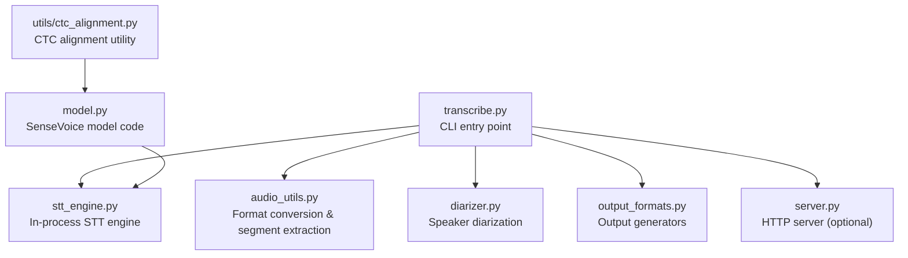
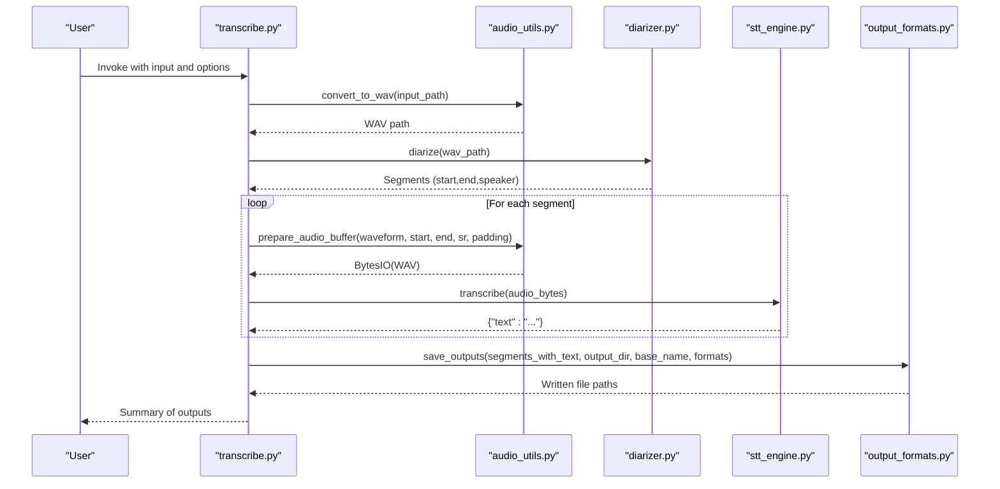
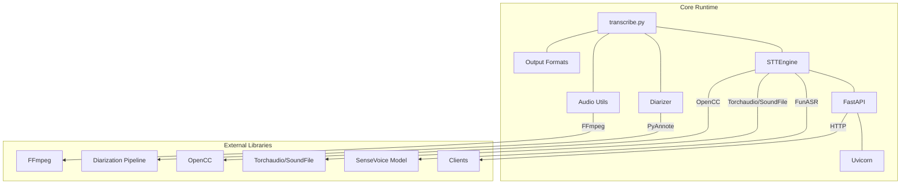

# Project Overview

<cite>
**Referenced Files in This Document**
- [README.md](file://README.md)
- [pyproject.toml](file://pyproject.toml)
- [transcribe.py](file://transcribe.py)
- [stt_engine.py](file://stt_engine.py)
- [diarizer.py](file://diarizer.py)
- [audio_utils.py](file://audio_utils.py)
- [output_formats.py](file://output_formats.py)
- [server.py](file://server.py)
- [model.py](file://model.py)
- [utils/ctc_alignment.py](file://utils/ctc_alignment.py)
- [run.sh](file://run.sh)
</cite>

## Table of Contents
1. [Introduction](#introduction)
2. [Project Structure](#project-structure)
3. [Core Components](#core-components)
4. [Architecture Overview](#architecture-overview)
5. [Detailed Component Analysis](#detailed-component-analysis)
6. [Dependency Analysis](#dependency-analysis)
7. [Performance Considerations](#performance-considerations)
8. [Troubleshooting Guide](#troubleshooting-guide)
9. [Conclusion](#conclusion)
10. [Appendices](#appendices)

## Introduction
Meeting Transcriber is an automatic speech-to-text solution designed for meeting recordings. It combines speaker diarization with high-precision speech recognition to produce aligned transcripts with speaker labels and multiple output formats. The system supports both in-process batch processing and an HTTP server mode compatible with OpenAI Whisper API conventions.

Key capabilities:
- Speaker diarization using PyAnnote.audio to detect and separate speakers
- High-precision speech recognition powered by SenseVoice (via FunASR)
- Multi-format output: SRT, VTT, plain text, and structured JSON
- Flexible audio input: automatic conversion of MP4, MP3, M4A, and other formats to 16 kHz mono WAV
- Two operational modes: CLI batch processing and HTTP server mode

## Project Structure
The project is organized into focused modules that handle distinct stages of the transcription pipeline. The primary entry point is a unified CLI that orchestrates the entire workflow or starts the HTTP server.

**Diagram sources**
- [transcribe.py:1-240](file://transcribe.py#L1-L240)
- [audio_utils.py:1-120](file://audio_utils.py#L1-L120)
- [diarizer.py:1-110](file://diarizer.py#L1-L110)
- [stt_engine.py:1-185](file://stt_engine.py#L1-L185)
- [output_formats.py:1-160](file://output_formats.py#L1-L160)
- [server.py:1-197](file://server.py#L1-L197)
- [model.py:1-931](file://model.py#L1-L931)
- [utils/ctc_alignment.py:1-77](file://utils/ctc_alignment.py#L1-L77)

**Section sources**
- [README.md:134-149](file://README.md#L134-L149)
- [pyproject.toml:1-24](file://pyproject.toml#L1-L24)

## Core Components
- Unified CLI: Orchestrates the end-to-end pipeline or starts the HTTP server based on arguments.
- Audio utilities: Converts input audio/video to 16 kHz mono WAV and extracts per-segment buffers.
- Speaker diarizer: Runs PyAnnote.audio to detect speakers and merge adjacent segments.
- STT engine: Wraps SenseVoice via FunASR for in-process transcription with configurable VAD and post-processing.
- Output formatters: Generates SRT, VTT, TXT, and JSON outputs.
- HTTP server: Provides OpenAI Whisper API-compatible endpoints for external clients.

**Section sources**
- [transcribe.py:45-144](file://transcribe.py#L45-L144)
- [audio_utils.py:23-120](file://audio_utils.py#L23-L120)
- [diarizer.py:27-110](file://diarizer.py#L27-L110)
- [stt_engine.py:24-185](file://stt_engine.py#L24-L185)
- [output_formats.py:43-160](file://output_formats.py#L43-L160)
- [server.py:92-197](file://server.py#L92-L197)

## Architecture Overview
The system follows a modular pipeline:
1. Input audio/video is converted to 16 kHz mono WAV if needed.
2. PyAnnote.audio performs speaker diarization and merges adjacent segments up to a configurable gap.
3. Each diarized segment is extracted from the original waveform and transcribed using SenseVoice.
4. Results are post-processed and formatted into requested output formats.

**Diagram sources**
- [transcribe.py:45-144](file://transcribe.py#L45-L144)
- [audio_utils.py:23-94](file://audio_utils.py#L23-L94)
- [diarizer.py:55-70](file://diarizer.py#L55-L70)
- [stt_engine.py:71-106](file://stt_engine.py#L71-L106)
- [output_formats.py:118-160](file://output_formats.py#L118-L160)

## Detailed Component Analysis

### Unified CLI (transcribe.py)
Responsibilities:
- Parses CLI arguments for both batch and server modes.
- Executes the full pipeline in-process: audio conversion, diarization, segmentation, transcription, and output generation.
- Starts the HTTP server with configurable host/port and engine parameters.

Public interfaces:
- run_transcription(args): Full pipeline execution.
- run_server(args): Delegates to server module.
- build_parser(): Defines CLI options and defaults.

Parameters and behavior:
- Mode selection: --server toggles server mode.
- Device selection: --device cpu/mps/cuda.
- Model directory: --model_dir pointing to SenseVoice model.
- Batch mode options: -i input, --language, --format, -o output, --max-workers, --padding, --max-gap.
- Server mode options: --host, --port, --vad_model, --use_itn, --merge_vad, --merge_length_s.

Return values:
- In batch mode: prints completion summary and list of generated files.
- In server mode: starts Uvicorn server.

Practical examples:
- Basic batch transcription with device and model directory.
- Specifying language and output formats.
- Starting HTTP server compatible with OpenAI Whisper API.

**Section sources**
- [transcribe.py:45-144](file://transcribe.py#L45-L144)
- [transcribe.py:151-166](file://transcribe.py#L151-L166)
- [transcribe.py:173-221](file://transcribe.py#L173-L221)
- [README.md:40-90](file://README.md#L40-L90)

### Audio Utilities (audio_utils.py)
Responsibilities:
- Convert any supported audio/video to 16 kHz mono WAV using FFmpeg.
- Extract waveform segments with optional padding and return in-memory WAV buffers.
- Provide in-memory decoding fallbacks using soundfile and torchaudio/ffmpeg.

Public APIs:
- convert_to_wav(input_path): Returns converted WAV path.
- prepare_audio_buffer(waveform, start_time, end_time, sample_rate, padding): Returns BytesIO(WAV).
- process_audio_bytes_torchaudio(audio_bytes): Decodes bytes to 16 kHz mono float32 array.

Error handling:
- Propagates FFmpeg errors and logs exceptions during buffer preparation.

**Section sources**
- [audio_utils.py:23-51](file://audio_utils.py#L23-L51)
- [audio_utils.py:53-94](file://audio_utils.py#L53-L94)
- [audio_utils.py:96-120](file://audio_utils.py#L96-L120)

### Speaker Diarizer (diarizer.py)
Responsibilities:
- Initialize PyAnnote.audio pipeline with a HuggingFace token.
- Run diarization on the converted WAV file.
- Merge adjacent segments from the same speaker within a configurable gap threshold.

Public API:
- MeetingDiarizer.__init__(hf_token, device, max_gap)
- diarize(audio_path): Returns sorted list of segments with start, end, speaker.

Processing logic:
- Loads pretrained diarization model and moves it to the selected device.
- Uses a progress hook for monitoring.
- Groups speaker turns, sorts by start time, merges close segments.

**Section sources**
- [diarizer.py:27-71](file://diarizer.py#L27-L71)
- [diarizer.py:76-110](file://diarizer.py#L76-L110)

### STT Engine (stt_engine.py)
Responsibilities:
- Wrap FunASR’s AutoModel to perform in-process transcription.
- Support multiple input types: file path, bytes, or numpy arrays.
- Normalize audio to 16 kHz mono and apply post-processing and text normalization.

Public API:
- STTEngine.__init__(model_dir, device, language, vad_model, use_itn, merge_vad, merge_length_s)
- transcribe(audio_input): Returns dictionary with normalized text.

Internal helpers:
- _process_bytes(audio_bytes): Decodes bytes using torchaudio with ffmpeg fallback.
- _format_result(rec_results): Applies rich transcription post-processing and Simplified-to-Traditional Chinese conversion.

Audio processing:
- In-memory decoding with soundfile/torchaudio.
- Resampling to 16 kHz mono when needed.

**Section sources**
- [stt_engine.py:24-106](file://stt_engine.py#L24-L106)
- [stt_engine.py:111-140](file://stt_engine.py#L111-L140)
- [stt_engine.py:147-185](file://stt_engine.py#L147-L185)

### Output Formats (output_formats.py)
Responsibilities:
- Generate SRT, VTT, TXT, and JSON outputs from diarized and transcribed segments.
- Persist outputs to disk with consistent naming.

Public API:
- save_outputs(segments, output_dir, base_name, formats): Writes files and returns written paths.
- Format-specific generators: generate_srt, generate_vtt, generate_txt, generate_json.

Time formatting:
- Helpers to format timestamps for SRT and VTT.

**Section sources**
- [output_formats.py:43-104](file://output_formats.py#L43-L104)
- [output_formats.py:118-160](file://output_formats.py#L118-L160)

### HTTP Server (server.py)
Responsibilities:
- Provide OpenAI Whisper API-compatible endpoints for external clients.
- Serve legacy /recognition endpoint for backward compatibility.

Endpoints:
- POST /v1/audio/transcriptions: Accepts multipart/form-data with file and model parameters, returns text in requested format.
- POST /recognition: Legacy endpoint returning JSON with text.

Response formatting:
- Helpers to format SRT/VTT text outputs.
- OpenAI-compatible response shapes for verbose_json.

Engine binding:
- Creates FastAPI app bound to an STTEngine instance configured with device, language, and VAD options.

**Section sources**
- [server.py:92-162](file://server.py#L92-L162)
- [server.py:169-197](file://server.py#L169-L197)

### SenseVoice Model Code (model.py)
Responsibilities:
- Implements SenseVoiceSmall model architecture and related components.
- Provides encoder layers, attention mechanisms, and CTC/attention hybrid training components.
- Includes utilities for CTC forced alignment used in training/inference contexts.

Highlights:
- SenseVoiceEncoderSmall: SANM-based encoder with sinusoidal position encoding.
- SenseVoiceSmall: Hybrid CTC-attention model with language identification and text normalization embeddings.
- CTC alignment utility for forced alignment of emissions to targets.

**Section sources**
- [model.py:437-578](file://model.py#L437-L578)
- [model.py:580-780](file://model.py#L580-L780)
- [utils/ctc_alignment.py:1-77](file://utils/ctc_alignment.py#L1-L77)

## Dependency Analysis
External dependencies and their roles:
- FastAPI/Uvicorn: HTTP server framework and ASGI server.
- FunASR/ModelScope: SenseVoice model runtime and model registry.
- PyAnnote.audio: Speaker diarization pipeline.
- Torchaudio/SoundFile: Audio loading/resampling and in-memory decoding.
- FFmpeg: Audio/video format conversion.
- OpenCC: Simplified-to-Traditional Chinese conversion.
- python-multipart: Multipart parsing for HTTP uploads.
- TQDM: Progress bars for batch processing.

**Diagram sources**
- [pyproject.toml:7-23](file://pyproject.toml#L7-L23)
- [server.py:169-197](file://server.py#L169-L197)
- [stt_engine.py:17-20](file://stt_engine.py#L17-L20)
- [diarizer.py:10-13](file://diarizer.py#L10-L13)
- [audio_utils.py:12-18](file://audio_utils.py#L12-L18)

**Section sources**
- [pyproject.toml:1-24](file://pyproject.toml#L1-L24)

## Performance Considerations
- Device selection: Prefer GPU acceleration (cuda) for faster inference; MPS for Apple Silicon; CPU for compatibility.
- Concurrency: --max-workers controls concurrent segment transcription; set to 1 for in-process safety to avoid double VAD artifacts.
- Padding and merging: --padding adds small buffers to reduce edge artifacts; --max-gap merges adjacent segments from the same speaker to reduce output fragmentation.
- VAD behavior: When using PyAnnote diarization, disable SenseVoice’s built-in VAD (--vad_model=None) to prevent double segmentation.
- Memory usage: Loading entire audio into memory improves speed but increases RAM usage; consider segment sizes and device constraints.

[No sources needed since this section provides general guidance]

## Troubleshooting Guide
Common issues and resolutions:
- torchcodec version mismatch: If encountering a NameError related to AudioDecoder, ensure torchcodec meets the required version.
- PyAnnote model access: Agree to the model’s terms on HuggingFace and set HF_TOKEN in .env.
- FFmpeg availability: Confirm FFmpeg installation and version compatibility; the project relies on FFmpeg for format conversion.

**Section sources**
- [README.md:175-203](file://README.md#L175-L203)

## Conclusion
Meeting Transcriber provides a robust, modular pipeline for meeting transcription with speaker diarization and high-precision speech recognition. Its dual-mode operation—CLI batch processing and HTTP server—caters to both local automation and integration scenarios. The architecture cleanly separates concerns across audio conversion, diarization, transcription, and output generation, enabling easy customization and extension.

[No sources needed since this section summarizes without analyzing specific files]

## Appendices

### Practical Usage Examples
- CLI batch processing:
  - Basic transcription with device and model directory.
  - Specify language and output formats.
  - Customize output directory.
- HTTP server mode:
  - Start server with host/port and device.
  - Call the OpenAI-compatible endpoint with multipart/form-data.

**Section sources**
- [README.md:40-90](file://README.md#L40-L90)
- [transcribe.py:173-221](file://transcribe.py#L173-L221)

### Command Reference
- Unified CLI:
  - --server: Enable HTTP server mode.
  - --device: cpu/mps/cuda.
  - --model_dir: SenseVoice model directory.
  - -i/--input: Required for batch mode.
  - --language: auto/zh/en/yue/ja/ko.
  - --format: Comma-separated srt,vtt,txt,json.
  - -o/--output: Output directory.
  - --max-workers: Concurrency limit.
  - --padding: Segment padding in seconds.
  - --max-gap: Merge gap in seconds.
  - --host/--port: Server bind address and port.
  - --vad_model/--use_itn/--merge_vad/--merge_length_s: VAD and post-processing options.

**Section sources**
- [README.md:90-122](file://README.md#L90-L122)
- [transcribe.py:173-221](file://transcribe.py#L173-L221)

### HTTP API Endpoints
- POST /v1/audio/transcriptions
  - Form fields: file (multipart), model (alias: sensevoice), language, prompt, response_format, temperature.
  - Response formats: text, json, verbose_json, srt, vtt.
- POST /recognition
  - Form field: audio (multipart).
  - Response: JSON with text and code.

**Section sources**
- [server.py:121-162](file://server.py#L121-L162)