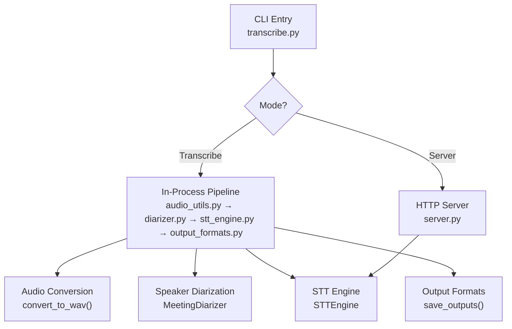
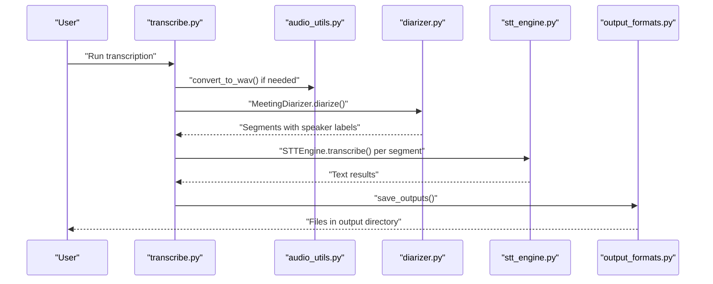
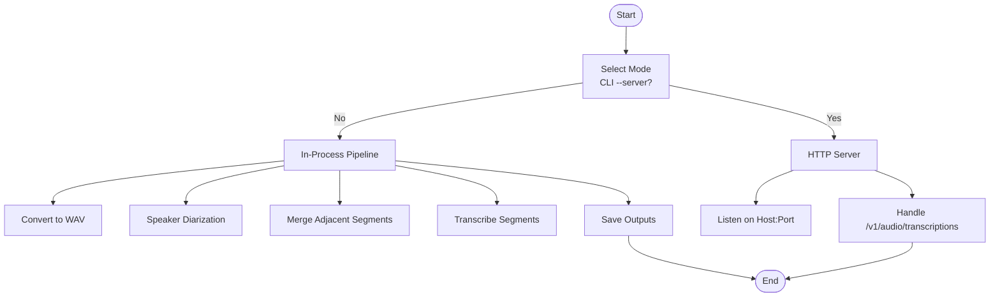
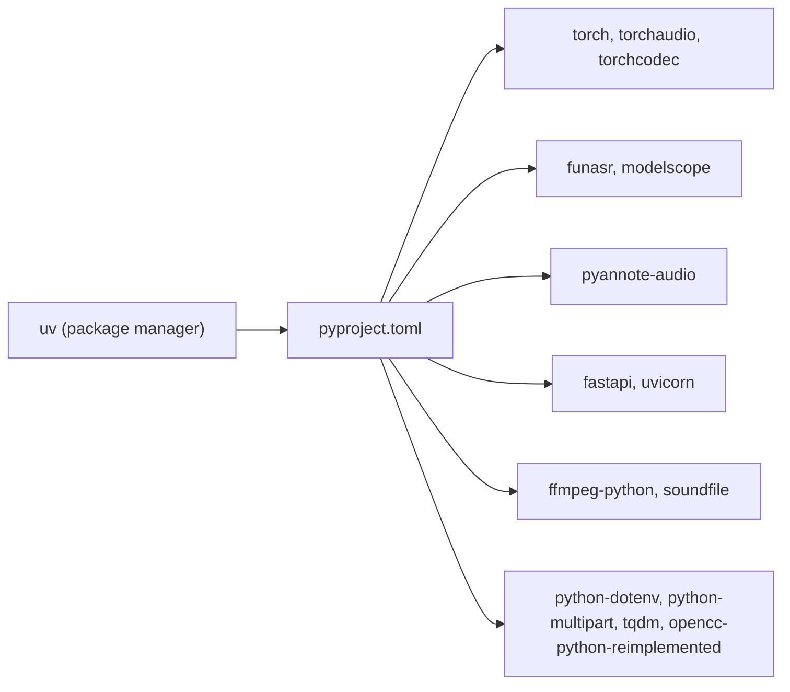

# Quick Start Guide

<cite>
**Referenced Files in This Document**
- [README.md](file://README.md)
- [pyproject.toml](file://pyproject.toml)
- [transcribe.py](file://transcribe.py)
- [server.py](file://server.py)
- [stt_engine.py](file://stt_engine.py)
- [audio_utils.py](file://audio_utils.py)
- [diarizer.py](file://diarizer.py)
- [output_formats.py](file://output_formats.py)
- [model.py](file://model.py)
- [utils/ctc_alignment.py](file://utils/ctc_alignment.py)
</cite>

## Update Summary
**Changes Made**
- Updated all CLI examples to use `uv run transcribe.py` consistently throughout the documentation
- Modernized command patterns to reflect repository migration to uv package management
- Enhanced examples to demonstrate the unified `uv run` approach for both transcription and server modes
- Updated troubleshooting guidance to reflect current dependency management with uv

## Table of Contents
1. [Introduction](#introduction)
2. [Project Structure](#project-structure)
3. [Core Components](#core-components)
4. [Architecture Overview](#architecture-overview)
5. [Detailed Component Analysis](#detailed-component-analysis)
6. [Dependency Analysis](#dependency-analysis)
7. [Performance Considerations](#performance-considerations)
8. [Troubleshooting Guide](#troubleshooting-guide)
9. [Conclusion](#conclusion)
10. [Appendices](#appendices)

## Introduction
This Quick Start Guide helps you get up and running with Meeting Transcriber quickly. You will learn:
- How to transcribe audio/video files in-process with practical CLI commands using `uv run`
- How to configure languages and customize output formats
- How to run the HTTP server compatible with OpenAI Whisper API
- Where outputs are saved and how filenames are generated
- Troubleshooting tips for common beginner issues
- Performance guidance for CPU, MPS, and CUDA devices

**Updated** All examples now use the modernized `uv run` command pattern for consistent execution across different environments.

## Project Structure
The project is organized around a unified CLI entry point that supports two modes:
- In-process transcription mode (default)
- HTTP server mode (OpenAI Whisper API compatible)



**Diagram sources**
- [transcribe.py:45-144](file://transcribe.py#L45-L144)
- [server.py:121-161](file://server.py#L121-L161)
- [audio_utils.py:23-51](file://audio_utils.py#L23-L51)
- [diarizer.py:55-70](file://diarizer.py#L55-L70)
- [stt_engine.py:71-106](file://stt_engine.py#L71-L106)
- [output_formats.py:118-160](file://output_formats.py#L118-L160)

**Section sources**
- [README.md:134-149](file://README.md#L134-L149)
- [transcribe.py:173-240](file://transcribe.py#L173-L240)

## Core Components
- Unified CLI entry point: [transcribe.py](file://transcribe.py)
- In-process STT engine: [stt_engine.py](file://stt_engine.py)
- Speaker diarization: [diarizer.py](file://diarizer.py)
- Audio utilities: [audio_utils.py](file://audio_utils.py)
- Output format generators: [output_formats.py](file://output_formats.py)
- HTTP server (OpenAI Whisper API compatible): [server.py](file://server.py)
- Model support: [model.py](file://model.py) and [utils/ctc_alignment.py](file://utils/ctc_alignment.py)

**Section sources**
- [transcribe.py:45-144](file://transcribe.py#L45-L144)
- [stt_engine.py:24-66](file://stt_engine.py#L24-L66)
- [diarizer.py:27-54](file://diarizer.py#L27-L54)
- [audio_utils.py:23-51](file://audio_utils.py#L23-L51)
- [output_formats.py:118-160](file://output_formats.py#L118-L160)
- [server.py:121-161](file://server.py#L121-L161)
- [model.py:437-578](file://model.py#L437-L578)
- [utils/ctc_alignment.py:1-77](file://utils/ctc_alignment.py#L1-L77)

## Architecture Overview
The default in-process pipeline converts audio to WAV, runs speaker diarization, merges adjacent segments, and transcribes each segment using SenseVoice. Outputs are generated in SRT, VTT, TXT, and JSON.



**Diagram sources**
- [transcribe.py:63-144](file://transcribe.py#L63-L144)
- [audio_utils.py:23-51](file://audio_utils.py#L23-L51)
- [diarizer.py:55-70](file://diarizer.py#L55-L70)
- [stt_engine.py:71-106](file://stt_engine.py#L71-L106)
- [output_formats.py:118-160](file://output_formats.py#L118-L160)

## Detailed Component Analysis

### In-Process Transcription Mode (Default)
- Purpose: Full pipeline in a single process without an HTTP server
- Key steps:
  - Convert input to WAV if needed
  - Detect speakers and segment audio
  - Merge adjacent segments by speaker
  - Transcribe each segment using SenseVoice
  - Save outputs in chosen formats

**Updated** All examples now use the modernized `uv run` command pattern:

Practical examples using `uv run`:
- Basic transcription with device selection and model directory:
  ```bash
  uv run transcribe.py -i audio/meeting.mp4 --device mps --model_dir /path/to/sensevoice_model
  ```
- Language-specific transcription:
  ```bash
  uv run transcribe.py -i audio/meeting.mp4 \
    --device mps \
    --language yue \
    --format srt,json \
    --model_dir /path/to/sensevoice_model
  ```
- Custom output directory:
  ```bash
  uv run transcribe.py -i audio/meeting.mp4 \
    --device mps \
    --model_dir /path/to/sensevoice_model \
    -o results/
  ```

Output directory and naming:
- Default output directory: input audio directory's "output" subfolder
- Output files: base name from the input file plus format-specific extension
- Example layout:
  ```
  audio/
  ├── meeting.mp4              # Original audio
  └── output/
    ├── meeting.srt          # SRT subtitles
    ├── meeting.vtt          # WebVTT subtitles
    ├── meeting.txt          # Plain text (with timestamps)
    └── meeting.json         # Structured JSON
  ```

CLI arguments (selected):
- Device selection: cpu, mps, cuda
- Model directory: local path or model hub identifier
- Language: auto, zh, en, yue, ja, ko
- Output formats: comma-separated list (srt, vtt, txt, json)
- Output directory: custom path
- Worker count, padding, and merging thresholds for segmentation

For the complete list and defaults, refer to:
- [README.md:90-122](file://README.md#L90-L122)
- [transcribe.py:194-220](file://transcribe.py#L194-L220)

How it works internally:
- Audio conversion: [audio_utils.py:23-51](file://audio_utils.py#L23-L51)
- Diarization: [diarizer.py:55-70](file://diarizer.py#L55-L70)
- STT engine: [stt_engine.py:71-106](file://stt_engine.py#L71-L106)
- Output generation: [output_formats.py:118-160](file://output_formats.py#L118-L160)

**Section sources**
- [README.md:40-72](file://README.md#L40-L72)
- [transcribe.py:45-144](file://transcribe.py#L45-L144)
- [audio_utils.py:23-51](file://audio_utils.py#L23-L51)
- [diarizer.py:55-70](file://diarizer.py#L55-L70)
- [stt_engine.py:71-106](file://stt_engine.py#L71-L106)
- [output_formats.py:118-160](file://output_formats.py#L118-L160)

### HTTP Server Mode (OpenAI Whisper API Compatible)
- Purpose: Expose a server endpoint compatible with OpenAI Whisper API for external tools
- Endpoint: POST /v1/audio/transcriptions
- Example startup and client call:
  ```bash
  uv run transcribe.py --server --port 8100 --device mps --model_dir /path/to/sensevoice_model
  ```

Server behavior:
- Accepts multipart/form-data with an audio file and model parameter
- Decodes audio to 16 kHz mono internally
- Returns text, JSON, verbose JSON, SRT, or VTT depending on response_format
- Uses STTEngine under the hood

Key parameters:
- Host, port, device, language, VAD model, ITN toggle, and segment merging options

References:
- Server factory and endpoints: [server.py:121-161](file://server.py#L121-L161)
- Runner and engine binding: [server.py:169-196](file://server.py#L169-L196)
- CLI server invocation: [transcribe.py:151-165](file://transcribe.py#L151-L165)

**Section sources**
- [README.md:74-89](file://README.md#L74-L89)
- [server.py:121-161](file://server.py#L121-L161)
- [server.py:169-196](file://server.py#L169-L196)
- [transcribe.py:151-165](file://transcribe.py#L151-L165)

### STT Engine Internals
- Loads SenseVoice via FunASR
- Supports bytes input with in-memory decoding using torchaudio and ffmpeg fallback
- Applies post-processing and simplified-to-traditional Chinese conversion
- Exposes a transcribe() method suitable for both in-process and server modes

References:
- Engine class and initialization: [stt_engine.py:24-66](file://stt_engine.py#L24-L66)
- Transcribe method: [stt_engine.py:71-106](file://stt_engine.py#L71-L106)
- Audio decoding helpers: [stt_engine.py:111-129](file://stt_engine.py#L111-L129), [stt_engine.py:147-184](file://stt_engine.py#L147-L184)

**Section sources**
- [stt_engine.py:24-66](file://stt_engine.py#L24-L66)
- [stt_engine.py:71-106](file://stt_engine.py#L71-L106)
- [stt_engine.py:111-129](file://stt_engine.py#L111-L129)
- [stt_engine.py:147-184](file://stt_engine.py#L147-L184)

### Speaker Diarization Internals
- Uses PyAnnote.audio pipeline
- Requires HuggingFace token configured via environment
- Merges adjacent segments from the same speaker based on a configurable threshold

References:
- Diarizer class and pipeline setup: [diarizer.py:27-54](file://diarizer.py#L27-L54)
- Diarization execution and merging: [diarizer.py:55-70](file://diarizer.py#L55-L70), [diarizer.py:89-110](file://diarizer.py#L89-L110)

**Section sources**
- [diarizer.py:27-54](file://diarizer.py#L27-L54)
- [diarizer.py:55-70](file://diarizer.py#L55-L70)
- [diarizer.py:89-110](file://diarizer.py#L89-L110)

### Audio Utilities Internals
- Converts any supported audio/video to 16 kHz mono WAV using ffmpeg
- Extracts segments from memory and writes to in-memory WAV buffers
- Provides in-memory decoding helpers for torchaudio and ffmpeg fallback

References:
- Conversion: [audio_utils.py:23-51](file://audio_utils.py#L23-L51)
- Segment extraction: [audio_utils.py:53-94](file://audio_utils.py#L53-L94)
- In-memory decoding: [audio_utils.py:96-120](file://audio_utils.py#L96-L120)

**Section sources**
- [audio_utils.py:23-51](file://audio_utils.py#L23-L51)
- [audio_utils.py:53-94](file://audio_utils.py#L53-L94)
- [audio_utils.py:96-120](file://audio_utils.py#L96-L120)

### Output Formats Internals
- Generates SRT, VTT, TXT, and JSON outputs
- Uses consistent time formatting helpers
- Persists outputs to disk with base filename and format-specific extensions

References:
- Generators: [output_formats.py:43-104](file://output_formats.py#L43-L104)
- Persistence: [output_formats.py:118-160](file://output_formats.py#L118-L160)

**Section sources**
- [output_formats.py:43-104](file://output_formats.py#L43-L104)
- [output_formats.py:118-160](file://output_formats.py#L118-L160)

### Conceptual Overview


## Dependency Analysis
- Python runtime and package manager: [pyproject.toml:1-24](file://pyproject.toml#L1-L24)
- CLI entry point: [transcribe.py:228-240](file://transcribe.py#L228-L240)

**Updated** The project now uses uv as the primary package manager with consistent `uv run` command patterns:



**Diagram sources**
- [pyproject.toml:1-24](file://pyproject.toml#L1-L24)

**Section sources**
- [pyproject.toml:1-24](file://pyproject.toml#L1-L24)
- [transcribe.py:228-240](file://transcribe.py#L228-L240)

## Performance Considerations
- Device selection:
  - cpu: default, broadly compatible
  - mps: Apple Silicon acceleration
  - cuda: NVIDIA GPU acceleration
- Worker concurrency:
  - max-workers controls concurrent segment transcription
  - Default is set low for in-process safety
- Audio preprocessing:
  - All inputs are converted to 16 kHz mono WAV
  - Segment padding and merging thresholds influence accuracy and speed
- Model choice:
  - Smaller models may improve throughput at the cost of accuracy
- Environment:
  - Ensure FFmpeg 4–8 is installed for audio conversion
  - Verify torchcodec compatibility with your torch version

References:
- Device and worker options: [README.md:94-122](file://README.md#L94-L122), [transcribe.py:194-220](file://transcribe.py#L194-L220)
- FFmpeg requirement: [README.md:17-18](file://README.md#L17-L18)
- Torchcodec compatibility note: [README.md:177-181](file://README.md#L177-L181)

**Section sources**
- [README.md:94-122](file://README.md#L94-L122)
- [README.md:17-18](file://README.md#L17-L18)
- [README.md:177-181](file://README.md#L177-L181)
- [transcribe.py:194-220](file://transcribe.py#L194-L220)

## Troubleshooting Guide
Common beginner issues and resolutions:
- torchcodec version mismatch:
  - Symptom: NameError related to AudioDecoder
  - Resolution: Ensure torchcodec version aligns with torch
  - Reference: [README.md:177-181](file://README.md#L177-L181)
- PyAnnote model access:
  - Symptom: Access denied to speaker diarization model
  - Resolution: Accept the model license on HuggingFace and set HF_TOKEN
  - Reference: [README.md:183-186](file://README.md#L183-L186), [diarizer.py:36-40](file://diarizer.py#L36-L40)
- FFmpeg not installed or incompatible:
  - Symptom: Conversion failures or missing audio
  - Resolution: Install FFmpeg 4–8 and verify installation
  - Reference: [README.md:187-203](file://README.md#L187-L203)

**Section sources**
- [README.md:177-181](file://README.md#L177-L181)
- [README.md:183-186](file://README.md#L183-L186)
- [README.md:187-203](file://README.md#L187-L203)
- [diarizer.py:36-40](file://diarizer.py#L36-L40)

## Conclusion
You now have everything needed to start transcribing meetings quickly:
- Use the in-process mode for immediate results with common audio formats using `uv run`
- Switch to HTTP server mode for integration with external tools
- Customize language and output formats to match your workflow
- Follow the troubleshooting tips to resolve common issues
- Adjust device and concurrency settings for optimal performance

**Updated** All commands now use the modernized `uv run` pattern for consistent execution across different environments and package managers.

## Appendices

### Practical CLI Examples
All examples use the modernized `uv run` command pattern:

- Basic transcription with device and model directory:
  ```bash
  uv run transcribe.py -i audio/meeting.mp4 --device mps --model_dir /path/to/sensevoice_model
  ```
- Language-specific transcription:
  ```bash
  uv run transcribe.py -i audio/meeting.mp4 \
    --device mps \
    --language yue \
    --format srt,json \
    --model_dir /path/to/sensevoice_model
  ```
- Custom output directory:
  ```bash
  uv run transcribe.py -i audio/meeting.mp4 \
    --device mps \
    --model_dir /path/to/sensevoice_model \
    -o results/
  ```
- Start HTTP server:
  ```bash
  uv run transcribe.py --server --port 8100 --device mps --model_dir /path/to/sensevoice_model
  ```

### Output Directory and Naming
- Default output directory: input audio directory's "output" subfolder
- Output files: base name from the input file plus format-specific extension
- Example layout:
  ```
  audio/
  ├── meeting.mp4              # Original audio
  └── output/
    ├── meeting.srt          # SRT subtitles
    ├── meeting.vtt          # WebVTT subtitles
    ├── meeting.txt          # Plain text (with timestamps)
    └── meeting.json         # Structured JSON
  ```

### HTTP Server Compatibility
- Endpoint: POST /v1/audio/transcriptions
- Accepts: file (multipart/form-data), model, language, prompt, response_format, temperature
- Returns: text, json, verbose_json, srt, vtt
- References:
  - [README.md:74-89](file://README.md#L74-L89)
  - [server.py:121-161](file://server.py#L121-L161)