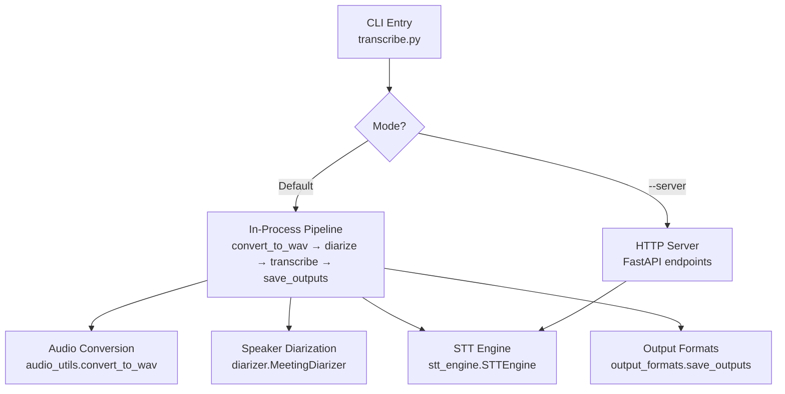
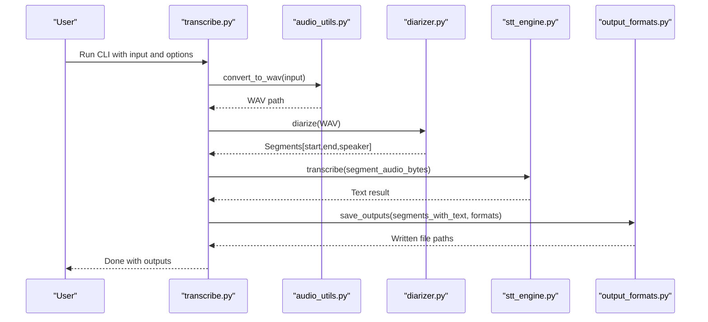
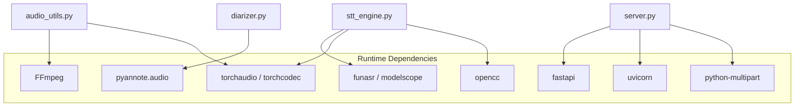
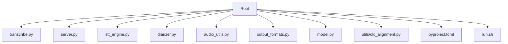

# Quick Start Guide

<cite>
**Referenced Files in This Document**
- [README.md](file://README.md)
- [transcribe.py](file://transcribe.py)
- [server.py](file://server.py)
- [stt_engine.py](file://stt_engine.py)
- [diarizer.py](file://diarizer.py)
- [audio_utils.py](file://audio_utils.py)
- [output_formats.py](file://output_formats.py)
- [model.py](file://model.py)
- [run.sh](file://run.sh)
- [pyproject.toml](file://pyproject.toml)
</cite>

## Table of Contents
1. [Introduction](#introduction)
2. [Project Structure](#project-structure)
3. [Core Components](#core-components)
4. [Architecture Overview](#architecture-overview)
5. [Detailed Component Analysis](#detailed-component-analysis)
6. [Dependency Analysis](#dependency-analysis)
7. [Performance Considerations](#performance-considerations)
8. [Troubleshooting Guide](#troubleshooting-guide)
9. [Conclusion](#conclusion)
10. [Appendices](#appendices)

## Introduction
This Quick Start Guide helps you get up and running quickly with the meeting transcriber. It covers:
- Installing prerequisites and dependencies
- Basic CLI usage for batch processing
- HTTP server mode for external integrations
- Essential command-line examples for audio file processing, language selection, output format specification, and device configuration
- Practical scenarios: meeting transcription, language-specific processing, and custom output directories
- Troubleshooting tips for common beginner mistakes

## Project Structure
The project is organized around a unified CLI entry point that supports two modes:
- In-process transcription mode (default): Converts audio, runs speaker diarization, performs segment-wise transcription, and writes outputs in multiple formats.
- HTTP server mode (--server): Exposes an OpenAI Whisper-compatible API for external clients.

**Diagram sources**
- [transcribe.py:45-144](file://transcribe.py#L45-L144)
- [audio_utils.py:23-51](file://audio_utils.py#L23-L51)
- [diarizer.py:55-70](file://diarizer.py#L55-L70)
- [stt_engine.py:71-106](file://stt_engine.py#L71-L106)
- [output_formats.py:118-159](file://output_formats.py#L118-L159)
- [server.py:121-161](file://server.py#L121-L161)

**Section sources**
- [README.md:134-149](file://README.md#L134-L149)
- [transcribe.py:173-240](file://transcribe.py#L173-L240)

## Core Components
- CLI entry point and argument parsing: [transcribe.py](file://transcribe.py)
- In-process STT engine: [stt_engine.py](file://stt_engine.py)
- Speaker diarization: [diarizer.py](file://diarizer.py)
- Audio utilities: [audio_utils.py](file://audio_utils.py)
- Output format generators: [output_formats.py](file://output_formats.py)
- HTTP server: [server.py](file://server.py)
- Model support (SenseVoice): [model.py](file://model.py)
- Environment and dependencies: [pyproject.toml](file://pyproject.toml), [run.sh](file://run.sh)

**Section sources**
- [transcribe.py:173-240](file://transcribe.py#L173-L240)
- [stt_engine.py:24-66](file://stt_engine.py#L24-L66)
- [diarizer.py:27-54](file://diarizer.py#L27-L54)
- [audio_utils.py:23-51](file://audio_utils.py#L23-L51)
- [output_formats.py:110-159](file://output_formats.py#L110-L159)
- [server.py:92-161](file://server.py#L92-L161)
- [model.py:580-640](file://model.py#L580-L640)
- [pyproject.toml:1-24](file://pyproject.toml#L1-L24)
- [run.sh:1-7](file://run.sh#L1-L7)

## Architecture Overview
High-level workflow for the default in-process mode:
1. Convert input audio/video to 16 kHz mono WAV using FFmpeg.
2. Detect speakers and segment audio using PyAnnote.
3. Merge adjacent segments from the same speaker based on a configurable gap threshold.
4. Transcribe each segment using SenseVoice via the STT engine.
5. Save outputs in requested formats (SRT, VTT, TXT, JSON).

**Diagram sources**
- [transcribe.py:63-144](file://transcribe.py#L63-L144)
- [audio_utils.py:23-51](file://audio_utils.py#L23-L51)
- [diarizer.py:55-70](file://diarizer.py#L55-L70)
- [stt_engine.py:71-106](file://stt_engine.py#L71-L106)
- [output_formats.py:118-159](file://output_formats.py#L118-L159)

## Detailed Component Analysis

### CLI Batch Processing (Default Mode)
- Purpose: End-to-end meeting transcription in a single process.
- Key options:
  - Input audio/video path
  - Device selection (cpu, mps, cuda)
  - Model directory (local path or remote model identifier)
  - Language selection (auto, zh, en, yue, ja, ko)
  - Output formats (comma-separated: srt, vtt, txt, json)
  - Output directory
  - Worker concurrency, padding, and merging thresholds

Step-by-step tutorial:
1. Prepare environment
   - Install dependencies and set up environment variables as described in the project documentation.
   - Ensure FFmpeg is installed and available on PATH.

2. Basic meeting transcription
   - Example command: [README.md:44-60](file://README.md#L44-L60)
   - Expected output: SRT, VTT, TXT, and JSON files placed under the input directory’s output subfolder.

3. Specify language and output formats
   - Example command: [README.md:48-54](file://README.md#L48-L54)
   - Expected output: Only the specified formats are generated.

4. Customize output directory
   - Example command: [README.md:55-60](file://README.md#L55-L60)
   - Expected output: Files saved under the provided directory.

Verification steps:
- Confirm the presence of output files in the expected directory.
- Open the generated files to verify timestamps, speaker tags, and text content.

**Section sources**
- [README.md:40-72](file://README.md#L40-L72)
- [transcribe.py:198-220](file://transcribe.py#L198-L220)
- [transcribe.py:45-144](file://transcribe.py#L45-L144)

### HTTP Server Mode
- Purpose: Expose an OpenAI Whisper-compatible API for external tools.
- Endpoints:
  - POST /v1/audio/transcriptions (OpenAI-compatible)
  - POST /recognition (legacy)

Step-by-step tutorial:
1. Start the server
   - Example command: [README.md:78-89](file://README.md#L78-L89)

2. Call the API with curl
   - Example request: [README.md:84-88](file://README.md#L84-L88)
   - Response formats: text, json, verbose_json, srt, vtt

Verification steps:
- Ensure the server is listening on the configured host/port.
- Send a request and confirm the response matches the selected format.

**Section sources**
- [README.md:74-89](file://README.md#L74-L89)
- [server.py:121-161](file://server.py#L121-L161)
- [transcribe.py:151-166](file://transcribe.py#L151-L166)

### Essential Command-Line Examples
- Meeting transcription with device and model directory:
  - [README.md:44-47](file://README.md#L44-L47)
- Language-specific processing (e.g., Cantonese):
  - [README.md:48-54](file://README.md#L48-L54)
- Custom output directory:
  - [README.md:55-60](file://README.md#L55-L60)
- HTTP server startup:
  - [README.md:78-80](file://README.md#L78-L80)
- OpenAI-compatible API call:
  - [README.md:84-88](file://README.md#L84-L88)

Expected outputs:
- Default: SRT, VTT, TXT, JSON in the input directory’s output subfolder.
- Custom output directory: Same formats in the specified folder.

**Section sources**
- [README.md:40-89](file://README.md#L40-L89)

### Practical Scenarios

#### Scenario A: Meeting Transcription
- Steps:
  - Place an audio/video file in the audio/ directory.
  - Run the default CLI mode with device and model_dir options.
  - Verify outputs in the output subfolder.

- Verification:
  - Check that SRT/VTT/TXT/JSON files exist and contain timestamps and speaker tags.

**Section sources**
- [README.md:42-72](file://README.md#L42-L72)
- [transcribe.py:63-144](file://transcribe.py#L63-L144)

#### Scenario B: Language-Specific Processing
- Steps:
  - Select a language option (e.g., yue for Cantonese).
  - Run the CLI with the language flag.

- Verification:
  - Confirm the output text reflects the chosen language.

**Section sources**
- [README.md:123-133](file://README.md#L123-L133)
- [transcribe.py:200](file://transcribe.py#L200)

#### Scenario C: Custom Output Directory
- Steps:
  - Provide an output directory via the -o flag.
  - Run the CLI.

- Verification:
  - Confirm all outputs are saved under the specified directory.

**Section sources**
- [README.md:55-60](file://README.md#L55-L60)
- [transcribe.py:130-135](file://transcribe.py#L130-L135)

## Dependency Analysis
Key runtime dependencies and their roles:
- FFmpeg: Audio/video format conversion to 16 kHz mono WAV.
- torchaudio/torchcodec: Audio loading and resampling.
- pyannote.audio: Speaker diarization pipeline.
- funasr/modelscope: SenseVoice model integration.
- fastapi/uvicorn: HTTP server stack for API endpoints.
- python-multipart/opencc: Multipart form handling and Traditional to Simplified Chinese conversion.

**Diagram sources**
- [pyproject.toml:7-23](file://pyproject.toml#L7-L23)
- [audio_utils.py:23-51](file://audio_utils.py#L23-L51)
- [diarizer.py:43-46](file://diarizer.py#L43-L46)
- [stt_engine.py:12-20](file://stt_engine.py#L12-L20)
- [server.py:16-19](file://server.py#L16-L19)

**Section sources**
- [pyproject.toml:1-24](file://pyproject.toml#L1-L24)

## Performance Considerations
- Device selection: Choose mps for Apple Silicon or cuda for NVIDIA GPUs to accelerate inference.
- Concurrency: Adjust max_workers to balance throughput and resource usage.
- Padding and merging: Tune padding and max-gap to reduce artifacts and improve accuracy.
- Model directory: Use a local model path to avoid repeated downloads and speed up startup.

[No sources needed since this section provides general guidance]

## Troubleshooting Guide
Common beginner mistakes and fixes:
- torchcodec version mismatch
  - Symptom: NameError related to AudioDecoder.
  - Fix: Ensure torchcodec meets the required version constraint.
  - Reference: [README.md:177-181](file://README.md#L177-L181)

- PyAnnote model access
  - Symptom: Access denied errors when loading the diarization model.
  - Fix: Agree to the model’s terms on Hugging Face and set HF_TOKEN in .env.
  - Reference: [README.md:183-186](file://README.md#L183-L186)

- FFmpeg availability
  - Symptom: Conversion failures or missing executables.
  - Fix: Install FFmpeg and verify with ffmpeg -version.
  - Reference: [README.md:187-203](file://README.md#L187-L203)

- Missing input file
  - Symptom: CLI exits with an error indicating a missing input.
  - Fix: Provide a valid input path with -i/--input.
  - Reference: [transcribe.py:54-61](file://transcribe.py#L54-L61)

- HTTP server startup issues
  - Symptom: Port binding errors or SSL configuration problems.
  - Fix: Change host/port or adjust SSL settings as needed.
  - Reference: [server.py:169-197](file://server.py#L169-L197)

**Section sources**
- [README.md:175-203](file://README.md#L175-L203)
- [transcribe.py:54-61](file://transcribe.py#L54-L61)
- [server.py:169-197](file://server.py#L169-L197)

## Conclusion
You can quickly transcribe meetings with a single command, customize languages and outputs, and integrate externally via the HTTP server. Start with the default CLI mode, verify outputs, and then explore server mode for API-driven workflows.

[No sources needed since this section summarizes without analyzing specific files]

## Appendices

### Appendix A: CLI Parameter Reference
- General parameters:
  - --server: Enable HTTP server mode
  - --device: cpu, mps, cuda
  - --model_dir: SenseVoice model directory or remote identifier
- Transcription mode parameters:
  - -i, --input: Input audio/video file path (required)
  - --language: auto, zh, en, yue, ja, ko
  - --format: Comma-separated output formats (default: srt,vtt,txt,json)
  - -o, --output: Output directory (default: <input_dir>/output/)
  - --max-workers: Max concurrent transcriptions
  - --padding: Audio segment padding in seconds
  - --max-gap: Max gap to merge same-speaker segments
- Server mode parameters:
  - --host: Server host
  - --port: Server port
  - --vad_model: VAD model name
  - --use_itn: Use inverse text normalization
  - --merge_vad: Merge VAD segments
  - --merge_length_s: VAD merge max length in seconds

**Section sources**
- [README.md:90-122](file://README.md#L90-L122)
- [transcribe.py:194-220](file://transcribe.py#L194-L220)

### Appendix B: Project Structure Diagram

**Diagram sources**
- [README.md:134-149](file://README.md#L134-L149)
- [pyproject.toml:1-24](file://pyproject.toml#L1-L24)
- [run.sh:1-7](file://run.sh#L1-L7)