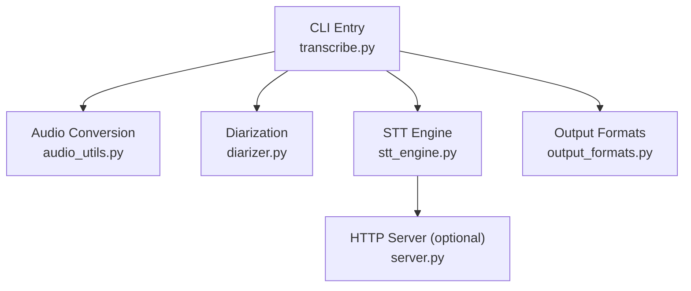
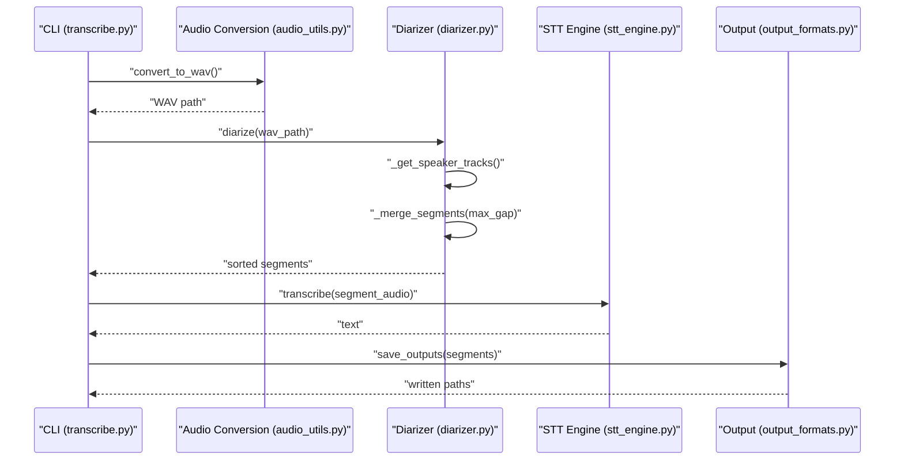
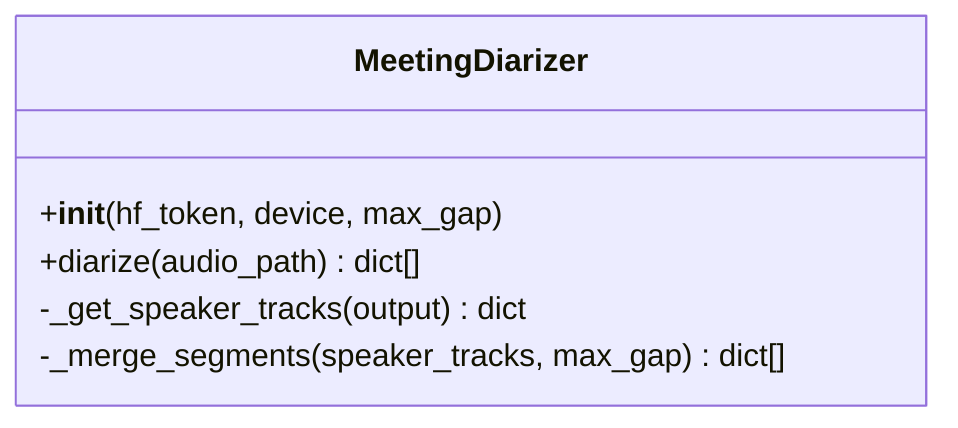
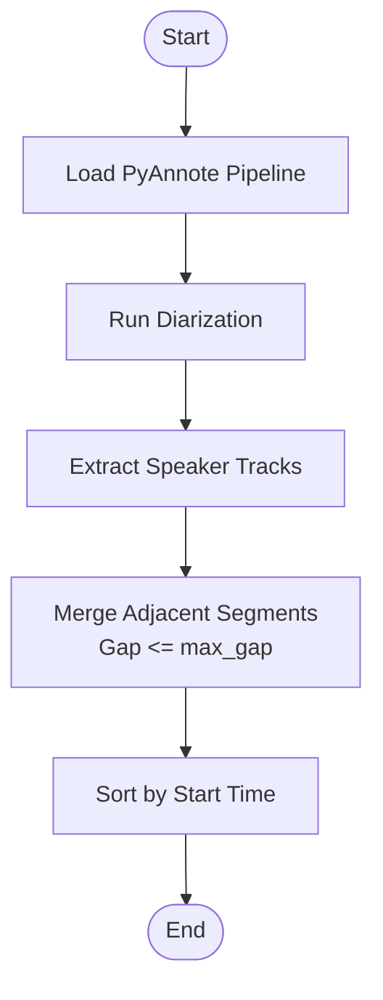
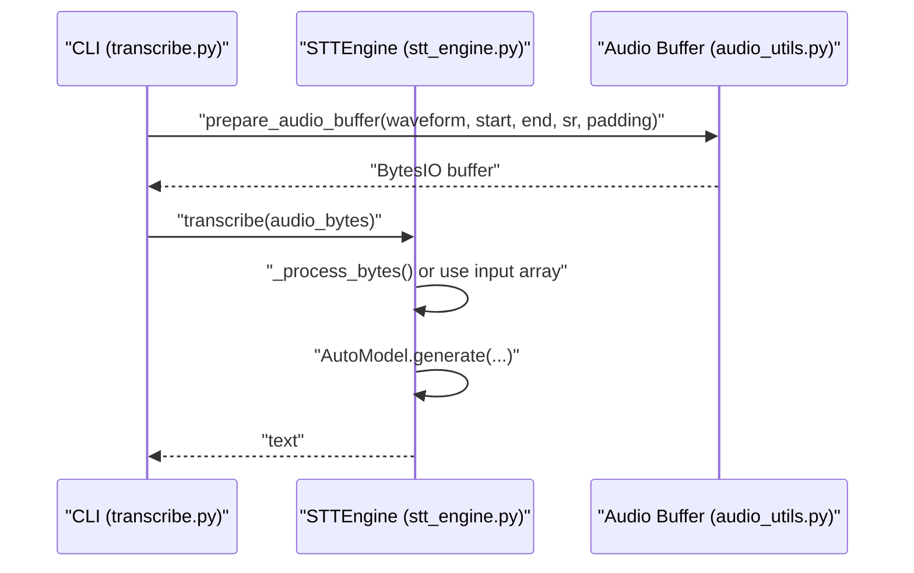
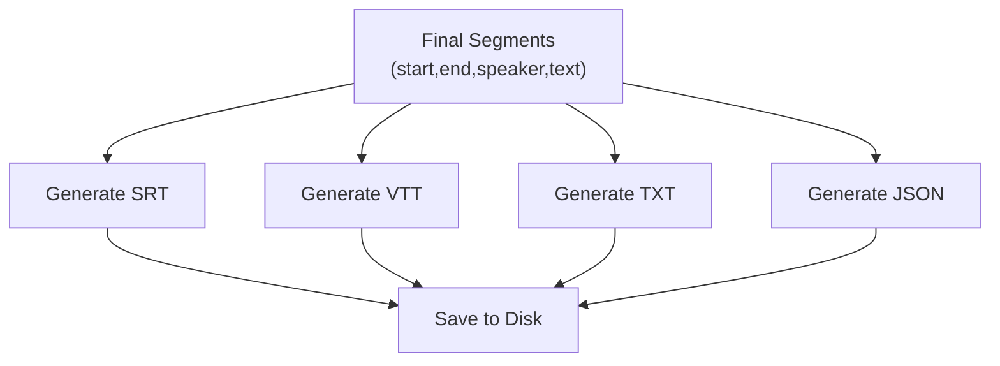
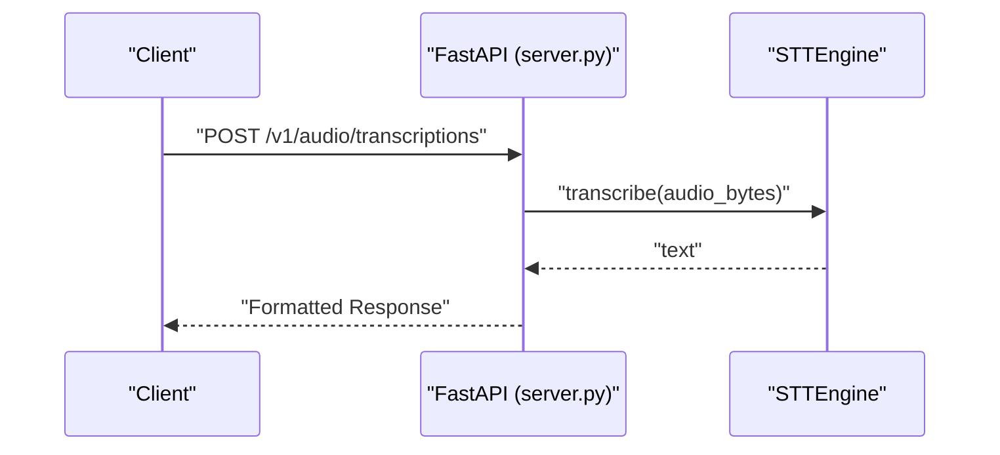
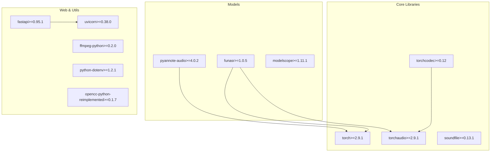

# Speaker Diarization System

<cite>
**Referenced Files in This Document**
- [README.md](file://README.md)
- [diarizer.py](file://diarizer.py)
- [transcribe.py](file://transcribe.py)
- [stt_engine.py](file://stt_engine.py)
- [server.py](file://server.py)
- [output_formats.py](file://output_formats.py)
- [audio_utils.py](file://audio_utils.py)
- [pyproject.toml](file://pyproject.toml)
- [run.sh](file://run.sh)
</cite>

## Table of Contents
1. [Introduction](#introduction)
2. [Project Structure](#project-structure)
3. [Core Components](#core-components)
4. [Architecture Overview](#architecture-overview)
5. [Detailed Component Analysis](#detailed-component-analysis)
6. [Dependency Analysis](#dependency-analysis)
7. [Performance Considerations](#performance-considerations)
8. [Troubleshooting Guide](#troubleshooting-guide)
9. [Conclusion](#conclusion)
10. [Appendices](#appendices)

## Introduction
This document explains the speaker diarization system integrated into the meeting transcription pipeline. It focuses on how PyAnnote.audio is used to detect speakers and segment audio into per-speaker turns, how the system merges adjacent segments, and how the resulting segments are fed into the SenseVoice STT engine for transcription. It also covers configuration options, performance tuning, accuracy optimization, and troubleshooting.

## Project Structure
The system is organized around a unified CLI that orchestrates audio conversion, speaker diarization, segment merging, per-segment transcription, and output generation. Supporting modules handle audio utilities, output formatting, and an optional HTTP server.

**Diagram sources**
- [transcribe.py:45-144](file://transcribe.py#L45-L144)
- [audio_utils.py:23-51](file://audio_utils.py#L23-L51)
- [diarizer.py:55-110](file://diarizer.py#L55-L110)
- [stt_engine.py:24-185](file://stt_engine.py#L24-L185)
- [output_formats.py:118-160](file://output_formats.py#L118-L160)
- [server.py:92-197](file://server.py#L92-L197)

**Section sources**
- [README.md:134-173](file://README.md#L134-L173)
- [transcribe.py:45-144](file://transcribe.py#L45-L144)

## Core Components
- MeetingDiarizer: Wraps PyAnnote’s speaker diarization pipeline, loads the model, runs inference, extracts speaker tracks, merges adjacent segments, and returns a sorted list of segments.
- STTEngine: In-process wrapper around FunASR’s SenseVoice model. Handles audio decoding, optional VAD, and transcription with post-processing.
- Audio utilities: Converts input audio/video to 16 kHz mono WAV, extracts waveform segments with optional padding, and decodes audio bytes.
- Output formats: Generates SRT, VTT, TXT, and JSON outputs from the final segments.
- Server: Optional FastAPI server exposing OpenAI-compatible endpoints for transcription.

Key configuration options:
- Device selection for PyAnnote and STT engines.
- Max gap for merging same-speaker segments.
- VAD settings for STT engine (when used in-process).
- Output formats and directories.

**Section sources**
- [diarizer.py:27-110](file://diarizer.py#L27-L110)
- [stt_engine.py:24-66](file://stt_engine.py#L24-L66)
- [audio_utils.py:23-94](file://audio_utils.py#L23-L94)
- [output_formats.py:118-160](file://output_formats.py#L118-L160)
- [server.py:92-197](file://server.py#L92-L197)

## Architecture Overview
The end-to-end pipeline integrates PyAnnote for speaker diarization and SenseVoice for transcription. The diarizer produces per-speaker segments; the STT engine transcribes each segment independently. Outputs are generated in multiple formats.

**Diagram sources**
- [transcribe.py:63-144](file://transcribe.py#L63-L144)
- [audio_utils.py:23-51](file://audio_utils.py#L23-L51)
- [diarizer.py:55-110](file://diarizer.py#L55-L110)
- [stt_engine.py:71-106](file://stt_engine.py#L71-L106)
- [output_formats.py:118-160](file://output_formats.py#L118-L160)

## Detailed Component Analysis

### Diarization Pipeline (PyAnnote Integration)
- Model loading: Initializes the PyAnnote speaker-diarization pipeline from a pretrained model and moves it to the selected device.
- Inference: Runs the pipeline on the input audio with progress reporting.
- Speaker tracks: Extracts speaker turns from the pipeline output and organizes them by speaker label.
- Segment merging: Merges adjacent segments for the same speaker if the gap between consecutive segments is less than or equal to the configured max gap.
- Sorting: Sorts the final merged segments by start time.

**Diagram sources**
- [diarizer.py:27-110](file://diarizer.py#L27-L110)

**Section sources**
- [diarizer.py:30-54](file://diarizer.py#L30-L54)
- [diarizer.py:55-70](file://diarizer.py#L55-L70)
- [diarizer.py:76-87](file://diarizer.py#L76-L87)
- [diarizer.py:89-110](file://diarizer.py#L89-L110)

### VAD Settings and Segment Merging
- VAD in STT engine: When enabled, the STT engine performs voice activity detection and segmentation. However, when diarization is used, the STT engine can be instructed to skip VAD to avoid double-segmentation artifacts.
- Segment merging: The diarizer merges adjacent segments for the same speaker if the inter-segment gap is within the configured threshold. This reduces noise and improves downstream transcription quality.

**Diagram sources**
- [diarizer.py:55-110](file://diarizer.py#L55-L110)

**Section sources**
- [transcribe.py:88-94](file://transcribe.py#L88-L94)
- [diarizer.py:89-110](file://diarizer.py#L89-L110)

### STT Engine and Transcription Workflow
- Initialization: Loads SenseVoice via FunASR, optionally enabling VAD with configurable parameters.
- Transcription: Accepts file paths, raw audio bytes, or preprocessed arrays; decodes audio to 16 kHz mono if needed; generates transcription with post-processing.
- Post-processing: Applies rich transcription post-processing and simplified-to-traditional Chinese conversion.

**Diagram sources**
- [transcribe.py:99-124](file://transcribe.py#L99-L124)
- [stt_engine.py:71-106](file://stt_engine.py#L71-L106)
- [audio_utils.py:53-94](file://audio_utils.py#L53-L94)

**Section sources**
- [stt_engine.py:27-66](file://stt_engine.py#L27-L66)
- [stt_engine.py:71-106](file://stt_engine.py#L71-L106)
- [audio_utils.py:53-94](file://audio_utils.py#L53-L94)

### Output Formatting and Integration
- Formats: Supports SRT, VTT, TXT, and JSON outputs.
- Generation: Each format generator expects segments with keys: start, end, speaker, text.
- Persistence: Writes files to the specified output directory with appropriate extensions.

**Diagram sources**
- [output_formats.py:43-104](file://output_formats.py#L43-L104)
- [output_formats.py:118-160](file://output_formats.py#L118-L160)

**Section sources**
- [output_formats.py:43-104](file://output_formats.py#L43-L104)
- [output_formats.py:118-160](file://output_formats.py#L118-L160)

### HTTP Server Integration
- Endpoints: Provides legacy and OpenAI-compatible endpoints for transcription.
- Response formatting: Supports text, JSON, verbose JSON, SRT, and VTT responses.
- Engine binding: Creates the STT engine with configurable parameters and serves requests.

**Diagram sources**
- [server.py:121-161](file://server.py#L121-L161)
- [stt_engine.py:71-106](file://stt_engine.py#L71-L106)

**Section sources**
- [server.py:92-197](file://server.py#L92-L197)
- [stt_engine.py:24-66](file://stt_engine.py#L24-L66)

## Dependency Analysis
The system relies on external libraries for audio processing, model inference, and HTTP serving. The project configuration lists the required dependencies.

**Diagram sources**
- [pyproject.toml:7-23](file://pyproject.toml#L7-L23)

**Section sources**
- [pyproject.toml:7-23](file://pyproject.toml#L7-L23)

## Performance Considerations
- Device selection: Prefer GPU acceleration (e.g., CUDA) for both PyAnnote and STT engines when available. On Apple Silicon, MPS can be used.
- Concurrency: Limit concurrent transcriptions in in-process mode to balance throughput and memory usage.
- Padding: Adjust segment padding to reduce edge effects while avoiding excessive recomputation.
- VAD: When diarization is used, disabling STT’s VAD avoids redundant segmentation and improves speed.
- Segment merging: Tune max gap to balance continuity and accuracy; smaller gaps reduce artifacts but increase segment count.

[No sources needed since this section provides general guidance]

## Troubleshooting Guide
- PyAnnote model access: Ensure a valid HuggingFace token is configured; agree to the model’s terms on HuggingFace.
- torchcodec compatibility: If encountering codec-related errors, verify torchcodec version compatibility with your PyTorch installation.
- FFmpeg availability: Confirm FFmpeg is installed and accessible; the system converts inputs to 16 kHz mono WAV.
- Audio decoding failures: The STT engine falls back to ffmpeg when torchaudio fails; ensure ffmpeg is available.

**Section sources**
- [README.md:175-203](file://README.md#L175-L203)
- [stt_engine.py:111-129](file://stt_engine.py#L111-L129)

## Conclusion
The speaker diarization system integrates PyAnnote for robust speaker detection and merges adjacent segments to improve transcription quality. Combined with the SenseVoice STT engine and flexible output formats, it provides a complete pipeline for meeting transcription. Proper configuration of devices, VAD, and merging thresholds yields significant improvements in both performance and accuracy.

[No sources needed since this section summarizes without analyzing specific files]

## Appendices

### Configuration Options Reference
- Diarizer
  - hf_token: HuggingFace token for model access.
  - device: Target device for inference (CPU, MPS, CUDA).
  - max_gap: Maximum gap (seconds) to merge adjacent same-speaker segments.
- STT Engine
  - model_dir: SenseVoice model directory or identifier.
  - device: Target device for inference.
  - language: Target language for transcription.
  - vad_model: VAD model name; set to None to skip VAD.
  - vad_kwargs: VAD-specific parameters.
  - use_itn: Enable inverse text normalization.
  - merge_vad: Merge VAD segments.
  - merge_length_s: Maximum VAD merge length in seconds.
- CLI
  - device: Device selection for both diarizer and STT.
  - model_dir: SenseVoice model path or hub identifier.
  - language: Language for transcription.
  - format: Comma-separated output formats (srt, vtt, txt, json).
  - output: Output directory; defaults to input directory’s output subfolder.
  - max_workers: Maximum concurrent transcriptions.
  - padding: Segment padding in seconds.
  - max_gap: Max gap for merging same-speaker segments.

**Section sources**
- [diarizer.py:30-54](file://diarizer.py#L30-L54)
- [stt_engine.py:27-66](file://stt_engine.py#L27-L66)
- [transcribe.py:173-221](file://transcribe.py#L173-L221)

### Example Workflows
- Speaker separation workflow
  - Convert input to WAV using FFmpeg.
  - Run PyAnnote diarization to obtain speaker segments.
  - Merge adjacent segments with configured max gap.
  - Transcribe each segment using SenseVoice (in-process).
  - Save outputs in desired formats.
- Parameter adjustment strategies
  - Increase max_gap to merge longer pauses; decrease for tighter turns.
  - Disable STT VAD when using PyAnnote diarization to prevent double segmentation.
  - Reduce padding to minimize recomputation; increase for robustness at boundaries.

**Section sources**
- [transcribe.py:63-144](file://transcribe.py#L63-L144)
- [diarizer.py:89-110](file://diarizer.py#L89-L110)
- [stt_engine.py:42-55](file://stt_engine.py#L42-L55)