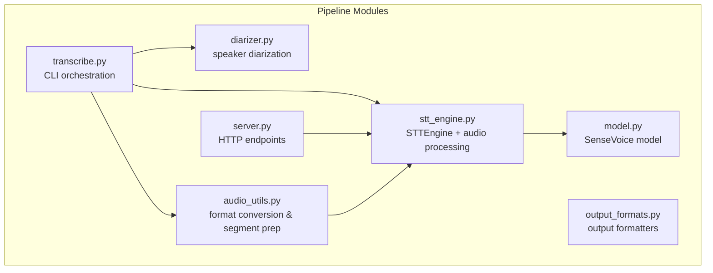
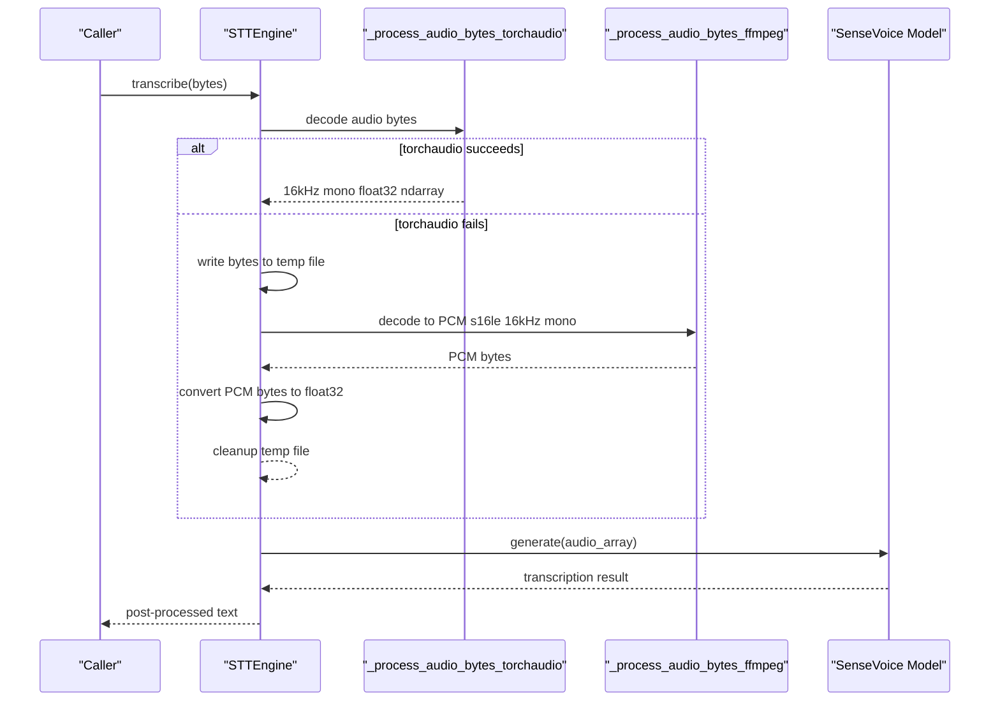
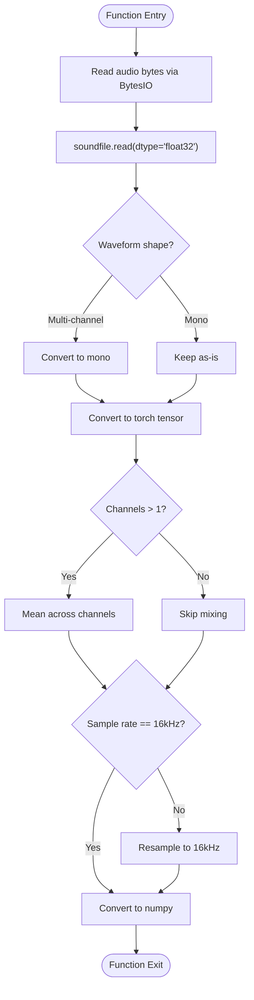
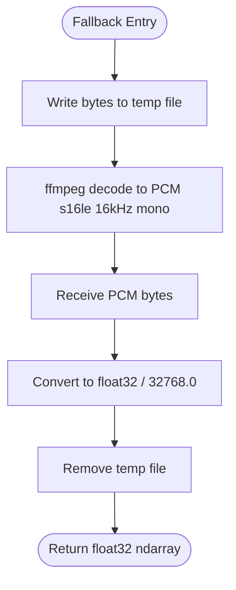
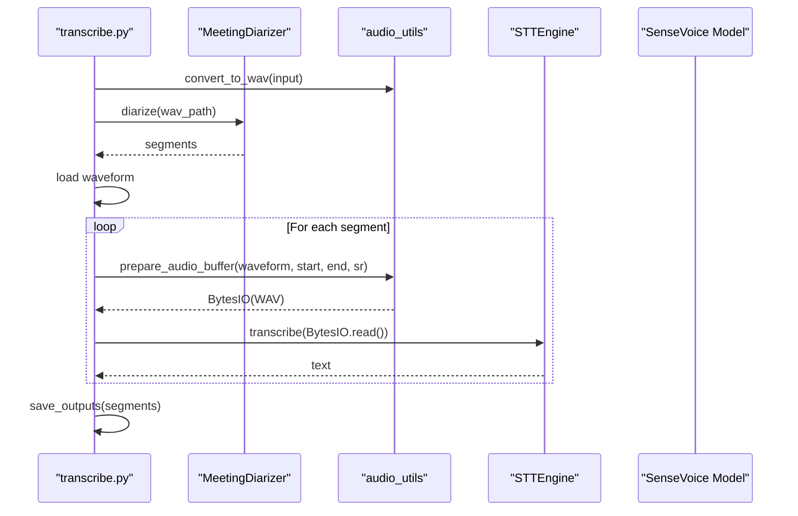
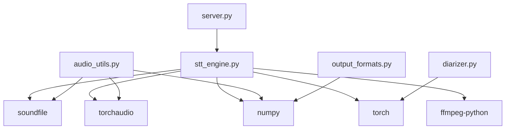

# Audio Processing Pipeline

<cite>
**Referenced Files in This Document**
- [stt_engine.py](file://stt_engine.py)
- [audio_utils.py](file://audio_utils.py)
- [transcribe.py](file://transcribe.py)
- [server.py](file://server.py)
- [diarizer.py](file://diarizer.py)
- [output_formats.py](file://output_formats.py)
- [model.py](file://model.py)
- [pyproject.toml](file://pyproject.toml)
- [README.md](file://README.md)
</cite>

## Table of Contents
1. [Introduction](#introduction)
2. [Project Structure](#project-structure)
3. [Core Components](#core-components)
4. [Architecture Overview](#architecture-overview)
5. [Detailed Component Analysis](#detailed-component-analysis)
6. [Dependency Analysis](#dependency-analysis)
7. [Performance Considerations](#performance-considerations)
8. [Troubleshooting Guide](#troubleshooting-guide)
9. [Conclusion](#conclusion)
10. [Appendices](#appendices)

## Introduction
This document explains the audio processing pipeline within the STT engine, focusing on in-memory decoding of audio bytes using soundfile and torchaudio, and the ffmpeg fallback path for unsupported formats. It covers:
- The _process_audio_bytes_torchaudio function for decoding audio bytes into a 16 kHz mono float32 array
- The _process_audio_bytes_ffmpeg implementation for PCM byte handling and audio format conversion
- Temporary file handling and error recovery mechanisms
- Practical examples of audio preprocessing, format compatibility, and troubleshooting

## Project Structure
The audio processing pipeline spans several modules:
- stt_engine.py: Implements the STTEngine class and the public transcribe API, including the fallback chain from torchaudio to ffmpeg
- audio_utils.py: Provides additional audio utilities such as format conversion to WAV and segment preparation
- transcribe.py: Orchestrates the end-to-end pipeline (format conversion, diarization, segmentation, transcription)
- server.py: Exposes HTTP endpoints that accept uploaded audio bytes and route them to STTEngine
- diarizer.py: Speaker diarization pipeline used upstream of transcription
- output_formats.py: Output formatters for SRT/VTT/TXT/JSON
- model.py: SenseVoice model integration and inference logic
- pyproject.toml: Dependencies including soundfile, torchaudio, ffmpeg-python, and others
- README.md: High-level overview and troubleshooting guidance

**Diagram sources**
- [stt_engine.py:111-184](file://stt_engine.py#L111-L184)
- [audio_utils.py:23-119](file://audio_utils.py#L23-L119)
- [transcribe.py:45-143](file://transcribe.py#L45-L143)
- [server.py:92-161](file://server.py#L92-L161)
- [diarizer.py:27-110](file://diarizer.py#L27-L110)
- [output_formats.py:118-160](file://output_formats.py#L118-L160)
- [model.py:580-931](file://model.py#L580-L931)

**Section sources**
- [stt_engine.py:1-185](file://stt_engine.py#L1-L185)
- [audio_utils.py:1-120](file://audio_utils.py#L1-L120)
- [transcribe.py:1-240](file://transcribe.py#L1-L240)
- [server.py:1-197](file://server.py#L1-L197)
- [diarizer.py:1-110](file://diarizer.py#L1-L110)
- [output_formats.py:1-160](file://output_formats.py#L1-L160)
- [model.py:1-931](file://model.py#L1-L931)
- [pyproject.toml:1-24](file://pyproject.toml#L1-L24)
- [README.md:1-210](file://README.md#L1-L210)

## Core Components
- STTEngine.transcribe: Public API that accepts str (file path), bytes (raw audio), or np.ndarray (preprocessed samples). For bytes, it delegates to _process_bytes.
- STTEngine._process_bytes: Attempts torchaudio decoding first; on failure, writes bytes to a temporary file and falls back to ffmpeg to produce PCM s16le at 16 kHz mono.
- _process_audio_bytes_torchaudio: Decodes audio bytes in-memory using soundfile and torchaudio, converting to 16 kHz mono float32.
- _process_audio_bytes_ffmpeg: Uses ffmpeg to decode arbitrary formats to PCM s16le at 16 kHz mono, returning raw PCM bytes.
- audio_utils.convert_to_wav: Converts any supported audio/video file to 16 kHz mono WAV using ffmpeg.
- audio_utils.prepare_audio_buffer: Extracts a segment from a waveform and returns an in-memory WAV buffer for downstream processing.

Key behaviors:
- Resampling to 16 kHz and mono channel conversion are performed consistently across both paths
- The fallback path converts PCM bytes to float32 normalized to [-1.0, 1.0]
- Temporary file cleanup is handled automatically after ffmpeg processing

**Section sources**
- [stt_engine.py:71-184](file://stt_engine.py#L71-L184)
- [audio_utils.py:23-119](file://audio_utils.py#L23-L119)

## Architecture Overview
The audio processing pipeline integrates multiple libraries and paths:

**Diagram sources**
- [stt_engine.py:111-184](file://stt_engine.py#L111-L184)
- [model.py:580-931](file://model.py#L580-L931)

## Detailed Component Analysis

### In-Memory Decoding with soundfile and torchaudio
The _process_audio_bytes_torchaudio function performs:
- Reads audio bytes into memory using soundfile into a float32 waveform
- Ensures correct shape for multi-channel audio (converts to mono)
- Resamples to 16 kHz if needed using torchaudio transforms
- Returns a 16 kHz mono float32 numpy array suitable for the STT model

**Diagram sources**
- [stt_engine.py:147-170](file://stt_engine.py#L147-L170)

**Section sources**
- [stt_engine.py:147-170](file://stt_engine.py#L147-L170)

### Fallback Decoding with ffmpeg
When torchaudio decoding fails, the pipeline writes the raw bytes to a temporary file and invokes ffmpeg to decode to PCM s16le at 16 kHz mono. The resulting PCM bytes are converted to float32 in [-1.0, 1.0].

**Diagram sources**
- [stt_engine.py:111-128](file://stt_engine.py#L111-L128)
- [stt_engine.py:173-184](file://stt_engine.py#L173-L184)

**Section sources**
- [stt_engine.py:111-128](file://stt_engine.py#L111-L128)
- [stt_engine.py:173-184](file://stt_engine.py#L173-L184)

### Temporary File Handling and Error Recovery
- Temporary file creation uses a binary suffix to ensure ffmpeg can read the bytes correctly
- The temp file is removed in a finally block to guarantee cleanup even if an exception occurs
- ffmpeg is invoked with explicit format and codec parameters to ensure deterministic output

Practical implications:
- Ensure sufficient disk space for temporary files during fallback processing
- The temp file is deleted immediately after ffmpeg completes

**Section sources**
- [stt_engine.py:118-128](file://stt_engine.py#L118-L128)

### PCM Byte Handling and Conversion
After ffmpeg decoding, the pipeline converts PCM s16le bytes to float32 samples normalized to the [-1.0, 1.0] range. This ensures compatibility with the STT model’s expectations.

**Section sources**
- [stt_engine.py:123-127](file://stt_engine.py#L123-L127)

### Additional Utilities for Audio Preprocessing
- convert_to_wav: Converts any supported audio/video file to 16 kHz mono WAV using ffmpeg. Useful for batch processing and offline workflows.
- prepare_audio_buffer: Extracts a segment from a waveform and returns an in-memory WAV buffer for downstream processing. It handles multi-channel to mono conversion and writes WAV data to a BytesIO buffer.

These utilities complement the in-memory decoding by providing robust format conversion and segment extraction capabilities.

**Section sources**
- [audio_utils.py:23-51](file://audio_utils.py#L23-L51)
- [audio_utils.py:53-94](file://audio_utils.py#L53-L94)

### End-to-End Pipeline Integration
The CLI orchestrator demonstrates how audio is prepared and fed into the STT engine:
- Converts input to WAV if needed
- Runs diarization to obtain speaker segments
- Loads audio into memory
- Extracts segments and transcribes them using STTEngine
- Saves outputs in requested formats

**Diagram sources**
- [transcribe.py:45-143](file://transcribe.py#L45-L143)
- [audio_utils.py:53-94](file://audio_utils.py#L53-L94)
- [diarizer.py:55-70](file://diarizer.py#L55-L70)

**Section sources**
- [transcribe.py:45-143](file://transcribe.py#L45-L143)
- [audio_utils.py:53-94](file://audio_utils.py#L53-L94)
- [diarizer.py:55-70](file://diarizer.py#L55-L70)

## Dependency Analysis
The audio processing pipeline relies on the following external libraries:
- soundfile: In-memory audio decoding
- torchaudio: Resampling and tensor operations
- ffmpeg-python: ffmpeg invocation for fallback decoding
- numpy: Array manipulation and type conversion
- torch: Tensor operations and model inference

**Diagram sources**
- [stt_engine.py:12-19](file://stt_engine.py#L12-L19)
- [audio_utils.py:15-19](file://audio_utils.py#L15-L19)
- [server.py:21](file://server.py#L21)
- [diarizer.py:10-13](file://diarizer.py#L10-L13)
- [output_formats.py:7-11](file://output_formats.py#L7-L11)

**Section sources**
- [pyproject.toml:7-23](file://pyproject.toml#L7-L23)
- [stt_engine.py:12-19](file://stt_engine.py#L12-L19)
- [audio_utils.py:15-19](file://audio_utils.py#L15-L19)
- [server.py:21](file://server.py#L21)
- [diarizer.py:10-13](file://diarizer.py#L10-L13)
- [output_formats.py:7-11](file://output_formats.py#L7-L11)

## Performance Considerations
- In-memory decoding with soundfile and torchaudio avoids disk I/O and is generally faster for supported formats
- Fallback to ffmpeg introduces temporary file I/O and subprocess overhead; minimize fallback by ensuring input formats are widely supported
- Resampling is computationally inexpensive but can be avoided if input is already 16 kHz
- For server deployments, consider buffering and streaming strategies to reduce latency and memory pressure

[No sources needed since this section provides general guidance]

## Troubleshooting Guide
Common issues and resolutions:
- FFmpeg not installed or incompatible version
  - Ensure FFmpeg 4–8 is installed and accessible in PATH
  - Verify ffmpeg-python can locate the ffmpeg executable
- Unsupported audio format
  - The fallback path decodes via ffmpeg; confirm the format is supported by ffmpeg
  - For CLI batch processing, use convert_to_wav to normalize inputs to 16 kHz mono WAV
- Temporary file errors
  - Ensure the temp directory is writable and has sufficient space
  - Confirm cleanup occurs even on exceptions due to the finally block
- torchcodec version mismatch
  - Align torchcodec with the installed torch version to avoid compatibility issues
- Model input mismatches
  - The pipeline produces 16 kHz mono float32 arrays; ensure downstream steps expect this format

**Section sources**
- [README.md:175-203](file://README.md#L175-L203)
- [stt_engine.py:118-128](file://stt_engine.py#L118-L128)

## Conclusion
The audio processing pipeline provides a robust, dual-path approach to decoding audio bytes:
- Prefer in-memory decoding with soundfile and torchaudio for speed and simplicity
- Fall back to ffmpeg for broad format support, ensuring consistent 16 kHz mono PCM output
- Complement with utilities for format conversion and segment extraction to support diverse workflows

[No sources needed since this section summarizes without analyzing specific files]

## Appendices

### Practical Examples
- Converting any audio/video to 16 kHz mono WAV for batch processing
  - Use convert_to_wav to normalize inputs before diarization and transcription
- Handling raw audio bytes from HTTP uploads
  - Use STTEngine.transcribe(bytes) to leverage the torchaudio-first path with ffmpeg fallback
- Extracting speaker-aligned segments
  - Use prepare_audio_buffer to create per-segment WAV buffers for targeted transcription

**Section sources**
- [audio_utils.py:23-51](file://audio_utils.py#L23-L51)
- [audio_utils.py:53-94](file://audio_utils.py#L53-L94)
- [stt_engine.py:71-105](file://stt_engine.py#L71-L105)