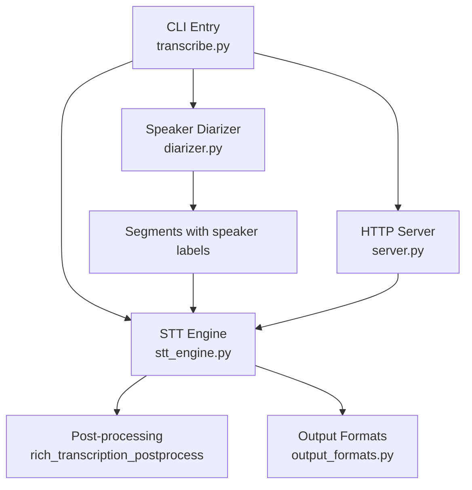
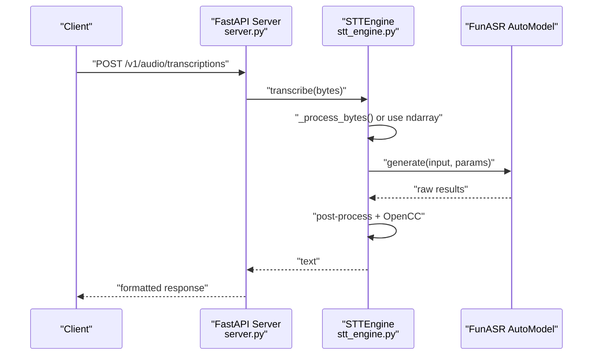
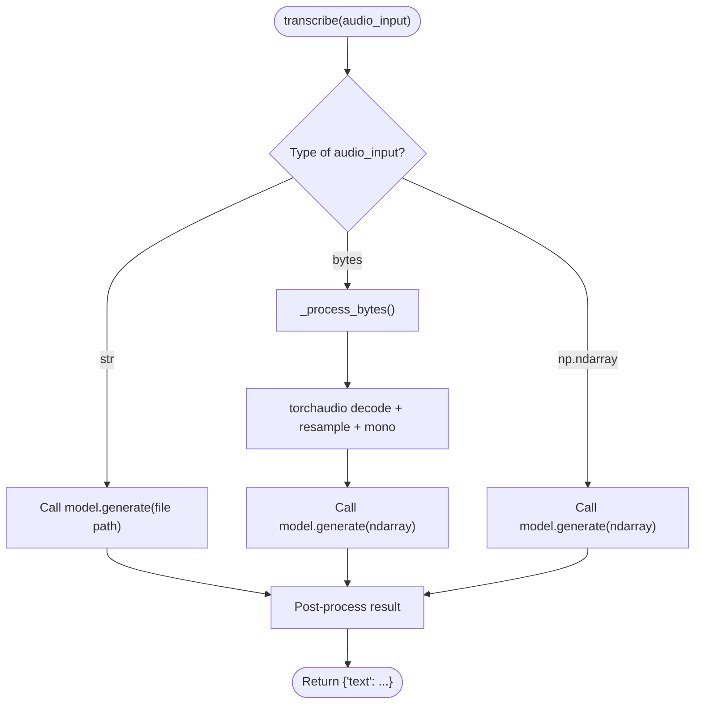
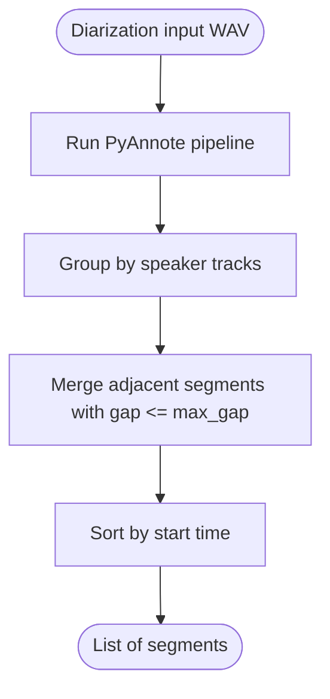
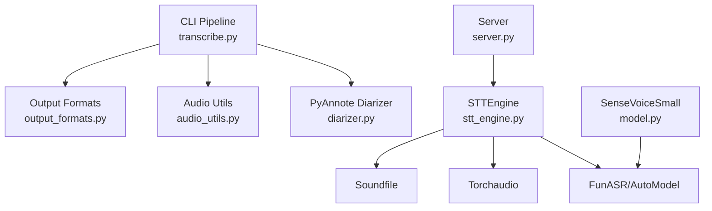

# Inference Optimization

<cite>
**Referenced Files in This Document**
- [stt_engine.py](file://stt_engine.py)
- [transcribe.py](file://transcribe.py)
- [audio_utils.py](file://audio_utils.py)
- [diarizer.py](file://diarizer.py)
- [server.py](file://server.py)
- [model.py](file://model.py)
- [output_formats.py](file://output_formats.py)
- [README.md](file://README.md)
- [pyproject.toml](file://pyproject.toml)
</cite>

## Table of Contents
1. [Introduction](#introduction)
2. [Project Structure](#project-structure)
3. [Core Components](#core-components)
4. [Architecture Overview](#architecture-overview)
5. [Detailed Component Analysis](#detailed-component-analysis)
6. [Dependency Analysis](#dependency-analysis)
7. [Performance Considerations](#performance-considerations)
8. [Troubleshooting Guide](#troubleshooting-guide)
9. [Conclusion](#conclusion)
10. [Appendices](#appendices)

## Introduction
This document focuses on STT inference optimization and performance tuning for the meeting transcription pipeline. It explains the transcribe method implementation, audio input processing for different formats (file paths, bytes, numpy arrays), and memory-efficient inference workflows. It also covers Voice Activity Detection (VAD) integration, parameter tuning for vad_model and vad_kwargs, and segment merging strategies. Finally, it provides optimization techniques for batch processing, device-specific acceleration, and resource management, along with concrete examples, benchmarking guidance, and troubleshooting tips for slow inference.

## Project Structure
The repository organizes functionality into focused modules:
- CLI orchestration and pipeline control
- STT engine wrapping FunASR’s SenseVoice
- Audio preprocessing and segmentation utilities
- Speaker diarization and segment merging
- HTTP server for OpenAI-compatible inference
- Model definition and related utilities
- Output format generation

**Diagram sources**
- [transcribe.py:45-144](file://transcribe.py#L45-L144)
- [diarizer.py:27-110](file://diarizer.py#L27-L110)
- [stt_engine.py:24-185](file://stt_engine.py#L24-L185)
- [output_formats.py:118-160](file://output_formats.py#L118-L160)
- [server.py:92-197](file://server.py#L92-L197)

**Section sources**
- [README.md:134-173](file://README.md#L134-L173)
- [pyproject.toml:1-24](file://pyproject.toml#L1-L24)

## Core Components
- STTEngine: Wraps FunASR AutoModel, exposes a transcribe method supporting str (file path), bytes (in-memory audio), and numpy arrays. Handles VAD integration and post-processing.
- Audio utilities: Provide in-memory decoding and segment extraction for efficient processing.
- Diarizer: Speaker diarization with segment merging to reduce inference workload.
- CLI pipeline: Orchestrates conversion, diarization, segmentation, inference, and output generation.
- HTTP server: Exposes OpenAI-compatible endpoints backed by STTEngine.

Key optimization levers:
- Device selection (CPU, MPS, CUDA)
- VAD configuration to avoid redundant segmentation
- Segment padding and merging to balance accuracy and throughput
- Concurrency control for batch-like processing

**Section sources**
- [stt_engine.py:24-185](file://stt_engine.py#L24-L185)
- [audio_utils.py:23-120](file://audio_utils.py#L23-L120)
- [diarizer.py:27-110](file://diarizer.py#L27-L110)
- [transcribe.py:45-144](file://transcribe.py#L45-L144)
- [server.py:92-197](file://server.py#L92-L197)

## Architecture Overview
The pipeline converts input to 16 kHz mono WAV, runs speaker diarization, merges adjacent speaker segments, extracts per-segment buffers, and performs inference via STTEngine. The server exposes endpoints for external clients.

**Diagram sources**
- [server.py:121-161](file://server.py#L121-L161)
- [stt_engine.py:71-106](file://stt_engine.py#L71-L106)
- [stt_engine.py:111-129](file://stt_engine.py#L111-L129)

## Detailed Component Analysis

### STTEngine: Transcribe Method and Audio Input Processing
The transcribe method accepts three input types:
- str: file path; FunASR handles decoding
- bytes: in-memory audio; decoded to 16 kHz mono float32 numpy array
- numpy array: preprocessed 16 kHz mono float32 samples

Processing logic:
- File path: pass directly to model.generate
- Bytes: decode via torchaudio with soundfile fallback; resample to 16 kHz; mono mixdown; return float32 array
- Numpy array: pass through unchanged

Memory efficiency:
- Bytes decoding prefers torchaudio + soundfile for in-memory decoding; falls back to ffmpeg via temporary file if needed
- Numpy arrays avoid repeated decoding overhead when upstream processing already yields proper samples

Post-processing:
- Rich transcription post-processing and Simplified-to-Traditional Chinese conversion

**Diagram sources**
- [stt_engine.py:71-106](file://stt_engine.py#L71-L106)
- [stt_engine.py:111-129](file://stt_engine.py#L111-L129)
- [stt_engine.py:147-184](file://stt_engine.py#L147-L184)

**Section sources**
- [stt_engine.py:71-106](file://stt_engine.py#L71-L106)
- [stt_engine.py:111-129](file://stt_engine.py#L111-L129)
- [stt_engine.py:147-184](file://stt_engine.py#L147-L184)

### Audio Input Processing Utilities
- convert_to_wav: Uses ffmpeg to produce 16 kHz mono WAV for any input format
- prepare_audio_buffer: Extracts a segment from a loaded waveform and writes to an in-memory WAV buffer
- process_audio_bytes_torchaudio: Decodes bytes to 16 kHz mono float32 array with resampling and mono mixdown

These utilities enable memory-efficient workflows by:
- Preloading full waveform once and extracting segments as needed
- Avoiding repeated disk I/O by keeping audio in memory
- Ensuring consistent 16 kHz mono sampling for optimal model performance

**Section sources**
- [audio_utils.py:23-51](file://audio_utils.py#L23-L51)
- [audio_utils.py:53-94](file://audio_utils.py#L53-L94)
- [audio_utils.py:96-120](file://audio_utils.py#L96-L120)

### Speaker Diarization and Segment Merging
- MeetingDiarizer loads the PyAnnote pipeline, assigns device, and runs diarization
- Segments are grouped by speaker and merged when inter-segment gaps are below a threshold
- The merged segments are sorted by start time and passed to STTEngine for inference

Segment merging reduces inference calls and improves throughput while preserving speaker continuity.

**Diagram sources**
- [diarizer.py:55-110](file://diarizer.py#L55-L110)

**Section sources**
- [diarizer.py:27-110](file://diarizer.py#L27-L110)

### HTTP Server and OpenAI-Compatible Endpoints
The server exposes:
- POST /v1/audio/transcriptions (OpenAI-compatible)
- POST /recognition (legacy)

It reads uploaded audio bytes, persists to a temporary file, invokes STTEngine.transcribe, and formats the response according to the requested format (json, text, verbose_json, srt, vtt).

Concurrency and resource management:
- Temporary files are cleaned up after processing
- Responses are streamed or returned as text/plain for SRT/VTT when requested

**Section sources**
- [server.py:92-197](file://server.py#L92-L197)

### Model Definition and Inference Path
The SenseVoiceSmall model integrates:
- Frontend + encoder stack
- CTC and rich text classification losses
- Embeddings for language and style queries
- Inference method for runtime usage

While the CLI and server primarily use FunASR’s AutoModel.generate, understanding the model structure helps optimize input shapes and device placement.

**Section sources**
- [model.py:580-800](file://model.py#L580-L800)

## Dependency Analysis
External dependencies include:
- FunASR and modelscope for SenseVoice
- PyAnnote.audio for diarization
- Torchaudio and soundfile for audio I/O
- FastAPI and Uvicorn for HTTP server
- OpenCC for text normalization

**Diagram sources**
- [pyproject.toml:7-23](file://pyproject.toml#L7-L23)
- [stt_engine.py:17-18](file://stt_engine.py#L17-L18)
- [model.py:580-800](file://model.py#L580-L800)

**Section sources**
- [pyproject.toml:1-24](file://pyproject.toml#L1-L24)

## Performance Considerations
Optimization techniques for STT inference:

- Device-specific acceleration
  - CPU: suitable for small-scale or low-power environments
  - MPS: Apple Silicon acceleration for inference
  - CUDA: NVIDIA GPU acceleration for throughput
  - Choose device via CLI/server arguments

- VAD integration and tuning
  - vad_model: defaults to “fsmn-vad”; set to None when using pre-segmented audio (e.g., from diarizer) to avoid double segmentation
  - vad_kwargs: controls max single segment time; tune to balance long utterances vs. fragmentation
  - merge_vad and merge_length_s: merge short segments to reduce inference overhead

- Memory-efficient inference workflows
  - Convert input to 16 kHz mono WAV once
  - Preload waveform and extract segments via prepare_audio_buffer
  - Pass numpy arrays directly to transcribe when possible to avoid re-decoding

- Batch-like processing
  - Use concurrency control (max_workers) to parallelize segment transcription
  - Keep batch_size=1 for STTEngine.generate as implemented; leverage async workers instead

- Resource management
  - Clean up temporary files after server-side processing
  - Limit segment durations to reduce peak memory usage
  - Prefer float32 arrays and appropriate device tensors

- Post-processing and normalization
  - Enable use_itn and OpenCC conversion only when needed to avoid extra overhead

[No sources needed since this section provides general guidance]

## Troubleshooting Guide
Common issues and remedies:

- Slow inference
  - Verify device selection (CPU vs. MPS/CUDA)
  - Disable VAD when using pre-segmented audio (set vad_model=None)
  - Increase segment durations moderately to reduce overhead
  - Reduce concurrency (max_workers) if memory pressure occurs

- Audio decoding errors
  - torchaudio decoding failures fall back to ffmpeg; ensure FFmpeg is installed and accessible
  - Confirm input format compatibility; use convert_to_wav to standardize

- Server-side errors
  - Check temporary file cleanup and permissions
  - Validate response_format parameter for endpoints

- Environment and library compatibility
  - Ensure torchcodec and FFmpeg versions are compatible
  - Confirm HuggingFace token for PyAnnote models

**Section sources**
- [stt_engine.py:111-129](file://stt_engine.py#L111-L129)
- [audio_utils.py:23-51](file://audio_utils.py#L23-L51)
- [server.py:100-161](file://server.py#L100-L161)
- [README.md:175-203](file://README.md#L175-L203)

## Conclusion
By combining efficient audio preprocessing, strategic VAD configuration, and careful device/resource management, the pipeline achieves robust and scalable STT inference. The STTEngine abstraction cleanly supports multiple input formats, while the CLI and server modes offer flexible deployment options. Tuning parameters such as vad_model, vad_kwargs, and segment merging enables balancing accuracy and throughput for diverse workloads.

[No sources needed since this section summarizes without analyzing specific files]

## Appendices

### Example: Inference Execution and Benchmarking
- CLI execution
  - Default in-process mode: run the CLI with an input file and device selection
  - Server mode: start the HTTP server and send requests via curl or client libraries

- Benchmarking guidance
  - Measure end-to-end latency per segment and total pipeline time
  - Compare CPU vs. MPS/CUDA performance with identical segment sizes
  - Evaluate impact of VAD enable/disable and segment merging thresholds

- Parameter tuning checklist
  - vad_model: None for pre-segmented audio; “fsmn-vad” otherwise
  - vad_kwargs: adjust max single segment time to fit speech rhythm
  - merge_vad and merge_length_s: reduce segment count without losing continuity
  - max_workers: increase gradually until memory limits are reached

**Section sources**
- [README.md:40-89](file://README.md#L40-L89)
- [transcribe.py:173-221](file://transcribe.py#L173-L221)
- [server.py:169-197](file://server.py#L169-L197)