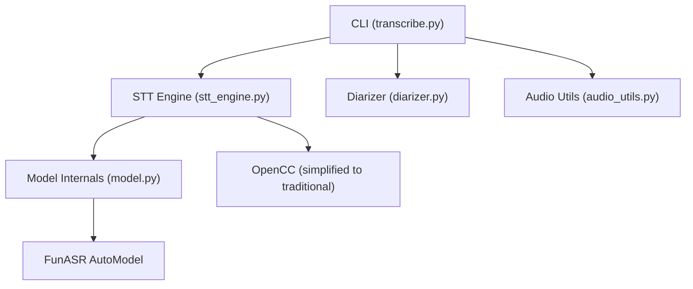
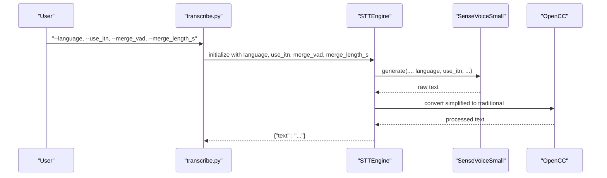
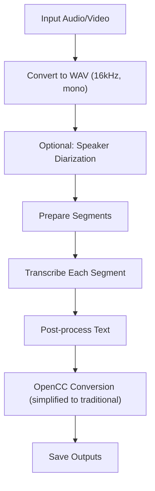
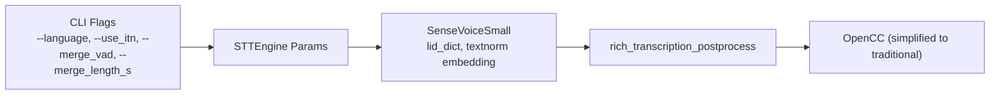

# Language Support

<cite>
**Referenced Files in This Document**
- [stt_engine.py](file://stt_engine.py)
- [transcribe.py](file://transcribe.py)
- [model.py](file://model.py)
- [diarizer.py](file://diarizer.py)
- [audio_utils.py](file://audio_utils.py)
- [README.md](file://README.md)
</cite>

## Table of Contents
1. [Introduction](#introduction)
2. [Project Structure](#project-structure)
3. [Core Components](#core-components)
4. [Architecture Overview](#architecture-overview)
5. [Detailed Component Analysis](#detailed-component-analysis)
6. [Dependency Analysis](#dependency-analysis)
7. [Performance Considerations](#performance-considerations)
8. [Troubleshooting Guide](#troubleshooting-guide)
9. [Conclusion](#conclusion)

## Introduction
This document explains how the STT engine supports multiple languages and related configuration options. It covers:
- Language configuration: auto-detection and explicit settings for Chinese, English, Cantonese, Japanese, and Korean
- Inverse Text Normalization (ITN) behavior
- VAD segmentation controls for segment merging
- Simplified to Traditional Chinese conversion using OpenCC
- Practical configuration examples, multilingual workflows, and tips to improve language detection accuracy

## Project Structure
The language support spans several modules:
- CLI and orchestration: transcribe.py
- STT engine wrapper: stt_engine.py
- Model internals and language identifiers: model.py
- Speaker diarization (pre-segmentation): diarizer.py
- Audio preprocessing utilities: audio_utils.py
- Documentation and CLI help: README.md

**Diagram sources**
- [transcribe.py](file://transcribe.py)
- [stt_engine.py](file://stt_engine.py)
- [model.py](file://model.py)
- [diarizer.py](file://diarizer.py)
- [audio_utils.py](file://audio_utils.py)

**Section sources**
- [README.md](file://README.md)

## Core Components
- Language configuration options:
  - Supported values: auto, zh, en, yue, ja, ko
  - Passed from CLI to the STT engine and model
- ITN parameter:
  - Controls whether inverse text normalization is applied during transcription
- VAD segmentation controls:
  - merge_vad: enable/disable merging of VAD segments
  - merge_length_s: maximum length (seconds) for merged segments
- Simplified to Traditional Chinese conversion:
  - OpenCC is configured to convert simplified Chinese to traditional Chinese after post-processing

Key implementation locations:
- CLI language option and VAD/ITN flags: [transcribe.py](file://transcribe.py)
- STT engine initialization and OpenCC setup: [stt_engine.py](file://stt_engine.py)
- Model-side language ID mapping and ITN integration: [model.py](file://model.py)

**Section sources**
- [transcribe.py:199-218](file://transcribe.py#L199-L218)
- [stt_engine.py:27-65](file://stt_engine.py#L27-L65)
- [model.py:633-639](file://model.py#L633-L639)
- [model.py:824-842](file://model.py#L824-L842)

## Architecture Overview
The language configuration flows from the CLI down to the STT engine and model, while audio segmentation and post-processing are handled by dedicated modules.

**Diagram sources**
- [transcribe.py:84-94](file://transcribe.py#L84-L94)
- [stt_engine.py:71-105](file://stt_engine.py#L71-L105)
- [model.py:824-842](file://model.py#L824-L842)
- [stt_engine.py:130-139](file://stt_engine.py#L130-L139)

## Detailed Component Analysis

### Language Configuration Options
- CLI-level language selection:
  - Values: auto, zh, en, yue, ja, ko
  - Default: auto
  - Passed to STT engine and server modes
- Model-level language identifiers:
  - The model maintains a language ID dictionary mapping symbolic keys to internal indices
  - Keys include auto, zh, en, yue, ja, ko, nospeech
- Behavior:
  - When language is set to auto, the model may infer language internally
  - Explicit language settings override inference

Practical examples:
- Force Cantonese: set language to yue
- Force Japanese: set language to ja
- Force Korean: set language to ko
- Force English: set language to en
- Force Chinese: set language to zh
- Auto-detect: set language to auto

**Section sources**
- [transcribe.py:199-200](file://transcribe.py#L199-L200)
- [model.py:633-639](file://model.py#L633-L639)
- [README.md:123-132](file://README.md#L123-L132)

### Inverse Text Normalization (ITN)
- Purpose:
  - Improve readability by converting normalized text back to surface form (e.g., “2023” to “two thousand and twenty-three”)
- Control:
  - CLI flag --use_itn toggles ITN behavior
  - The STT engine passes use_itn to the underlying model
- Model integration:
  - The model embeds a text normalization dimension and selects “withitn” or “woitn” based on the flag

Practical examples:
- Enable ITN: --use_itn True
- Disable ITN: --use_itn False

**Section sources**
- [transcribe.py:216](file://transcribe.py#L216)
- [model.py:832-842](file://model.py#L832-L842)

### VAD Segmentation Controls
- merge_vad:
  - When enabled, adjacent segments are merged according to merge_length_s
  - Useful to reduce overly fragmented segments
- merge_length_s:
  - Maximum duration for merged segments
  - Defaults to 15 seconds
- Interaction with diarizer:
  - When using a separate diarizer, VAD in the STT engine can be disabled to avoid double segmentation

Practical examples:
- Merge short segments: --merge_vad True --merge_length_s 15
- Keep original VAD behavior: --merge_vad False

**Section sources**
- [transcribe.py:217-218](file://transcribe.py#L217-L218)
- [stt_engine.py:52-55](file://stt_engine.py#L52-L55)

### Simplified to Traditional Chinese Conversion (OpenCC)
- Purpose:
  - Convert simplified Chinese output to traditional Chinese for downstream processing or preferences
- Implementation:
  - OpenCC is initialized in the STT engine
  - Applied after rich transcription post-processing

Practical examples:
- Enable conversion: ensure OpenCC is active (default setup)
- Disable conversion: remove or bypass OpenCC step

**Section sources**
- [stt_engine.py:64](file://stt_engine.py#L64)
- [stt_engine.py:130-139](file://stt_engine.py#L130-L139)

### Multilingual Audio Processing Workflow
End-to-end workflow for multilingual audio:
1. Convert input to 16 kHz mono WAV
2. Optionally run speaker diarization to split audio into per-speaker segments
3. For each segment:
   - Extract waveform slice and encode to in-memory WAV
   - Transcribe using the STT engine with selected language and ITN settings
   - Apply OpenCC conversion if needed
4. Save outputs in requested formats

**Diagram sources**
- [audio_utils.py:23-51](file://audio_utils.py#L23-L51)
- [diarizer.py:55-70](file://diarizer.py#L55-L70)
- [transcribe.py:45-144](file://transcribe.py#L45-L144)
- [stt_engine.py:71-105](file://stt_engine.py#L71-L105)
- [stt_engine.py:130-139](file://stt_engine.py#L130-L139)

### Language Detection Accuracy Optimization
Tips to improve language detection:
- Prefer explicit language setting when the dominant language is known
- Use ITN judiciously; disabling ITN can sometimes preserve punctuation and numeric forms that aid downstream processing
- Adjust merge_length_s to balance continuity vs. segment granularity
- When using a diarizer, disable the STT engine’s VAD to prevent overlapping segmentation artifacts

**Section sources**
- [transcribe.py:84-94](file://transcribe.py#L84-L94)
- [stt_engine.py:52-55](file://stt_engine.py#L52-L55)

## Dependency Analysis
Language support depends on:
- CLI flags and defaults
- STT engine parameter forwarding
- Model-side language ID mapping and ITN embedding
- OpenCC post-processing

**Diagram sources**
- [transcribe.py:199-218](file://transcribe.py#L199-L218)
- [stt_engine.py:27-65](file://stt_engine.py#L27-L65)
- [model.py:633-639](file://model.py#L633-L639)
- [model.py:824-842](file://model.py#L824-L842)
- [stt_engine.py:130-139](file://stt_engine.py#L130-L139)

**Section sources**
- [transcribe.py:199-218](file://transcribe.py#L199-L218)
- [stt_engine.py:27-65](file://stt_engine.py#L27-L65)
- [model.py:633-639](file://model.py#L633-L639)
- [model.py:824-842](file://model.py#L824-L842)
- [stt_engine.py:130-139](file://stt_engine.py#L130-L139)

## Performance Considerations
- Enabling ITN adds minimal overhead but improves readability; consider disabling ITN for speed-sensitive scenarios
- Larger merge_length_s reduces segment count and may slightly improve throughput at the cost of temporal precision
- Using a diarizer eliminates redundant VAD processing and reduces repeated segmentation work

[No sources needed since this section provides general guidance]

## Troubleshooting Guide
Common language-related issues and resolutions:
- Unexpected language detection:
  - Set an explicit language (--language zh, en, yue, ja, ko) to override auto-detection
- Unreadable numbers or dates:
  - Toggle ITN (--use_itn True/False) depending on downstream needs
- Overly fragmented segments:
  - Increase merge_length_s or enable merge_vad
- Mixed scripts or inconsistent character sets:
  - Ensure OpenCC conversion is active; verify that the output is in the desired script variant

**Section sources**
- [transcribe.py:199-218](file://transcribe.py#L199-L218)
- [stt_engine.py:64](file://stt_engine.py#L64)
- [stt_engine.py:130-139](file://stt_engine.py#L130-L139)

## Conclusion
The STT engine provides robust multi-language support with clear configuration options:
- Choose auto or explicit languages (zh, en, yue, ja, ko)
- Control ITN behavior for readability vs. fidelity
- Tune VAD segmentation to balance continuity and precision
- Apply OpenCC for simplified-to-traditional Chinese conversion

These settings enable reliable multilingual transcription across diverse workflows.