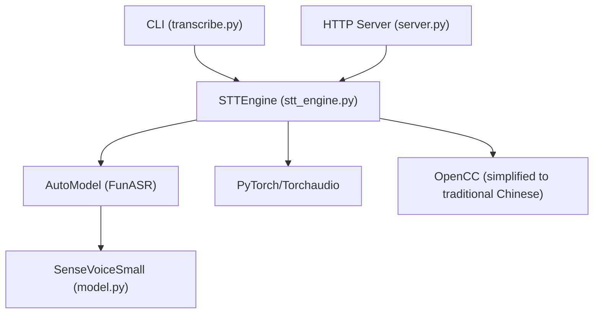
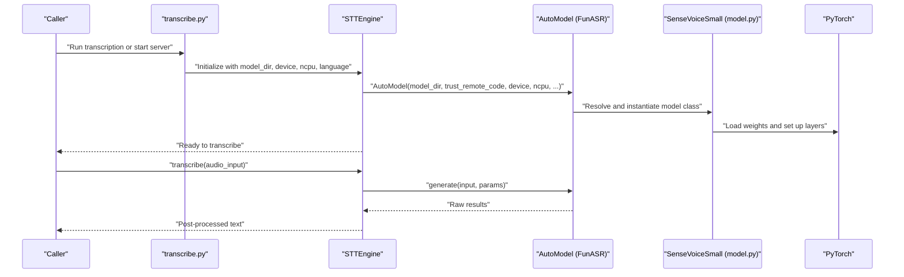
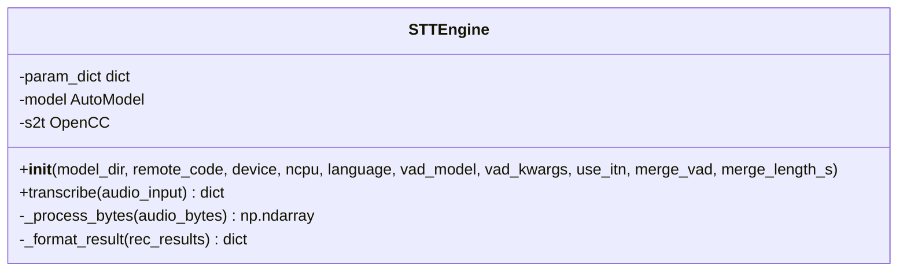
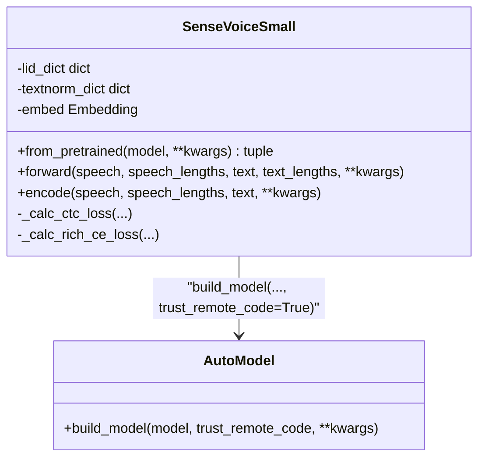
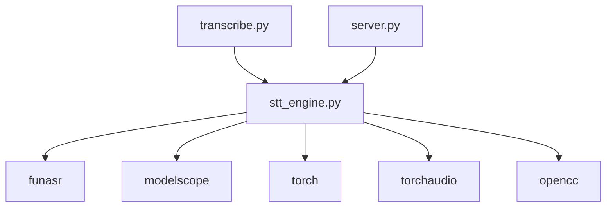

# Model Management

<cite>
**Referenced Files in This Document**
- [stt_engine.py](file://stt_engine.py)
- [model.py](file://model.py)
- [transcribe.py](file://transcribe.py)
- [server.py](file://server.py)
- [pyproject.toml](file://pyproject.toml)
- [README.md](file://README.md)
</cite>

## Table of Contents
1. [Introduction](#introduction)
2. [Project Structure](#project-structure)
3. [Core Components](#core-components)
4. [Architecture Overview](#architecture-overview)
5. [Detailed Component Analysis](#detailed-component-analysis)
6. [Dependency Analysis](#dependency-analysis)
7. [Performance Considerations](#performance-considerations)
8. [Troubleshooting Guide](#troubleshooting-guide)
9. [Conclusion](#conclusion)
10. [Appendices](#appendices)

## Introduction
This document explains the STT model management system used in the project, focusing on how SenseVoice models from FunASR are initialized, configured, and integrated. It covers:
- Model loading and initialization via the AutoModel wrapper
- Parameter configuration for model_dir, device selection (CPU/MPS/CUDA), and ncpu
- Remote code loading and trust_remote_code behavior
- Practical examples of initialization with different configurations
- Device-specific optimizations and troubleshooting common model loading issues
- Model directory structure expectations and dependency management

## Project Structure
The STT model management spans several modules:
- stt_engine.py: Provides the STTEngine class that wraps FunASR’s AutoModel and exposes a simple transcribe API
- model.py: Implements the SenseVoiceSmall model and registers it for FunASR’s model registry
- transcribe.py: CLI entry point that constructs STTEngine and runs in-process transcription
- server.py: HTTP server exposing OpenAI-compatible endpoints backed by STTEngine
- pyproject.toml: Declares runtime dependencies including FunASR, Torch, Torchaudio, and related packages
- README.md: Describes supported languages, CLI parameters, and troubleshooting tips

**Diagram sources**
- [stt_engine.py:24-65](file://stt_engine.py#L24-L65)
- [model.py:580-653](file://model.py#L580-L653)
- [transcribe.py:84-94](file://transcribe.py#L84-L94)
- [server.py:92-161](file://server.py#L92-L161)

**Section sources**
- [stt_engine.py:24-65](file://stt_engine.py#L24-L65)
- [model.py:580-653](file://model.py#L580-L653)
- [transcribe.py:84-94](file://transcribe.py#L84-L94)
- [server.py:92-161](file://server.py#L92-L161)

## Core Components
- STTEngine: Encapsulates model initialization and transcription. It accepts model_dir, device, ncpu, and VAD-related parameters, then builds an AutoModel instance and performs post-processing on results.
- SenseVoiceSmall: A model class registered under the FunASR model registry. It supports loading via AutoModel and integrates preprocessing, CTC, and attention-based decoding.
- CLI and Server: Provide entry points to initialize STTEngine with desired parameters and expose transcription capabilities either in-process or via HTTP.

Key responsibilities:
- Parameter-driven model initialization
- Device selection and CPU thread control
- Remote code loading and trust_remote_code
- Post-processing and output formatting

**Section sources**
- [stt_engine.py:24-65](file://stt_engine.py#L24-L65)
- [model.py:580-653](file://model.py#L580-L653)
- [transcribe.py:84-94](file://transcribe.py#L84-L94)
- [server.py:92-161](file://server.py#L92-L161)

## Architecture Overview
The model management architecture centers around AutoModel, which resolves and loads the SenseVoice model. STTEngine configures AutoModel with device, CPU thread count, and optional VAD parameters. The model class encapsulates the encoder and decoder logic and integrates with FunASR’s registry.

**Diagram sources**
- [stt_engine.py:27-65](file://stt_engine.py#L27-L65)
- [model.py:648-653](file://model.py#L648-L653)
- [transcribe.py:84-94](file://transcribe.py#L84-L94)

## Detailed Component Analysis

### STTEngine: Model Initialization and Transcription
STTEngine initializes the model with:
- model_dir: Path or model identifier (e.g., a hub name or local directory)
- device: Target device string (cpu, mps, cuda)
- ncpu: Number of CPU threads for inference
- remote_code: Path to remote code file for model registration
- trust_remote_code: Enables loading of remote model code
- vad_model and vad_kwargs: Optional voice activity detection configuration

It stores a parameter dictionary for downstream generation calls and applies post-processing to results.

**Diagram sources**
- [stt_engine.py:24-65](file://stt_engine.py#L24-L65)

**Section sources**
- [stt_engine.py:27-65](file://stt_engine.py#L27-L65)
- [stt_engine.py:71-106](file://stt_engine.py#L71-L106)

### SenseVoiceSmall: AutoModel Integration and Model Registration
SenseVoiceSmall is registered under the FunASR model registry and supports loading via AutoModel. It:
- Accepts encoder, normalization, and CTC configurations
- Integrates preprocessing and embedding logic for language and style prompts
- Exposes a static from_pretrained method that delegates to AutoModel.build_model with trust_remote_code enabled

**Diagram sources**
- [model.py:580-653](file://model.py#L580-L653)

**Section sources**
- [model.py:580-653](file://model.py#L580-L653)

### CLI and Server: Practical Initialization Examples
- In-process transcription: STTEngine is constructed with model_dir, device, language, and VAD options. Audio is processed and transcribed in the same process.
- HTTP server: STTEngine is created and exposed via FastAPI endpoints supporting OpenAI-compatible requests.

Practical examples (described):
- Initialize with a local model directory and MPS device for Apple Silicon
- Initialize with a hub model identifier and CUDA device for GPU acceleration
- Disable VAD when using pre-segmented audio from a diarizer
- Configure ncpu for CPU-bound inference scenarios

**Section sources**
- [transcribe.py:84-94](file://transcribe.py#L84-L94)
- [server.py:169-196](file://server.py#L169-L196)

## Dependency Analysis
Runtime dependencies relevant to model management include:
- FunASR and ModelScope for model loading and registry
- PyTorch and Torchaudio for device-agnostic inference
- OpenCC for text normalization
- Additional audio processing libraries

**Diagram sources**
- [pyproject.toml:7-23](file://pyproject.toml#L7-L23)
- [stt_engine.py:17-19](file://stt_engine.py#L17-L19)

**Section sources**
- [pyproject.toml:7-23](file://pyproject.toml#L7-L23)

## Performance Considerations
- Device selection:
  - Use CUDA for GPU acceleration when available
  - Use MPS for Apple Silicon devices
  - Use CPU for environments without dedicated accelerators
- CPU thread control:
  - Adjust ncpu to balance throughput and resource usage
- VAD configuration:
  - Tune vad_kwargs and disable VAD when using external segmentation to avoid redundant processing
- Post-processing:
  - Apply ITN and simplified-to-traditional Chinese conversion judiciously to reduce overhead

[No sources needed since this section provides general guidance]

## Troubleshooting Guide
Common issues and resolutions:
- torchcodec version mismatch:
  - Symptom: NameError related to AudioDecoder
  - Resolution: Ensure torchcodec version compatibility with your PyTorch installation
- PyAnnote model access:
  - Symptom: Access denied to speaker diarization model
  - Resolution: Accept terms on HuggingFace and set HF_TOKEN in environment
- FFmpeg availability:
  - Symptom: Audio decoding failures
  - Resolution: Install FFmpeg 4–8 and ensure system PATH includes ffmpeg

**Section sources**
- [README.md:177-203](file://README.md#L177-L203)

## Conclusion
The STT model management system leverages FunASR’s AutoModel to seamlessly load and configure SenseVoice models. STTEngine centralizes initialization parameters (model_dir, device, ncpu) and integrates optional VAD and post-processing. The system supports flexible deployment modes (in-process and HTTP) and accommodates diverse hardware backends. Following the configuration patterns and troubleshooting steps outlined here ensures reliable model loading and efficient inference.

[No sources needed since this section summarizes without analyzing specific files]

## Appendices

### Model Directory Structure and Registry
- The model class is registered under the FunASR model registry, enabling AutoModel to resolve and instantiate SenseVoiceSmall by name or path.
- The from_pretrained static method demonstrates how AutoModel.build_model is invoked with trust_remote_code enabled to load model code dynamically.

**Section sources**
- [model.py:580-653](file://model.py#L580-L653)

### Device-Specific Optimizations
- CPU: Set device to cpu and tune ncpu for throughput
- Apple Silicon: Set device to mps for Metal acceleration
- NVIDIA GPUs: Set device to cuda for CUDA acceleration

**Section sources**
- [stt_engine.py:27-65](file://stt_engine.py#L27-L65)
- [transcribe.py:195-196](file://transcribe.py#L195-L196)

### Practical Initialization Patterns
- Local model directory with MPS:
  - Provide model_dir pointing to a downloaded model and device=mps
- Hub model with CUDA:
  - Provide model_dir as a hub identifier and device=cuda
- Pre-segmented audio:
  - Omit or set vad_model=None to bypass internal VAD

**Section sources**
- [stt_engine.py:27-65](file://stt_engine.py#L27-L65)
- [transcribe.py:84-94](file://transcribe.py#L84-L94)