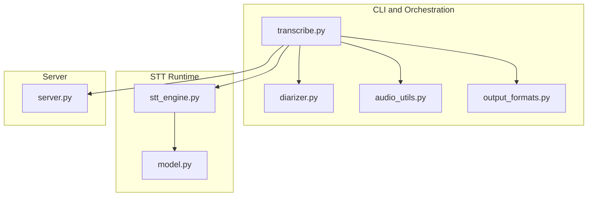
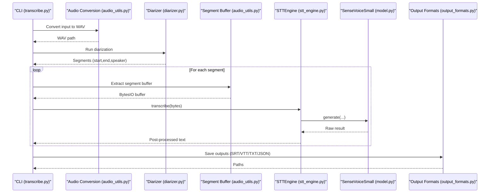
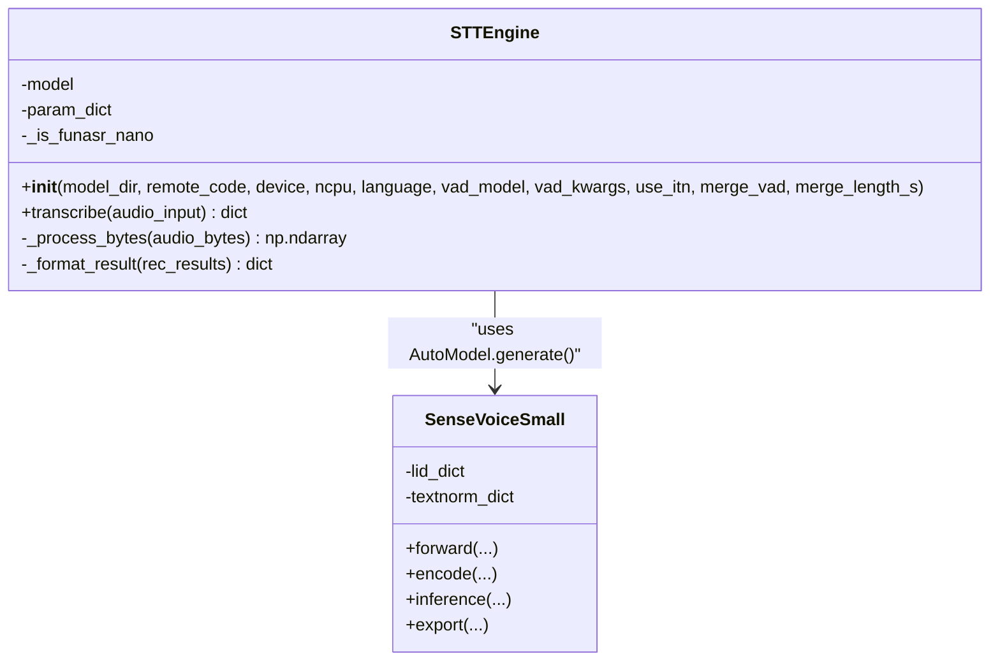
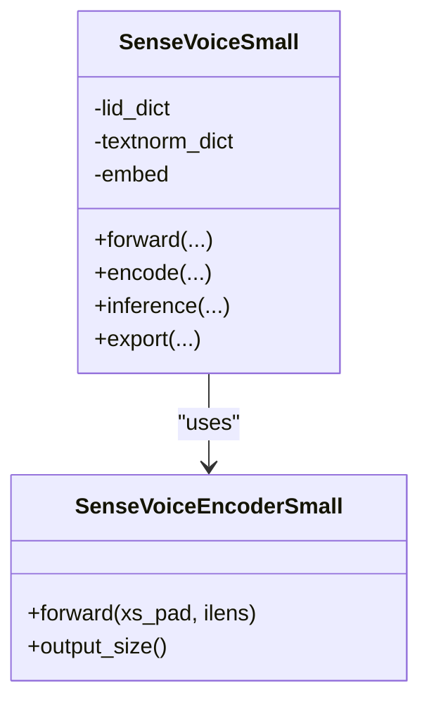
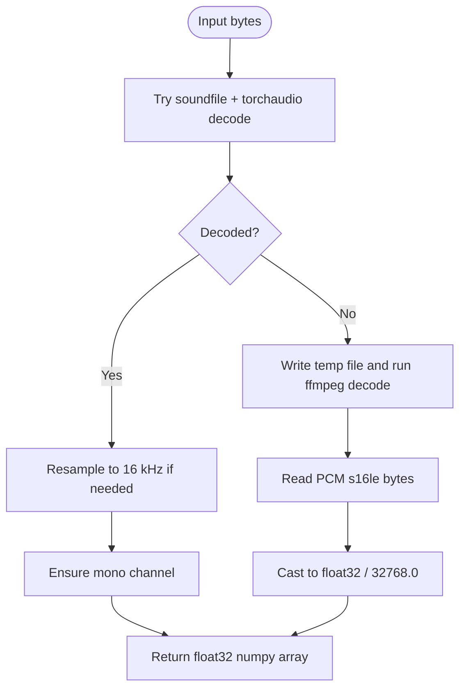
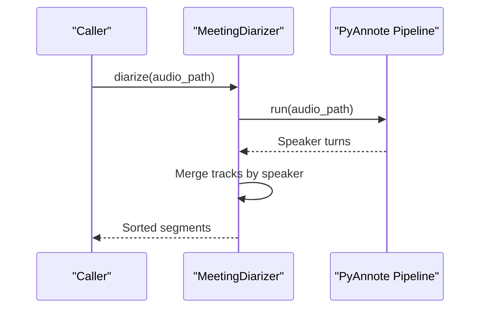
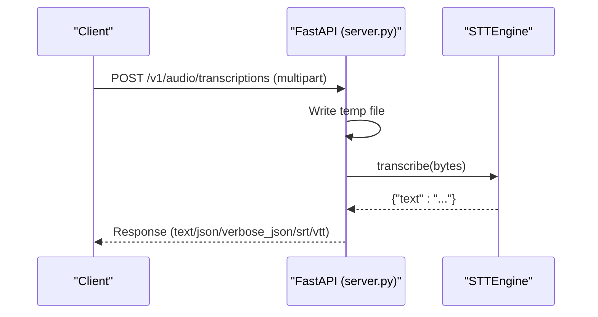
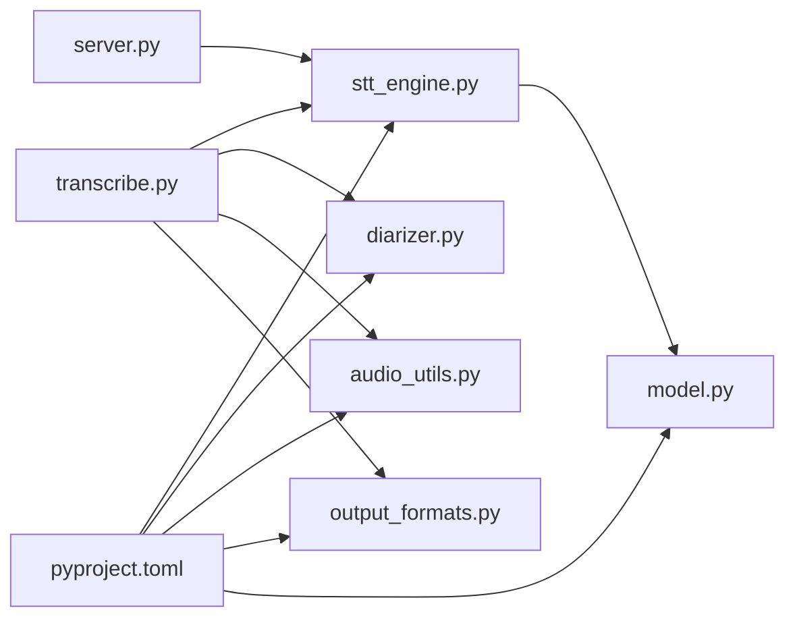

# Speech Recognition Engine

<cite>
**Referenced Files in This Document**
- [stt_engine.py](file://stt_engine.py)
- [model.py](file://model.py)
- [transcribe.py](file://transcribe.py)
- [server.py](file://server.py)
- [audio_utils.py](file://audio_utils.py)
- [diarizer.py](file://diarizer.py)
- [output_formats.py](file://output_formats.py)
- [pyproject.toml](file://pyproject.toml)
- [README.md](file://README.md)
</cite>

## Table of Contents
1. [Introduction](#introduction)
2. [Project Structure](#project-structure)
3. [Core Components](#core-components)
4. [Architecture Overview](#architecture-overview)
5. [Detailed Component Analysis](#detailed-component-analysis)
6. [Dependency Analysis](#dependency-analysis)
7. [Performance Considerations](#performance-considerations)
8. [Troubleshooting Guide](#troubleshooting-guide)
9. [Conclusion](#conclusion)
10. [Appendices](#appendices)

## Introduction
This document describes the speech recognition engine powered by SenseVoice (FunASR). It explains the STT engine architecture, model loading and caching mechanisms, and integration with PyTorch/Torchaudio. It documents language support (Chinese, English, Cantonese, Japanese, and Korean), configuration options for device selection, model directory management, and performance tuning parameters. It also provides concrete examples of model loading workflows, inference execution, and result processing, along with accuracy optimization techniques and troubleshooting guidance.

## Project Structure
The project is organized around a unified CLI that orchestrates audio conversion, speaker diarization, and in-process transcription using SenseVoice. An optional HTTP server exposes an OpenAI-compatible API for external clients.

**Diagram sources**
- [transcribe.py:1-240](file://transcribe.py#L1-L240)
- [diarizer.py:1-110](file://diarizer.py#L1-L110)
- [audio_utils.py:1-120](file://audio_utils.py#L1-L120)
- [output_formats.py:1-160](file://output_formats.py#L1-L160)
- [stt_engine.py:1-185](file://stt_engine.py#L1-L185)
- [model.py:1-931](file://model.py#L1-L931)
- [server.py:1-197](file://server.py#L1-L197)

**Section sources**
- [README.md:134-173](file://README.md#L134-L173)
- [pyproject.toml:1-24](file://pyproject.toml#L1-L24)

## Core Components
- STTEngine: wraps FunASR’s AutoModel to perform in-process transcription with configurable device, VAD, and post-processing.
- SenseVoiceSmall and SenseVoiceEncoderSmall: model definitions registered with FunASR, including language identification and text normalization embeddings.
- MeetingDiarizer: PyAnnote-based speaker diarization pipeline.
- Audio utilities: format conversion, segment extraction, and in-memory decoding.
- Output formats: SRT, VTT, TXT, JSON generation and persistence.
- Server: FastAPI endpoints exposing OpenAI-compatible transcription API.

**Section sources**
- [stt_engine.py:24-185](file://stt_engine.py#L24-L185)
- [model.py:437-931](file://model.py#L437-L931)
- [diarizer.py:27-110](file://diarizer.py#L27-L110)
- [audio_utils.py:23-120](file://audio_utils.py#L23-L120)
- [output_formats.py:118-160](file://output_formats.py#L118-L160)
- [server.py:92-197](file://server.py#L92-L197)

## Architecture Overview
The system integrates audio preprocessing, speaker diarization, and in-process SenseVoice transcription. The CLI coordinates the pipeline, while the server exposes an HTTP interface.

**Diagram sources**
- [transcribe.py:45-144](file://transcribe.py#L45-L144)
- [audio_utils.py:23-120](file://audio_utils.py#L23-L120)
- [diarizer.py:55-110](file://diarizer.py#L55-L110)
- [stt_engine.py:71-106](file://stt_engine.py#L71-L106)
- [model.py:800-931](file://model.py#L800-L931)
- [output_formats.py:118-160](file://output_formats.py#L118-L160)

## Detailed Component Analysis

### STTEngine: SenseVoice Wrapper
Responsibilities:
- Initialize AutoModel with device, VAD, and CPU thread count.
- Accept audio inputs as file path, bytes, or numpy arrays.
- Decode and resample audio using torchaudio and soundfile.
- Post-process raw transcripts and convert Simplified to Traditional Chinese.
- Return standardized result dictionaries.

Key behaviors:
- Device selection: cpu, mps, cuda.
- VAD integration: optional FSMN-VAD with configurable max segment time.
- ITN toggle and segment merging options.
- Fallback decoding via ffmpeg when torchaudio fails.

**Diagram sources**
- [stt_engine.py:24-185](file://stt_engine.py#L24-L185)
- [model.py:580-931](file://model.py#L580-L931)

**Section sources**
- [stt_engine.py:27-65](file://stt_engine.py#L27-L65)
- [stt_engine.py:71-106](file://stt_engine.py#L71-L106)
- [stt_engine.py:111-129](file://stt_engine.py#L111-L129)
- [stt_engine.py:130-139](file://stt_engine.py#L130-L139)
- [stt_engine.py:147-184](file://stt_engine.py#L147-L184)

### SenseVoiceSmall and SenseVoiceEncoderSmall
Responsibilities:
- Define the hybrid CTC-attention encoder-decoder architecture.
- Embeddings for language identification and text normalization modes.
- Forward/inference logic for generating transcripts and optional timestamps.
- Integration with FunASR registration tables.

Highlights:
- Language ID dictionary includes zh, en, yue, ja, ko, nospeech.
- Text normalization embeddings support “with itn” and “without itn” modes.
- Timestamp generation via forced CTC alignment.

**Diagram sources**
- [model.py:437-578](file://model.py#L437-L578)
- [model.py:580-780](file://model.py#L580-L780)

**Section sources**
- [model.py:437-578](file://model.py#L437-L578)
- [model.py:580-780](file://model.py#L580-L780)
- [model.py:800-931](file://model.py#L800-L931)

### Audio Utilities: Conversion, Resampling, and Decoding
Responsibilities:
- Convert arbitrary audio/video to 16 kHz mono WAV using ffmpeg.
- Extract audio segments from a loaded waveform and return in-memory WAV buffers.
- Decode audio bytes to numpy arrays using soundfile and torchaudio, with fallback to ffmpeg.

**Diagram sources**
- [audio_utils.py:96-120](file://audio_utils.py#L96-L120)
- [stt_engine.py:147-184](file://stt_engine.py#L147-L184)

**Section sources**
- [audio_utils.py:23-51](file://audio_utils.py#L23-L51)
- [audio_utils.py:53-94](file://audio_utils.py#L53-L94)
- [audio_utils.py:96-120](file://audio_utils.py#L96-L120)
- [stt_engine.py:111-129](file://stt_engine.py#L111-L129)

### Diarizer: PyAnnote Pipeline
Responsibilities:
- Load PyAnnote speaker diarization pipeline with a HuggingFace token.
- Detect speaker turns and merge adjacent segments up to a configurable gap.
- Select device automatically if not provided.

**Diagram sources**
- [diarizer.py:55-110](file://diarizer.py#L55-L110)

**Section sources**
- [diarizer.py:27-54](file://diarizer.py#L27-L54)
- [diarizer.py:55-110](file://diarizer.py#L55-L110)

### Output Formats: SRT, VTT, TXT, JSON
Responsibilities:
- Generate SRT and VTT subtitles with speaker tags and timestamps.
- Produce plain text with bracketed time windows and speaker labels.
- Emit structured JSON with segment metadata.
- Persist outputs to disk.

**Section sources**
- [output_formats.py:43-104](file://output_formats.py#L43-L104)
- [output_formats.py:118-160](file://output_formats.py#L118-L160)

### Server: OpenAI-Compatible API
Responsibilities:
- Expose POST endpoints for audio transcription with OpenAI-compatible parameters.
- Accept uploads, write to temporary files, and delegate to STTEngine.
- Format responses according to requested media type.

**Diagram sources**
- [server.py:100-161](file://server.py#L100-L161)
- [stt_engine.py:71-106](file://stt_engine.py#L71-L106)

**Section sources**
- [server.py:92-197](file://server.py#L92-L197)

## Dependency Analysis
External dependencies include FunASR, PyTorch/Torchaudio, PyAnnote, OpenCC, FFmpeg, and FastAPI/Uvicorn. The CLI and server both depend on STTEngine, which depends on FunASR’s AutoModel and the SenseVoiceSmall model definition.

**Diagram sources**
- [pyproject.toml:7-23](file://pyproject.toml#L7-L23)
- [transcribe.py:49-52](file://transcribe.py#L49-L52)
- [server.py:21](file://server.py#L21)
- [stt_engine.py:17](file://stt_engine.py#L17)
- [model.py:8](file://model.py#L8)

**Section sources**
- [pyproject.toml:1-24](file://pyproject.toml#L1-L24)
- [stt_engine.py:17-19](file://stt_engine.py#L17-L19)

## Performance Considerations
- Device selection: Choose device="cuda" for GPU acceleration, "mps" for Apple Silicon, or "cpu" for CPU-only environments.
- CPU threads: Increase ncpu to improve CPU decoding throughput when using CPU.
- VAD behavior: Disable VAD (vad_model=None) when using pre-segmented audio from a diarizer to avoid double segmentation artifacts.
- Memory management:
  - Prefer in-memory WAV buffers for short segments to reduce disk I/O.
  - Use minimal padding around segments to reduce memory footprint during resampling.
  - Limit concurrency with max_workers to balance throughput and memory usage.
- Model directory: Point model_dir to a local path to avoid repeated downloads and speed up cold starts.
- ITN and post-processing: Enable use_itn for normalized text; note it adds processing overhead.

[No sources needed since this section provides general guidance]

## Troubleshooting Guide
Common issues and resolutions:
- torchcodec version mismatch: Ensure torchcodec version is compatible with your PyTorch installation. See the project README for guidance.
- PyAnnote model access: Provide a valid HuggingFace token in .env and accept the model license on HuggingFace.
- FFmpeg availability: Confirm FFmpeg 4–8 is installed; the project README includes platform-specific installation steps.
- Audio decoding failures: The engine falls back to ffmpeg when torchaudio decoding fails; verify FFmpeg installation and permissions.
- CUDA/MPS availability: Verify device selection matches your hardware; the engine logs device selection during initialization.

**Section sources**
- [README.md:175-203](file://README.md#L175-L203)
- [stt_engine.py:111-129](file://stt_engine.py#L111-L129)
- [diarizer.py:36-41](file://diarizer.py#L36-L41)

## Conclusion
The system provides a robust, modular pipeline for meeting transcription using SenseVoice (FunASR) with integrated speaker diarization and flexible output formats. It supports multiple languages and devices, offers both in-process and HTTP server modes, and includes practical configuration options for performance tuning and accuracy optimization.

[No sources needed since this section summarizes without analyzing specific files]

## Appendices

### Language Support and Configuration
Supported languages include automatic detection and explicit choices for Chinese, English, Cantonese, Japanese, and Korean. Language selection influences model embeddings and post-processing behavior.

- Language codes: auto, zh, en, yue, ja, ko.
- Language embedding: injected into the model input to guide recognition.
- Text normalization: controlled via use_itn and internal textnorm embeddings.

**Section sources**
- [README.md:123-132](file://README.md#L123-L132)
- [model.py:634-640](file://model.py#L634-L640)
- [model.py:825-842](file://model.py#L825-L842)

### Example Workflows

- In-process transcription:
  - Convert input to WAV.
  - Run diarizer to obtain speaker segments.
  - For each segment, extract a buffer and call STTEngine.transcribe.
  - Save outputs in desired formats.

- HTTP server:
  - Start the server with chosen device and model directory.
  - Send multipart/form-data requests to /v1/audio/transcriptions with model=sensevoice.

**Section sources**
- [transcribe.py:45-144](file://transcribe.py#L45-L144)
- [server.py:169-197](file://server.py#L169-L197)

### Accuracy Optimization Techniques
- Use pre-segmented audio from a diarizer and disable built-in VAD to prevent redundant segmentation.
- Adjust padding around segments to include contextual speech without excessive noise.
- Enable ITN for normalized text when appropriate; disable for literal transcripts.
- Tune merge_vad and merge_length_s to balance continuity and accuracy.
- Select device="cuda" for faster inference when available.

**Section sources**
- [transcribe.py:84-94](file://transcribe.py#L84-L94)
- [stt_engine.py:52-63](file://stt_engine.py#L52-L63)